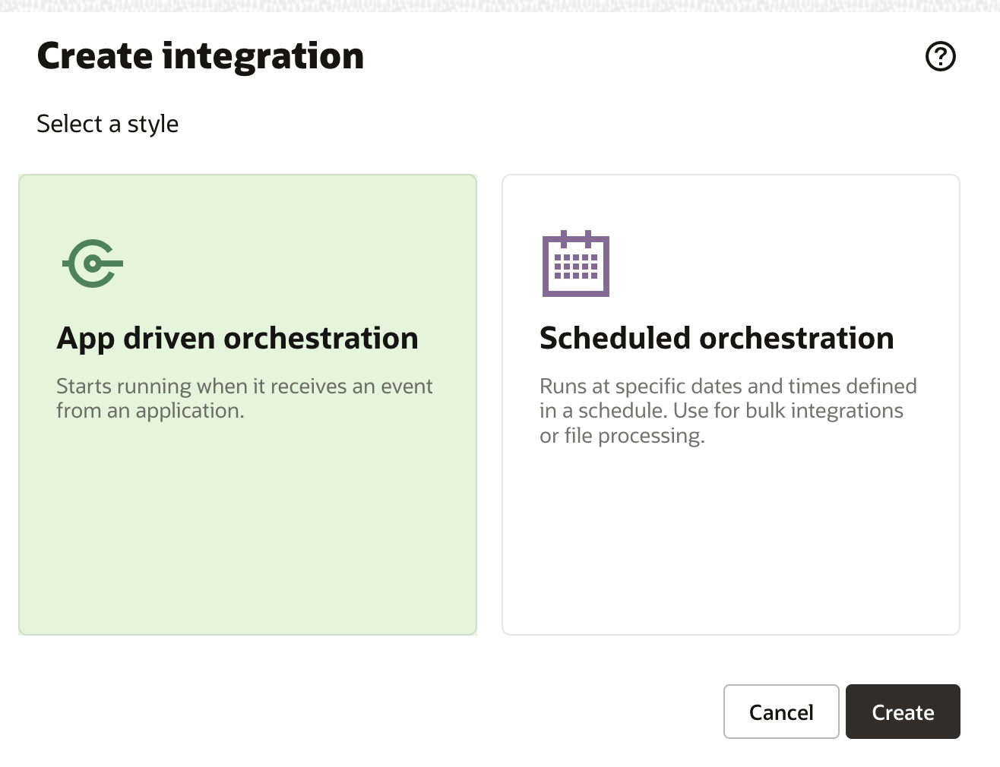
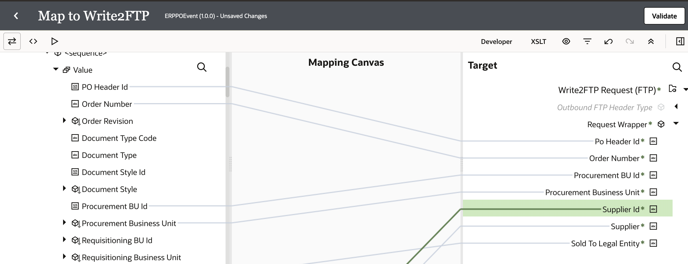
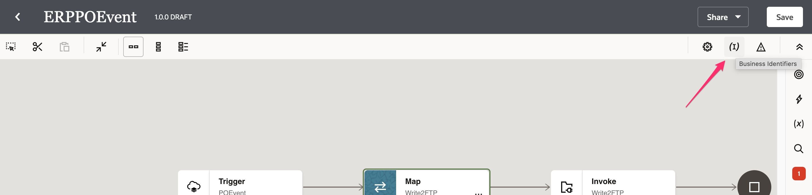
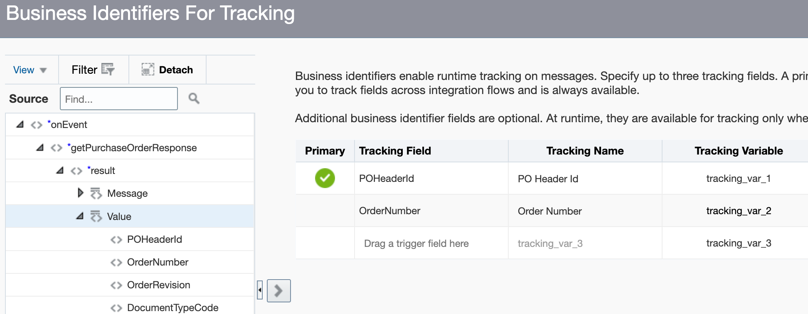
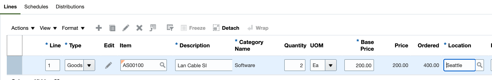
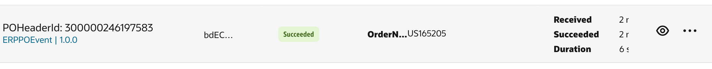

# ERP Cloud Adapter Connection configuration

## Introduction

This lab walks you through the steps to create Integration flow.

This Lab explores the use of Oracle Integration to subscribe to Oracle ERP Cloud Events and
push the relevant event information to downstream systems. As part of the lab you will build the following use case scenario:

1.  You create and activate an integration that subscribes to an ERP Cloud Purchase Order (PO) event
2.  You then create a PO in ERP Cloud and a PO event is triggered.
3.  Your integration receives the PO event and pushes the data
    into the File Server.

    The following diagram shows the runtime interaction between the systems involved in this use case:
      

Estimated Time: 30 minutes

### Objectives

In this lab, you will:

* Understand how to subscribe to business events in Oracle ERP cloud leveraging out of the box ERP cloud
  adapter capabilities
* Connect to file server to write data records

### Prerequisites

This lab assumes you have:

* All previous labs successfully completed.

## Task 1: Configure File Server

Configure File Server settings. This is required as you are using Embedded File Serve of Oracle Integration and using File Server as a target application in your integration flow.

1. Starting at the Oracle Integration **Home** page, select ***Settings***, then ***File Server*** from the left Navigation pane.
2. Select ***Settings*** from the left Navigation pane to open the File Server Settings page and review the File Server status and configurations. Make a note of the IP and port number.

**Note**: Ensure the **Authentication Type** is set to ***Password or Key***.
3. Select ***Files*** from left Navigation pane.

4. Click on ***home***, click on ***users***, click on your username and from the top right click ***Create*** and create a Folder named ***Output***.
5. Click on ***Permissions*** on the ***Output*** Folder

**Note**: You will be using the above Folder structure in the lab.
10. Click ***Add Permissions*** and select your user. Click ***Add***.

11. Select ***All*** and ***Propagate to subfolders***. All of the permission checkboxes should be checked. Click ***Save*** and exit the Permissions page.


## Task 2: Connect to File Server with FTP Client

To access files on the File Server you will need to use an FTP Client. You will need to configure your FTP Client with the following:

* File Server IP Address.
* File Server Port.
* Your Oracle Integration username.
* Your Oracle Integration password.

1. To obtain the File Server IP Address and Port, select ***Settings*** from the left Navigation pane. The IP and Port are located in the **IP and Port Information** section of the **Settings** page.
2. Using your FTP Client choice, connect to the File Server using the SFTP - SSH File Transfer Protocol.  

An example configuration using FileZilla FTP Client.  
If the permissions are configured correctly, you should be able to list, read, and write files on the **Output** folder.


## Task 3: Creating Connection with File Server

To access the File Server from an Integration, you will need to create an FTP Connection.  
**Note**: You can use an existing connection if one has already been configured for your environment.

1. Starting at the Oracle Integration **Home** page, select ***Integrations***, then ***Connections*** from the left Navigation pane.
2. Click ***Create***, then select the ***FTP*** Adapter and click ***Select***.
3. From the **Create Connection** dialog, **Name** your connection ***File Server*** and leave the rest of the configurations as default. Click ***Create***.  
**Note**: If you get an error that the identifier already exists, change the Connection Name and remember this name for use later in the workshop.
4. Enter the following configurations in the **FTP Connection** with the information you previously gathered from the File Server Settings page.  
| Field                   | Value                                                 |
|-------------------------|-------------------------------------------------------|
| FTP Server Host Address | From File Server Settings - IP and Port Information   |
| FPT Server Port         | From File Server Settings - IP and Port Information   |
| SFTP Connection         | Yes                                                   |
| Security                | FTP Server Access Policy                              |
| Username                | Your Oracle Integration username                      |
| Password                | Your Oracle Integration password                      |

5. Confirm your Connection by clicking ***Test***, then ***Diagnose & Test***. You should see the **Connection File Server was tested successfully** confirmation message. Click ***Save*** and exit the Connection editor.


##	Task 4: Create the PO Event Integration
1. In the left Navigation pane, click ***Integrations*** > ***Integrations***.
2. On the **Integrations page**, click ***Create***.
3. On the **Integration Style** dialog, select ***App Driven Orchestration***, followed by ***Select***

4. In the **Create New Integration** dialog, enter the following information:

    | **Element**        | **Value**          |       
    | --- | ----------- |
    | Name         | `ERPPOEvent`       |
    | Description  | `ERP Event integration for LiveLabs` |


    Accept all other default values.

5. Click ***Create***.

6. Click ***Save*** to apply changes.

## Task 5: Define ERP Purchase Order (PO) Event trigger
Add ERP PO Event trigger to the empty integration canvas.

1. Click the ***+*** sign below **START** in the integration canvas.

2. Select the ERP Cloud connection which you have created in the previous labs. This invokes the Oracle ERP Cloud Endpoint Configuration Wizard.

3. On the Basic Info page, for the **What do you want to call your endpoint?** element, enter ***POEvent***.

4. Click ***Next***.

5. On the Request page, select the following values:

    | **Element**        | **Value**          |       
    | --- | ----------- |
    | Define the purpose of the trigger         | Receive Business Events raised within ERP Cloud       |
    | Business Event for Subscription  | Purchase Order Event |
    | Filter Expr for Purchase Order Event | [see code snippet below] |
    |

    ```
    <copy>
    <xpathExpr xmlns:ns0="http://xmlns.oracle.com/apps/prc/po/editDocument/purchaseOrderServiceV2/" xmlns:ns2="http://xmlns.oracle.com/apps/prc/po/editDocument/purchaseOrderServiceV2/types/">$eventPayload/ns2:result/ns0:Value/ns0:PurchaseOrderLine/ns0:ItemDescription="Lan Cable"</xpathExpr></copy>
    ```

    > **Tip:** If you are working on a shared ERP Cloud environment, it is recommended to use a distinct value in the filter expression under **ItemDescription**. For example `Lan Cable <your-initials>`. The value you enter is case sensitive. Write down this value for later use.


    > **Note:** The filter is not required, however, it does allow you to control which integration should be triggered. This is useful if there are multiple integrations subscribed to the PO Event in the same ERP Cloud environment. Without the filter expression, all integrations subscribed to the PO Event would get triggered whenever that specific event occurs.

6. Click ***Next***.

7. On the Response page, for **Response Type** element, choose ***None***. Click ***Next***.

8. On the Summary page, click ***Done***.

9. On the integration canvas, from the Layout list, choose ***Horizontal***.

    

10. Click ***Save*** to persist changes.

## Task 6: Add the FTP Adapter as invoke activity
Add the FTP Adapter invoke to the integration canvas.
1. Hover your cursor over the arrow in the integration canvas to display the ***+*** sign. Click the ***+*** sign and select the FTP Connection the previous lab.
This invokes the FTP adapter Configuration Wizard.
2. On the **Basic Info** page, select the following values:
  | **Element**        | **Value**          |       
  | --- | ----------- |
  | What do you want to call your endpoint? | `Write2FTP`       |

3. On the **Operation** page, select the following values:

    | **Element**        | **Value**          |       
    | --- | ----------- |
    | Select Operation | Write File  |
    | Output Directory | /home/users/***your username***/Output  |
    | File Name Pattern | PO%SEQ%.json  |

    Leave the rest as default.
3. On the **Schema page**, select the ***Sample JSON document*** from the drop-down. In the **Do you want to specify the structure of the contents of the file?** as ***Yes***
4. Copy the below json content into a file and save it to your desktop. Name it as ***PurchaseOrder.json***

```
<copy>
  {
    "poHeaderId":"US164985",
    "orderNumber":"300000245105090",
    "procurementBUId":"300000046987012",
    "procurementBusinessUnit":"US1 Business Unit",
    "supplierId":"300000047414679",
    "supplier":"Dell Inc.",
    "soldToLegalEntity":"US1 Legal Entity"
  }
</copy>
```
5. On the **File Contents - Definition** page, upload the file **PurchaseOrder.json** saved in the previous step
6. Click ***Next*** and Review the **Summary** page and click on ***Done***
7. Click on ***Save***

## Task 7: Map data between ERP trigger and FTP invoke
Use the mapper to drag fields from the source structure (POEvent)  to the target structure (Write2FTP) to map elements between the two.

When we added the FTP invoke to the integration, a map icon was automatically added.

1. Hover your cursor over the **Map to Write2FTP** Mapper icon, click once, then select ***Edit***.
   

2. Use the mapper to drag element nodes in the source ERP Cloud structure to element nodes in the target FTP structure.

    Expand the ***Source*** node:

    ```
    POEvent Request > Get Purchase Order Response > Result > 2nd <sequence> > Value
    ```

    Expand the ***Target*** node:

    ```
    Write2FTP Request > request-wrapper
    ```

    Complete the mapping as below:    

    | **Source** *(ERP Cloud)*        | **Target** *(FTP)* |
    | --- | ----------- |
    | PO Header Id | poHeaderId |
    | Order Number | orderNumber |
    | Procurement BU Id | procurementBUId |
    | Procurement Business Unit | procurementBusinessUnit |
    | Sold To Legal Entity Id | soldToLegalEntity |
    | supplierId | supplierId |
    | supplier | supplier |


   

3. Click ***Validate***, then wait for the confirmation message **Mapping is valid and ready to use.**

4. Click ***Close***

5. Click ***Save*** to persist changes.
## Task 8: Define Tracking Fields
Manage business identifiers that enable you to track fields in messages during runtime.

> **Note:** If you have not yet configured at least one business identifier **Tracking Field** in your integration, then an error icon is displayed in the design canvas.
    

1. Click the ***Actions*** menu on the top right, then select ***Tracking***.
    

2. From the **Source** section, expand ***getPurchaseOrderResponse*** > ***result***, click ***Load more***, expand ***Value***, and click ***Load more***. Drag the ***POHeaderId*** and ***OrderNumber***  fields from **ERP PO source** to the **Drag a trigger field here** section:

    

    > **Note:** Only the Used fields are displayed due to the *Filter* on the top left side of the screen.

3. Click ***Save***.

4. On the Integration canvas, click ***Save***, followed by ***Close***.

## Task 9: Activate the integration

1. On the **Integrations** page, click on the ***Activate*** icon.

    

2. On the **Activate Integration** dialog, select ***Enable Tracing***, followed by ***Include Payload*** options.

3. Click ***Activate***.

    The activation will be complete in a few seconds. If activation is successful, a status message is displayed in the banner at the top of the page, and the status of the integration changes to **Active**.

## Task 10: Create Purchase Order in ERP Cloud
Access your ERP Cloud environment.

1. Login with a user having the correct roles and privileges to create a PO.

2. Navigate to the ***Procurement*** Tab.

3. Click ***Purchase Orders***.

4. In the **Overview** section, click the ***Tasks*** button on the right.
       

        This opens the Tasks menu.

5. Under the **Orders** section, select ***Create Order***.
      

  The **Create Order** dialog is displayed.

6. Enter a valid entry in the **Supplier** field, for example, `ABC Consulting`, and select the corresponding supplier in the dropdown.

  **Tip:** You can also search for valid suppliers using the **Search** icon.

7. Click ***Create***.

      

  The **Edit Document (Purchase Order)** page is displayed.

8. In the **Lines** Tab, click ***+*** to add a Purchase Order line row.
      

9. Enter values in the below fields (sample values provided) and click on ***Save***

      | **Field**        | **Value**          |       
      | --- | ----------- |
      | Line | `1` (Default)       |
      | Type | `Goods` |
      | Item | Choose a valid item. For example, start typing `AS`, and choose an item from the resulting drop-down (or press the search button to select a valid item)
      | Description | Remove the existing description and enter the same value used for **Lab 7 > Task 5 > Step 5: Filter Expr for Purchase Order Event**. For example: `Lan Cable <your-initials>`|
      | Quantity | Enter a valid number, eg. `2` |
      | UOM | `Ea` (Default) |
      | Base Price | Enter a valid number, eg. `2`

      

10. Click the ***EDIT*** button under the *Lines* section.
      

      This opens the *Edit Line* page for the current purchase order line.

11. Enter a future date in either *Requested Delivery Date* or *Promised Delivery Date* fields.
      

12. Click ***OK*** at the top right of the *Edit Line* page and return to the parent window.

13. Click ***Submit*** to initiate the Purchase Order processing.

    After submitting the Purchase Order, a confirmation message should appear with the PO number. Make a note of the **PO number**

14. Click ***OK*** to close the confirmation dialog.


## Task 11: Validate Purchase Order status
  After the PO is submitted, the initial status becomes **Pending Approval**. The PO Create event will occur once the status changes to **Open**.

1. In the **Overview** section, click ***Tasks*** button on the right.

    This opens the **Tasks** menu.

2. Under the **Orders** section, click on ***Manage Orders***.

3. Click ***Search***. You should see the Purchase Orders for the current user OR enter the PO number to search for the purchase order which you have created.

4. Look for your Purchase Order in the list with the PO number displayed in the previous task.

   **Tip:** The last created PO should generally be the top one in the list.

5. Validate the PO Status. If it's **Open** then the Business Event has occurred.

    **Note:** If PO has another Status, such as *Pending Approval*, then wait a couple of minutes and keep refreshing the page until the desired PO Status appears.


## Task 12: Track message flow triggered by the PO Create Event
Use the Oracle Integration dashboard to see the data flow resulting from the create Purchase Order event in ERP Cloud.

1. In the Integration navigation pane, click ***Home*** > ***Monitoring*** > ***Integrations*** > ***Tracking***

2. Find our corresponding Integration Instance, by matching the *PO Header Id* or *Order Number* from the Purchase Order in ERP Cloud. This should be under the columns *Primary Identifier* or *Business Identifiers*.

      

3. Click on your ***PO Header Id*** link to open the corresponding integration instance.

      The flow ran successfully if it is displayed with a green line.

      

4. Click on the ***Actions*** menu on the top right of the screen, and select ***View Activity Stream***.


5. In the Activity Steam window, click on the different ***Message*** links to review the flow of request and response messages.

6. Click ***Close*** after reviewing the Activity Stream.


## Task 13: Verify PO record in FTP Server

Follow these steps to view the file in the FTP Server

1. In the Integration navigation pane, click ***Home*** > ***Settings*** > ***File Server*** > ***Files*** > ***home*** > ***users*** > ***Select your username*** > ***Output*** > You should see the **PO%.json** file.

  **Note:** Currently, you can not view the contents of the file using the Oracle Integration console but, you can use any third-party tools like FileZilla to connect to this file server and pull the file from the FTP server to your local machine and view the file contents

**Congratulations!** You have learnt how to subscribe to ERP Cloud Business Events by configuring the Out of the box ERP Cloud adapter. The Adapter abstracts the Business Events experience and provides an intuitive interface to select from the Catalog which greatly simplifies the task to perform Real-Time Synchronization.

You may now **proceed to the next lab**.

## Learn More

* [Getting Started with Oracle Integration](https://docs.oracle.com/en/cloud/paas/integration-cloud)
* [Using the Oracle ERP Cloud Adapter with Oracle Integration](https://docs.oracle.com/en/cloud/paas/integration-cloud/erp-adapter)

## Acknowledgements

* **Author** - Subhani Italapuram, Director Product Management, Oracle Integration
* **Contributors** - Kishore Katta, Director Product Management, Oracle Integration
* **Last Updated By/Date** - Kishore Katta, May 2022
