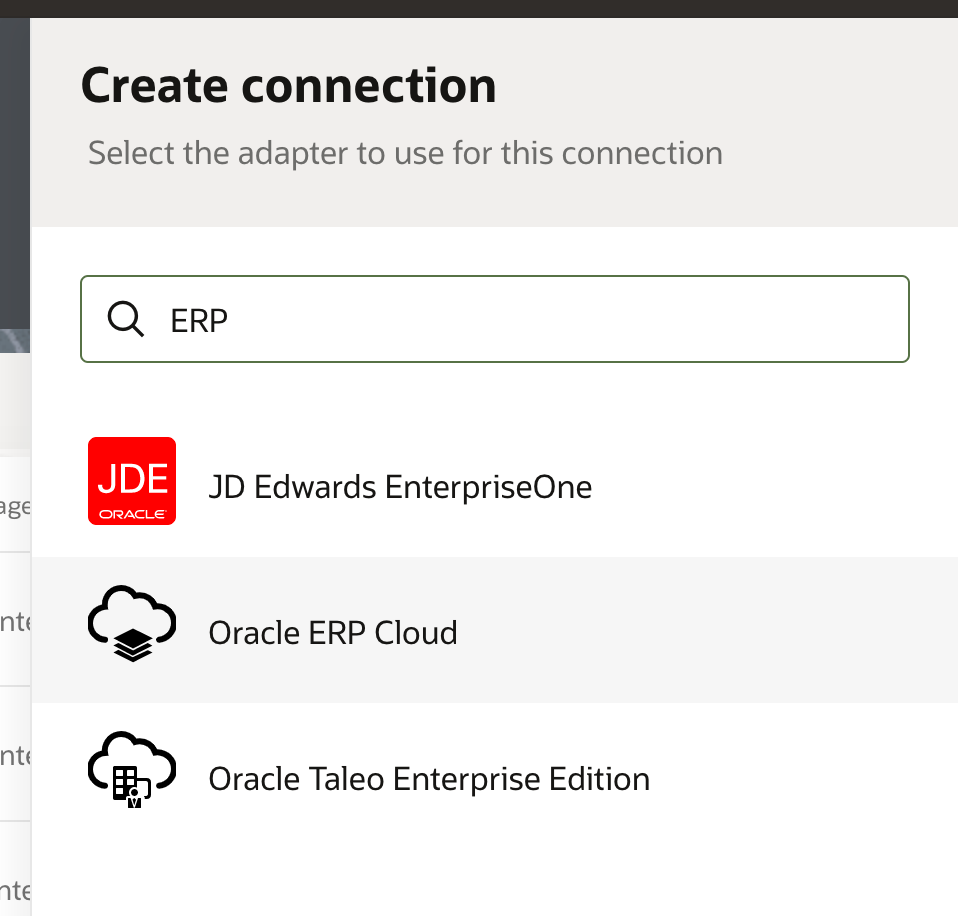
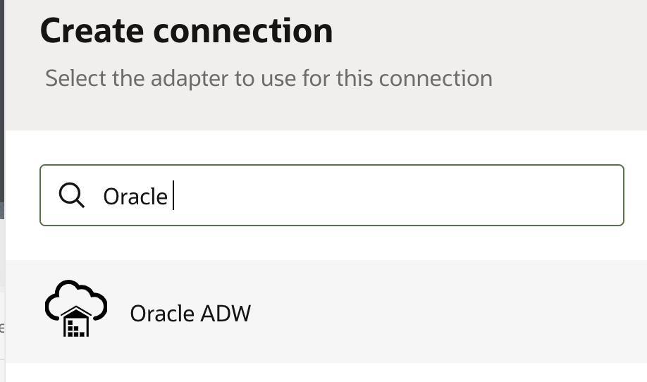
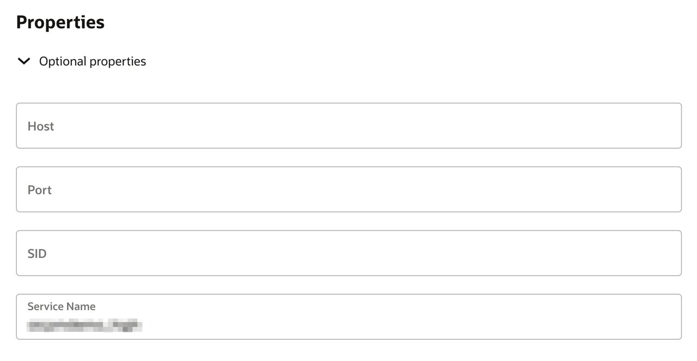
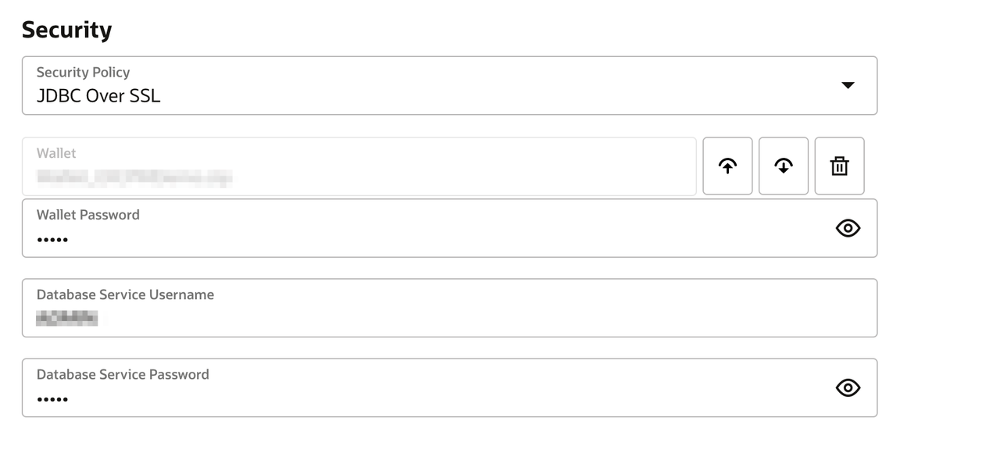

# Create Connections

## Introduction
This demo lab walks you through the steps to create connections for all the services used in the ERP purchase order event integration.

Before you can build an integration, you have to create the connections to the applications with which you want to share data. Follow these steps to create an ERP Cloud connection.

Estimated Time: 10 minutes

### Objectives
In this lab, you will:
- Create an Oracle ERP Cloud Adapter connection.
- Create an Oracle Autonomous Data Warehouse connection.

### Prerequisites
This lab assumes you have:
- Completed the Lab Setup.

## Task 1: Create an Oracle ERP Cloud Adapter Connection
Create a connection with the Oracle ERP Cloud Adapter.

1. In the left navigation pane, click ***Design*** &gt; ***Connections*** &gt; ***Create***.
2. In the *Create Connection* dialog, select the **Oracle ERP Cloud** adapter. To find the adapter, enter `ERP` in the search field, then click the highlighted adapter.
    

3. In the *Create Connection* dialog, enter the following information, then click ***Create***:

    | **Field**        | **Value**          |       
    | --- | ----------- |
    | Name         | `LLDemo_ERP`       |
    | Description  | `ERP Connection for LiveLabs demo` |
    |

    Keep all other values at their defaults.

5. In the *Oracle ERP Cloud Connection* dialog, enter the following information:

    | **Field**  | **Values** |
    |---|---|
    |ERP Cloud Host | `your-erp-host-name` |
    |Security Policy | **Username Password Token**|
    |Username | `<erp-username>`|
    |Password | `<erp-password>`|
    |

5. Click ***Test*** and wait for a confirmation that the test was successful.

    > **Note:**  The first time you run the test, it could take up to 2 minutes for completion.

6. Click ***Save*** and wait for the confirmation box. Exit the connection canvas by clicking the back button in the upper-left corner of the screen.

## Task 2: Create an Oracle Autonomous Data Warehouse Connection
Create a connection with the Oracle Autonomous Data Warehouse Adapter.

1. In the left navigation pane, click ***Design*** &gt; ***Connections*** &gt; ***Create***.

2. In the *Create Connection* dialog, select the **Oracle ADW** adapter. To find the adapter, enter `Oracle` in the search field, then click the highlighted adapter.
    

3. In the *Create Connection* dialog, enter the following information, then click ***Create***:

    | **Field**        | **Value**          |       
    | --- | ----------- |
    | Name         | `LLDemo_ADW`       |
    | Description  | `ADW Connection for LiveLabs demo` |
    |

    Keep all other values at their defaults.

4. In the *Oracle ADW Connection* dialog, enter the following information:

    | **Field**  | **Value** |
    |---|---|
    |Service Name | `<your-adb-tns-name>` (Use the TNS Name obtained in **Lab Setup** &gt; **Task 1** &gt; **Step 6**) |
    |Security Policy | **JDBC Over SSL**|
    |Wallet | **Upload wallet file (Zip)** |
    |Wallet Password | `<wallet-password>`|
    |Database Service Username | `<db-service-username>` (Default: `ADMIN`)|
    |Database Service Password | `<db-service-password>` |
    |

    
    

5. Click ***Test***, then click ***Save***. Exit the connection canvas by clicking the back button in the upper-left corner of the screen.

You may now **proceed to the next lab**.

## Acknowledgements
* **Author** - Ravi Chablani, Product Management - Oracle Integration
* **Last Updated By/Date** - Subhani Italapuram, Aug 2026
