# Create an Integration Flow

## Introduction
This demo lab walks you through the steps to create an end-to-end integration that receives ERP purchase order events and persists the data in an ADW table.

### Objectives
You will learn how to:

- Initiate an app-driven integration flow.
- Define an ERP purchase order (PO) event trigger.
- Add the ADW invoke activity.
- Map data between the ERP trigger and ADW invoke.
- Define tracking fields.
- Activate the integration.


### Prerequisites
This lab assumes you have:
- Successfully completed all previous labs.


## Task 1: Initiate an App-Driven Integration Flow

Start by creating a new integration and adding basic information.

1. In the left Navigation pane, click ***Design*** &gt; ***Integrations***.
2. On the Integrations page, click ***Create***.
3. On the *Create Integration* dialog, click ***Application***.

4. In the *Create Integration* dialog, enter the following information, then click ***Create***.

    | **Element**        | **Value**          |       
    | --- | ----------- |
    | Name         | `LLERPEventDemo`       |
    | Description  | `ERP Event integration for LiveLabs demo` |
    |
    {: title="Create integration"}

    Accept all other default values.


5. Optional: Select the ***Horizontal*** layout, then click ***Save*** to apply the changes.
    

## Task 2: Define the ERP Purchase Order (PO) Event Trigger

Add an ERP PO event trigger to the empty integration canvas.

1. Select the configured ERP Cloud connection. This invokes the Oracle ERP Cloud Endpoint Configuration Wizard.

2. On the Basic Info page, enter `ERP_POEvent` for the *What do you want to call your endpoint?* field.

3. Click ***Continue***.

4. On the Request page, select the following values:

    | **Element**        | **Value**          |       
    | --- | ----------- |
    | Define the purpose of the trigger         | **Receive Business Events raised within ERP Cloud**       |
    | Business Event for Subscription  | **Purchase Order Event** |
    | Filter Expr for Purchase Order Event | [see code snippet below] |
    |
    {: title="ERP Cloud adapter request parameters"}

    ```
    <copy><xpathExpr xmlns:ns0="http://xmlns.oracle.com/apps/prc/po/editDocument/purchaseOrderServiceV2/" xmlns:ns2="http://xmlns.oracle.com/apps/prc/po/editDocument/purchaseOrderServiceV2/types/">$eventPayload/ns2:result/ns0:Value/ns0:DocumentDescription="demo"</xpathExpr></copy>
    ```
    > **Tip:** If you are working on a shared ERP Cloud environment, it is recommended to use a distinct value in the filter expression under **DocumentDescription**. For example `<your-initials>-demo`. The value you enter is case sensitive. Write down this value for later use.
    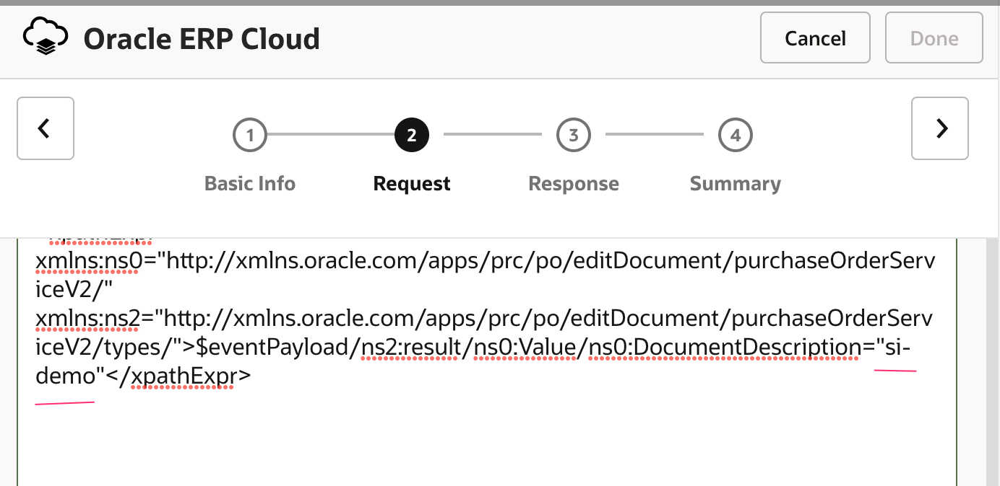

    > **Note:** The filter is not required; however, it allows you to control which integration is triggered. This is useful when multiple integrations are subscribed to the PO Event in the same ERP Cloud environment. Without the filter expression, all integrations subscribed to the PO Event are triggered whenever that event occurs.

5. Click ***Continue***.

6. On the Summary page, click ***Finish***.

    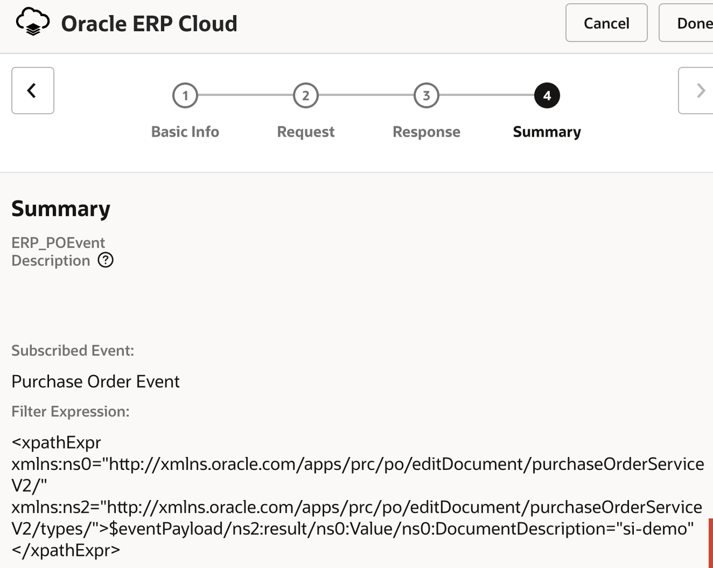

7. Click ***Save*** to persist changes.


## Task 3: Add the ADW Invoke Activity
Add the Oracle Autonomous Data Warehouse Adapter invoke to the integration canvas.

1. Hover over the arrow in the integration canvas to display the **+** sign. Click ***+*** and select the ADW connection created in the previous lab.

    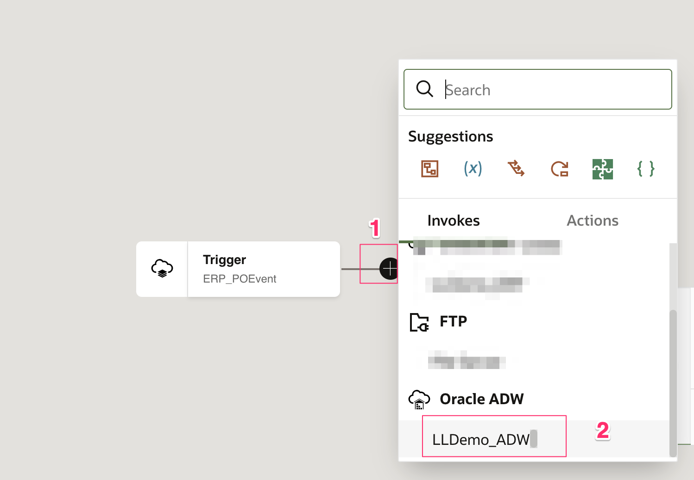

    This invokes the Oracle Autonomous Data Warehouse Endpoint Configuration Wizard.

2. On the Basic Info page, select the following values:

    | **Element**        | **Value**          |       
    | --- | ----------- |
    | What do you want to call your endpoint? | `ADW_InsertPO`       |
    | What operation do you want to perform? | **Perform an Operation on a Table** |
    | What operation do you want to perform on the table? | **Insert** (Default) |
    |
    {: title="ADW Basic Information"}

3. Click ***Continue***.

4. On the Table Operation page, select the following values:

    | **Element**        | **Value**          |       
    | --- | ----------- |
    | Schema | **ADMIN**  |
    | Table Type | **TABLE** |
    | Table Name | &lt;keep blank&gt; and click **Search** |
    | Available | Select **PURCHASEORDER** and click **&gt;(Move to selected)** to move it to the *Selected* box |
    |
    {: title="ADW Operation page"}

    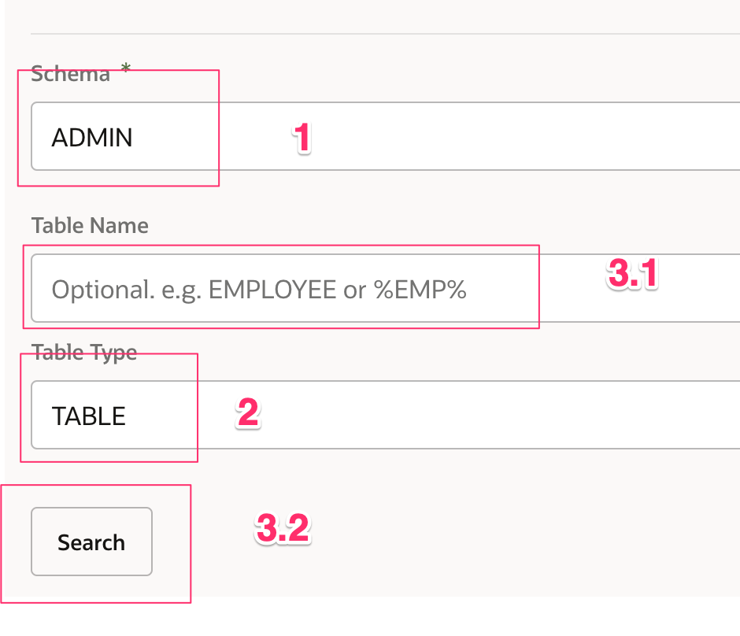
    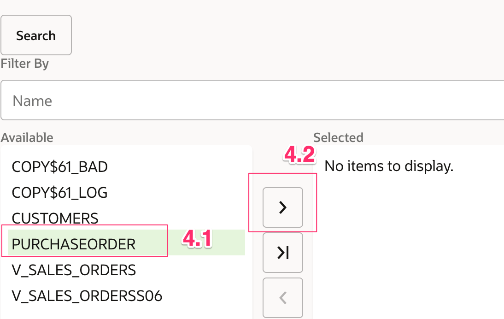

5. Click **Import Tables**, wait, then click ***Continue***.

6. When the *Select the parent database table* element appears, click ***Continue***.

7. On the Summary page, click ***Finish***.

    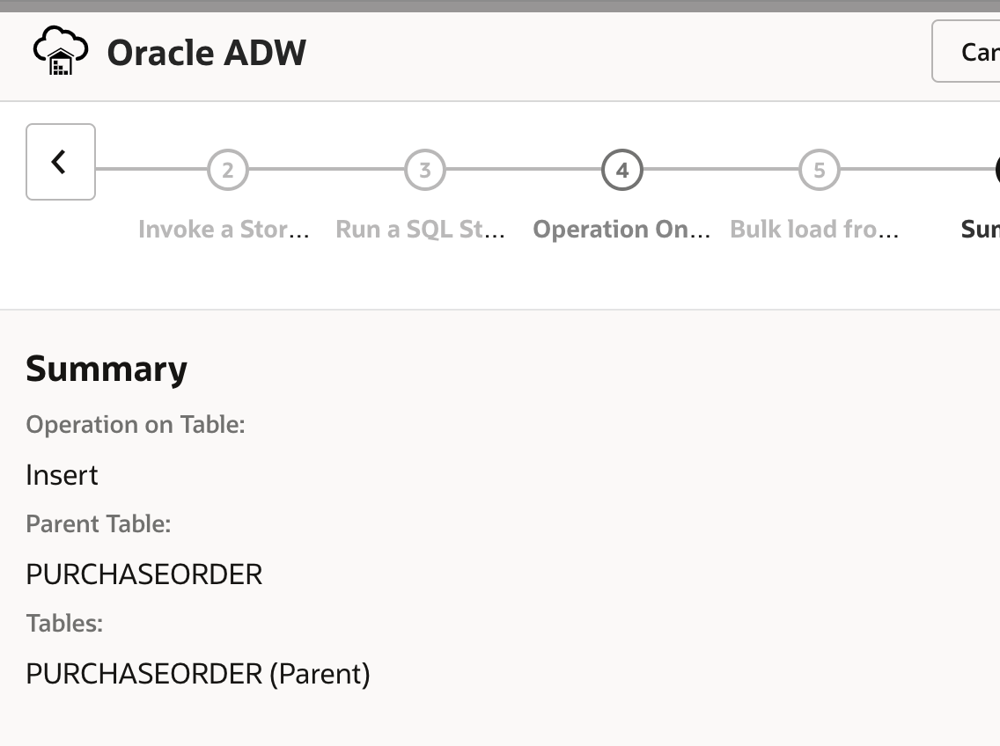

8. Click ***Save*** to apply the changes.
9. Use the controls in the designer canvas to zoom in (+), zoom out (-), and reposition the integration flow.
    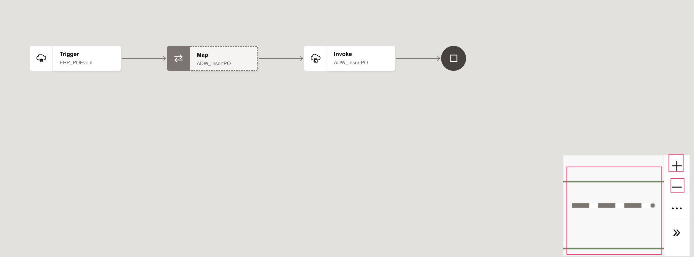

## Task 4: Map Data Between the ERP Trigger and ADW Invoke

Use the mapper to drag fields from the source structure (`ERP_POEvent` data) to the target structure (`ADW_InsertPO`).

When we added the ADW invoke to the integration, a map icon was automatically added.

1. Hover over the **Mapper** icon, click it once, then select **Edit**.
    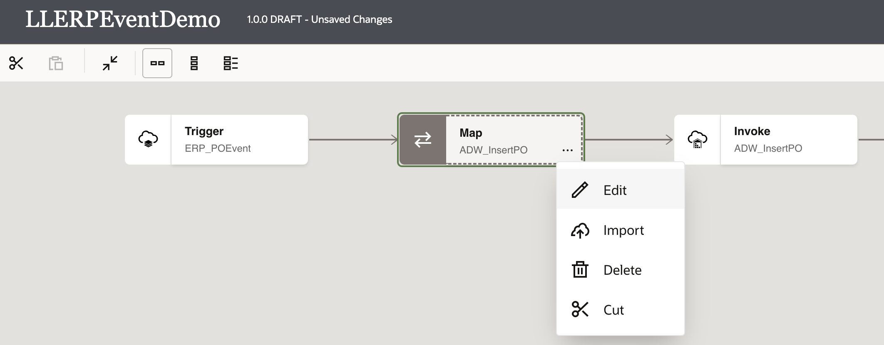

2. Use the mapper to drag element nodes from the source ERP Cloud structure to the target Oracle ADW structure.

    Expand the **Source** node:

    ```
    ERP_POEvent Request > Get Purchase Order Response > Result > 2nd <sequence> > Value
    ```

    Expand the **Target** node:

    ```
    ADW_InsertPO Request > Purchaseorder
    ```

    Complete the mapping as follows:

    | **Source** *(ERP_POEvent)*        | **Target** *(ADW_InsertPO)* |
    | --- | ----------- |
    | PO Header Id | poheaderid |
    | Order Number | ordernumber |
    | Sold To Legal Entity Id | soldtolegalentityid |
    | Document Description | description |
    | Creation Date | creationdate |
    | Document Status | status |
    | Total Amount | total |
    |
    {: title="Mappings"}

    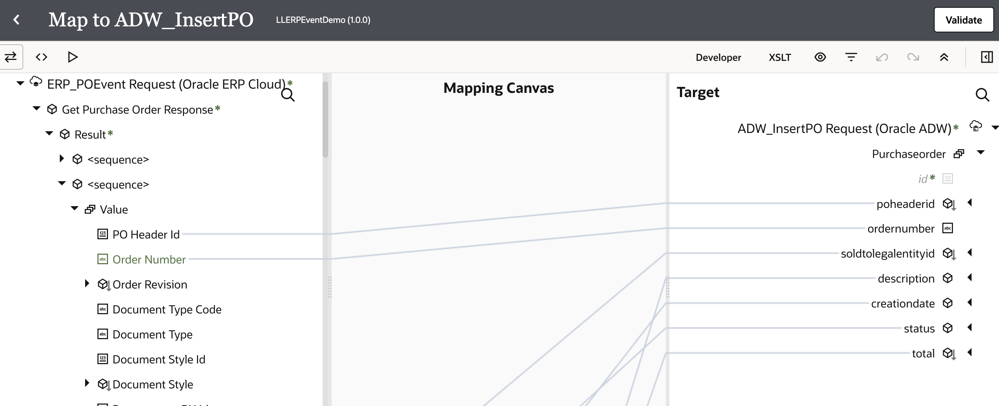

3. Click ***Validate***, then wait for the confirmation message: *Map to ADW_InsertPO successfully validated.*

4. Click the ***&lt; (Go back)*** button.

5. Click ***Save*** to persist changes.


## Task 5: Define Tracking Fields

1. Manage business identifiers that enable you to track fields in messages during runtime.

    > **Note:** If you have not yet configured at least one business identifier **Tracking Field** in your integration, then an error icon is displayed in the designer canvas.
    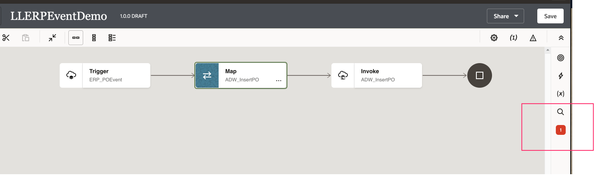

2. Click ***Business Identifiers*** in the upper-right corner.
    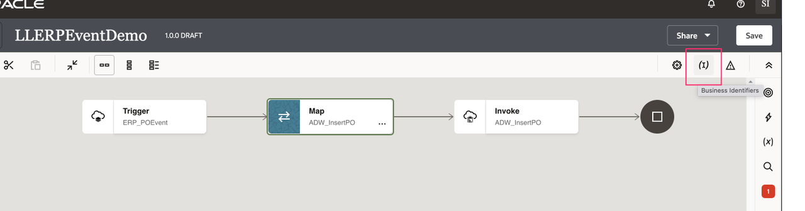

3. From the *Source* section, expand **onEvent** &gt; **getPurchaseOrderResponse** &gt; **result** &gt; **2nd &lt;sequence&gt;** &gt; **Value**. Drag the **POHeaderId**, **OrderNumber**, and **DocumentDescription** fields from the ERP PO source to the *Drag a trigger field here* section:

    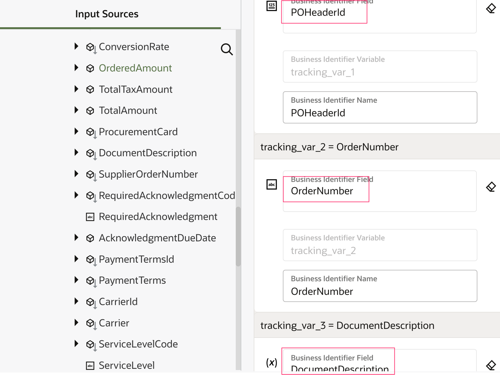


4. Click ***Business Identifiers*** again to close the Business Identifiers window.

5. Click ***Save***, followed by ***&lt; (Go back)***.

## Task 6: Activate the integration

1. On the *Integrations* page, click the ***Activate*** icon.

    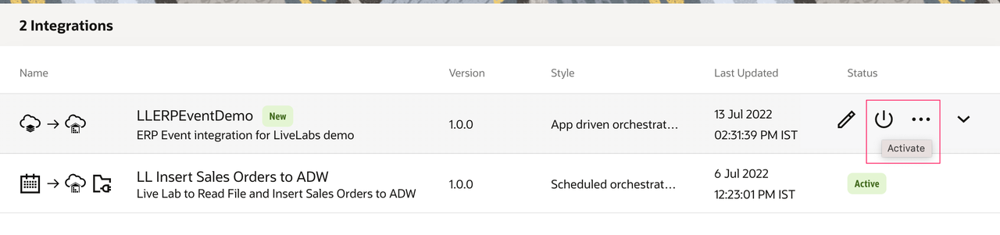

2. On the *Activate Integration* dialog, select ***Audit*** as the tracing level, then click ***Activate***.

    The activation completes in a few seconds. If activation is successful, a status message is displayed in the banner at the top of the page, and the integration status changes to *Active*.


You may now **proceed to the next lab**.


## Acknowledgements
* **Author** - Ravi Chablani, Product Management - Oracle Integration
* **Author** - Subhani Italapuram, Product Management - Oracle Integration
* **Last Updated By/Date** - Subhani Italapuram, Aug 2026
