# Run an End-to-End Demo

## Introduction
This demo lab walks you through the steps to create an ERP purchase order and validate how the data is processed in the integration flow.

Estimated Time: 10 minutes

### Objectives
In this lab, you will:
- Create a purchase order (PO) in ERP Cloud.
- Validate the PO status.
- Track the message flow triggered by the PO Create Event.
- Verify the PO record in the ADW table.

### Prerequisites
This lab assumes you have:
- Successfully completed all previous labs.

## Task 1: Create a Purchase Order in ERP Cloud
1. Access your ERP Cloud environment. Log in with a user who has the required roles and privileges to create a PO.

2. Navigate to the **Procurement** tab.

3. Click **Purchase Orders**.

4. In the *Overview* section, click the **Tasks** button on the right.
    

    This opens the Tasks menu.

5. Under the *Orders* section, select **Create Order**.
    

    The *Create Order* dialog is displayed.

6. Enter a valid supplier in the *Supplier* field, for example, `ABC Consulting`, then select the corresponding supplier from the drop-down list. Also select the Requisitioning BU that corresponds to the Procurement BU field.

    > **Tip:** You can also search for valid suppliers using the **Search** icon.

7. Click **Create**.

    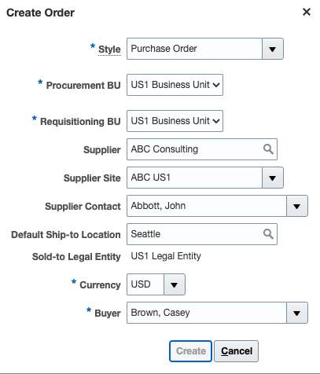

    The *Edit Document (Purchase Order)* page is displayed.

8. In the *General* section, enter the same value in the *Description* field that you used for *Lab 6 &gt; Task 2 &gt; Step 5: Filter Expr for Purchase Order Event*. For example: `<your-initials>-demo`.

    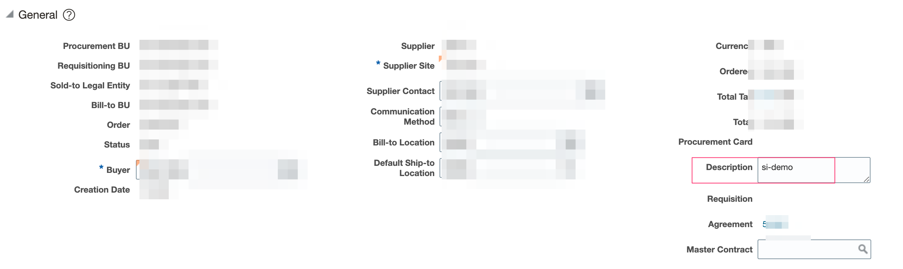

9. In the *Lines* tab, click **+** to add a purchase order line.
    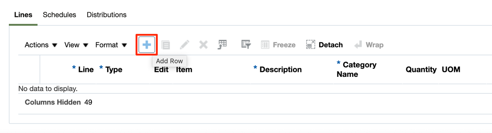

10. Enter values in the following fields. Sample values are provided.
    | **Field**        | **Value**          |       
    | --- | ----------- |
    | Line | `1` (Default)       |
    | Type | `Goods` |
    | Item | Choose a valid item. For example, start typing `AS1`, and choose an item from the resulting drop-down (or hit the search button to select a valid item)
    | Description | &lt;keep default&gt; or enter a value if empty |
    | Quantity | Enter a valid number, for example, `2` |
    | UOM | `Ea` (Default) |
    | Base Price | Enter a valid number, for example, `200` |
    {: title="Line Item Values"}

     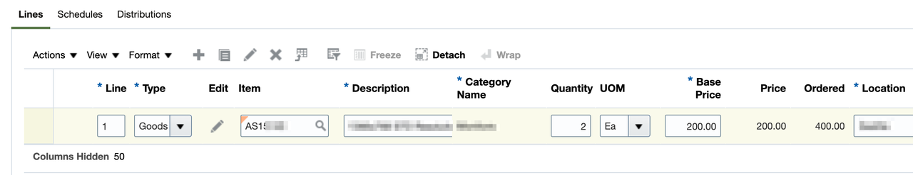

11. Click the **EDIT** button under the *Lines* section.
    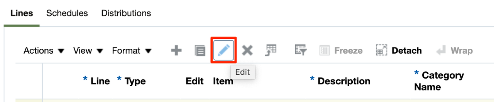

    This opens the *Edit Line* page for the current purchase order line.

12. Enter a future date in either the *Requested Delivery Date* or *Promised Delivery Date* field.
    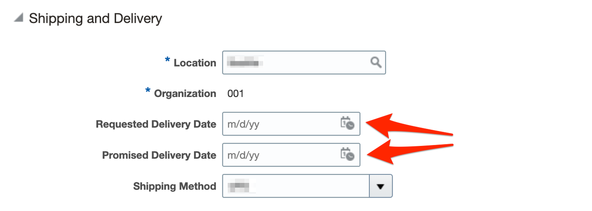

13. Click **OK** at the top right of the *Edit Line* page and return to the parent window.

14. Click **Submit** to initiate purchase order processing.
    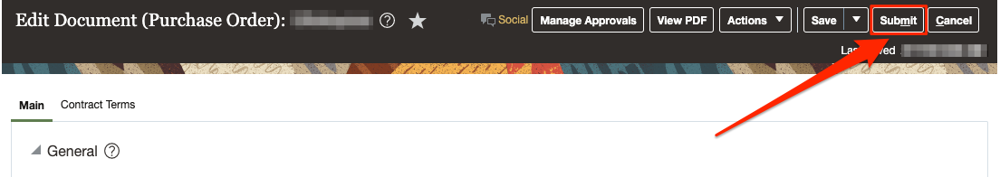

    After submitting the Purchase Order, a confirmation message should appear with the PO number.

15. Click **OK** to close the confirmation dialog.

## Task 2: Validate the Purchase Order Status

After the PO is submitted, its initial status becomes *Pending Approval*. The PO Create event occurs once the status changes to *Open*.

1. In the **Overview** section, click the **Tasks** button on the right.

    This opens the *Tasks* menu.

2. Under the *Orders* section, click on **Manage Orders**.

3. Click **Search**. You should see the Purchase Orders for the current user.

4. Look for your Purchase Order in the list with the PO number displayed in the previous task.

    > **Tip:** The last created PO should generally be the top one in the list.

5. Validate the PO status. If it is *Open*, the business event has occurred.

    > **Note:** If the PO has another status, such as *Pending Approval*, wait a few minutes and refresh the page until the desired PO status appears.

## Task 3: Track message flow triggered by the PO Create Event
Use the Oracle Integration dashboard to view the data flow resulting from the purchase order creation event in ERP Cloud.

1. In the Integration navigation pane, click **Home** &gt; **Observability** &gt; **Instances**.

2. Find the corresponding integration instance by matching the *PO Header ID* or *Document Description* from the purchase order in ERP Cloud. This information appears under the *Primary Identifier* or *Business Identifiers* columns.

    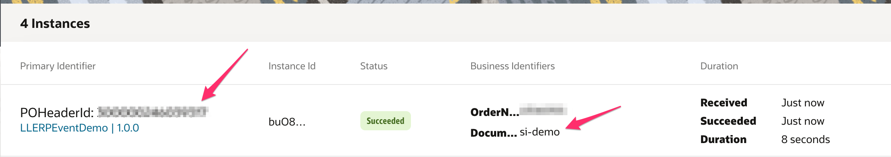

3. Click your **PO Header ID** link to open the corresponding integration instance.

    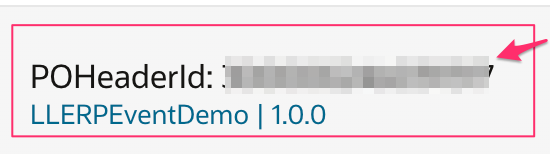

    The flow ran successfully if it is displayed with a green line.

    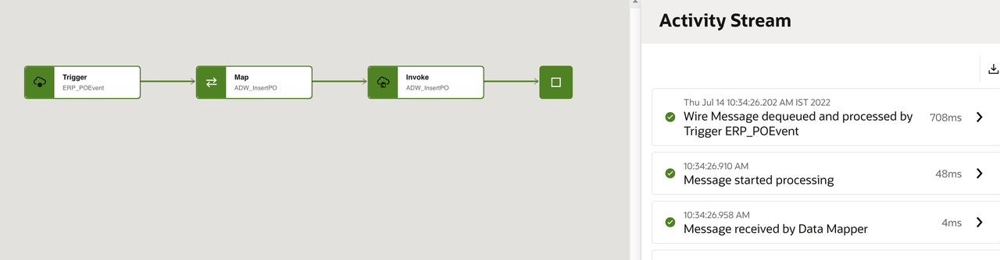

4. You can view the **Activity Stream** on the right side of the screen.

5. Click the different **Message** links to review the request and response message flow.

6. Click **Go back** to return to the instances.

## Task 4: Verify the PO Record in the ADW Table

Follow these steps to view the PO record in the designated database table.

1. If you are not already logged in to Oracle Cloud Console, log in and select **Autonomous Data Warehouse** from the navigation menu.

    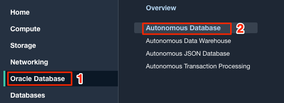

    > **Note:** You can also directly access your Autonomous Data Warehouse or Autonomous Transaction Processing service in the **Quick Actions** section of the dashboard.

2. Navigate to your demo database by clicking the instance link.

    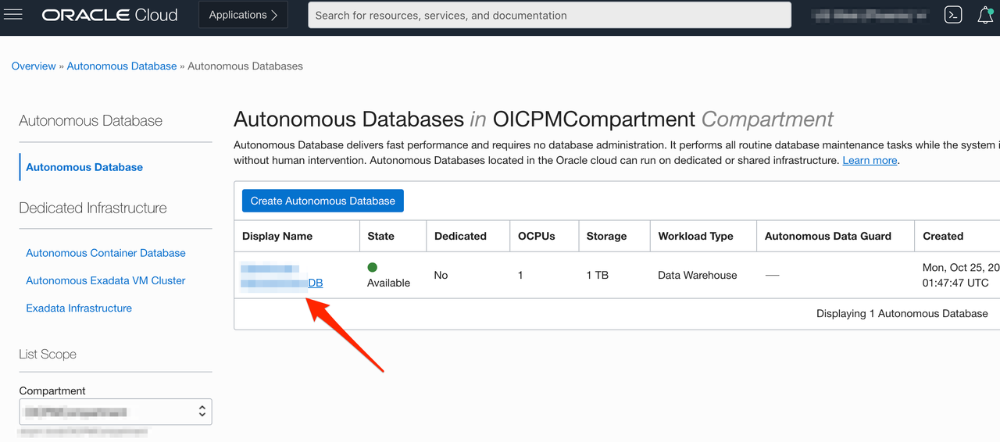

    > **Note:** Similar steps apply to either Autonomous Data Warehouse or Autonomous Transaction Processing.

3. In the ADW Database Details page, click the **Database Actions** button.

    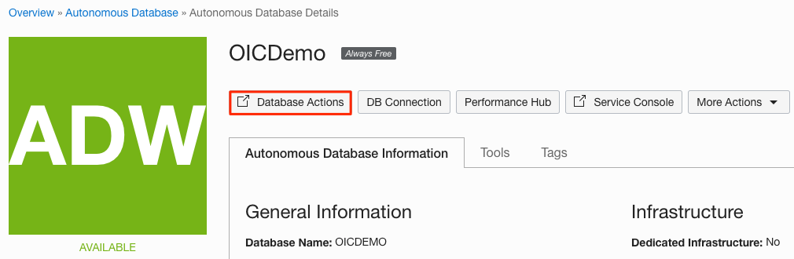

4. Sign in with your database instance's default administrator account, using `ADMIN` as the username, then click **Next**.

    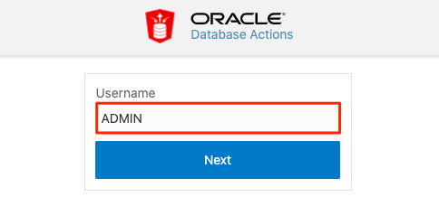

5. Enter the **ADMIN** password, then click **Sign in**.

    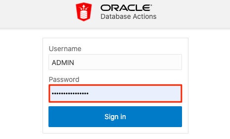

6. The Database Actions page opens. In the *Development* box, click **SQL**.

    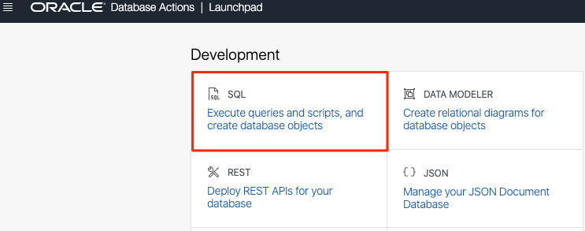

7. The SQL Worksheet appears. In the *Navigator* on the left, select the **PURCHASEORDER** table, then right-click **Open**.
    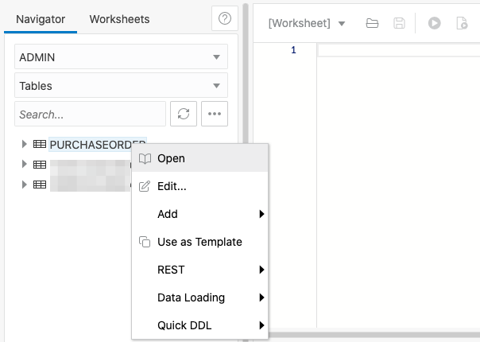

    This opens the *ADMIN.PURCHASEORDER* table window.

8. Click **Data** in the left menu to display the table data. Verify that your PO record is available.
    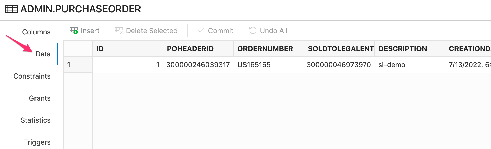

You have completed the final step of this workshop. Thank you!

## Acknowledgements
* **Author** - Ravi Chablani, Product Management - Oracle Integration
* **Author** - Subhani Italapuram, Product Management - Oracle Integration
* **Last Updated By/Date** - Subhani Italapuram, Aug 2026
