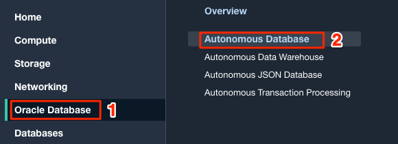
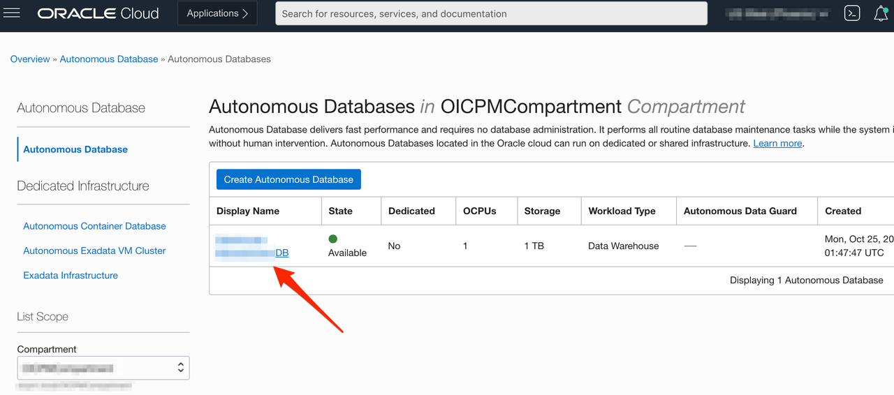
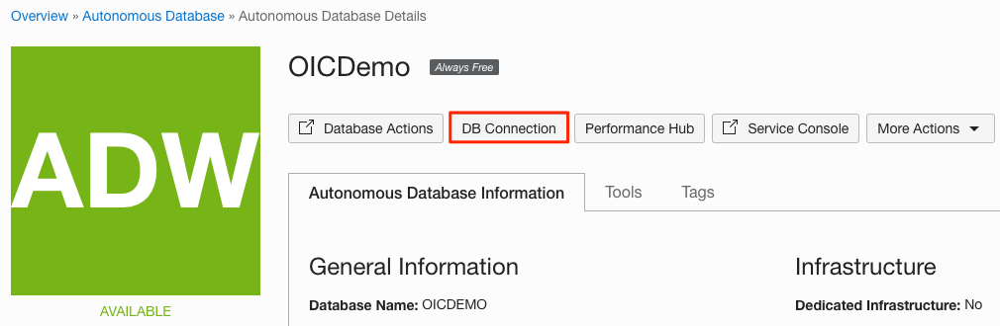
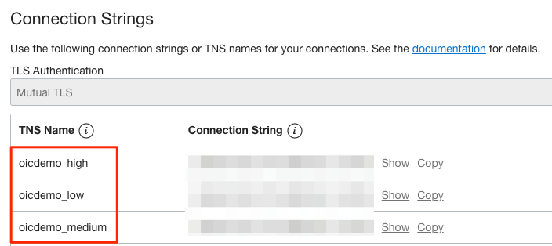
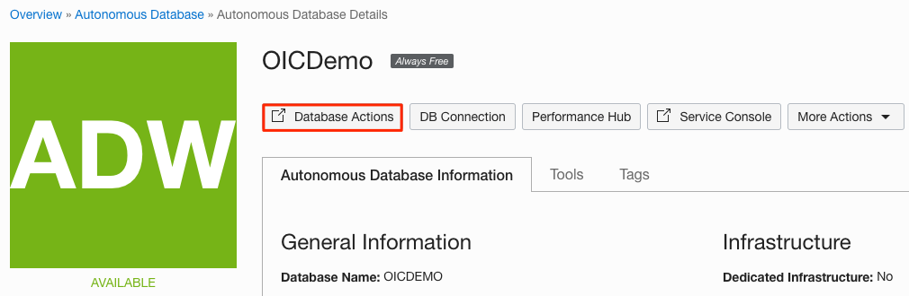
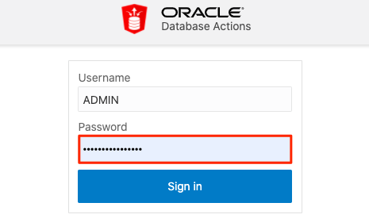
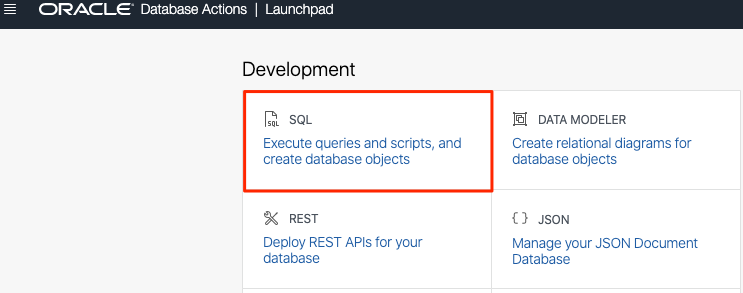
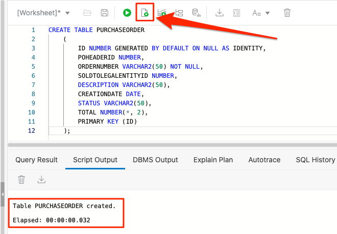

# Lab Setup

## Introduction

This lab walks you through the setup required to complete this demo workshop.

Estimated Lab Time: 5 minutes

### Objectives
In this lab, you will:
- Obtain Database Connection details
- Create Database Table using a SQL script


### Prerequisites
This lab assumes you have:
* An Oracle Cloud account
* All previous labs successfully completed


## Task 1: Obtain Database Connection details
1. If you are not already logged in to Oracle Cloud Console, log in and select **Autonomous Database** from the navigation menu under Oracle Database.

    

    > **Note:** You can also directly access your Autonomous Data Warehouse or Autonomous Transaction Processing service in the **Quick Actions** section of the dashboard.

2. Navigate into your demo database by clicking on the instance link.

    

    > **Note:** Similar steps apply to either Autonomous Data Warehouse and Autonomous Transaction Processing.

3.  In your Autonomous Database Details page, click the **DB Connection** button.

    

4. In the displayed *Database Connection* dialog, click **Download Wallet**. 

5. Provide a Wallet password, then click **Download**. Save the wallet file (ZIP) on your local machine. This file will be used later when creating the Autonomous Database connection in Oracle Integration. 

6. Under *Connection Strings*, select one of the *TNS Name* entries and write it down. This value will used later when creating the Autonomous Database connection in Oracle Integration.

    

7. Click **Close**.


## Task 2: Create a database table using a SQL script
Follow these steps to create a DB table which will be used as part of this workshop. 

1.  If you are not already logged in to SQL Worksheet, in your ADW Database Details page, click the **Database Actions** button.

    

    > **Note:** If you are redirected to the Database Actions page, then skip to Step 4. Otherwise, follow the next step to log-in manually.  

2. A sign-in page opens for Database Actions. For this lab, simply use your database instance's default administrator account `ADMIN` and click **Next**.

   

3.  Enter the **ADMIN** password you specified when creating the database and click **Sign in**.

    

4. The Database Actions page opens. In the *Development* box, click **SQL**.

    

    > **Note:** If this is the very first time you open the SQL Action, then a click-demo will be displayed. Just hit the **X** button to proceed. 

5. The SQL Worksheet appears. Before you proceed with the SQL Worksheet, copy below code snippet:
    ```
    <copy>
    CREATE TABLE PURCHASEORDER
    (
        ID NUMBER GENERATED BY DEFAULT ON NULL AS IDENTITY,
        POHEADERID NUMBER,
        ORDERNUMBER VARCHAR2(50) NOT NULL,
        SOLDTOLEGALENTITYID NUMBER,
        DESCRIPTION VARCHAR2(50),
        CREATIONDATE DATE,
        STATUS VARCHAR2(50),
        TOTAL NUMBER(*, 2),
        PRIMARY KEY (ID)
    );
    </copy>
    ```

6. Paste the script in the SQL Worksheet, then click **Run It** button. This will create the **PURCHASEORDER** table. The table is created successfully when you see the notification in the *Script Output* window. 

    

Now you have an external table which will be used in the demo flow. 


You may now **proceed to the next lab**.


## Acknowledgements
* **Author** - Ravi Chablani, Product Management - Oracle Integration
* **Last Updated By/Date** - Ravi Chablani, May 2022
