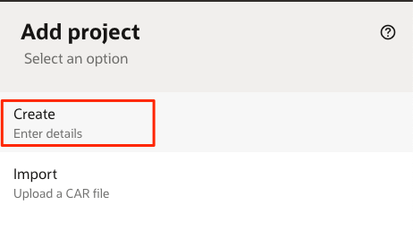

# Create a Project

## Introduction

This lab walks you through the steps to create a Project to hold all the relevant Integration and Robot assets, such as connections and flows.

Estimated Lab Time: 5 minutes

### About Projects

Projects are the hubs of all your automation work and the place to go when you want to design automation solutions, including integrations and robots. Each project can focus on a specific business objective, where select users are given access to project assets. Users who are on different teams and who have different skill-sets can collaborate on designated projects to meet their team objectives.

Projects provide convenient deployment and unified observability, allowing pre-defined teams to work together to build, deploy, and monitor integrations and robots.

### Objectives

In this lab, you will:

- Create a project to hold the integration and robot assets

### Prerequisites

This lab assumes you have:

- Completed the Oracle Integration provisioning lab

## Task 1: Create a Project

1. In the left Navigation pane, click **Projects**.

2. Click **Add**.

3. Select **Create**

    

4. Enter the following information:
    | **Field**        | **Description** |
    | --- | ----------- |
    | Name | Provide a meaningful name for your project. For example `Robot Flow Lab` |
    | Anyone can edit, view, and monitor | Select this option to allow anyone to edit, view, and monitor resources in the project. Don't select this option if you want to restrict access to editing, viewing, and monitoring resources in this project. |

5. Click **Create**.

    The new project page is displayed. You can now create and manage integrations and robots from the project.

You have successfully completed this lab.

## Learn More

- [Get Started with Projects](https://docs.oracle.com/en/cloud/paas/application-integration/integrations-user/release-management.html) in *Using Integrations in Oracle Integration 3*

## Acknowledgements

- **Author** - Ravi Chablani, Product Management - Oracle Integration
- **Last Updated By/Date** - Ravi Chablani, June 2024
