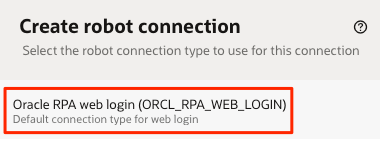
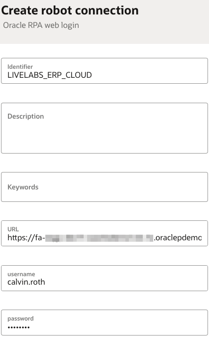

# Create Robot Connection

## Introduction

This lab will walk you through the steps to create a Robot Connection. A robot connection specifies the information that a robot needs to connect to an application. A typical connection specifies the URL and security credentials which the robot can use to login to an application.

Estimated Lab Time: 10 minutes

### Robot Connection Type

Robot connection types are similar to templates, and allow you to specify the parameters required for a robot connection.

Unlike an integration, a robot doesn't need information about an application's security protocols or its APIs. A robot typically needs only a little information about the application or web page that it's connecting to, such as a URL and credentials. You list the fields that a robot needs to connect to an application in a robot connection type.

A robot connection type doesn't list the values of the fields, and it's not application specific. Therefore, you can base robot connections to different applications on the same robot connection type. For example, any robot connection that requires only a user name, password, and URL to access an application can use one of the predefined robot connection types.

### Robot Connections

A robot connection lets you store sensitive data, such as sign-in credentials, outside a robot for easier maintenance. You can update a robot connection at any time without having to open or update a robot.

You specify the parameters that you define in a robot connection based on the selected robot connection type. Once the parameters that a robot needs in a robot connection type have been specified, you can enter values for the parameters in a robot connection. For example, a parameter ```username``` is specified in the Robot Connection Type, and the value ```'jane.doe@example.com'``` is entered in the Robot Connection for that specific parameter.

### Objectives

In this lab, you will:

* Create a robot connection to an Oracle ERP Cloud environment using the default connection type

## Task 1: Create a connection to Oracle ERP Cloud

Specify the service URL and login credentials in a robot connection.

1. In the navigation pane, select **Projects** and then click on the project created in the previous lab.

2. On the right side of the page, go to the **Robot connections** box and click **+ (Add)**.

3. On the **Create robot connection** panel, select the Default connection type **Oracle RPA web login**.

    

4. In the **Create robot connection - Oracle RPA web login** panel, fill in the following fields:
    | **Field**           | **Required** | **Value** |
    | ------------------- | ----------- | ----------- |
    | Name                | Yes | Enter a name for the login page. <br> For example: `LiveLabs ERP Cloud` |
    | Identifier          | Yes | This entry is autogenerated based on the Name value.  |
    | Description         | No  | Provide additional information about the robot connection.|
    | URL                 | Yes | Enter your ERP Cloud login URL. Please follow this format: <br>`https://<your-erp-cloud-hostname>/fscmUI/faces/FuseWelcome?fndThemeName=Vision_Default`  |
    | Username            | Yes  | Enter an ERP user who has access to the Procurement module|
    | Password            | Yes  | Enter a valid ERP password for the selected user. |

    The connection panel should look as below:

    

5. Click **Create**.

You have successfully completed this lab.

## Acknowledgements

* **Author** - Ravi Chablani, Principal Product Manager - Oracle Integration
* **Last Updated By/Date** - Ravi Chablani, June 2024
