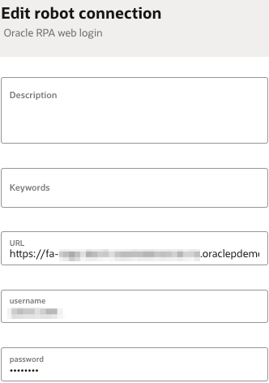

# Create Robot Connection

## Introduction

This lab will walk you through the steps to create a Robot Connection. A Robot Connection lets you store sensitive data, such as sign-in credentials, outside a robot for easier maintenance.

## Task 1: Create a connection to ERP Cloud

Specify the service URL and login credentials in a robot connection.

1. In the navigation pane, select **Projects** and then click on the project created in the previous lab.

2. On the right side of the page, go to the **Robot connections** box and click **+ (Add)**.

3. On the **Create robot connection** panel, select the Default connection type **Oracle RPA Web Login**.

    .

4. In the **Create robot connection - Oracle RPA web login** panel, fill in the following fields:
    | **Field** | **Required** | **Value** |
    | --- | ----------- | ----------- |
    | Name        | Yes | Enter a name for the login page.   For example: `LiveLabs ERP Cloud` |
    | Identifier  | Yes | This entry is autogenerated based on the Name value.  |
    | Description | No  | Provide additional information about the robot connection.|
    | URL         | Yes | Enter your ERP Cloud login URL. Please follow this format:  `https://<your-erp-cloud-hostname>/fscmUI/faces/FuseWelcome?fndThemeName=Vision_Default`  |
    | Username    | Yes  | Enter a valid ERP username.|
    | Password    | Yes  | Enter a valid ERP password for the selected user. |

    |  |
    |-|

5. Click **Create**.

## Acknowledgements
* **Author** - Ravi Chablani, Principal Product Manager - Oracle Integration
* **Last Updated By/Date** - Ravi Chablani, April 2024
