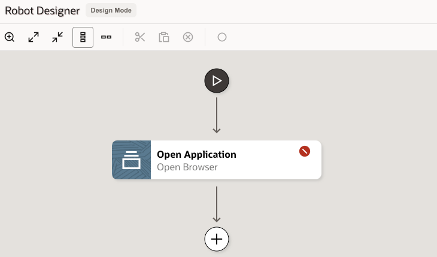
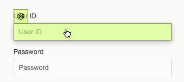

# Create Robot Flow

## Introduction

This lab walks you through the steps to create a end-to-end robot flow. When you create a robot flow, you define its trigger and the actions that the robot performs.

### Objectives

In this lab, you will:

* Create a Robot
* Specify Input and Output Triggers
* Install the Robot Designer Extension
* Add Robot Actions

### Prerequisites

This lab assumes you have:

* Completed the Robot Connection
* Chrome Browser with manage permission

## Task 1: Create a Robot

When you create a robot, you define its trigger and the actions that the robot performs.

1. In the navigation pane, select **Projects** and then click on the project created in the previous lab.

2. On the right side of the page, go to the **Robots** box and click **+ (Add)**.

3. In the **Create robot** panel, fill in the following fields:
    | **Field** | **Required** | **Value** |
    | --- | ----------- | ----------- |
    | Name          | Yes | Enter a name for the robot connection type For example: `LiveLabs Robot Flow`       |
    | Identifier    | Yes | This entry is autogenerated based on the Name value.  |
    | Version       | Yes | Keep as default: `1.00.00` |
    | Description   | No  | Provide additional information about the robot.|
    | Keywords      | No  | Enter text that people might use to search for the robot. |

    

4. Click **Create**.

The Robot Designer will appear, with a default flow which includes an Open Application action.

## Task 2: Specify Input and Output Triggers

The trigger defines the interface for the robot, including the input (incoming request) and the output (outgoing response). For this lab, we will provide a purchase order number as input, and capture the supplier name as output.

1. Select  **(Click to edit trigger)**

    The trigger panel will appear on the screen.

2. On the **Input** tab, click **+ (Add)** and enter the following Input property values:

    * Name: `PONumber`
    * Type: `String` (default)

3. Select the **Output** tab, click **+ (Add)** and enter the following Output property values:

    * Name: `SupplierName`
    * Type: `String` (default)

4. Click **OK**.

## Task 3: Define Open Application Action

This action tells the robot to open a web browser and navigate to the Oracle ERP Cloud sign-in page. We will use the robot connection created in the previous lab to pull the service URL and credentials.

1. Double-click on the **Open Application** action.

    

2. In the **Open Browser** panel, keep the default values for **Name** and **Description**.

3. We will assign the target URL dynamically using a Robot Connection. On the **Input** tab, select within the **URL** field and click on the **Robot connections** icon .

    The **Robot connections** side panel will appear, with the previously created robot connection.

4. Returning to the **Robot connections** side panel, expand the newly created Robot Connection. Next, drag the **URL** parameter to the matching field under the **Input** tab.

    

5. Under **Browser**, select the browser which will be used by the robot flow. Keep all other values as default.

6. Click **OK** when done, then **Save**.

## Task 4: Add Login Action

Start the robot flow by adding the Login action.

1. On the Robot Designer canvas, hover over the **Open Application** action and click on the **+** which appears below it.

    A menu of available actions appears.

2. From the **Actions** tab, select the **Login** action.

    The **Login** action appears on the canvas.

3. On the **Login** panel, within the **Username** field, select **Robot connections** . On the Robot connections side panel, expand the created robot connection and drag the `username` parameter to the **Username** field.

4. Repeat these steps by dragging the `password` parameter to the **Password** field.

    Next, we will specify input details for Username and Password actions.

5. In another browser window, open the sign-in page for the Oracle Fusion environment that the robot will work in. Here's an example environment URL:
`https://eeho.fa.us2.oraclecloud.com/fscmUI/faces/FuseWelcome`

6. Return to the **Login** panel on the Robot window, click within the **Username locator** field, and select **Target a page element** .

    > The rest of the workshop requires the Robot Designer Extension. If you see below message, then complete the installation before proceeding to the next step. After installing the browser extension, we can start adding robot actions.

    

7. Install the Browser Extension

    * Click on the **Download browser extension** button and wait for the download to complete.
    * Navigate to the location of the downloaded ZIP file, such as your **Downloads** folder.
    * Extract the ZIP file in the same folder.
    * In Google Chrome, open the **Extensions** menu, and select **Manage Extensions**.
    * On the **Extensions** page, select **Load unpacked**.
    * Navigate to the folder containing the unzipped files, select the *target* folder, and click on **Select Folder**.

    This loads the Robot Extension in your Chrome browser. Close this tab and return to the Robot flow.

    

8. On the **Target a page element** panel, select the target browser window to the Oracle Fusion login page. The title will be `Sign In`.

    

    This starts the design Targeting on the ERP Cloud login page. This component pops up at the bottom of the Fusion Application window:

    

9. On the Oracle Fusion login page, point to the `User ID` field where the robot will enter the user name.
    > **Note**: When using the targeting component, wait until the target icon appears, the field turns green, and your mouse icon changes to a hand before selecting the UI element.

    

    The Targeting maps the `User ID` UI element value to the **Username locator** field in the robot.

    

10. Repeat the previous steps for the following fields:

    * **Password locator**: Select the `password` UI element.
    * **Submit locator**: Select the `Sign In` button that the robot clicks to sign in to the Oracle Fusion application.

    Your current (incomplete) flow should look as follows:

    

11. Click **OK**.

12. Above the Robot canvas, click **Save**.

-
-

    This adds an action `Enter "User ID" Text` to the robot flow.

    > **Note:** When using the recorder, wait until the target icon appears, the field turns green, and your mouse icon changes to a hand before selecting the UI element.

    Next we set the **Value** field by mapping the **Username** input variable.

 **Target a page element** panel, check **Create target** option and select `Sign In`.

    This starts the recorder on the ERP Cloud login page.

13. On the **RPA Smart Recording** panel, click on **Begin Recording**.

    We will now select field elements to generate associated Actions in the robot flow.

## Task 5: Add Robot Actions using the Record option

Build the robot flow by adding actions using the recorder.

1. Open a new browser window and navigate to the login page of ERP Cloud. This is the URL value which was set in the web login panel.

    

2. Return to the browser tab running the robot designer. Select the **Open Application** action (don't double-click). Selecting the actions enables the record button. 

3. On the **Smart Record** panel, click **Select browser tab to target**.

    

    This starts the recorder on the ERP Cloud login page.

4. On the **RPA Smart Recording** panel, click on **Begin Recording**.

    We will now select field elements to generate associated Actions in the robot flow.

5. Hover the mouse over the **User ID** field until it lights-up green, and select it.

    This adds an action `Enter "User ID" Text` to the robot flow.

    > **Note:** When using the recorder, wait until the target icon appears, the field turns green, and your mouse icon changes to a hand before selecting the UI element.

    Next we set the **Value** field by mapping the **Username** input variable.

6. On the **Action Details** panel, within the **Value** field, select the **Robot connections** icon . On the **Robot connections** side panel, expand the created robot connection and drag the **username** parameter to the **Value** field.

7. For the **Test value** field, enter a valid EPR username. For example `calvin.roth`.

8. Click **Save**.

    > **Note:** We add valid test values to allow the login to work and move to the next screen in the browser.

9. Next, hover the mouse over the **Password** field until it lights-up green, and select it.

10. Map the robot connection **password** parameter to the **Value** field.

11. For the **Test value** field, enter a valid ERP password.

12. Click **Save**.

13. Next, hover the mouse over the **Sign In** button until it lights-up green, and select it.

14. On the **Action Details** panel, keep all values as default and click **Save**.

15. Return to the browser tab running the robot designer. Click **Save** in the robot designer.

    Your current (incomplete) flow should look as follows:

    

> **Note:** When clicking a button or link in recorder mode, the following events occur:
    > 1. The operation is added as action to the robot flow.
    > 2. The browser performs the actual UI operation.

## Task 6: Add Robot ERP Actions using the Record option

Continue the robot flow by adding actions from ERP Cloud using the recorder. After sign-in in the previous task, you should now be on the ERP Cloud landing page.

1. From the top menu in ERP Cloud, click on **Procurement** when the icon changed to a target. In the **Action Details**, keep all values as default and click **Save**. This will add the action `Click "Procurement"` and move to the procurement element.

2. Click on **Purchase Orders** when the complete tile is shaded and changed to a target. In the **Action Details**, keep all values as default and click **Save**. This will add the `Click "Purchase Orders"` action and move to the purchase orders element.

3. On the **Overview** page, move to the right of the screen and select the **Tasks** icon when the icon changes to a target.
    

    In the **Action Details**, keep all values as default and click **Save**. This will add the `Click "Tasks"` action and display a side panel.

4. On the side panel, go to the **Orders** section and click on **Manage Orders** when the icon changes to a target. In the **Action Details**, keep all values as default and click **Save**. This will add the `Click "Manage Orders"` action and move to the Manage Orders page.

    Next, we will search for a specific Purchase Order by providing an order number.

5. Move to the **Order** field and select the UI element when the icon changes to a target. Enter the following values in the **Action Details**.

    * Name: `Enter "PO number" Text`
    * Value: In the field, click  **(Flow Input/Output)** and select the **Input** property **PONumber**. Double-click the property to have it mapped to the **Value** field.
    * Test value: Enter a valid `PO Number` which will be used in the search query to pull an actual purchase order. Example: `US164712`

    

6. Click **Save**.

7. Click on **Search** when the complete tile is shaded and changed to a target. In the **Action Details**, keep all values as default and click **Save**. This will add the `Click "Search"` action and display the search results containing the specified purchase order.

8. For the listed purchase order, move to the **Supplier** column and select the supplier name after the icon changes to a target. Enter the following values in the **Action Details**.
    * Name: `Click "Get supplier name"`
    * Action: Get Text
    * Save To: Select  **(Flow Input/Output)**, switch to **Output** and double-click on **SupplierName**.

9. Click **Save**.

10. In the "Smart Recording" panel, click on  **(Stop recording)** to end the recording.

11. In the **Robot Designer**, click on **Save**.

12. Close the robot designer by clicking on the **< (Go back)** button on the top left of the screen.

13. For the selected robot, click on **...** and select **Add Environment Pool**.

14. In the **Add Environment pool**, select the existing environment pool and click **Add**.

    

    The status of your robot should change to **Configured**.

15. For the selected robot, click on **...** and select **Activate**.

## Acknowledgements

* **Author** - Ravi Chablani, Principal Product Manager - Oracle Integration
* **Last Updated By/Date** - Ravi Chablani, March 2024
