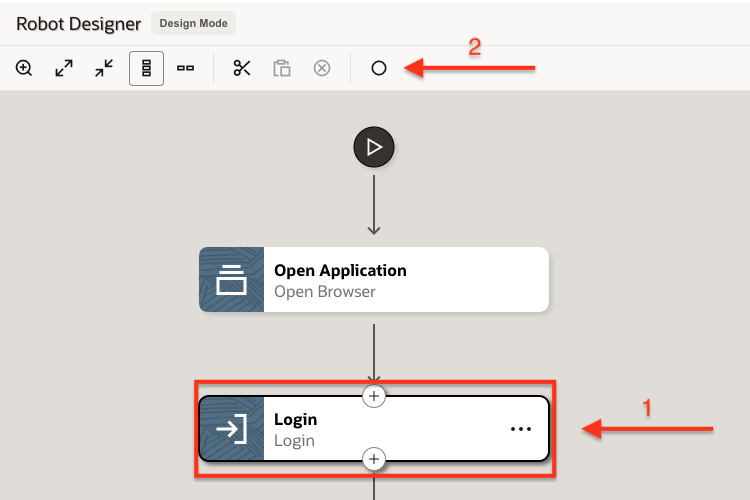

## Create Robot Flow

### Objectives

In this lab, you will:

* Create a Robot
* Add Robot Actions

### Prerequisites

This lab assumes you have:

* Completed the Robot Connections

## Task 1: Create a Robot

When you create a robot, you define its trigger and the actions that the robot performs.

1. In the navigation pane, select **Projects** and then click on the project created in the previous lab.

2. On the right side of the page, go to the **Robots** box and click **+ (Add)**.

3. In the **Create robot** panel, fill in the following fields:
    | **Field** | **Required** | **Value** |
    | --- | ----------- | ----------- |
    | Name          | Yes | Enter a name for the robot connection type.   For example: `LiveLabs Robot Flow`       |
    | Identifier    | Yes | This entry is autogenerated based on the Name value.  |
    | Version       | Yes | Keep as default: `1.00.00` |
    | Description   | No  | Provide additional information about the robot.|
    | Keywords      | No  | Enter text that people might use to search for the robot. |
    | | | |

    

4. Click **Create**.

Robot Designer will appear. The flow includes an Open Application action that is undefined.

## Task 2: Specify the trigger

The trigger defines the interface for the robot, including the input (incoming request) and the output (outgoing response). For this lab, we will provide a purchase order number as input, and capture the supplier name as output.

1. Select  **(Click to edit trigger)**

    The trigger panel will appear on the screen.

2. On the **Input** tab, click **+ (Add)** and enter the following Input property values:

    * Name: `PONumber`
    * Type: `String` (default)

3. Select the **Output** tab, click **+ (Add)** and enter the following Output property values:

    * Name: `SupplierName`
    * Type: `String` (default)

4. Click **OK**.

## Task 3: Define Open Application Action

This action tells the robot to open a web browser and navigate to the Oracle ERP Cloud sign-in page. We will define a Robot Connection, based on a Robot Connection Type, containing the URL and credentials to the ERP Cloud login page.

1. Double-click on the **Open Application** action.

2. In the **Open Browser** panel, enter a **Name** and **Description** for the action.

3. Next, we will assign the target URL dynamically using a Robot Connection. On the **Input** tab, select within the **URL** field and click on the **Robot connections** icon .

    The **Robot connections** side panel will appear, without any available robot connections.

4. On the **Robot connections** side panel, create a new connection to the target page by clicking on **+ (Add)**.

5. On the **Create robot connection** panel, select the Default connection type **Oracle RPA Web Login**.

    .

6. In the **Create robot connection** panel, fill in the following fields:
    | **Field** | **Required** | **Value** |
    | --- | ----------- | ----------- |
    | Name        | Yes | Enter a name for the login page.   For example: `LiveLabs ERP Cloud Login` |
    | Identifier  | Yes | This entry is autogenerated based on the Name value.  |
    | Description | No  | Provide additional information about the robot connection.|
    | URL         | Yes | Enter your ERP Cloud login URL. Please follow this format:  `https://<your-erp-cloud-hostname>/fscmUI/faces/FuseWelcome?fndThemeName=Vision_Default`  |
    | Username    | Yes  | Enter the username.|
    | Password    | Yes  | Enter the password for the selected user. |
    | | | |

    .

7. Click **Create**.

8. Returning to the **Robot connections** side panel, expand the newly created Robot Connection. Next, drag the **URL** parameter to the matching field under the **Input** tab.

    .

9. Under **Browser**, select the browser which will be used by the robot flow. Keep all other values as default.

10. Click **OK** when done, then **Save**.

## Task 4: Specify Robot Actions using the Record option

Build the robot flow by adding actions using the recorder.

1. Open a new browser tab and navigate to the login page of ERP Cloud. This is the URL value which was set in the web login panel.

    .

2. Return to the browser tab running the robot designer. Select the **Open Application** action. This will enable the record button. .

3. On the **Smart Record** panel, click **Select browser tab to target**.
    

    This starts the recorder on the ERP Cloud login page.

4. On the **RPA Smart Recording** panel, click on **Begin Recording**.

5. Hover the mouse over the **User ID** field until it lights-up green, and click it.

6. On the **Action Details** panel, 