# Create Robot

## Introduction

This lab walks you through the steps to create a end-to-end robot. When creating a robot, you define its trigger and the actions that the robot performs.

Estimated Lab Time: 45 minutes

### Objectives

In this lab, you will:

* Create a Robot
* Specify Input and Output Triggers
* Install the Robot Designer Extension
* Add Robot Actions

### Prerequisites

This lab assumes you have:

* Completed the Robot Connection
* Chrome Browser with manage permission

## Task 1: Create a Robot

When you create a robot, you define its trigger and the actions that the robot performs.

1. In the navigation pane, select **Projects** and then click on the project created in the previous lab.

2. On the right side of the page, go to the **Robots** box and click **+ (Add)**.

    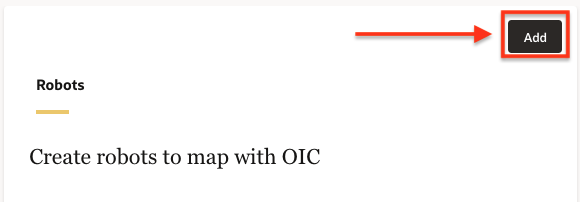

3. In the **Create robot** panel, fill in the following fields:
    | **Field** | **Required** | **Value** |
    | --- | ----------- | ----------- |
    | Name          | Yes | Enter a name for the robot connection type For example: `LiveLabs Robot`       |
    | Identifier    | Yes | This entry is autogenerated based on the Name value.  |
    | Version       | Yes | Keep as default: `1.00.00` |
    | Description   | No  | Provide additional information about the robot.|
    | Keywords      | No  | Enter text that people might use to search for the robot. |

    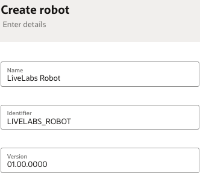

4. Click **Create**.

The Robot Designer will appear, with a default robot which includes an **Open Application** action.
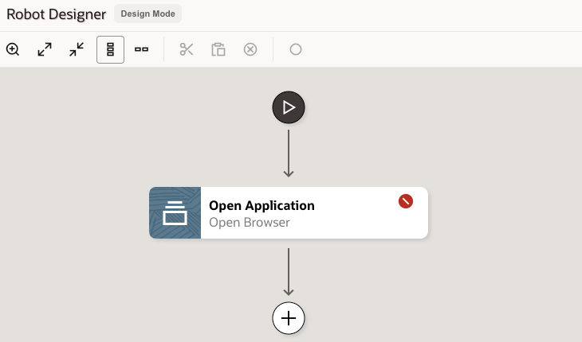

## Task 2: Specify Input and Output Triggers

The trigger defines the interface for the robot, including the input (incoming request) and the output (outgoing response). For this lab, we will provide a purchase order number as input, and capture the supplier name as output.

1. Select  **(Click to edit trigger)**

    The trigger panel will appear on the screen.

2. On the **Input** tab, click **+ (Add)** and enter the following Input property values:

    * Name: `PONumber`
    * Type: `String` (default)

3. Select the **Output** tab, click **+ (Add)** and enter the following Output property values:

    * Name: `SupplierName`
    * Type: `String` (default)

4. Click **OK**.

## Task 3: Define Open Application Action

This action tells the robot to open a web browser and navigate to the Oracle ERP Cloud sign-in page. We will use the robot connection created in the previous lab to pull the service URL and credentials.

1. Double-click on the **Open Application** action.

    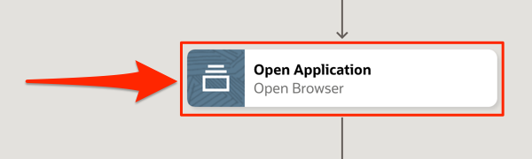

2. In the **Open Browser** panel, keep the default values for **Name** and **Description**.

3. We will assign the target URL dynamically using a Robot Connection. On the **Input** tab, select within the **URL** field and click on the 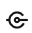 (**Robot connections**) icon.

    The **Robot connections** side panel will appear, with the previously created robot connection.

4. Returning to the **Robot connections** side panel, expand the newly created Robot Connection. Next, drag the **URL** parameter to the matching field under the **Input** tab.

    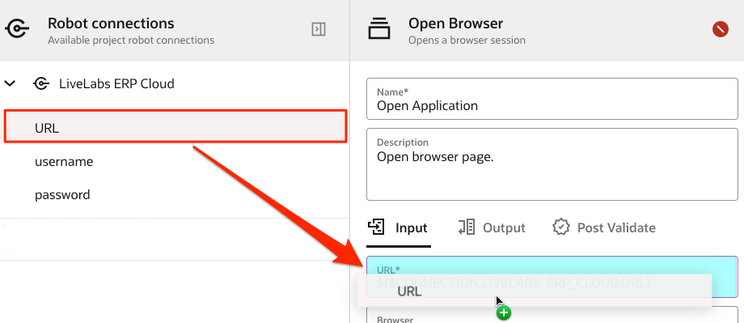

5. Under **Browser**, select the browser which will be used by the robot. Keep all other values as default.

6. Click **OK** when done, then **Save**.

## Task 4: Add Login Action

Start the robot by adding the Login action.

1. On the Robot Designer canvas, hover over the **Open Application** action and click on the **+** which appears below it.


    A menu of available actions appears.

2. From the **Actions** tab, select the **Login** action.


    The **Login** action appears on the canvas.

3. On the **Login** panel, within the **Username** field, select  (**Robot connections**). On the Robot connections side panel, expand the created robot connection and drag the `username` parameter to the **Username** field.
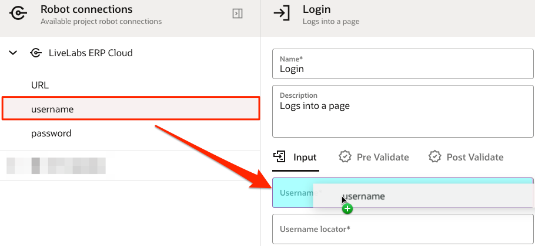

4. Repeat these steps by dragging the `password` parameter to the **Password** field.

    Next, we will specify input details for Username and Password actions.

5. In another browser window, open the sign-in page for the Oracle Fusion environment that the robot will work in. For example, to access Oracle Cloud ERP, your login URL pattern will be:
`https://<Fusion-domain>.fa.<data-center>.oraclecloud.com/fscmUI/faces/FuseWelcome`

6. Return to the **Login** panel on the Robot window, click within the **Username locator** field, and select  (**Target a page element**).

    > **Note**: The rest of the workshop requires the **Robot Designer Extension** on your Chrome browser. This extension is used for Targeting and Recording, which allows you to harness the power of control and power of the low-code capabilities. This extension must be installed in order to build robots.

7. If you see below message while following the previous step, then complete the extension installation. After installing the browser extension, you can start creating targets when adding actions to a robot.

    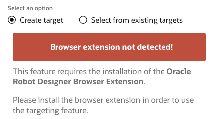

    Follow these steps to install the Browser Extension:

    * Click on the **Download browser extension** button and wait for the download to complete.
    * Navigate to the location of the downloaded ZIP file, such as your **Downloads** folder.
    * Move the ZIP file to a local folder of your choice, such as ```Users\<user>\RPA\plugin```
    * Extract the ZIP file to the designated plugin folder.
    * In Google Chrome, open the **Extensions** menu, and select **Manage Extensions**.
    * Enable **Developer mode** using the slider on the top right corner. 
    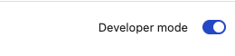
    * On the **Extensions** page, select **Load unpacked**.
    * Navigate to the folder containing the unzipped files, select the *target* folder, and click on **Select Folder**.

    This installs the Robot Extension in your Chrome browser.

    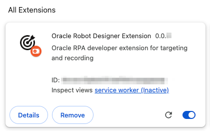

    Close the **Extensions** tab and return to the Robot. Click **Save**, reopen the project and return to the previous step.

    > **Note**: If the extension fails to load, then save all your work and restart the browser window. Next, navigate to the Robot and reopen the **Login** action.

8. On the **Target a page element** panel, select the target browser window to the Oracle Fusion login page with title `Sign In`, and click **Go**.

    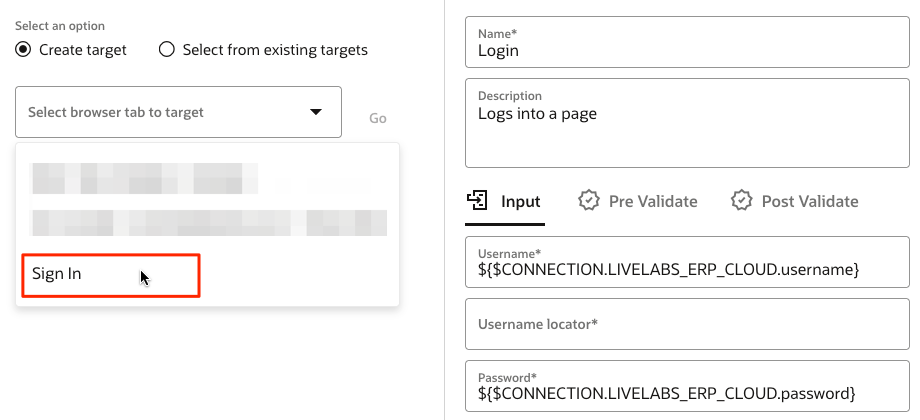

    This starts the design Targeting on the ERP Cloud login page. This component pops up at the bottom of the Fusion Application window:

    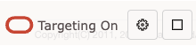

9. On the Oracle Fusion login page, point to the `User ID` field where the robot will enter the user name.
    > **Note**: When using the targeting component, wait until the target icon appears, the field turns green, and your mouse icon changes to a hand before selecting the UI element. By clicking the field before it turns green will result in a regular UI interaction.

    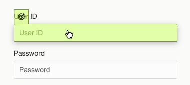

    The Targeting will map the `User ID` UI element value to the **Username locator** field in the robot.

    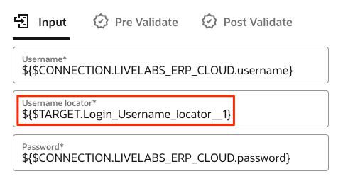

10. Repeat the previous steps for the following fields:

    * **Password locator**: Select the `password` UI element.
    * **Submit locator**: Select the `Sign In` button that the robot clicks to sign in to the Oracle Fusion application.

    Your intermediate Login action panel should look as follows:

    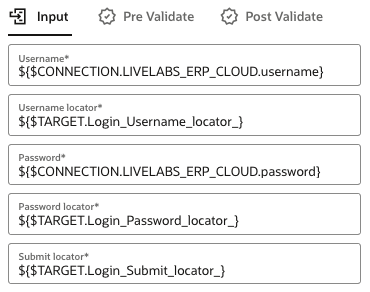

11. Click **OK**.

12. Above the Robot canvas, click **Save**.

## Task 5: Add Robot ERP Actions using the Record option

While building the rest of the robot, you'll record the actions that the robot completes using the recorder, all while harnessing the power of control and power of the low-code capabilities. We will navigate the Fusion pages using UI actions (e.g. mouse clicks, keyboard entries), which will automatically generate the relevant robot actions on the flow.

1. Open the browser window where the credentials were entered in the previous task. Click **Sign In** to proceed to the next screen in ERP Cloud.

    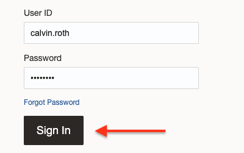

    We will start the robot recording after the login screen.

2. Return to the browser tab running the robot designer. On the robot designer canvas, click the **Login** action to enable the record button.

3. Click the **Record after the selected option** button to start recording after the selected **Login** action.  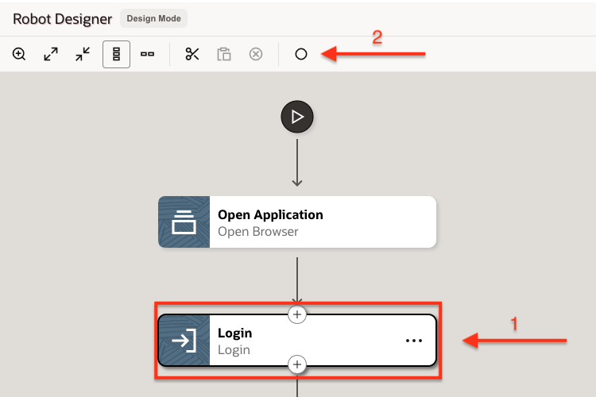

4. On the **Smart Record** panel, click **Select browser tab to target** drop-down.

5. Select the window title which coincides with the Oracle ERP Cloud tab.

    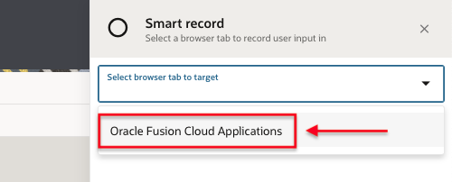

    This starts the recorder on the ERP Cloud landing page.

6. On the **RPA Smart Recording** panel, click on **Begin Recording**.

    We will now select field elements to generate associated Actions in the robot.

    > **Note**: When recording actions, the recorder can start from any point in time. However, for this task we will record after the Login operation.

7. From the top menu in ERP Cloud, click on **Procurement** when the icon changes to a target. 

    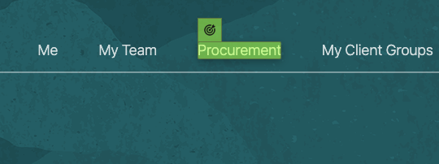

8. In the **Action Details**, keep all values as default and click **Save**. This will add the action `Click "Procurement"` and move to the **Procurement** tab. If your element value is not `A`, then you clicked on the wrong element. Retry the action by selecting **Discard** and click **Procurement** target element again while using the recorder.

    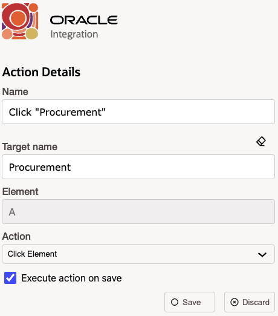

    > **Note:** When recording or targeting a field, hover your cursor over a UI element and note the shading that appears. While the shading is purple and the icon above the field is a magnifying glass, the recorder is still collecting information about the element. Clicking the element before it turns green will result in a regular UI interaction.

9. Click on **Purchase Orders** when the complete tile is shaded and changed to a target.

    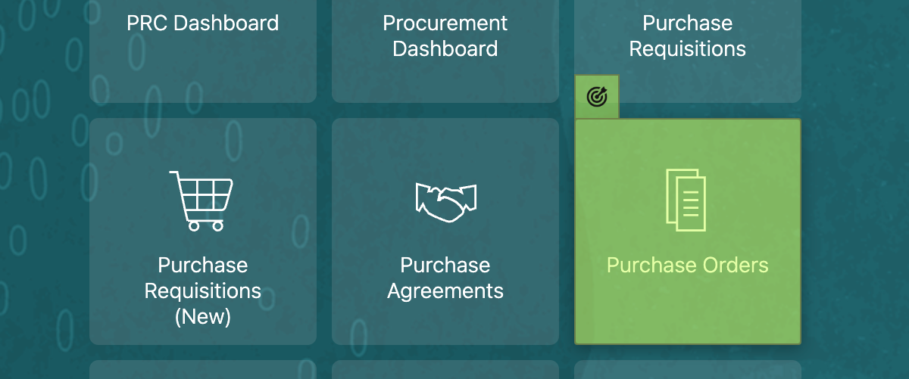

10. In the **Action Details**, keep all values as default and click **Save**. This will add the `Click "Purchase Orders"` action and move to the **Overview - Purchase Orders** screen. If your element value is not `DIV`, then you clicked on the wrong element. Retry the action by selecting **Discard** and click **Purchase Orders** target element again while using the recorder.

    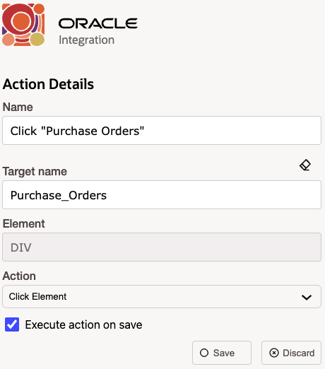

11. On the **Overview** page, move to the right of the screen and select the **Tasks** icon when the icon changes to a target.

    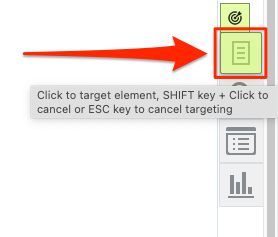

12. In the **Action Details**, if your Element value is `IMG`, then click **Save** to add the `Click "Tasks"` action. If you see a different element value, then you clicked on the wrong UI element. Retry the action by selecting **Discard** and click **Tasks** icon element again while using the recorder.

    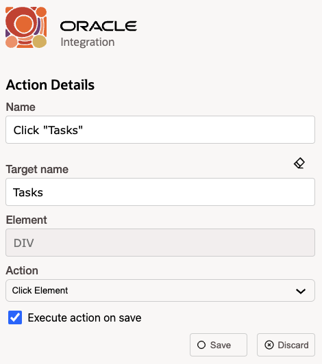

13. On the Tasks side panel, hover to the **Orders** section and click on **Manage Orders** when the icon changes to a target.

    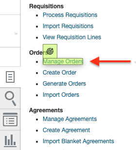

14. In the **Action Details**, keep all values as default and click **Save**. This will add the `Click "Manage Orders"` action.

     > **Note**: When we are ready to test the robot, a valid Purchase Order number will be required as input. In the next steps, we will momentarily pause the recording and search for a valid Purchase Order before continuing with recording consequent actions.

15. Click the **Pause** button on the Smart Recording panel.

    

16. Click the **Tasks** icon again, then select **Manage Orders**. This will display the Manage Orders overview screen.

17. Click **Search** and wait until you see a list of existing purchase orders.

18. Choose one of the purchase orders with a listed `Supplier Name`, and make a note of the order number.

19. Click **Done** on the top right corner to close the **Manage Orders** screen.

20. Once again click on the **Tasks** icon, and select **Manage Orders** to display the Manage Orders overview screen.

21. Click the **Resume** button on the Smart Recording panel to commence recording of UI actions.

    

22. Move to the **Order** field and click the textbox element when the icon changes to a target.

    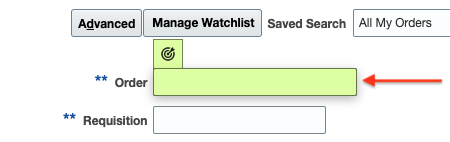

23. Change the following values in the **Action Details**.

    1. Name: `Enter "PO number" Text`
    2. Target name: Add something descriptive without spaces (such as `Enter_po_number`)
    3. Value: In the field, click 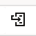 (**Flow Input/Output**) and select the **Input** property **PONumber**.
    4. Double-click the **PONumber** property to have it mapped to the **Value** field.
    5. Test value: Enter the previously captured `PO Number` in the **Test Value** textbox, which will be used in the search query to pull an actual purchase order. Example: `US164712`

    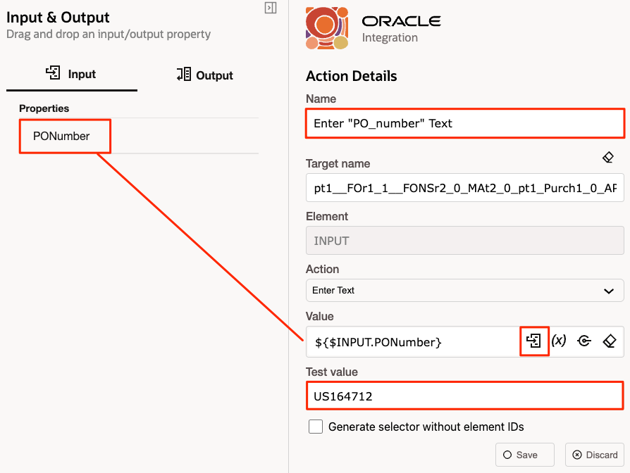

24. Click **Save**.

25. Click on **Search** when the complete tile is shaded and changed to a target.

    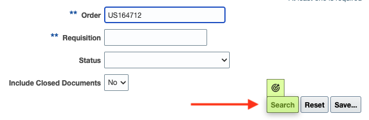

26. In the **Action Details**, keep all values as default and click **Save**. This will add the `Click "Search"` action and display the search results containing the specified purchase order.

27. For the listed purchase order, move to the **Supplier** column and select the supplier name after the icon changes to a target.

    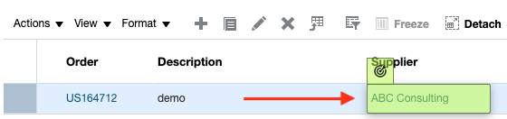

28. In the **Action Details**, if your Element value is not `TD`, then you clicked on the wrong UI element. Retry the action by selecting **Discard** and click on the **Supplier** value again while using the recorder. When the Element value is `TD`, then proceed with the following changes:

    1. Action: `Get Text`
    2. Name: `Click "Get supplier name"`
    3. Target name: Add something descriptive without spaces (such as `Get_supplier_name`)
    4. Save To: In the field, click 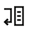 (**Output**)
    5. Double-click the **SupplierName** property to have it mapped to the **Save to** field.

    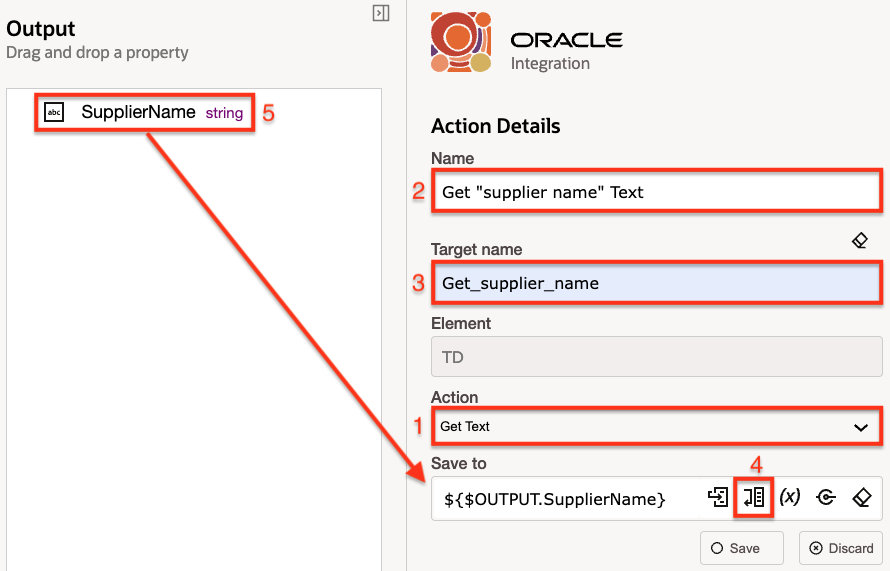

29. Click **Save**.

30. In the "Smart Recording" panel, click on 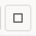 **(Stop recording)** to end the recording.

31. In the **Robot Designer**, click on **Save**.

    We will add a Log action to capture the output value of the robot.

32. Click on the **Robot actions** panel, and drag-and-drop the **Log** action to the tail end of the flow.
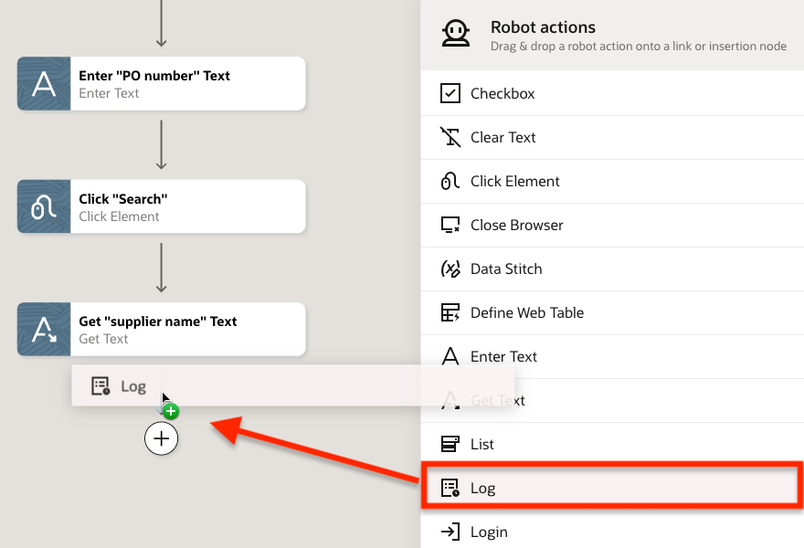

33. On the **Log** panel, hover over the **Message** field, click **...** (**More options**), and select **Output**. This assigns the output value to the log message.
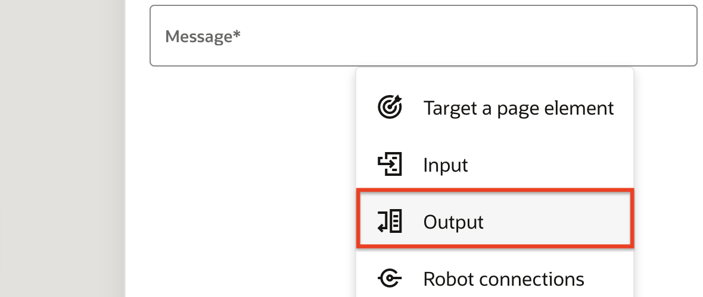

34. Drag the `SupplierName` property to **Message** field.
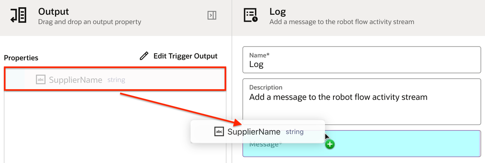

35. Click **OK**, then **Save**.

36. Close the robot designer by clicking on the **<** (**Go back**) button on the top left of the screen.

    The status of your robot should be **Draft**.

    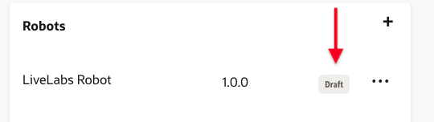

You have successfully completed this lab.

## Acknowledgements

* **Author** - Ravi Chablani, Principal Product Manager - Oracle Integration
* **Last Updated By/Date** - Ravi Chablani, June 2024
