# Create and Test the Integration

## Introduction

After ensuring the robot performs the UI tasks as expected, we will now create an integration that calls it. This integration simulates an end-to-end testing scenario, where the integration passes the input values to the robot.

Estimated Time: 10 minutes

### Objectives

In this lab, you will:

* Create a scheduled integration which invokes the robot and passes input values
* Add Scheduled parameters which capture the requested PO number
* Complete Mapper activity
* Configure Business Identifiers
* Activate the integration
* Run Integration to call the robot
* Validate Integration Run Status

### Prerequisites

This lab assumes you have:

* Activated the robot
* Successfully tested the robot in its environment
* All previous labs successfully completed

## Task 1: Create Scheduled Integration

Create a scheduled integration that will invoke the robot and pass input parameters.

1. On the project page, move to the **Integrations** box and click **Add**.

2. On the **Add integration** panel, click **Create**.

   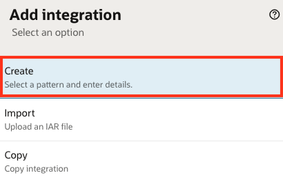

3. On the next screen, select **Schedule**

    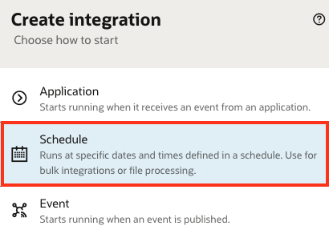

4. Enter a name for the integration, leave all other fields as default, and click **Create**.

    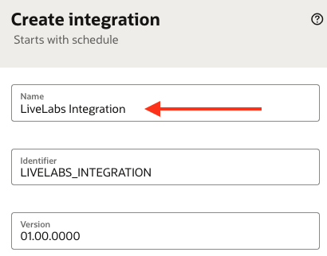

    The Integration Designer will appear, with a default integration.

5. However the mouse just below the **Schedule** activity and click on the **+** button.

    

6. In the popup **Actions** tab, scroll down until the bottom and select **Robot Flow** action.

    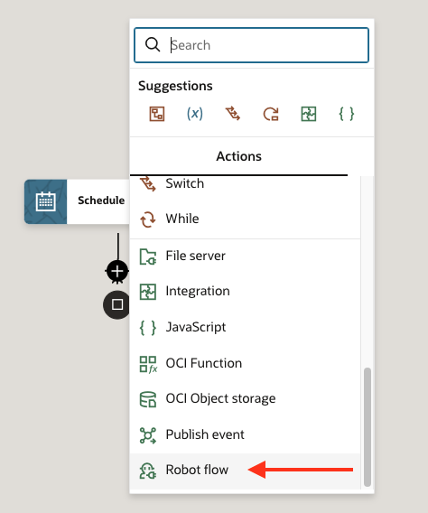

7. On the **Configure Basic Info** screen, enter a valid name for the endpoint without spacing.

    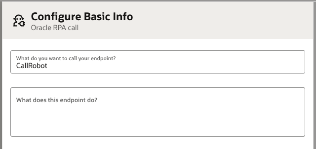

8. On the **Configure Configuration** screen, select the previously activated Robot flow.

   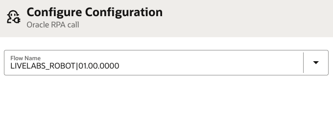

9. Click **Continue**, then **Finish**.

    The designer with Robot action will be displayed.

    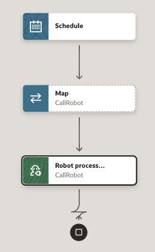

10. Move below the **Robot process** activity and click on the **+** button.

    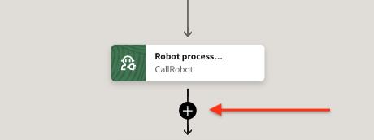

11. In the **Configure assign** panel, take the following steps:

    1. Change **Name** to `Response`
    2. Click on the **Apply** button to save name change
    3. Click **+** to add a variable
    4. Select Datatype **String**

    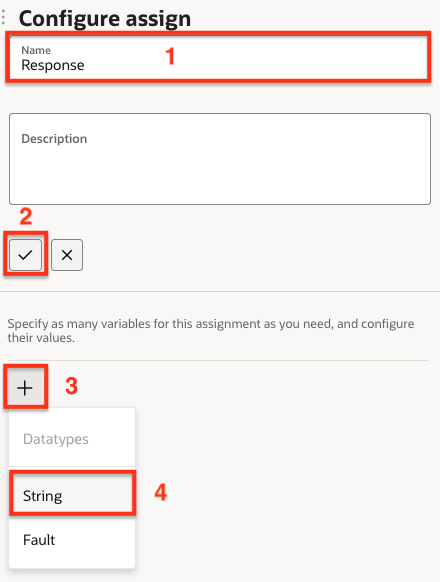

12. With the side panel displayed, take the following steps:

    1. Change **Variable** to ```vSupplierName```
    2. On **Input sources** tab, expand **$CallRobot > RPAFlowResponse > ResponseWrapper** and drag `SupplierName` to the **Value** textbox on the right.

    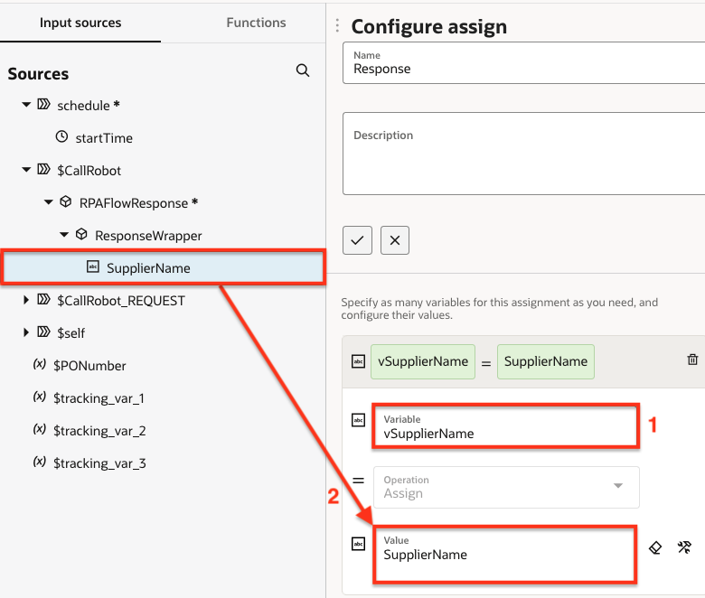

13. Click **Save** to close the panel.

14. On the integration canvas, click **Save**.

## Task 2: Add Scheduled parameters

1. Double-click on the **Schedule** activity to open the **Configure schedule parameters** editor.

    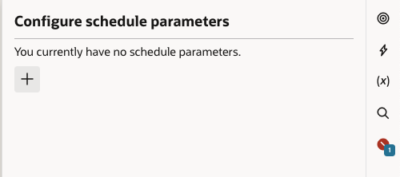

2. Click on the **+** to add a parameter.

3. Under **Parameter name**, enter `PONumber`.

    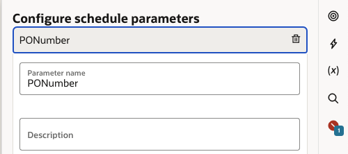

4. Click anywhere on the integration canvas to save the parameter and close the panel.

5. Click **Save**.

## Task 3: Complete Mapper activity

1. Double-click the **Map** activity.

    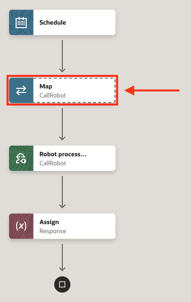

2. In the Map Editor, move to the **Target** side and click on the 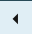 (**left arrow**) next to the `Request Wrapper`.

    The `PO Number` field should be visible on the Target side.

3. Drag the `PONumber` field from the Sources side to the `PO Number` field on the Target side.

    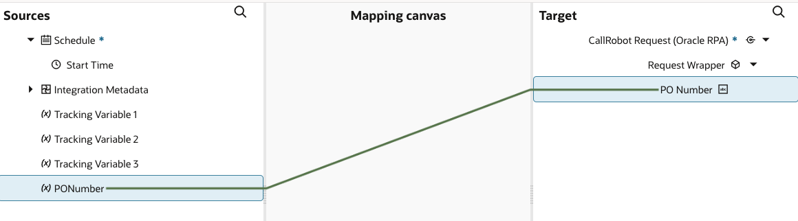

    This completes the mapping activities.

4. Click **Validate** and wait for the confirmation message `Map to CallRobot successfully validated`.

5. Close the mapper by clicking on the  (**Go Back**) button on the top-left corner of the screen.

6. Click **Save**.

## Task 4: Configure Business Identifiers

1. Click on the 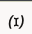 (**Business Identifiers**) button.

2. Drag the `$PONumber` from Sources to the first **Business identifier field**.

    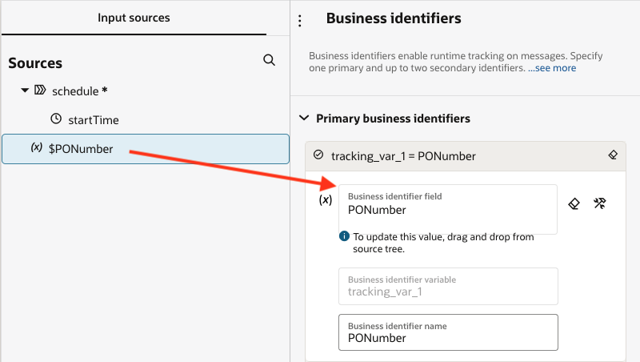

3. Click **Save** to close the **Business Identifiers** panel.

4. Click **Save** on the integration canvas.

5. Close the canvas by clicking on the  (**Go Back**) button on the top-left corner of the screen.

    Under the **Integrations** box, you will find the integration with status `Configured`.

## Task 5: Activate the integration

1. On the right side of the integration, click on **...** (**Options**), then select **Activate**.

    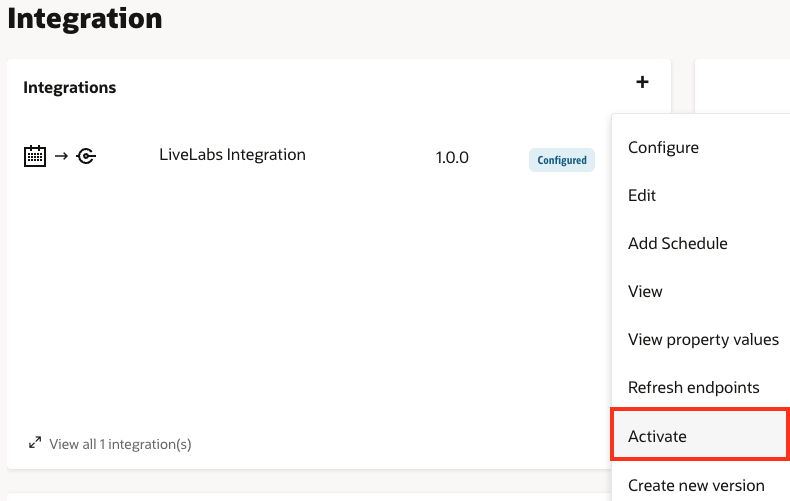

2. In the **Activate integration** panel, select **Debug** tracing level and click **Activate**.

    After a few seconds, the integration status will change from `Activation in progress` to `Active`. You can manually refresh the screen to see the status change.

## Task 6: Run Integration to call the robot

Once the integration is `Active`, we can run it on-demand.

1. On the right side of the integration, click on **...** (**Options**), then select **Run**.

2. On the **Configure and run** panel, enter the previously obtained PO Number under the **Current Value** field (see sample value). Keep all other values as default.

    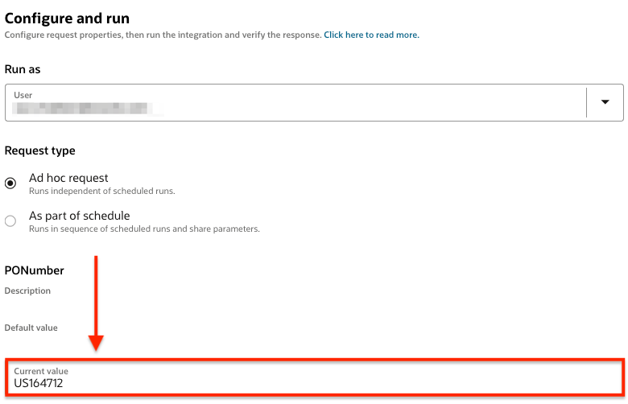

3. Click **Run** to initiate the integration run.

## Task 7: Validate Integration Run Status

After clicking **Run** to start the integration, a side panel of **Activity stream** will appear. Here we will observe the status of the integration run.

1. After the robot run has completed, move to the **Activity stream** panel and click the 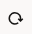 (**Refresh**) button until you see the message `Processing completed successfully`.

    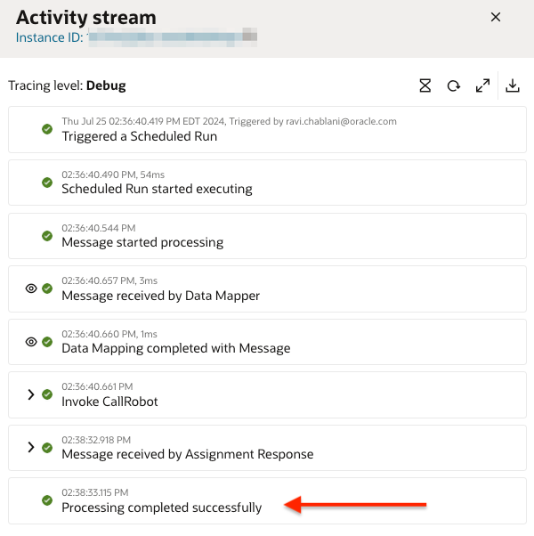

2. Expand the **Invoke CallRobot** activity to verify the robot run.

    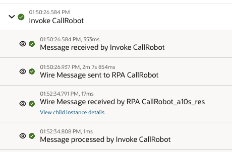

3. Expand the **Message received by Assignment Response** activity to verify the returned supplier name of the provided PO number (see sample supplier name).

    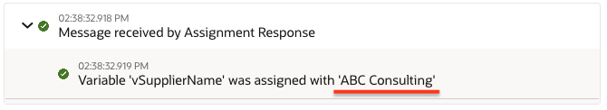

You have successfully completed this lab.

## Acknowledgements

* **Author** - Ravi Chablani, Product Management - Oracle Integration
* **Last Updated By/Date** - Ravi Chablani, July 2024
