# Create and Test the Integration

## Introduction

After ensuring the robot performs the UI tasks as expected, we will now create an integration that calls it. This integration simulates an end-to-end testing scenario, where the integration passes the input values to the robot.

Estimated Time: 10 minutes

### Objectives

In this lab, you will:

* Create a scheduled integration that invokes the robot and passes input values.
* Add scheduled parameters that capture the requested PO number.
* Complete the Mapper activity.
* Configure business identifiers.
* Activate the integration.
* Run the integration to call the robot.
* Validate the integration run status.

### Prerequisites

This lab assumes you have:

* Activated the robot.
* Successfully tested the robot in its environment.
* Successfully completed all previous labs.

## Task 1: Create Scheduled Integration

Create a scheduled integration that will invoke the robot and pass input parameters.

1. In the navigation pane, select **Projects**, then click the project created for this lab.

2. Go to the **Integrations** box and click **Add**.

3. On the **Add integration** panel, click **Create**.

    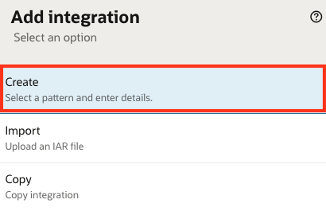

4. On the next screen, select **Schedule**.

    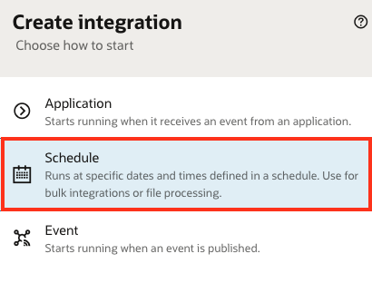

5. Enter a name for the integration, leave all other fields at their defaults, then click **Create**.

    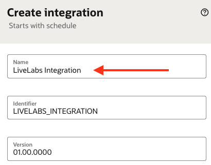

    The Integration Designer appears with a default integration.

6. Hover just below the **Schedule** activity, then click **+**.

    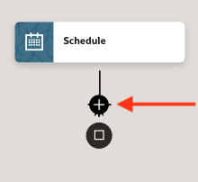

7. In the **Actions** tab of the pop-up, scroll to the bottom and select the **Robot Flow** action.

    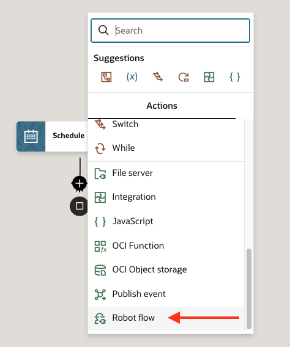

8. On the **Configure Basic Info** screen, enter a valid endpoint name without spaces.

    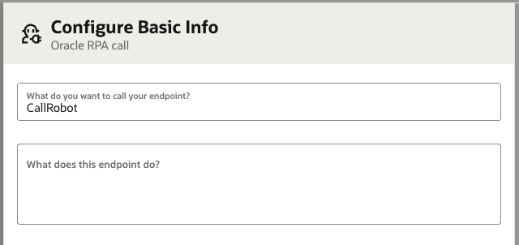

9. On the **Configure Configuration** screen, select the previously activated robot flow.

    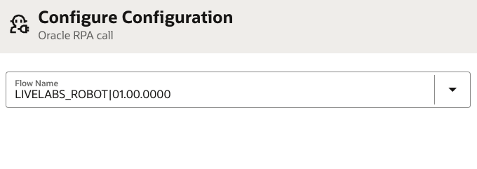

10. Click **Continue**, then **Finish**.

    The designer displays the Robot action.

    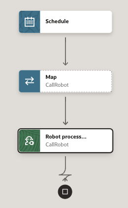

11. Hover below the **Robot process** activity, then click **+**.

    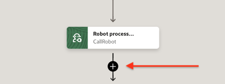

12. Select the **Assign** action.

13. In the **Configure assign** panel, take the following steps:

    1. Change **Name** to `Response`
    2. Click **Apply** to save the name change.
    3. Click **+** to add a variable
    4. Select Datatype **String**

    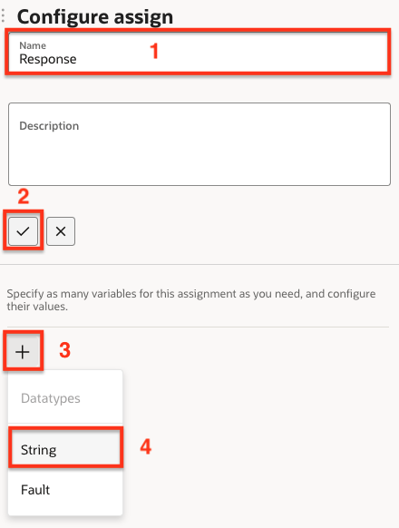

14. With the side panel displayed, take the following steps:

    1. Change **Variable** to `vSupplierName`.
    2. On the **Input sources** tab, expand **$CallRobot > RPAFlowResponse > ResponseWrapper**, then drag `SupplierName` to the **Value** text box on the right.

    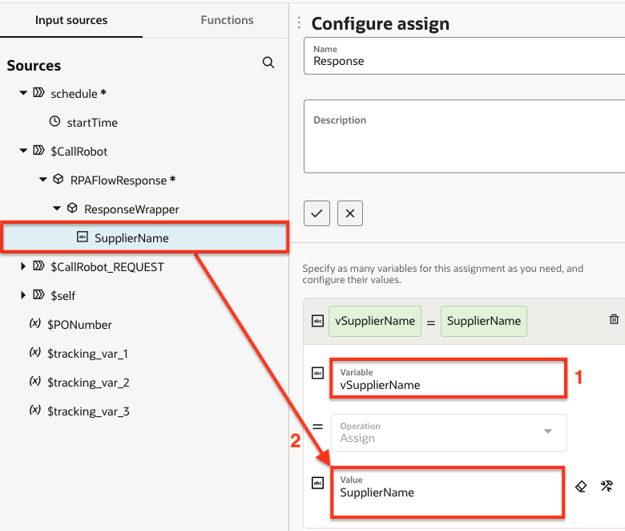

15. Click **Save** to close the panel.

16. On the integration canvas, click **Save**.

## Task 2: Add Scheduled Parameters

1. Double-click on the **Schedule** activity to open the **Configure schedule parameters** editor.

    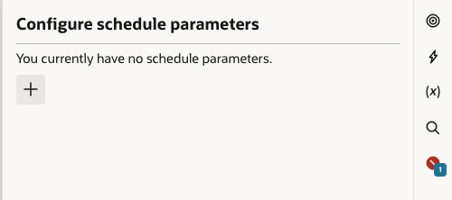

2. Click **+** to add a parameter.

3. Under **Parameter name**, enter `PONumber`.

    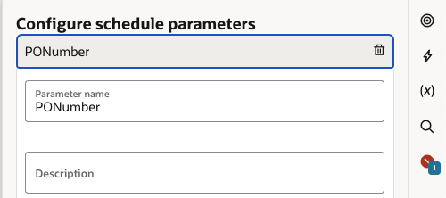

4. Click anywhere on the integration canvas to save the parameter and close the panel.

5. Click **Save**.

## Task 3: Complete the Mapper Activity

1. Double-click the **Map** activity.

    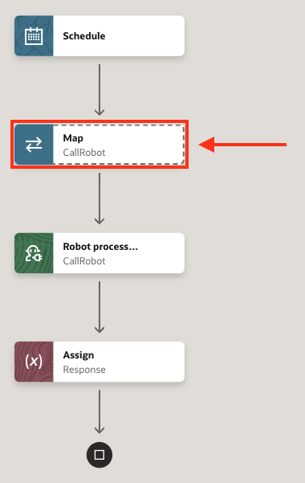

2. In the Map Editor, move to the **Target** side and click the 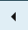 (**left arrow**) next to `Request Wrapper`.

    The `PO Number` field should be visible on the target side.

3. Drag the `PONumber` field from the source side to the `PO Number` field on the target side.

    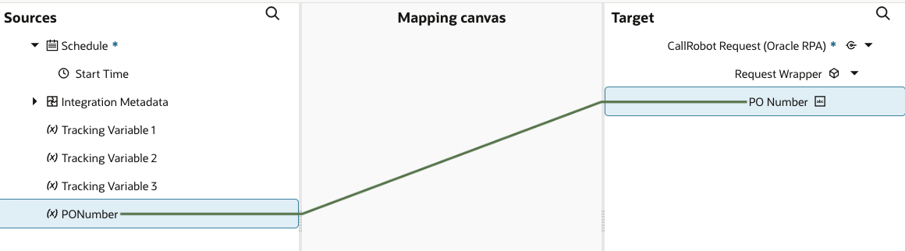

    This completes the mapping activity.

4. Click **Validate** and wait for the confirmation message, `Map to CallRobot successfully validated`.

5. Close the mapper by clicking the  (**Go Back**) button in the upper-left corner of the screen.

6. Click **Save**.

## Task 4: Configure Business Identifiers

1. Click the 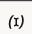 (**Business Identifiers**) button.

2. Drag `$PONumber` from the source to the first **Business identifier field**.

    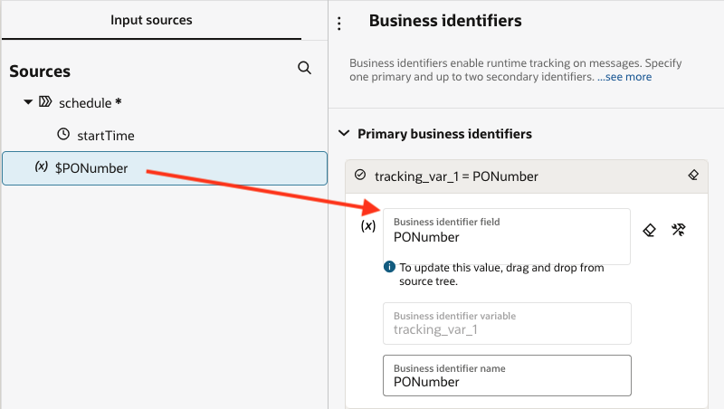

3. Click **Save** to close the **Business Identifiers** panel.

4. Click **Save** on the integration canvas.

5. Close the canvas by clicking the  (**Go Back**) button in the upper-left corner of the screen.

    Under the **Integrations** box, you will find the integration with status `Configured`.

## Task 5: Activate the integration

1. On the right side of the integration, click **...** (**Options**), then select **Activate**.

    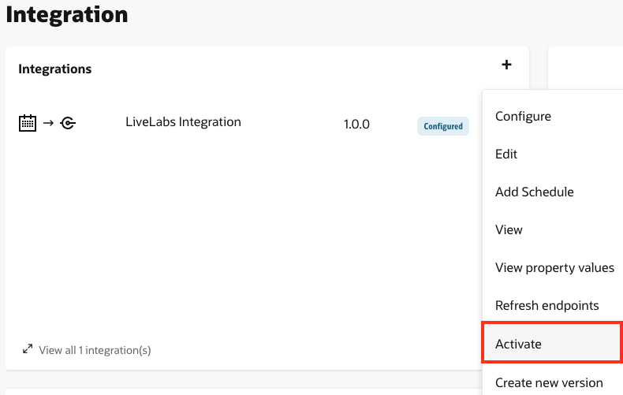

2. In the **Activate integration** panel, select **Debug** as the tracing level, then click **Activate**.

    After a few seconds, the integration status will change from `Activation in progress` to `Active`. You can manually refresh the screen to see the status change.

## Task 6: Run Integration to call the robot

Once the integration is `Active`, we can run it on-demand.

1. On the right side of the integration, click **...** (**Options**), then select **Run**.

2. On the **Configure and run** panel, enter the previously obtained PO number in the **Current Value** field. Keep all other values at their defaults.

    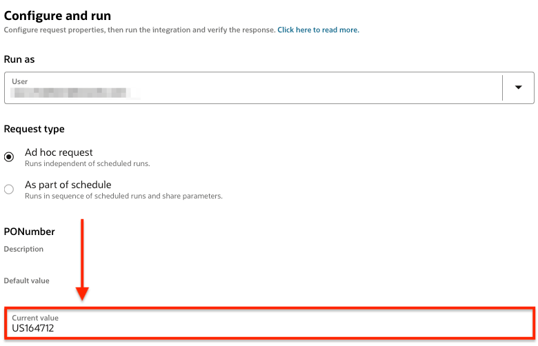

3. Click **Run** to initiate the integration run.

## Task 7: Validate Integration Run Status

After you click **Run** to start the integration, the **Activity stream** side panel appears. Use it to observe the integration run status.

1. After the robot run completes, go to the **Activity stream** panel and click the 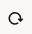 (**Refresh**) button until you see the message `Processing completed successfully`.

    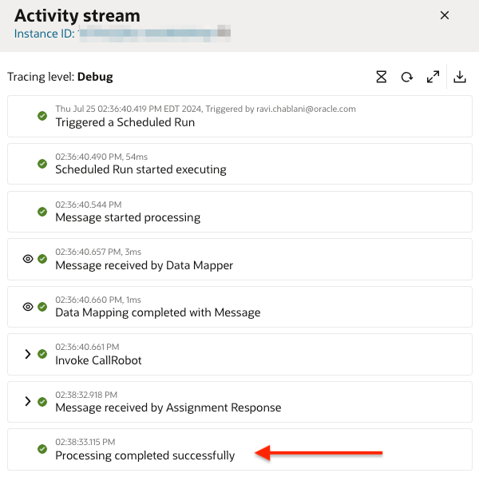

2. Expand the **Invoke CallRobot** activity to verify the robot run.

    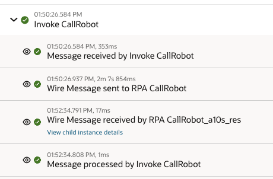

3. Expand the **Message received by Assignment Response** activity to verify the returned supplier name of the provided PO number (see sample supplier name).

    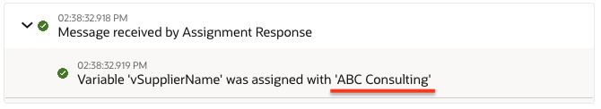

You have successfully completed this lab.

## Acknowledgements

* **Author** - Ravi Chablani, Product Management - Oracle Integration
* **Last Updated By/Date** - Subhani Italapuram, Aug 2026
