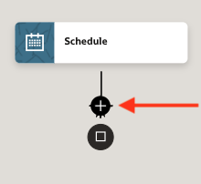

# Create and Test an Integration

## Introduction

After ensuring the robot performs the UI tasks as expected, we will now create an integration that calls it. This integration simulates an end-to-end testing scenario, where the integration passes the input values to the robot.

Estimated Time: 10 minutes

### Objectives

In this lab, you will:

* Create a scheduled integration which invokes the robot and passes input values
* Add Scheduled parameters which capture the requested PO number
* Add Mapper activity to call the robot
* Activate the integration
* Run an end-to-end test cycle

### Prerequisites

This lab assumes you have:

* Activated the robot
* Successfully tested the robot in its environment
* All previous labs successfully completed

## Task 1: Create Integration

Create a scheduled integration that will invoke the robot and pass input parameters.

1. On the project page, move to the **Integrations** box and click **Add**.

2. On the **Add integration** panel, click **Create**.

   

3. On the next screen, select **Schedule**

    

4. Enter a name for the integration, leave all other fields as default, and click **Create**.

    

    The Integration Designer will appear, with a default integration.

5. However the mouse just below the **Schedule** activity and click on the **+** button.

    

6. In the popup **Actions** tab, scroll down until the bottom and select **Robot Flow** action.

    

7. On the **Configure Basic Info** screen, enter a valid name for the endpoint without spacing.

    

8. On the **Configure Configuration** screen, select the previously activated Robot flow.

   

9. Click **Continue**, then **Finish**.

    The designer with Robot action will be displayed.

      

10. Click **Save**.

## Task 2: Add Scheduled parameters

1. Double-click on the **Schedule** activity to open the **Configure schedule parameters** editor.

    

2. Click on the **+** to add a parameter.

3. Under **Parameter name**, enter `PONumber`.

    

4. Click anywhere on the integration canvas to save the parameter and close the panel.

5. Click **Save**.

## Task 3: Add Mapper activity to call the robot

1. Double-click the **Map** activity.

    

2. In the Map Editor, move to the **Target** side and click on the  (**left arrow**) next to the `Request Mapper`.

## Task 4: Run Integration to Call the Robot

## Acknowledgements

* **Author** - Ravi Chablani, Product Management - Oracle Integration
* **Last Updated By/Date** - Ravi Chablani, July 2024