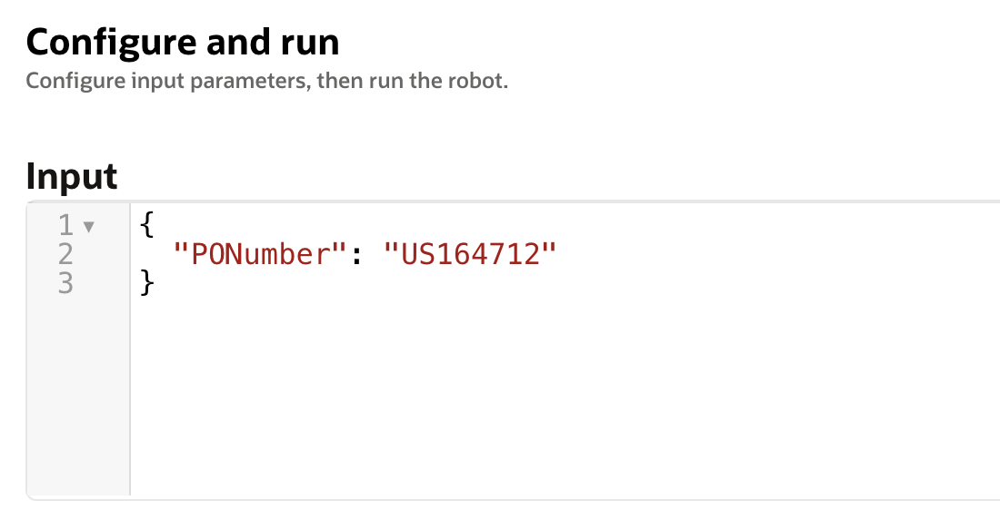

# Run end-to-end demo

## Introduction

This demo lab will walk you through the steps to run the Robot which will enter a given Purchase Order in Oracle ERP Cloud and fetch the supplier name from the User Interface, and return that value as response of the flow.

Estimated Time: 10 minutes

### Objectives

In this lab, you will:

* Provide a valid request payload to start the robot flow
* Observe the completion of instructions by the robot

This lab assumes you have:

* All previous labs successfully completed

## Task 1: Run Flow

1. On the Project overview, navigate to the robot flow and click on **...**, then select **Run**.

2. In the **Input** tab, fill in a valid purchase order number as a value of attribute **PONumber**.

    Input with sample purchase order number:
    

3. Click **Run** on the top-right side of the screen.

    You should start seeing new activities in the terminal. 