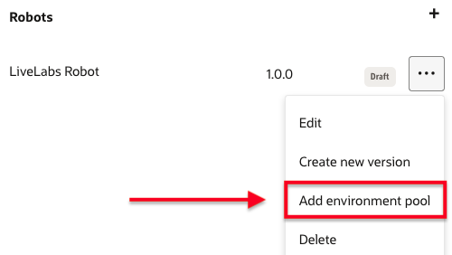
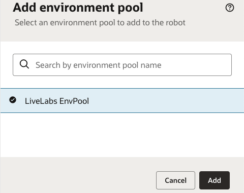
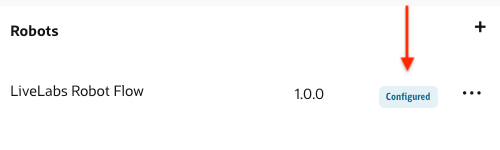
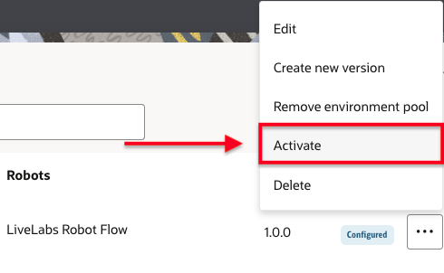
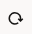
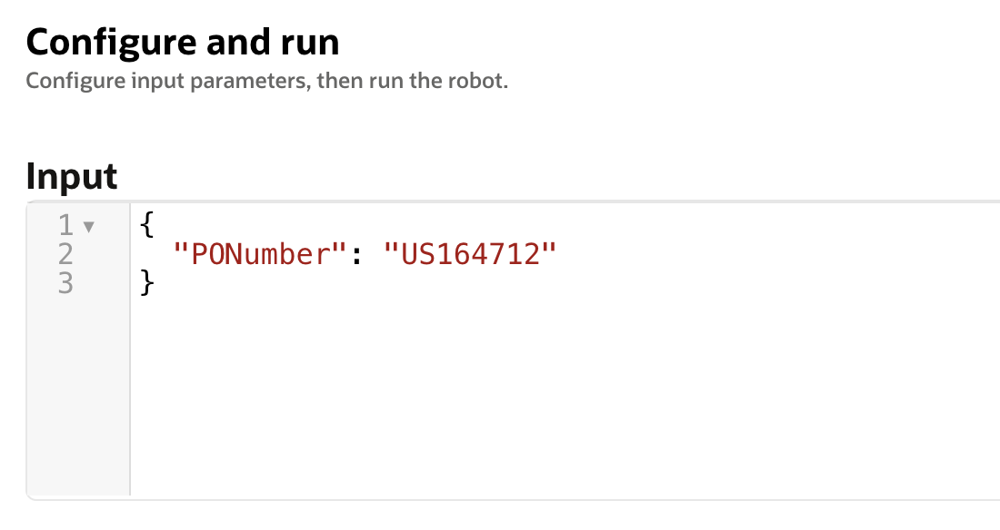

# Test the Robot

## Introduction

This demo lab will walk you through the steps to associate the robot with an environment pool, activate the robot, and then run the robot.

Estimated Time: 10 minutes

### Robot Environments

To test a robot on its environment, you must create an environment pool, add computers to the environment pool, and associate the robot with the environment pool.

* An Environment is a computer, machine or VM where a robot runs.
* An environment pool is a computer or set of computers that specific robots can run on.

### Objectives

In this lab, you will:

* Prepare the Robot Environment
* Activate the Robot
* Run the Robot in its Environment

This lab assumes you have:

* All previous labs successfully completed

## Task 1: Create Environment Pool

Create an Environment Pool and assign you local computer to it.

1. In the navigation pane, select **Projects**.

2. Open the LiveLabs project.

3. In the **Environment Pools** box, select **Add** or **+**.

    > **Note**: **Add** button appears if you have no environment pools. The **+** button appears if you have at least one environment pool.

    The **Create environment pool** panel appears.

4. Fill in the **Name** field, such as `LiveLabs-EnvPool`.

5. Select **Create**.

6. In the **Environment Pools** box, point to the environment pool you just created, click **... (Action)** icon, and select **Add environment**.

    The Add environment panel appears.

7. From the list of options, select the environment matching your machine to add to the environment pool.

    > **Note**: An environment appears in the list only if you've installed the robot agent on it and the robot agent is currently running.

8. Select **Add**.

    The Environment pools' box lists the number of environments that are associated with the pool in the **environments** button. To view the associated environments, click the button.

## Task 2: Associate Robot with Environment Pool

To run a robot on a real-world environment, you must first associate the robot with an environment pool.

1. For the LiveLabs robot, click on **... (Action)** icon and select **Add environment pool**.

2. On the **Add Environment pool**, select the designated environment pool and click **Add**.

    

   The status of your robot should change to **Configured**.

    

## Task 3: Activate the Robot

Activate a robot to be able to test and run it.

1. In the **Robots** box, point to the Configured robot, select **...** (**Actions**), and click **Activate**.

    

    A Confirmation pop-up appears, and the state changes to `Activation in progress`.

2. Within a minute or two, the robot's state should change to **Active**. Keep hitting the  (**Refresh**) button until the state changes.

## Task 4: Run the Robot in its Environment

Provide a valid request payload to start the robot. The robot will then enter the specified Purchase Order in Oracle ERP Cloud and fetch the supplier name from the User Interface, and return that value as response in the flow.

1. On the Project overview, navigate to the robot flow and click on **...**, then select **Run**.

2. In the **Input** tab, fill in the previously obtained purchase order number as a value of attribute **PONumber**.

    Input with sample purchase order number:
    

3. Click **Run** on the top-right side of the screen.

You should start seeing the following activities in the terminal:

    INFO - Launching robot instance <guid>
    INFO - Requesting messages from ControlRoom

After this message, the robot will bring up the assigned browser window and start the flow. During this time, wait until the robot completes all the steps.

## Task 5: Validate Robot Run Status

Let's observe the robot run.

1. From the **Configure and run** screen, click on the link under **Instance ID**.

    The Robot instances tab appears and is filtered to show only the instance ID that you selected. Just after the start of the robot flow, the instance will have **Status** ``Pending``.

2. The robot will start a new browser session to perform the UI tasks. Wait until the robot completes the flow, the click the (**Refresh**) button until the status changes to ``Succeeded``.

3. Hover over the completed instance and move the mouse to the right of the screen. Click on the  (**View details**) button.

    This opens the **Activity Stream** for the selected instance.

You have successfully completed this lab. Testing the robot in its environment is helpful to validate all the correct actions are performed. This is valuable for debugging purposes, however a real-world scenario will generally involve a separate integration invoking the robot. We will proceed to build this integration in the next lab.

You have successfully completed this lab.

## Acknowledgements

* **Author** - Ravi Chablani, Product Management - Oracle Integration
* **Last Updated By/Date** - Ravi Chablani, May 2024
