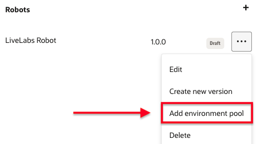
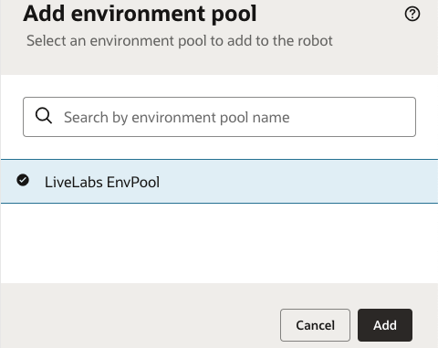
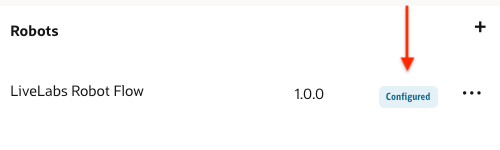
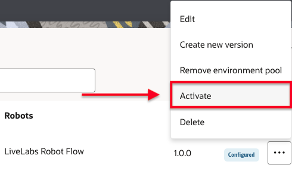
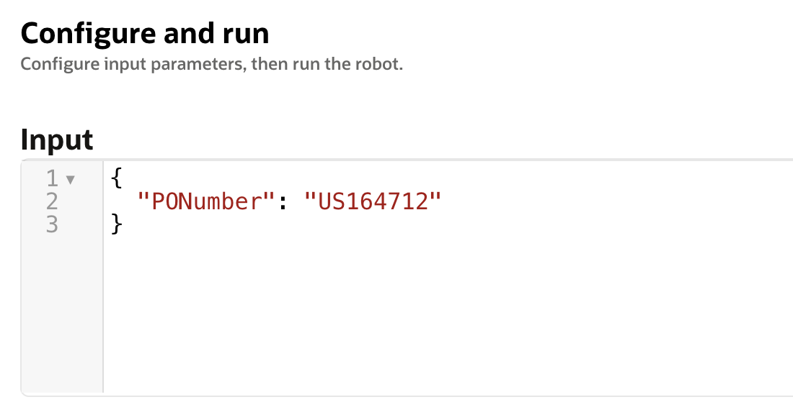

# Test the Robot

## Introduction

This demo lab walks you through the steps to associate the robot with an environment pool, activate it, and run it.

Estimated Time: 10 minutes

### Robot Environments

To test a robot on its environment, you must create an environment pool, add computers to the environment pool, and associate the robot with the environment pool.

* An environment is a computer, machine, or VM where a robot runs.
* An environment pool is a computer or set of computers on which specific robots can run.

### Objectives

In this lab, you will:

* Prepare the robot environment.
* Activate the robot.
* Run the robot in its environment.

This lab assumes you have:

* Successfully completed all previous labs.

## Task 1: Create Environment Pool

Create an environment pool and assign your local computer to it.

1. In the navigation pane, select **Projects**, then click the project created for this lab.

2. Click the  (**Robot**) icon on the left side of the screen.

3. In the **Robot** category, go to the **Environment Pools** box and click **Add** or **+**.

    > **Note**: The **Add** button appears if you have no environment pools. The **+** button appears if you have at least one environment pool.

    The **Create environment pool** panel appears.

4. Fill in the **Name** field, such as `LiveLabs EnvPool`.

5. Select **Create**.

6. In the **Environment Pools** box, point to the environment pool you just created, click the **... (Action)** icon, then select **Add environment**.

    The Add environment panel appears.

7. From the list of options, select the environment matching your machine to add to the environment pool.

    > **Note**: An environment appears in the list only if you've installed the robot agent on it and the robot agent is currently running.

8. Select **Add**.

    The **Environment Pools** box lists the number of environments associated with the pool in the **environments** button. To view the associated environments, click the button.

## Task 2: Associate Robot with Environment Pool

To run a robot on a real-world environment, you must first associate the robot with an environment pool.

1. For the LiveLabs robot, click the **... (Action)** icon and select **Add environment pool**.
    

2. In **Add Environment Pool**, select the designated environment pool and click **Add**.

    

   The status of your robot should change to **Configured**.

    

## Task 3: Activate the Robot

Activate a robot to be able to test and run it.

1. In the **Robots** box, point to the Configured robot, select **...** (**Actions**), and click **Activate**.

    

    A confirmation pop-up appears, and the state changes to `Activation in progress`.

2. Within a minute or two, the robot's state should change to **Active**. Keep hitting the  (**Refresh**) button until the state changes.

## Task 4: Run the Robot in its Environment

Provide a valid request payload to start the robot. The robot enters the specified purchase order in Oracle ERP Cloud, retrieves the supplier name from the user interface, and returns that value in the flow response.

1. In the project overview, navigate to the robot flow, click **...**, then select **Run**.

2. In the **Input** tab, enter the previously obtained purchase order number as the value of the **PONumber** attribute.

    Input with sample purchase order number:
    

3. Click **Run** on the top-right side of the screen.

You should start seeing the following activities in the terminal:

    INFO - Launching robot instance <guid>
    INFO - Requesting messages from ControlRoom

After this message, the robot will bring up the assigned browser window and start the flow. During this time, wait until the robot completes all the steps.

## Task 5: Validate Robot Run Status

Let's observe the robot run.

1. From the **Configure and run** screen, click on the link under **Instance ID**.

    The Robot instances tab appears and is filtered to show only the instance ID that you selected. Just after the start of the robot flow, the instance will have **Status** ``Pending``.

2. The robot starts a new browser session to perform the UI tasks. Wait until the robot completes the flow, then click the **Refresh** button until the status changes to `Succeeded`.

3. Hover over the completed instance and move the pointer to the right side of the screen. Click the  (**View details**) button.

    This opens the **Activity Stream** for the selected instance.

You have successfully completed this lab. Testing the robot in its environment helps validate that all actions are performed correctly. This is valuable for debugging; however, a real-world scenario generally involves a separate integration that invokes the robot. You will build this integration in the next lab.

## Acknowledgements

* **Author** - Ravi Chablani, Product Management - Oracle Integration
* **Last Updated By/Date** - Subhani Italapuram, Aug 2026
