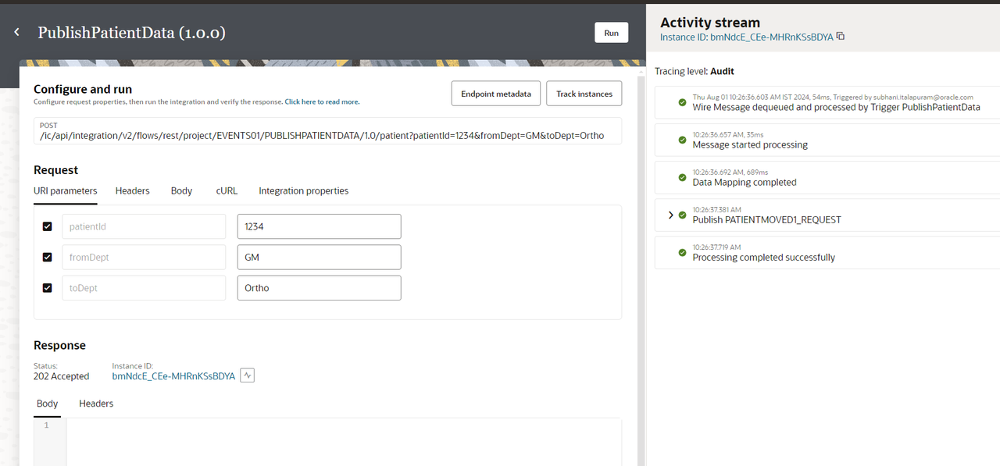

# Deploy Integrations in a Project

## Introduction

You manage a project from a single workspace, including creating project deployments, activating and deactivating project deployments or individual integrations, exporting projects, extending integrations in an accelerator project, upgrading accelerator projects, setting tracing levels on integrations, testing integrations, deleting projects, exporting projects, and more

Estimated Time: 5 minutes

### Objectives

In this lab, you will:

* Create a deployment
* Run the Integrations

### Prerequisites

This lab assumes you have:

* All previous labs successfully completed.

## Task 1: Create a Deployment

1. In the left Navigation pane, click ***Projects***, click the project name or click 
2. Click the ***Deploy*** tab, click ***Create***
The Create deployment panel appears.
3. Enter a name as ***eventsdeploy***, click ***Create***
4. Scroll through the list of integrations included in the project and select the ones to include in the deployment, by default, all the integrations are selected.
5. Click ***Save***,  Click ***&lt; (Go back)***
6. Click on the ***Activate***
7. On the **Activate Integration** dialog, select **a tracing level** to ***Audit***
8. Click ***Activate***.
    > **Note:** Please note that if one of the integrations is active then you can not activate at project level. Either you can deactivate already activated integrations and then activate project deployment OR activate each integration separately.

## Task 2: Run the Integration

Refresh your page after few seconds.

1. In the left Navigation pane, click ***Projects***, click the project name or click 
2. Select **PublishPatientData**,  Click on **...(Actions)** menu and Click on ***Run***
3. Configure the URI parameters:

    * for **PatientId**, enter ***123***
    * for **FromDept**, enter ***GM***
    * for **ToDept**, enter ***Ortho***

4. Click ***Run*** (in the upper right of the page).
5. Look at the Response section and verify the Status is 200 OK
6. Look at the activity stream which is on right section.

7. Please check the notification email.

You may now **proceed to the next lab**.

## Learn More

* [Getting Started with Oracle Integration 3](https://docs.oracle.com/en/cloud/paas/application-integration/index.html)
* [Design, Manage, and Monitor Integrations in Projects](https://docs.oracle.com/en/cloud/paas/application-integration/integrations-user/designing-managing-and-monitoring-integrations-projects.html)

## Acknowledgements

* **Author** - Subhani Italapuram, Director Product Management, Oracle Integration
* **Contributors** - Kishore Katta, Director Product Management, Oracle Integration
* **Last Updated By/Date** -
