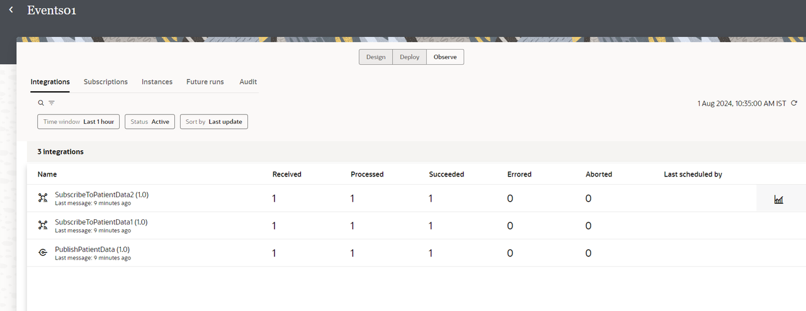
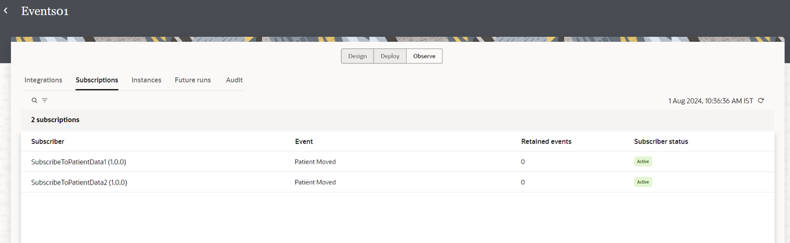
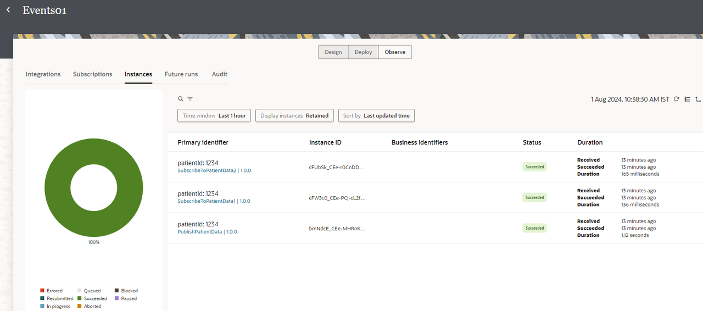

# Monitor Integrations in a Project

## Introduction

You can track instances and monitor errors in a project from a single workspace during runtime. You can also access and view the activity stream that shows details about the movement of messages through integrations.

Estimated Time: 5 minutes

### Objectives

In this lab, you will:

* Monitor Integrations in a Project
* View Subscribed Instances in a Project
* Monitor Instances in a Project

### Prerequisites

This lab assumes you have:

* All previous labs successfully completed.

## Task 1: Monitor Integrations in a Project

1. In the left Navigation pane, click ***Projects***, click the project name or click 
    
    You can please skip step1 if you are already on the edit project page.
2. Click the ***Observe*** tab, click ***Integrations***
3. Look at the list of integrations which are processes successfully.

## Task 2: View Subscribed Instances in a Project

1. Click ***Subscriptions***

## Task 3: View Instances in a Project

1. Click ***Instances***

You may now **proceed to the next lab**.

## Learn More

* [Getting Started with Oracle Integration 3](https://docs.oracle.com/en/cloud/paas/application-integration/index.html)
* [Design, Manage, and Monitor Integrations in Projects](https://docs.oracle.com/en/cloud/paas/application-integration/integrations-user/designing-managing-and-monitoring-integrations-projects.html)

## Acknowledgements

* **Author** - Subhani Italapuram, Director Product Management, Oracle Integration
* **Contributors** - Kishore Katta, Director Product Management, Oracle Integration
* **Last Updated By/Date** - Subhani Italapuram, Aug 2024
