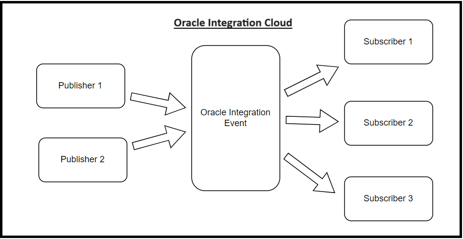
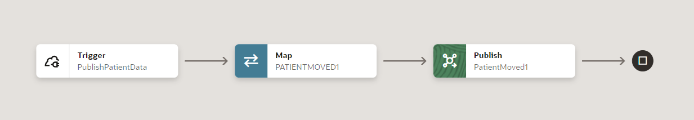
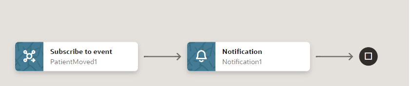

# Introduction

## About this Workshop

You can create and select events for publishing and subscribing to in integrations in Projects in Oracle Integration. You define the events in JSON-formatted or XML schema files.
This LiveLab provides an overview of projects and the life cycle of projects.
This Livelab provides an overview of the event design life cycle and describes event restrictions.

Estimated Time: 60 minutes

### What is Oracle Integration 3?
With Oracle Integration 3 (OIC), you have the power to *integrate* your cloud and on-premises applications, *automate* business processes, *gain insight* into your business processes, visually *develop* web and mobile applications, use an SFTP-compliant file server to *store* and *retrieve* files, and *exchange* business documents with a B2B trading partner—all in one place.

[First Glimpse - Oracle Integration 3](youtube:yW3TEBWkFbg)

Oracle Integration 3 provides native connectivity to Oracle and non-Oracle Software as a Service (SaaS) and On-premises applications, such as FTP adapter, REST adapter, Oracle ERP Cloud, Oracle Service Cloud, HCM Cloud, Salesforce.com, Workday, EBS, SAP, NetSuite and so on. OIC adapters simplify connectivity by handling the underlying complexities of connecting to applications using industry-wide best practices

As an Integration Developer, if you have a requirement with publish-subscribe pattern then, you can use  this live lab as a reference

### Objectives

In this workshop, you will learn how to:

* Creating Free Trial Account
* Provision Oracle Integration 3 in Oracle Cloud Infrastructure.
* Learn about publish subscribe pattern
* Learn project and events management in Oracle Integration 3.
* Create a project, create connection, create an event based integration flow and create an application based integration flow to publish the message and create two event based integration flows as subscribers.

### Prerequisites

* An Oracle Free Tier or Paid Cloud Account.
* A Chrome browser.

## Task 1:  Pub/Sub (Publisher/subscriber) architecture

* Pub/Sub (or Publish/Subscribe) is an architectural design pattern used in distributed systems for asynchronous communication between different components or services. Although Publish/Subscribe is based on earlier design patterns like message queuing and event brokers, it is more flexible and scalable. The key to this is the fact that Pub/Sub enables the movement of messages between different components of the system without the components being aware of each other’s identity (they are decoupled).

* Pub/Sub provides a framework for exchanging messages between publishers (components that create and send messages) and subscribers (components that receive and consume messages). Note that publishers don’t send messages to specific subscribers in a point-to-point manner. Instead, an intermediary is used - a Pub/Sub message broker, which groups messages into entities called events.

    
    
    

## Task 2:  Benefits of the Pub/Sub model

* The Pub/Sub pattern brings many benefits to the table, including but not limited to:
* Loose coupling between components, making your system more modular and flexible.
* High scalability (in theory, Pub/Sub allows any number of  publishers to communicate with any number of subscribers).
* Language-agnostic and protocol-agnostic, which makes it straightforward and fast to integrate Pub/Sub into your tech stack.
* Asynchronous, event-driven communication that’s ideal for realtime, low-latency app

## Task 3: When should you use the Pub/Sub pattern?

* Pub/Sub’s loose coupling, asynchronous nature, and inherent scalability make it an excellent solution for distributed systems with a high and fluctuating number of publishers and subscribers. You can use Pub/Sub for many different purposes, such as:
* Sending event notifications.
* Distributed caching.
* Distributed logging.
* Working with multiple data sources.
* Broadcasting updates (one-to-many messaging).
* Building responsive, low-latency end-user experiences like live chat and multiplayer collaboration functionality.

## Task 4: Situations where Pub/Sub is a bad choice

Every design pattern has limitations and trade-offs. There are scenarios where Pub/Sub is the wrong choice:

* Overkill for simpler systems. Pub/Sub is an overkill for simple systems which are unlikely to scale up. If you’re operating systems where elastic scaling is not required and where static scaling will suffice, think twice before using Pub/Sub. Similarly, if your system only needs to communicate with a few other components or services, using Pub/Sub might be excessive.

* Not suitable for media streaming. Audio and video streaming have nuanced requirements for smooth rendering on the user’s end. Synchronous point-to-point communication between the two endpoints is the best solution for media streaming. Pub/Sub is not suitable for carrying VoIP or video telephony traffic over the Internet.

* Inappropriate for periodic/background tasks. Pub/Sub is an asynchronous method of sending information. Therefore, it is not suitable for systems that run as periodic background tasks, like cron jobs which are triggered over a particular time period.

* Non-event-driven systems. Pub/Sub is typically used in event-driven systems, where components react to changes in the system state. If your system is not event-driven, but instead follows a more traditional request/response or batch processing model, Pub/Sub might not be the best choice.

* Synchronous communication: Pub/Sub is designed for asynchronous communication, where the publisher doesn't wait for a response from the subscriber. If you need a synchronous request-response communication pattern, you should consider using something else instead of Pub/Sub.

## Task 5: Event Design Life Cycle

The publish and subscribe feature enables you to decouple producers and subscribers. This decoupling enables you to define an event and start building your subscriber for the event before the event is published. You can create an event type (can be a producer, subscriber, or someone else). Creating an event type defines a contract, meaning that there's a contract to produce and subscribe.

The event design life cycle consists of three high-level steps. These steps are described using an event named Patient Moved as an example. References are provided to more specific documentation for performing these steps

1. Create an event
2. Create an event publishing integration
3. Create an event subscription integration

## Task 6: Restrictions

A maximum of 50 integrations can subscribe to events per service instance.

You may now **proceed to the next lab**.

## Learn More

* [Getting Started with Oracle Integration 3](https://docs.oracle.com/en/cloud/paas/application-integration/index.html)

## Acknowledgements

* **Author** - Subhani Italapuram, Product Management, Oracle Integration
* **Contributors** - Kishore Katta, Product Management, Oracle Integration
* **Last Updated By/Date** - Subhani Italapuram, July 2024
