# Create an Integration Flow to Read Excel file and convert to CSV

## Introduction

This lab walks you through the steps to create an Integration flow as per the below Integration Architecture.

This use case describes how to use Native Actions in Oracle Integration to connect with file server, object storage and serverless functions.

1.  Vendors drop Excel files into the system.
2.  Oracle Integration orchestrates the logic as below:
    - A scheduler triggers the Integration flow.
    - File Server Native Action gets the file from the source.
    - OCI Object Storage Native Action uploads the Excel file to Object Storage.
    - OCI Function is converts the Excel format to CSV format and uploads the file to Object Storage bucket
    - The transformed CSV is retrieved using Object Storage Native Action operations
    - The data is staged in a Virtual File System (VFS).
    - Records are parsed and inserted into the DB system (Optional)
3.  OCI Serverless Functions are used to process the files:
    - A function is triggered to perform operations on the files.
    - The function interacts with Object Storage, reading from and writing to a bucket.

4.  The OIC File Server stores the Excel files for reference.
5.  The parsed and processed data is ultimately stored in the ATP DB (Autonomous Transaction Processing Database).
6.  User Groups have access to the processed files.


The following diagram shows the interaction between the systems involved in this use case.
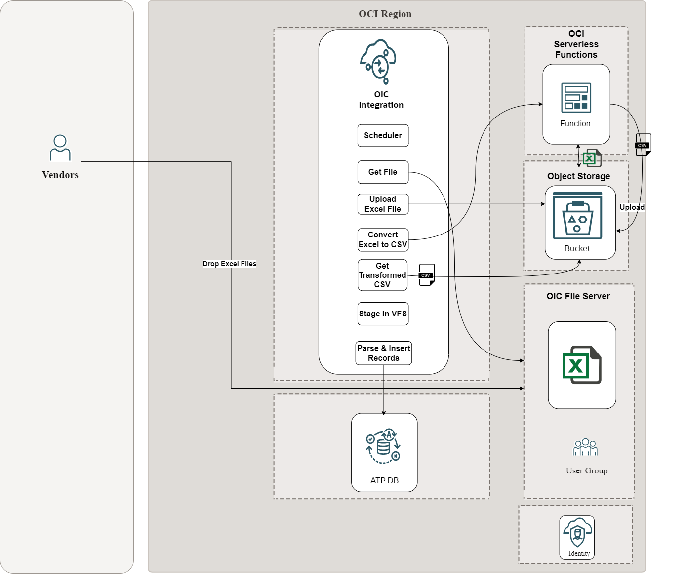

The Final Integration Flow should look like below.
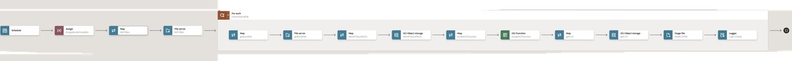

Estimated Time: 100 minutes

### Objectives

In this lab, you will:

* Use Object Storage Native Action
* Use File Server Native Action
* Use Functions Native Action

### Prerequisites

This lab assumes you have:

* All previous labs completed.

## Task 1: Pre-Requisites setup for Native Actions

You will create a dynamic group and add policies to use functions and manage objects.

1.  Sign in to the OCI Console as a tenancy administrator.

2.  Obtain the client ID of the OAuth application for the Oracle Integration instance. In the upper right corner, select Profile, then click the identity domain.


3.  In the left navigation pane, click *Oracle Cloud Services*.
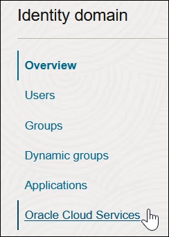

4.  Select the OIC service instance, and scroll down to **General Information** and copy the client ID value to use it in the dynamic group creation.

5.  In the OCI Console, Open the navigation menu and click *Identity & Security*, Select the domain (example: Default domain).
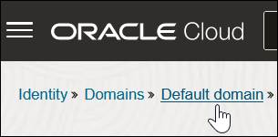

6. In the left navigation pane, click *Dynamic groups*

7.  Click *Create Dynamic Group*.

8.  Provide a name (example: ll-dynamic-group) and description. In the **Matching Rules** section, enter the below rules. The resource ID you specify mush match the client ID of the OAuth application of your Oracle Integration instance. Provide the functions compartment ocid in the below rule

    ```
    <copy>
    resource.id = 'oic-instance-client-ID'
    ALL {resource.type = 'fnfunc', resource.compartment.id = '<functions-compartment-ocid>'}
    </copy>
    ```
TIP: Get the ocid of the functions compartment by navigating to Identity &gt; Compartments &gt; ll-native-actions. The first rule is required to group the OIC instance which matches the client id. The second rule groups the functions of a given compartment ocid.

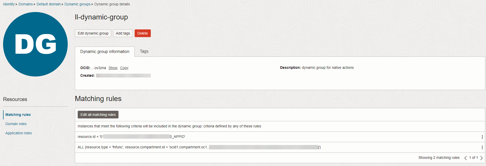

9.   Open the navigation menu and click *Identity & Security*. Under Identity, click *Policies*.

10.  Select the Policy **ll-native-actions-policy** , and Click on **Edit policy statements**. In the Policy builder add the following statements. Modify the dynamic group name, group name and compartment name as per your configuration.

    ```
    <copy>
    Allow dynamic-group ll-dynamic-group to use functions-family in compartment <compartment-name>
    Allow dynamic-group ll-dynamic-group to manage object-family in compartment <compartment-name>
    Allow dynamic-group ll-dynamic-group to inspect compartments in compartment <compartment-name>
    Allow group ll-group to manage objects in compartment <compartment-name>
    </copy>
    ```
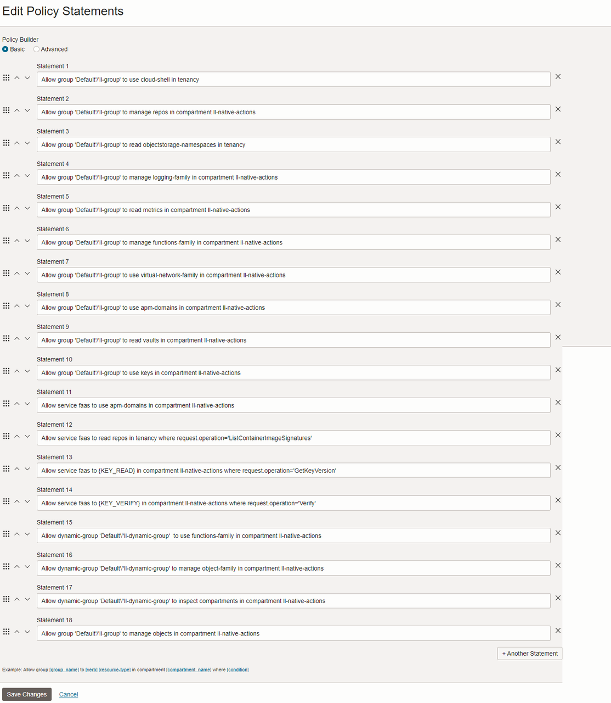

## Task 2: Create Object Storage Buckets

You will create two buckets namely, bucket-excel and bucket-csv. These buckets are used to upload the source file and processed files.

1.  In the OCI Console, Open the navigation menu and click *Storage &gt; Buckets*.

2.  Select the Compartment **ll-native-actions**

3.  Click *Create Bucket* and provide a name (example: bucket-excel) and description. Click **Create**

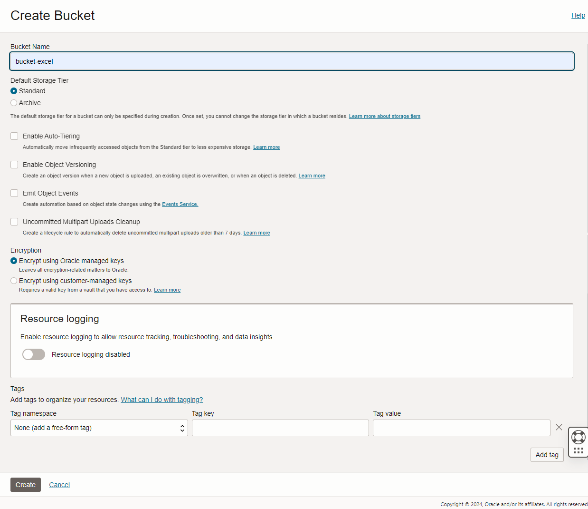

4.  Similarly, create another bucket and name it (example: bucket-csv)


## Task 3: Create Integration Flow

Create a Project in OIC console which provides a single unified workspace for all stakeholders to design, manage, and monitor integrations. Additionally, projects provide robust life-cycle management.

***Create Project***

1.  Login into OIC Console

2.  In the left Navigation pane of OIC console, Click *Projects* and Click *Add*, then *Create*

3.  In the **Create Project** dialog, enter the following information and click on *Create*:

| **Field**        | **Value**          |       
| --- | ----------- |
| Name         | OIC Native Actions     |
| Identifier         | Generated automatically       |
| Description  | This project is the workspace to create integrations to invoke OCI resources |
{: title="Create Project"}

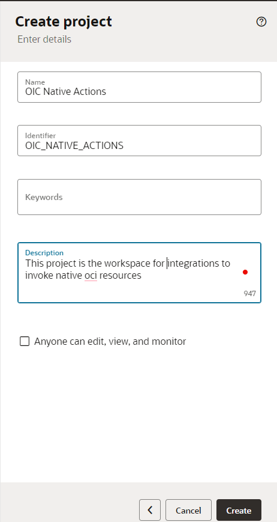

***Create Integration Flow***

1. In the *Integrations tile*, click *Add*, then *Create*

2. On the *Create integration* dialog, select and click on **Schedule**.

3. In the *Create integration* dialog, enter the following information:

    | **Element**          | **Value**          |       
    | --- | ----------- |
    |Name | Use Native Actions |
    |Description | Integration to invoke native actions and process excel files, which converts to csv format |
    {: title="Create Integration Flow"}

    Accept all other default values.

    

***Assign Variables***

Create 3 variables ObjectstoreNamespace, ObjectstoreSource, ObjectstoreTarget

1.  Click *+* icon next to the **Schedule** activity and Select *Assign* action from the action palette and name it as **AssignBucketVariables**

    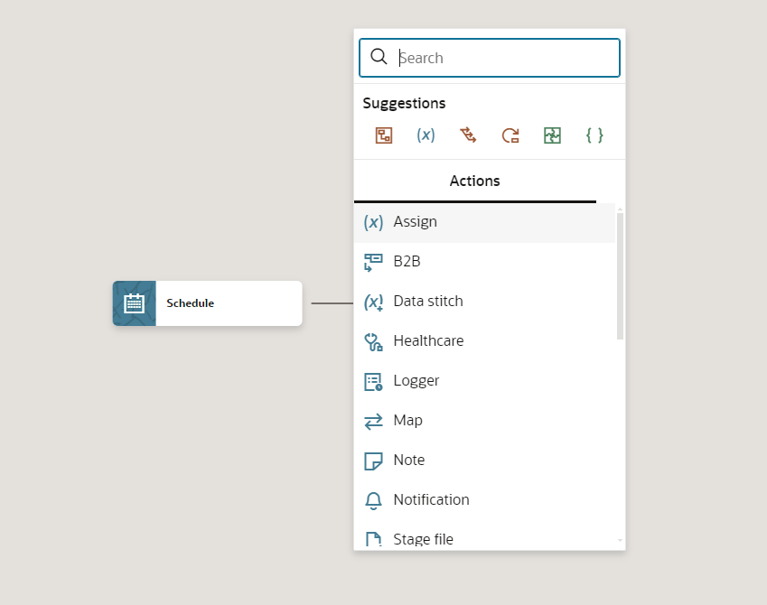

2.  Click on *+* icon and create a **String** data type. Provide the name as **ObjectstoreNamespace** and value **&lt;your-object-storage-namespace&gt;**

    


**TIP**: To view your Object Storage namespace string, do the following:

Select the Profile menu (Profile menu icon), which is on the upper-right side of the navigation bar at the top of the page, and then click Tenancy: <your_tenancy_name>. Your namespace string is listed under Object Storage Settings.

3.  Similarly, Create 2 more variables per below  

    | **Variable Name**          | **Value**          |       
    | --- | ----------- |
    | ObjectstoreSource | 'bucket-excel' |
    | ObjectstoreTarget | 'bucket-csv' |
    {: title="Assign OS Variables"}

    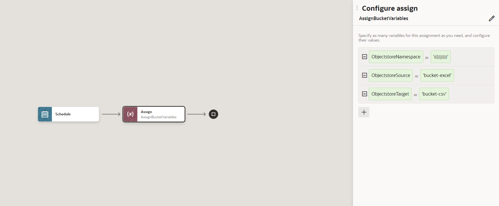

***List Files in object storage bucket (bucket-excel)***

1.  Click *+* icon next to the **AssignBucketVariables** activity and Select *File Server* action from the action palette.

2.  In the **Configure FS Native Action** provide per below values.

    | **Property**          | **Value**          |       
    | --- | ----------- |
    | What do you want to call your endpoint? | listFSFiles |
    | Select Resource | Directory |
    | Select Operation | List Directory |
    | Input Directory | &lt; directory path configured in File Server for your user &gt; |
    | File Name Pattern | *.xlsx |
    {: title="Configure FS Native Action "}

    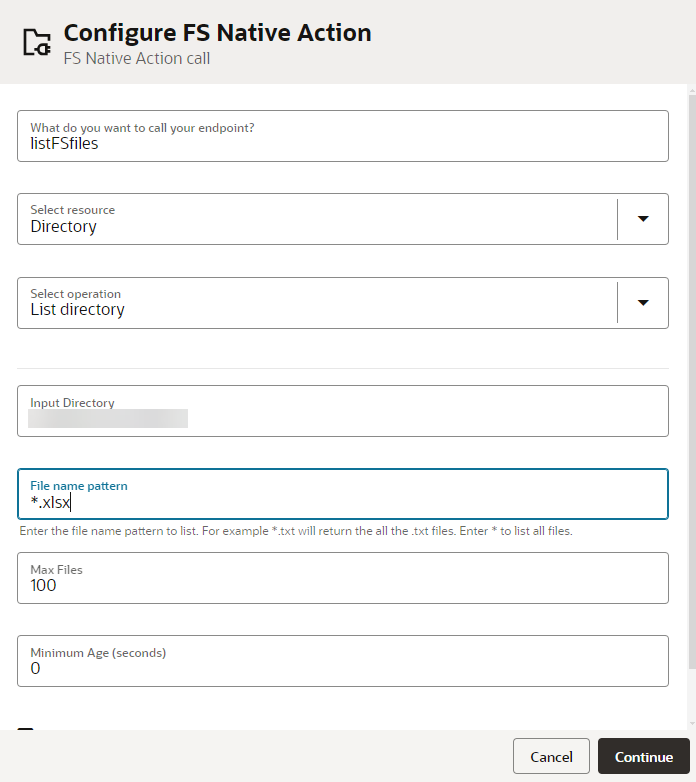

    Click *Continue* and **Finish** the wizard. **Save** your integration.

***Add for-each action***

1.  Click *+* icon next to the **listFSFiles** action and Select *For Each* action from the action palette.

2.  In the **Configure For Each** pane provide array reference in the for-each **Repeating element**. In the Source variable, Expand variable $listFSFiles &gt; ListDirectoryResponse &gt; Directory Definitions &gt; fileList &gt;.

    Drag and drop the **file** element to the **Repeating Element** box, and provide the name **Current element name** as *currentFile* per below.

    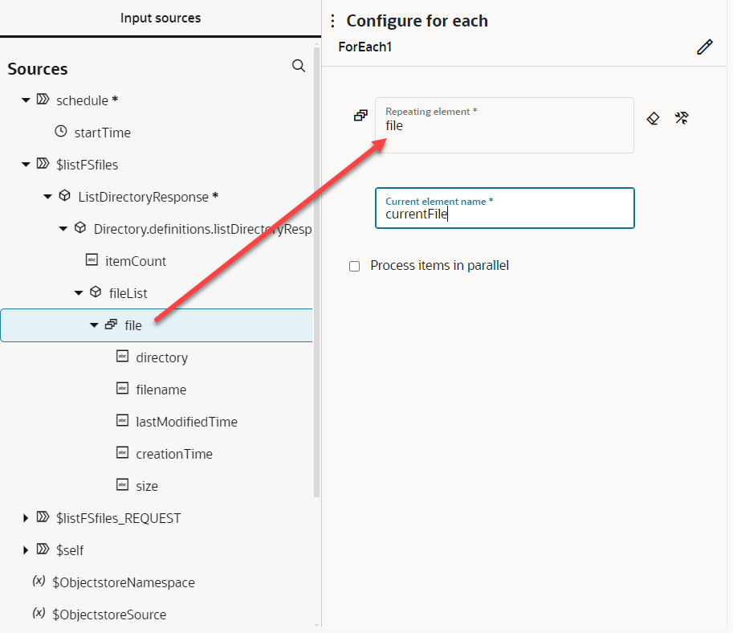

    **Save** your integration.

***Get Excel File***

1.  In the For Each scope click on *+* icon and add a **File Server** Native Action

2.  In the **Configure FS Native Action** provide per below values.

    | **Property**          | **Value**          |       
    | --- | ----------- |
    | What do you want to call your endpoint? | getExcelFile |
    | Select Resource | File |
    | Select Operation | Get File Reference |
    | Input Directory | &lt; directory path configured in File Server for your user &gt; |
    | File Name | sample.xlsx |
    {: title="Configure FS Native Action "}

    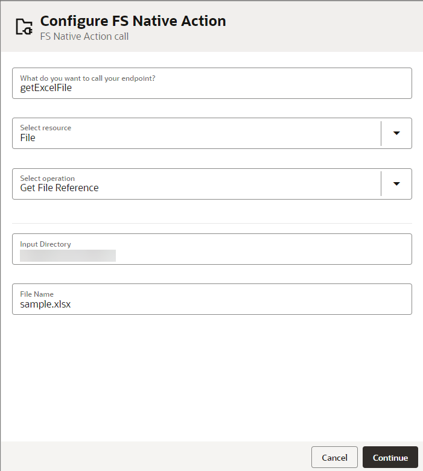

    Click *Continue* and **Finish** the wizard. **Save** your integration.

3.  *Edit* the **getExcelFile** map activity and perform the mapping per below.

    In the **Sources** pane expand the variable: currentFile &gt; File.

    In the **Target** pane expand the variable: getExcelFile Request &gt; QueryParameters.

    | **Source**          | **Target**          |       
    | --- | ----------- |
    | Directory | Directory |
    | File Name| File Name |
    {: title="Map Get Excel File Properties "}

    

    Click *Validate*. Click **&lt** icon to Navigate back to the Integration Flow

***Transfer Excel File from File Server to Object Storage Bucket***

1.  **Add** a *OCI Object Storage* action after the **getExcelFile** activity.

2.  In the **Configure Object Storage** provide per below values.

    | **Property**          | **Value**          |       
    | --- | ----------- |
    | What do you want to call your endpoint? | MoveFSExcelToOS |
    | Select the resource type you want to manage | Manage Objects |
    | Select Operation | Upload Object |
    | Select Compartment | &lt; Compartment you have created in the previous lab example: ll-native-actions &gt; |
    | Select Bucket | bucket-excel |
    {: title="Configure OS Native Action "}

    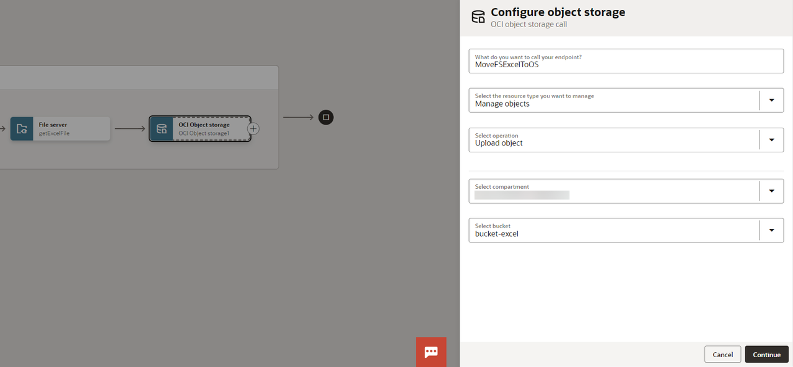

    Click *Continue* and **Finish** the wizard. **Save** your integration.

3.  *Edit* the **Map to MoveFSExcelToOS** map activity and perform the mapping per below.

    In the **Sources** pane expand the variable:  getExcelFile Response &gt; Get File Reference Response &gt; File Definitions.. &gt;

    In the **Target** pane expand the variable: MoveFSExcelToOS Request.

    | **Source**          | **Target**          |       
    | --- | ----------- |
    | File Reference | Query Parameters &gt; Stream Reference |
    | File Name| Template Parameters &gt; Object Name |
    {: title="Map Get Excel File Properties "}

    Click *Validate*. Click **&lt** icon to Navigate back to the Integration Flow.

    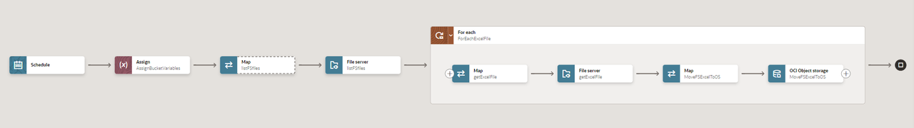

***Invoke OCI Function to transform excel file to csv***

1.  **Add** a *OCI Function* action after the **MoveFSExcelToOS** activity.

2.  In the **Configure OCI Function Call** page provide per below values.

    | **Property**          | **Value**          |       
    | --- | ----------- |
    | What do you want to call your endpoint? | invokeOCIFunction |
    | Region | &lt; select-your-function-region &gt;|
    | Compartment | Upload Object |
    | Select Compartment | &lt; select-your-function-compartment example: ll-native-actions &gt; |
    | Application | &lt; select-your-function-application example: oicnativeaction &gt; |
    | Fucntion | &lt; select-your-function-deployed example: convert2CSV &gt; |
    {: title="Configure Function Native Action "}

    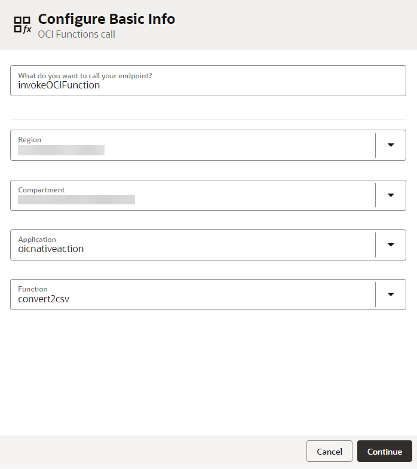

    Click *Continue*.

3.  In the **Configure Request** Page select *Payload Type* as **JSON Sample**, and provide the below provide request payload.

    ```
        <copy>
        {
          "file_name": "SourceFile.xlsx",
          "source_bucket": "bucket-excel",
          "target_bucket": "bucket-csv",
          "namespace": "<your-tenancy-namespace>"
          }
        </copy>
      ```

      Click *Continue*

4.  In the **Configure Response** Page select *Payload Type* as **JSON Sample**, and provide the below provide request payload.

    ```
        <copy>
        {
          "fileconversion": "SUCCESS",
          "target_bucket": "bucket_csv",
          "target_filename": "SourceAPFile.csv"
        }
        </copy>
      ```

      Click *Continue* and **Finish** the wizard, Save your integration flow.

5.  *Edit* the **Map to invokeOCIFunction** map activity and perform the mapping per below.

    In the **Target** pane expand the variable: invokeOCIFunction Request &gt; Request Wrapper.

    | **Source**          | **Target**          |       
    | --- | ----------- |
    | $currentFile &gt; File &gt; Filename | File Name |
    | $ObjectstoreSource | Source Bucket |
    | $ObjectstoreTarget | Target Bucket |
    | $ObjectstoreNamespace| Namespace |
    {: title="Map Invoke OCI Fn Properties "}

    Click *Validate*. Click **&lt** icon to Navigate back to the Integration Flow.

    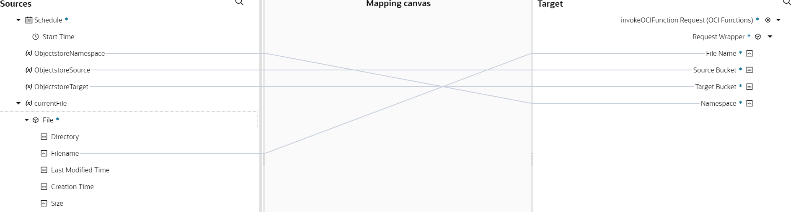

***Get Transformed CSV File***

1.  **Add** a *OCI Object Storage* action after the **invokeOCIFunction** activity.

2.  In the **Configure Object Storage** provide per below values.

    | **Property**          | **Value**          |       
    | --- | ----------- |
    | What do you want to call your endpoint? | getCSV |
    | Select the resource type you want to manage | Manage Objects |
    | Select Operation | Download Object |
    | Select Compartment | &lt; Compartment you have created in the previous lab example: ll-native-actions &gt; |
    | Select Bucket | bucket-csv |
    {: title="Configure OS Native Action Get CSV"}

    Click *Continue* and **Finish** the wizard. **Save** your integration.

3.  *Edit* the **Map to getCSV** map activity and perform the mapping per below.

    In the **Sources** pane expand the variable:  invokeOCIFunction Response &gt; Invoke Response &gt; Response Wrapper

    In the **Target** pane expand the variable: getCSV Request &gt; Template Parameters

    | **Source**          | **Target**          |       
    | --- | ----------- |
    | Target File Name | Object Name |
    {: title="Map Get CSV Properties "}

    Click *Validate*. Click **&lt** icon to Navigate back to the Integration Flow.

    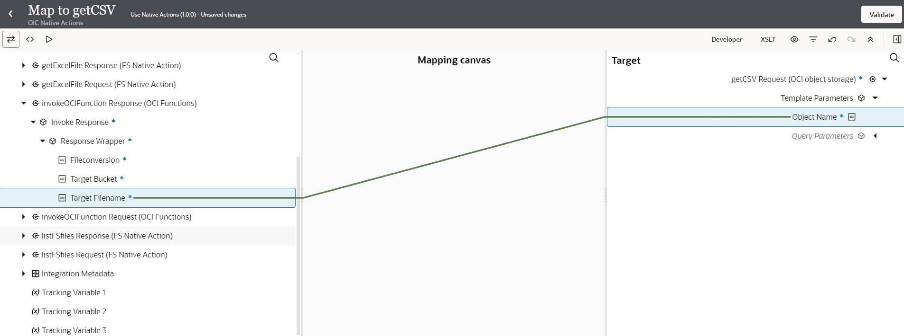

***Add Stage Action***

1.  **Add** a *Stage File* action after the **getCSV** activity.

2.  In the **Configure Stage File Action** provide the name **ReadCSVFile** and Click on *Continue*

3.  In the **Configure Operation Page** configure properties per below

    | **Property**          | **Value**          |       
    | --- | ----------- |
    | Choose Stage File Operation | Read Entire File |
    | Configure File Reference | Yes |
    | Specify File Reference | Switch to Developer View and map the $getCSV &gt; Get_ObjectResponse &gt; StreamReference element  |
    {: title="Configure OS Native Action Get CSV"}

    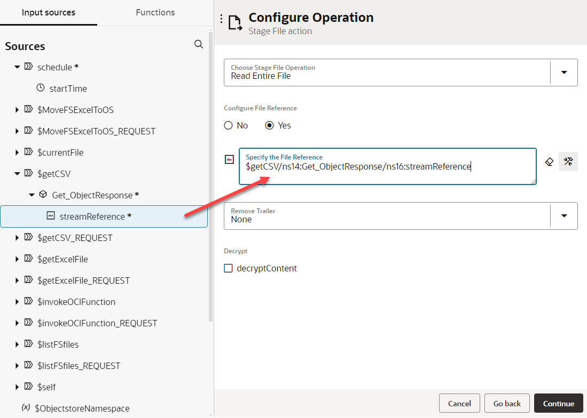

    Click *Continue*

4.  In the **Configure Schema Options** page, Select the file structure as **CSV**. Click *Continue*

5.  In the **Configure Format Definition** page, Configure the properties per below and rest as defaults.

    | **Property**          | **Value**          |       
    | --- | ----------- |
    | Drag and Drop Schema File | Select **Sample-10.csv** file from lab artifacts downloaded in the previous labs. |
    | Enter the Record Name | CustomerRecord |
    | Enter the Recordset Name | CustomerBatch  |
    | Select the Field Delimiter | Comma (,)  |
    | First Row as Column Header | Yes  |
    {: title="Read CSV Stage File Format Definition Properties"}

    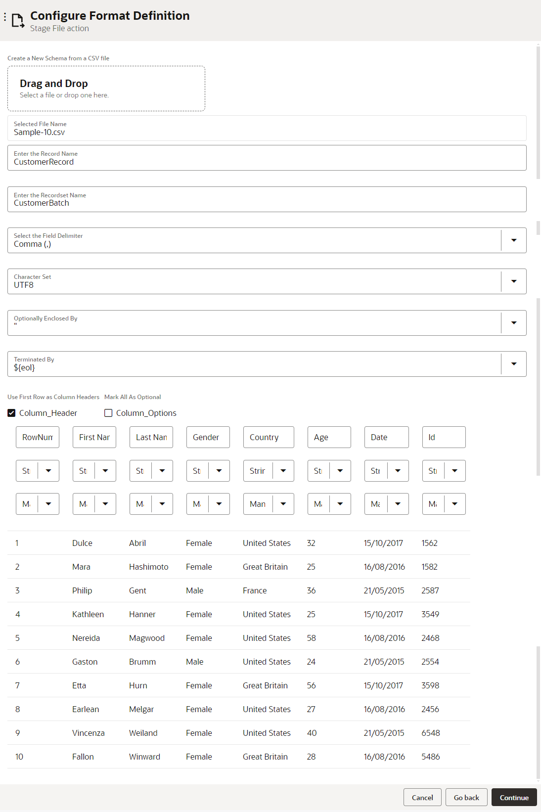

    Click *Continue* and **Finish** the wizard. **Save** your integration.

***Add logger Action***

1.  **Add** a *logger* action after the **ReadCSVFile** activity.

2.  In the **Configure Logger** page, drag and drop **$ReadCSVFile &gt; ReadResponse** element to the **logger message** text box. This will print the entire csv data in activity stream.

    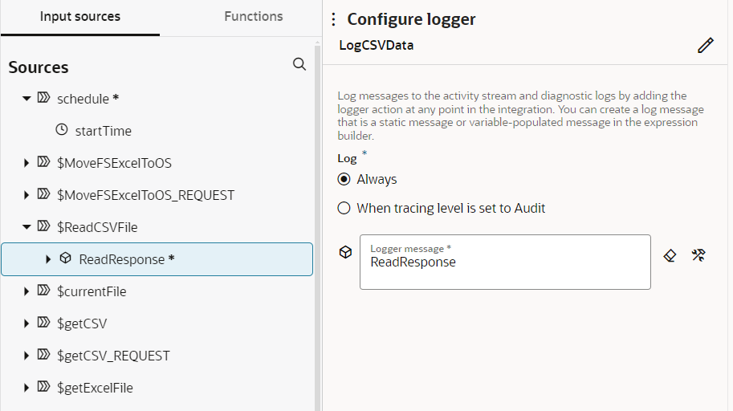

***Define Business Identifiers & Activate the Integration Flow***

1. Manage business identifiers that enable you to track fields in messages during runtime.

2. Click on the *(I) Business Identifiers* menu on the top right.
   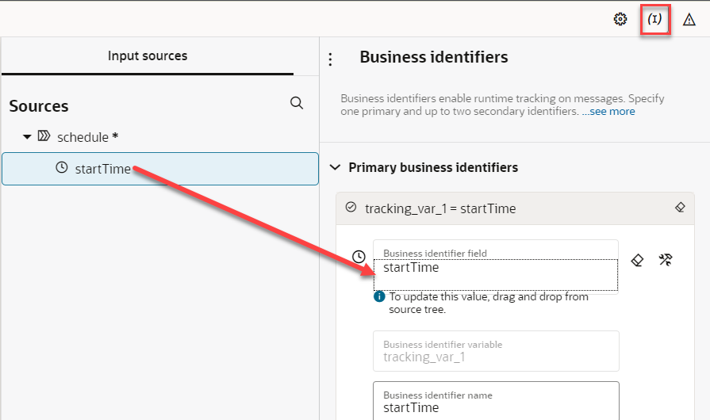

3. From the **Source** section, expand *Schedule* &gt; *start Time* fields to the right side section tracking\_var\_1

4. Click on the *(I) Business Identifiers* menu on the top right and Click *Save* and Click on *&lt;* *(Go back)* button.

## Task 4: Activate the Integration.

1.  In the Project **Design** View, Select three dots (...) which is next to the Integration Flow. From the list of Actions select *Activate*. You can create a deployment and activate. Alternatively, you can activate individual integration aswell.

    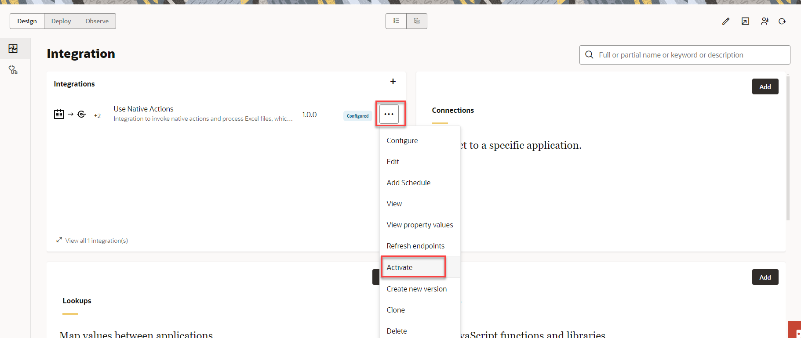

2.  In the **Activate Integration** page select *Tracing Level* as *Debug*, and Click on *Activate*

## Task 5: Test & Monitor the Integration.

1.  Upload the .xlsx file (available in the lab artifacts) to the directory configured in the Integration Flow File Server Action.

2.  In the Project **Design** View, Select three dots (...) which is next to the Integration Flow. From the list of Actions select *Run*.

3.  In the **Configure & Run**, Select *Request Type* as **Ad hoc Request**. Click on *Run*

4.  An Instance of the integration is created. Select *Instance Id*. In the Instance Monitoring page, Activity Stream section expand the *For Each* action - Iteration 1

    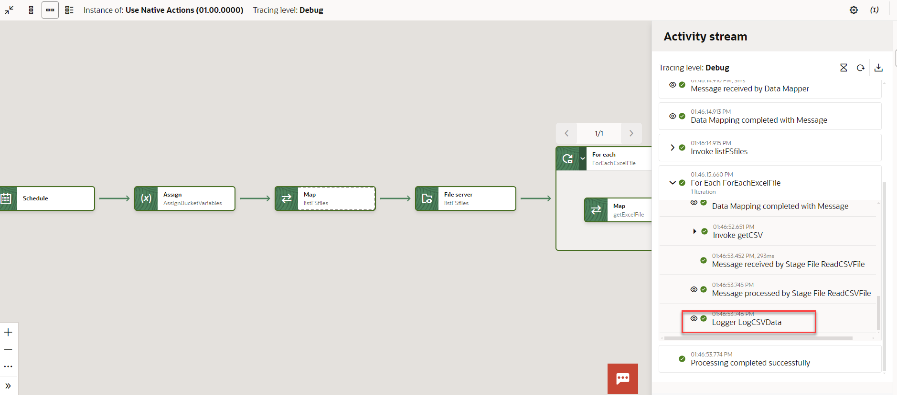

5.  Click on the *Eye* icon next to the Logger Action in the activity stream. You should the parsed csv data.

## Task 6: Bonus Section

Extend the use case to delete the csv file uploaded in the Object Storage

1.  Orchestrate Object Storage native action in the existing Integration flow

2.  Use the delete object operation

3.  In the map activity refer the object name to delete the file from the bucket-csv.

## Task 7: Congratulations 🎉

🎉 Congratulations on completing the Workshop! 🎉

You've successfully navigated through the creation and testing of a powerful integration flow using Oracle Integration (OIC) and Oracle Cloud Infrastructure (OCI) services. By automating the transfer, conversion, and processing of Excel files, you’ve harnessed the full potential of OIC's native actions and OCI’s serverless functions to build a seamless, efficient, and scalable data integration solution.

Key Takeaways:

- You’ve learned how to list and transfer files from an FTP server using OIC’s native actions.
- You’ve successfully invoked an OCI function to convert Excel files to CSV, showcasing the power of serverless computing.
- You’ve mastered the art of reading, staging, and processing data files within OIC, paving the way for real-time analytics and business insights.

## Learn More

* [Getting Started with Oracle Integration 3](https://docs.oracle.com/en/cloud/paas/application-integration/index.html)

* [About Projects](https://docs.oracle.com/en/cloud/paas/application-integration/integrations-user/integration-projects.html)

* [Activate Integration](https://docs.oracle.com/en/cloud/paas/application-integration/integrations-user/activate-and-deactivate-integrations.html)

* [Monitor Integration](https://docs.oracle.com/en/cloud/paas/application-integration/integrations-user/track-integration-instances.html#GUID-46A7C0A0-CBE4-4F1B-9B45-62A5AFA89D74)

## Acknowledgements

* **Author** - Kishore Katta, Director Product Management, Oracle Integration & OPA
* **Last Updated By/Date** - Kishore Katta, August 2024
