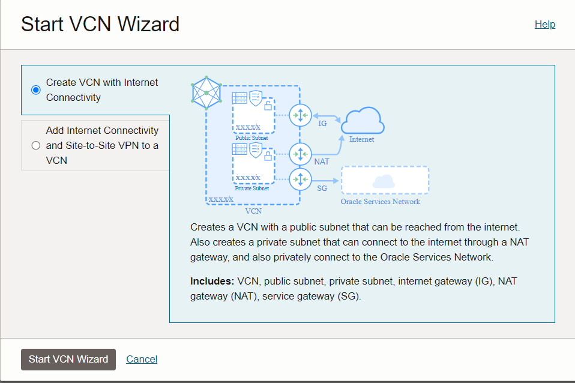
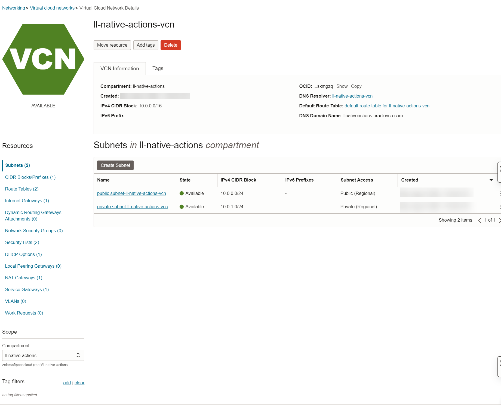
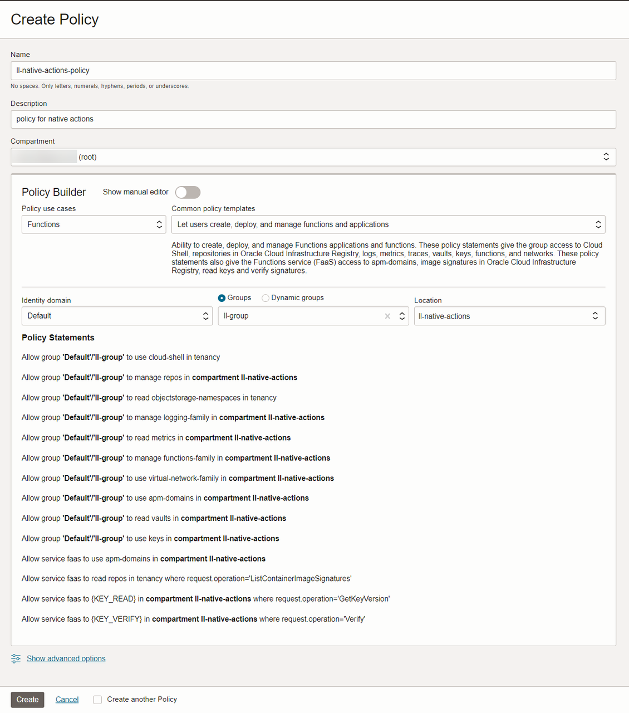

# Setup

## Introduction

This lab walks you through the pre requisite setup like creating VCN and policies required to access OCI resources to complete the workshop.

Estimated Time: 45 minutes

### Objectives
In this lab, you will:
- Create VCN and subnets
- Create policy for group and service to create serverless functions

### Prerequisites
This lab assumes you have:
- Ensure that your cloud tenancy uses identity domains. Invoking Oracle Cloud Infrastructure functions from an integration does not work in cloud tenancies that are not enabled for identity domains.
- Completed all the previous labs
- Created a group and added the required User to the group.

## Task 1: Create VCN and subnets

If a suitable VCN in which to create network resources doesn't exist already:

1.  Sign in to the OCI Console as a tenancy administrator.

2.  Open the navigation menu, click *Networking*, and then click *Virtual cloud networks*.

3.  Select the same compartment (example: ll-native-actions) you have used to provision OIC instance in the previous lab. We will create the OCI resources in the same compartment.

3.  Click *Start VCN Wizard* to create a new VCN.

4.  In the Start VCN Wizard dialog box, select **VCN with Internet Connectivity** and click *Start VCN Wizard*.

5.  Enter a name for the new VCN (example: ll-native-actions-vcn), click *Next*, and then click *Create* to create the VCN along with the related network resources.

6.  VCN is created with the all the resources such as Subnets, Route Tables, CIDR blocks, Internet Gateway, Security Lists, NAT Gateways, Service Gateways along with DHCP options

## Task 2: Create policy for group and service

1.  In the OCI Console, Open the navigation menu and click *Identity & Security*. Under Identity, click *Policies*.

2.  Click Create *Policy*, specify a name (example: ll-native-actions-policy) and description for the new policy, and select the tenancy's root compartment.

3.  Use the Policy Builder to create the policy. Select *Functions* from the list of Policy use cases, and base the policy on the policy template *Let users create, deploy, and manage functions and applications*. Select the **Identity Domain**, **Groups** , **Location** (example: ll-native-actions compartment)

You may now **proceed to the next lab**.

## Learn More

* [Setup Your Tenancy with Functions Pre-Requisites](https://docs.oracle.com/en-us/iaas/Content/Functions/Tasks/functionsquickstartcloudshell.htm)

## Acknowledgements
* **Author** - Kishore Katta, Director Product Management - Oracle Integration & OPA
* **Last Updated By/Date** - Kishore Katta - August 2024
