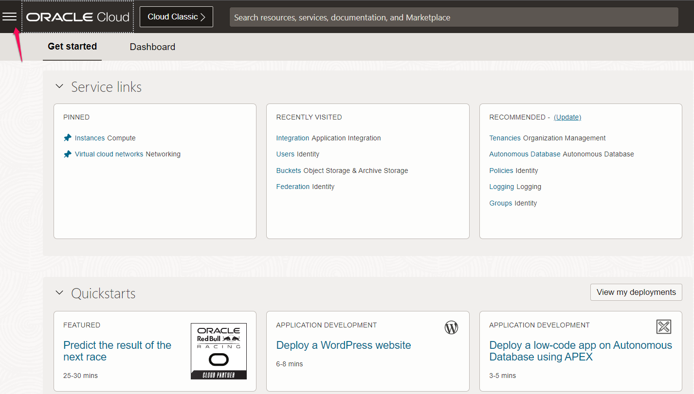

# Provision Oracle Integration 3

## Introduction

This lab walks you through the process of provisioning an instance of Oracle Integration 3, assuming you don't already have one available to you. If you do, you can skip this lab and move on to the next one.

Estimated Time: 10 minutes

### Objectives

In this lab, you will:
* Provision Integration Instance

    > **Note:** This lab is required **only** if have not yet provisioned an Oracle Integration 3 instance.

### Prerequisites

This lab assumes you have:
* This lab requires completion of the Get Started section in the Contents menu on the left.

### Background

If you just created a new Cloud account following the instructions in Getting Started, you must wait up to 30 minutes before you attempt to create an instance of Oracle Integration 3. (It could take anywhere between 10 and 30 minutes for a new user account to be fully provisioned) If you already have a Cloud account, you don't need to wait. Either way, make sure you've signed in to the Oracle Cloud as an Oracle Identity Cloud Service user before proceeding.

## Task 1: Create an Instance of Oracle Integration 3

1. On the Oracle Cloud Get Started page, select the region in the upper right where you want to create your Oracle Integration 3 instance. Once created, instances are visible only in the region in which they were created.

2. On the Oracle Cloud Get Started page, click the menu in the upper left corner to display the services you can provision.

    

3. Open the navigation menu and click **Developer Services**. Under **Application Integration**, click **Integration**

    

4. From the **Compartment** list, click through the hierarchy of compartments and select the one in which to create the instance. You may need to expand the + icon to find the compartment to use. Compartments can contain other compartments. It may take several minutes for the new compartment to appear after the policy has been created.

    

    > *Note:* Do NOT create your instance in the root or ManagedCompartmentForPaaS compartment

5. Click ***Create*** .

6. Enter the following details, and click ***Create***
    | Field &nbsp; &nbsp; &nbsp; &nbsp; &nbsp; &nbsp; &nbsp; &nbsp; | Description |
    | --- | --- |
    | Display Name |Enter the display name for the instance. Note that the display name becomes part of the URL for accessing the instance|
    | Version| Lists Version available in this tenancy. Select "Oracle Integration 3"|
    | Consumption Model| Lists consumption models available in this tenancy. Typically, one model is displayed, but multiple consumption models are listed if your tenancy is enabled for more than one. Available models include : Metered (Universal Credits)|
    | Edition|Enterprise|
    | Shape|Development|
    | License Type |Select - Subscribe to a new Oracle Integration License|
    | Message Packs |1|
    | Access Token | If this field is displayed, you are creating an instance as a non-federated user. Sign in as a federated user and restart creating an instance.|

7. You should see your instance in the Creating state. It will take several minutes for the instance to be created. When instance creation completes successfully, the instance shows as **Active** in the State column and you'll receive an email. You are now ready to access your instance.
Please note that once Instance is created, an instance is visible only in the region in which it was created

## Task 2: Accessing an Oracle Integration 3 Instance

Navigate to an Oracle Integration 3 instance in the Oracle Cloud Infrastructure Console to open it.

1. On the Oracle Cloud Get Started page, select the region in the upper right where you created your Oracle Integration 3 instance. Open the navigation menu in the upper left and click **Developer Services**. Under **Application Integration**, click **Integration**.
2. If needed, select the compartment where you created your Oracle Integration 3 instance. You should see your instance.
3. At the far right, click the Task menu and select ***Service Console***. A new browser window will open to your Oracle Integration home page.
    

If a message appears that access was denied, or the home page flashes, you don't have access to the Oracle Integration instance. See [Assigning Oracle Integration Roles to Groups](https://docs.oracle.com/en/cloud/paas/application-integration/oracle-integration-oci/assigning-oic-roles-groups.html#GUID-B839F41C-445D-4137-8F2C-BF5CCBEC3D5C)

Please *proceed to the next lab*.

## Learn More

* [Provisioning Oracle Integration 3 Instance](https://docs.oracle.com/en/cloud/paas/application-integration/oracle-integration-oci/creating-oracle-integration-instance.html#GUID-930F40E8-5149-4091-9CDA-8E05C8449BA6)

## Acknowledgements
* **Author** - Kishore Katta, Technical Director, Oracle Integration Product Management
* **Author** - Subhani Italapuram, Technical Director, Oracle Integration Product Management
* **Last Updated By/Date** - Subhani Italapuram, Sep 2022
