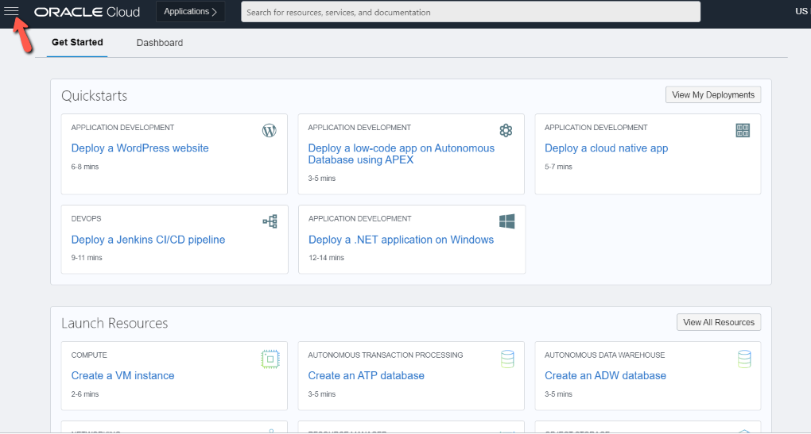
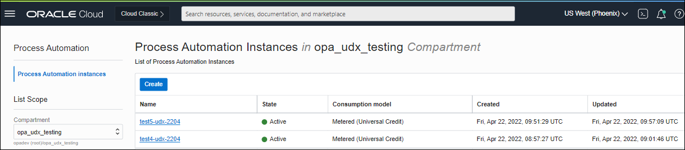
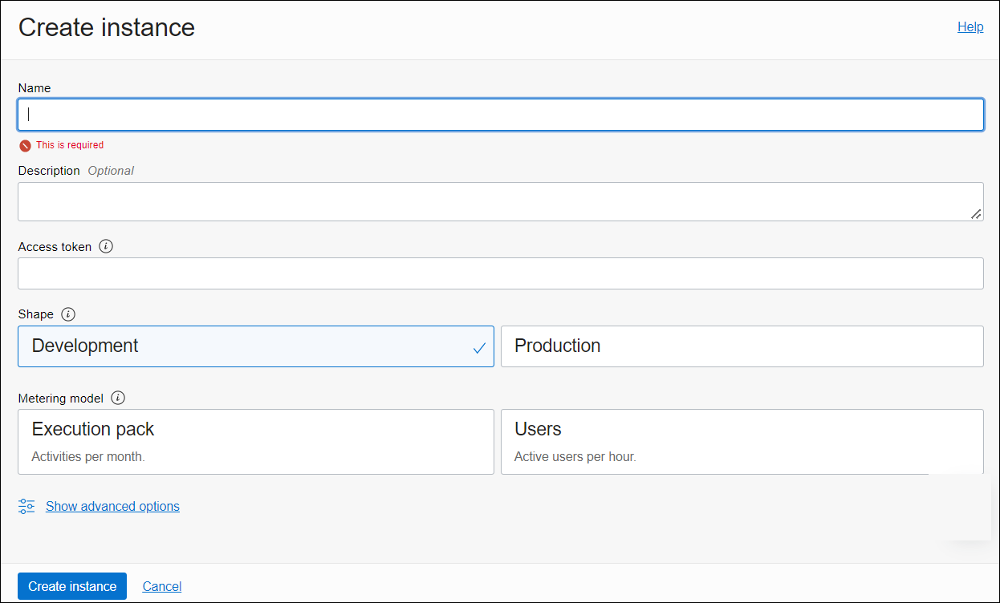
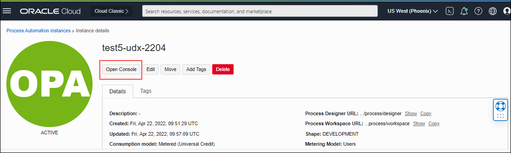

# Provision Oracle Process Automation

> **Note:** This step is required **only** if have have not yet provisioned an Oracle Process Automation instance. **Ignore** this section if you are using a **Oracle Process Automation for Fusion Applications**

## Introduction

This lab walks you through the process of provisioning an instance of Oracle Process Automation, assuming you don't already have one available to you. If you do, you can skip this lab and move on to the next one.

Estimated Time: 10 minutes

### Objectives

In this lab, you will:
* Provision Oracle Process Automation Instance

### Prerequisites

This lab assumes you have:
* This lab requires completion of the Get Started section in the Contents menu on the left.

### Background

If you just created a new Cloud account following the instructions in Getting Started, you must wait up to 30 minutes before you attempt to create an instance of Oracle Process Automation. (It could take anywhere between 10 and 30 minutes for a new user account to be fully provisioned) If you already have a Cloud account, you don't need to wait. Either way, make sure you've signed in to the Oracle Cloud as an Oracle Identity Cloud Service user before proceeding.

## Task 1: Create Compartment

1.	In the Oracle Cloud Infrastructure Console home page, open the navigation menu, and click *Identity & Security*. Under Identity, click *Compartments*. A list of the compartments in your tenancy is displayed. Note that if there are existing compartments, you can also choose to create your Process Automation instance in an existing compartment.

2.	Click *Create Compartment*

3.	Enter the following details:
-	Name: Enter a name that is unique across all compartments in your tenancy (maximum 100 characters, including letters, numbers, periods, hyphens, and underscores). For example, enter a name such as OCIPACompartment.
-	Description: Enter a description for this compartment.
-	Tags: Enter tags to organize and list resources based on your business needs

4.	Click *Create Compartment*

## Task 2: Create an Instance of Oracle Process Automation

You can provision an Oracle Cloud Infrastructure Process Automation instance in a selected compartment

1. On the Oracle Cloud Get Started page, select the region in the upper right where you want to create your Oracle Process Automation instance. Once created, instances are visible only in the region in which they were created.

2. On the Oracle Cloud Get Started page, click the menu in the upper left corner to display the services you can provision.

	

3. Open the navigation menu and click Developer Services. Under Application Integration, click Process Automaton

4. From the Compartment list, click through the hierarchy of compartments and select the one in which to create the instance. You may need to expand the + icon to find the compartment to use. Compartments can contain other compartments. It may take several minutes for the new compartment to appear after the policy has been created.

	

5. Click the **Create** button.

6. In the **Create instance** dialog, enter the following details
| Field &nbsp; &nbsp; &nbsp; &nbsp; &nbsp; &nbsp; &nbsp; &nbsp; | Description |
| --- | --- |
| Name |Enter the display name for the instance.|
| Description |Enter the description of the instance.|
| Access Token |Enter the access token. For details on how to obtain the access token, see [Create an Access Token](https://docs.oracle.com/en-us/iaas/process-automation/oci-process-automation/create-access-token-provision-instance.html#GUID-82BCB285-4E96-43E0-B780-368DAFEF7C4E) to Provision an Instance. Note that this field is visible only to non-federated users (IAM users). If you are federated, this field won't be visible, as the access token will be pre-fetched for you.|
| Shapes |Select the instance shape *Development*|
| Metering Model |Select a metering model *Execution Pack*|

	

7. Click *Create instance*.

## Task 3: Access the Process Automation Instance from the Infrastructure Console

After you've provisioned a Oracle Cloud Infrastructure Process Automation instance, you can access it from the Oracle Cloud Infrastructure Console.

1.	Sign in to the Oracle Cloud Infrastructure Console.
2.	Open the navigation menu and click Developer Services. Under Application Integration, click Process Automation.
3.	From the Compartment drop-down list, select the compartment in which you created your Process Automation instance.
4.	The existing instances in the selected compartment are listed.
5.	You can filter down further by instance states. Under Filters, select Active from the State drop-down list.
6.	Click the instance to open the instance details page.
7.	On the instance details page, click Open console.

The Designer environment of your Process Automation instance opens.

	You may now **proceed to the next lab**.

## Learn More

* [Provision and Manage Oracle Cloud Infrastructure Process Automation Instances](https://docs.oracle.com/en-us/iaas/process-automation/oci-process-automation/provision-and-manage-oracle-cloud-infrastructure-process-automation-instances.html)

## Acknowledgements
* **Author** - Kishore Katta, Product Management, Oracle Integration & Process Automation
* **Last Updated By/Date** - Kishore Katta, August 2022
