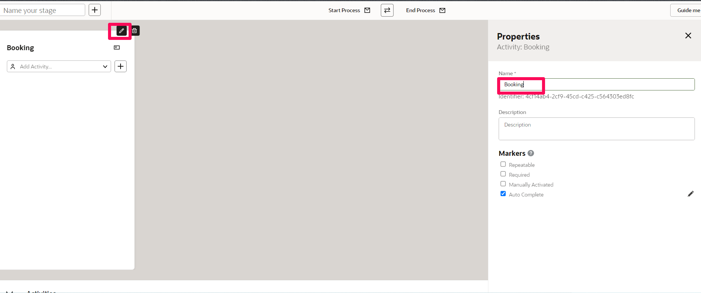
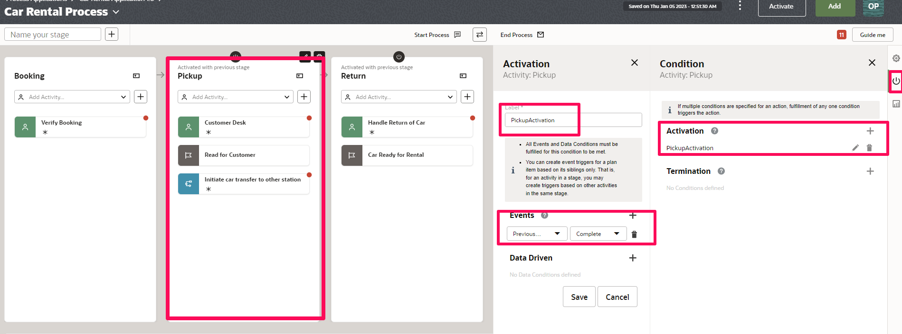
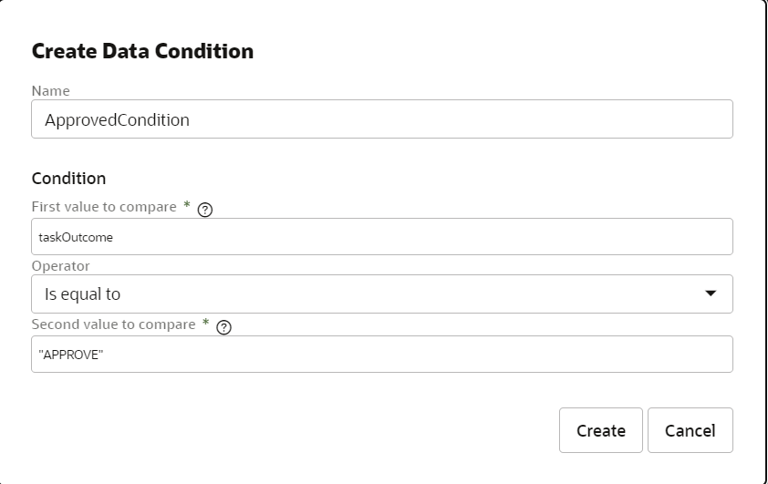

# Create Dynamic Process Application

## Introduction

This lab shows you how to create a car rental application from scratch in Process Automation using a Dynamic Process.

Estimated Time: 120 minutes

### Background

Many business processes don’t follow a structured or sequential path. They might have many possible activities that experts could act on as needed, given the situation.

Consider a use case of Claims Processing. Claims are most commonly seen in the insurance industry but can be applied anywhere where a customer seeks the services of a company to address a claim. Which documents the Policy holder needs to present? Based on policy review, is the Policy holder eligible for the Claim? Which documents must be approved before a Policy review stage can begin?

### Objectives

In this lab, you will:
* Create a Car Rental Application using a Dynamic Process
* Design a Web-Form based User Interface
* Create roles
* Use workspace to work on assigned Tasks

Using the example of a Car Rental App, let's explore the entire dynamic processes development life cycle – from creating a dynamic process, modeling its activities and properties, activating it on the server, and using it in runtime as a knowledge worker. Then, after learning all about creating, configuring, and testing a standalone dynamic process, you'll explore how to use a structured process within a dynamic process

1.	You will create 2 web forms. The first form allows a customer to book a car, the second allows the creation of a Car Transfer.
2.	A dynamic process that is started at the beginning of the application, allowing a customer to book a car.
3.	A Structured process to handle initiation of car transfer to another station . It simply sends an email notification to the Fleet Manager. If the request is rejected the same is notified to the Rental Office.
4.	Add human task activities and stages which are enabled by Activation conditions
5.	You'll add milestones to indicate that something occurred or a condition was met. Use milestones so users get updated on what’s transpired in a running process instance.

At the end of the lab you would be designing a dynamic process as below
		

### Prerequisites
You will need access to a Process Automation instance. Note that it is useful to have multiple credentials for testing purposes.

1.	Enter the web address for Process Automation. Ask your administrator if you don’t have it.

2.	Complete the User Name and Password fields, and click Sign In.

The main page for Process Designer appears, listing any existing process applications.

## Task 1: Create a Process Application in Designer

A process application is a container for key components: processes, forms, connectors, and roles.

1.	Click *Create*. The **Create Application** side pane opens.

2.	In the Title field, enter *Car Rental Application*. The title can have spaces
		and special characters.
> **Note:** By default the Identifier Name field gets auto-populated with the title you enter.

3.	Enter a meaningful description in the **Description** field.

4.	Leave the Version Tag field as 1.0.
		It will help you identify the application version when you activate it.

5.	Click *Create*.
		A message indicates that it’s being created, and then shows a link.

6.	Click the *Open now* link in the message.

If the link disappeared, select the My Applications tab to filter the list to show only those you created. Click the Search icon and enter the first few characters of the application’s name (Car Rental). Once you locate the application, select it to open it.

## Task 2: Create Roles

In Process Automation, you define roles to grant users or groups access to activated applications and specify what they can do.

1.	Create three **New** roles with Scope as **Application** and **Use** permission

	-	**RentalCarCustomers** - who starts the process and is assigned the use permission
	-	**FleetManagement** - who handles the car transfer process and approves or rejects a request and is also assigned use permission
	-	**RentalCarOffice** - customer desk who verifies the booking approves or rejects a request and is also assigned use permission
		

2. Open the *RentalCarOffice* role and search for a user and add to the role
. For the sake of simplifying the lab add the same user to the other two roles as well.

Now that we have created the three roles - RentalCustomers, RentalCarOffice, FleetManagement and added a user to the roles. Let’s create a dynamic process where we implement the roles to specific user tasks.

## Task 3: Add Activities and Stages

A process features activities that humans perform, such as completing and submitting information or approving documents. A dynamic process is created using Stages and Activities.

Stages are segments that a process can be divided into. A stage acts as a container using which you can group and organize activities in a logical way. Typically, activities that must be completed in order for a milestone to be achieved are grouped into a stage. The execution of stages is not necessarily sequential. Stages can be activated in parallel or upon occurrence of an event.

Activities represent the actions for a process to execute. The Activities drop-down menu on the process canvas contains all the activities that can be used within a dynamic process.

**Note:** Within a process, activities can exist without being grouped into a stage. Such activities are called Global activities.

Activities are divided into the following types:

**Human Task Activity** – Represents an activity where a process participant is required to perform the work. The task can be a simple interaction, such as filling out a form, or part of a more complicated workflow that requires input from multiple process participants.

**Process Activity** – Represents invoking of a structured process within a dynamic process.

**Service Activity** – Represents invoking of an external service, such as a REST connector.

**Milestone** – Represents a sub-goal within a process. Milestones are typically defined to track progress of a process.

**Connectors** – Represents invoking of a REST connector.

Let’s start by adding some human tasks within stages that people typically perform in a car rental application. For simplicity, we’ll keep this example brief. But keep in mind that a dynamic process can accommodate the complex scenarios of a real world situation such as car auto upgrade based on service levels etc .

1.	Click the **Car Rental Application 1.0** breadcrumb to go to your application’s main page.

2.	From the top of the page, click *Add*.

3.	In the Add component pane, expand **Processes**, and click *Dynamic*.
		

4.	Enter *Car Rental Process* in the **Title** field.

5.	Click *Create*. A confirmation message shows that the process was created.

6.	Select *Add Stage*. A stage is added and **Edit Properties** and change the name of the stage to **Booking**
		
7.	Add 2 more Stages **Pickup** and **Return**
		

Stages enable you to organize activities into phases of a process. (This example is kept simple, but you can include many possible activities in each stage.) Stages can run at the same time or one after another.

8.	In the **Booking** stage add a Human Task Activity. Select the **Human task Activity** from the drop down.
		

9.	Provide *Verify Booking* and Click on *+* icon which creates a human task activity in Booking Stage
		
		Similarly, add **Customer Desk** and **Handle Return of Car** human task activities in **Pickup** and **Return** stages respectively
		

10.	In the **Activities** section Add two human task activities namely **Update Booking Information** and **Report Incident**. The activities present here are treated as global activities and becomes available when the process it is contained in is instantiated or becomes Active
		

11.	Under the **Pickup** stage, select the activities drop down and select *Milestone* activity type. Enter **Ready for Customer** and click on *+*
Similarly, add another milestone activity **Car Ready for Rental** under **Return** stage.
Add another *Milestone* activity type and name as **Car Pickup** as global activity under Activities section
		

12.	Under the **Pickup** stage, select the activities drop down and select *Process activity*. Enter *Initiate car transfer to other station* and click on *+*
		

Notice the validation icon at the right hand side top corner. It shows the total number of validation issues in the process. Because you just started to create your dynamic process, and your dynamic process isn't complete, ignore these issues. You will be configuring the activities in the next sections.

Important points about human tasks:

-	A human task can be a submit or an approval activity.
-	Each human task activity must be associated with a form. The form provides the interface for the task.
-	Each human task activity needs an assignee, which could be a user, role, or group.
-	Each human task activity has data values that flow in and out of it, referred to as its input and output. For example, a human task’s form might display with some fields completed and its output might contain additional or changed fields.

## Task 4: Create Web Form Presentations for Dynamic Process

1.	Click *Add* at the top of the page.

2.	In the Add component pane, expand **UIs** and click *Web Form*.

3.	In the Title field, enter *Rental Car Form*.

4.	Click *Create*, then click the *Open now* link.

5.	Add controls to the web form per blow with default values.

| Name | Field Type | Default Value | Properties |
| --- | --- | --- | --- |
| FullName | Input Text |||
| PickupDate | Date ||Format: **yy-MM-dd**|
| ReturnDate | Date ||Format: **yy-MM-dd**|
| FromZip | Input Text |90220||
| ToZip | Input Text |90209||
| FromCity | Input Text |Crompton||
| FromState | Input Text |California||
| ToCity | Input Text |Beverly Hills||
| ToState | Input Text |California||
| CarModel | Input Text |Honda||
| LuggageSize | Input Text |300||
| NoOfDoors | Input Text |4||
| NoOfPeople | Input Text |5||
| ReportDamage | Text Area || Rows: **5** , Hide: **Enabled**|
{: title="Car Rental Form Field Properties"}

5.	Click anywhere outside the form to open Form properties. In the **Properties** pane select *Form* tab

6.	Select *Add* to create a Customized Presentation. From the **Select Presentation Style** dialog Click *Customize* and provide a name *InputPresentation*

**Note:** A customized presentation is identical to the base presentation from which it is created. However, unlike a cloned presentation, you cannot add/delete controls or modify control properties within a customized presentation. You can only perform the followings actions on existing controls: hide, show, and modify read-only status. To edit a customized presentation after creating it, use the Edit button next to the presentation switcher.

7. Select the **InputPresentation** form created above under Presentations. Select *Customize* and observe the actions that can be performed for a form control. Notice that that the control **Report Damage** shows as hidden, because we chose to hide the control when creating a new travel request.

8.	Create another customized presentation and name it as *ReportDamagePresentation*. *Unhide* the **Report Damage** control so that the text area can be utilized by the respective persona to enter the damage details.

## Task 5: Define Dynamic Process Input and Output

Define input and output arguments for a dynamic process to communicate or exchange data with other processes and services.

After defining the input arguments for your process, you must map them to data objects of your process or its flow elements. Similarly, data from a flow element in the process can be mapped to output arguments as the output of the process.

In this lab we will use a web form as the input to a process to start process execution when a user submits the form. The form is designed to get input from the user and present information relevant to the workflow.

1.	Navigate to the dynamic process **Car Rental Process** and Select *Start Process*

2.	Define values per below

| Name | Value |
| --- | --- |
| Who can start the process? | Any user with **Use** or **Manage** permission |
| How to start the process? | With Form|
| Form Title | Car Rental Form|
| Form | Car Rental Form |
| Presentation | Input Presentation (Cutomized Car Rental Form)|
| Interface Argument | formArg |
{: title="Define Start Process arguments"}

Click *Define*

Since, we do not want our process to provide any output you may leave it as is without any arguments

## Task 6: Define Data objects

1. Create 3 **Data Objects** of Type **Simple** per below to save Human Task Outcome at different Process stages
-	taskOutcome - String
- carReturnOutcome - String
- transferOutcome - String

## Task 7: Define Properties for Stage
You can customize a stage to suit your requirements by defining markers and conditions specific to the stage. You set properties for a stage in the stage's Properties pane. Select a stage and click *Edit Properties* icon that appears to open the Properties pane. Optionally, select a stage and click the *Properties* icon on the right of the process editor canvas to open the Properties pane.

Markers control transitions of a stage between states. In addition, markers can specify if the execution of a stage is mandatory for the process to complete or if the execution must be repeated under certain conditions.

Note that if you apply a marker to a stage without condition then the marker applies to the stage by default.

1.	For a new stage, the Auto Complete marker is enabled by default. Observe that for the stages Booking, Pickup and Return Auto Complete marker is enabled.

If the Auto Complete marker is enabled, a stage is automatically marked Complete if none of the activities within it are in the **Active** state and all required activities are **Completed**, **Terminated**, or **Disabled**.

2.	Select the *Pickup* stage and click the *Condition* icon on the right of the process editor canvas to open the Conditions pane. Under **Activation** click on *+* icon and provide a condition Label as **PickupActivation**

3.	Create a new *Event* in Events section. Provide the activation condition as *Previous Stage* *Complete* and Click on *Create*. Observe a decorator at the top of the Stage.

4.	Configure the activation condition for **Return** Stage similar to **Pickup** stage. Provide the activation condition as *Previous Stage* *Complete*.

5.	Click anywhere outside the Stages and configure open Process **Properties** and select *Auto Complete* marker.

## Task 8: Define Properties for Activity

You can customize an activity to suit your requirements by specifying markers, conditions, and other properties. You set properties for an activity in the activity's Properties pane. Double click an activity or select an activity and click *Edit Properties* icon that appears to open the Properties pane. Optionally, select an activity and click the *Properties* icon on the right of the process editor to open the Properties pane.

In the Properties pane, you can do the following:
-	Enable markers for the activity, and if required set conditions for markers.
-	For Activities like Human Task, Process, Service and Connectors you can specify implementation details

Similar to Stage you can use markers to control transition of an activity between states.

The following table lists all markers available for an activity.
-	**Repeatable** - Enable the Repeatable marker to repeatedly execute an activity.
-	**Required** - Enable this marker to make execution of an activity obligatory for the stage/process to complete.
-	**Manually Activated** - Enable the Manually Activated marker if you require an activity to be started by a process participant.

**Configure Booking (Stage) -> Verify Booking (Activity)**

1.	Select *Verify Booking* activity and Click on *Properties*

2.	In the **Markers** section select the *Required* marker

3.	Select the **Task Type** as *Submit*

4.	In the **Assignees** section add *RentalCarOffice* role which is created earlier

5.	In the **End User display** section Select *Car Rental Form* UI and **Presentation** as *InputPresentation (Customized from CarRentalForm)*

6.	Select *Bind to process data* check box to automatically bind form payload and outcome.

7.	In **Task Payload** select *formArg* and for **Task Outcome** select *taskOutcome* data object created earlier

8.	The Action field gets auto populated depending on the type of task. If the selected task type is Submit, then the field has a **SUBMIT** action. If the selected task type is Approve, then the field has APPROVE,REJECT actions.

**Configure Pickup (Stage) -> Customer Desk (Activity)**

1.	Select *Customer Desk* activity and Click on *Properties*

2.	In the **Markers** section select the *Required* marker

3.	Select the **Task Type** as *Approve*

4.	In the **Assignees** section add *RentalCarOffice* role which is created earlier

5.	In the **End User display** section Select *Car Rental Form* UI and **Presentation** as *InputPresentation (Customized from CarRentalForm)*

6.	Select *Bind to process data* check box to automatically bind form payload and outcome.

7.	In **Task Payload** select *formArg* and for **Task Outcome** select *taskOutcome* data object created earlier

**Configure Pickup (Stage) -> Ready for Customer (Activity)**

1.	Select *Customer Desk* activity and Click on *Condition* tab

2.	Our requirement is to treat the milestone as completed if Customer Desk approves the Rental Request. Select *+* to Create a Complete Condition and label it as *Ready Condition*. In the **Events** section click on *Create Event*. Create an event trigger based on **Customer Desk** -> **Complete** state.

Create a **Data Driven** condition and name it as *Approved Condition* and provide condition as **If taskOutcome equals to "APPROVE"**. Finally click on *Create*

**Note:** Once you select the condition in first value all the data objects gets displayed.

Observe an **Activation** decorator on the milestone activity once the condition is created

**Configure Pickup (Stage) -> Initiate car transfer to other station (Activity)**

1.	Select *Initiate car transfer to other station* activity and Click on *Properties*

2.	In the **Markers** section make sure no markers are selected. Since this activity invokes another Structured Process we will configure the implementation in later part of lab.

3.	Our requirement is to Activate the car transfer process if the from location and to location are different. Select *Condition* tab to define an activation condition. Create an Activation Condition and label as *TransferCondtion*. Create a new **Data Driven** condition and name it as **TransferDataCondition**. Provide a condition per below and Click *Create*

You will notice a red dot on the activity which indicates an error, as we have not completed the implementation part. Observe an activation decorator on the activity.

**Configure Return (Stage) -> Handle Return of Car (Activity)**

1.	Select *Handle Return of Car* activity and Click on *Properties*

2.	In the **Markers** section select the *Required* marker

3.	Select the **Task Type** as *Approve*

4.	In the **Assignees** section add *RentalCarOffice* role which is created earlier

5.	In the **End User display** section Select *Car Rental Form* UI and **Presentation** as *ReportDamagePresentation (Customized from CarRentalForm)*

6.	Select *Bind to process data* check box to automatically bind form payload and outcome.

7.	In **Task Payload** select *formArg* and for **Task Outcome** select *carReturnOutcome* data object created earlier

8.	Modify the actions as **COMPLETE,**SERVICE** instead of default actions

**Configure Return (Stage) -> Car Ready for Rental (Activity)**

1.	Select *Car Ready for Rental* activity and Click on *Condition* tab

2.	Our requirement is to treat the milestone as completed once return of car is handled. Select *+* to Create a Complete Condition and label it as *ReadyCondition*. In the **Events** section click on *Create Event*. Create an event trigger based on **Handle Return of Car** -> **Complete** state.

Create a **Data Driven** condition and name it as *returnOutcomeCompleteCondition* and provide condition as **If carReturnOutcome equals to "COMPLETE"**. Finally click on *Create*

Observe an **Activation** decorator on the milestone activity once the condition is created

**Configure Update Booking Information (Global Activity)**

1.	Select *Update Booking Information* activity and Click on *Properties*

2.	In the **Markers** section select the *Manually Activated* marker. Uncheck any other markers if already selected

3.	Select the **Task Type** as *Submit*

4.	In the **Assignees** section add *RentalCarCustomer* role which is created earlier

5.	In the **End User display** section Select *Car Rental Form* UI and **Presentation** as *InputPresentation (Customized from CarRentalForm)*

6.	Select *Bind to process data* check box to automatically bind form payload and outcome.

7.	In **Task Payload** select *formArg* and for **Task Outcome** select *taskOutcome* data object created earlier

8.	Leave the default Action **SUBMIT** as is

9.	Select the *Condition* tab and create an **Enablement** condition and name the label as **EnableUpdateBooking**. Create a new Event to trigger the plan Item **Update Booking Information**. Select the Stage as *Booking* and process state as *Create*

**Configure Report Incident (Global Activity)**

1.	Select *Report Incident* activity and Click on *Properties*

2.	In the **Markers** section select the *Manually Activated* marker. Uncheck any other markers if already selected

3.	Select the **Task Type** as *Submit*

4.	In the **Assignees** section add *RentalCarCustomer* role which is created earlier

5.	In the **End User display** section Select *Car Rental Form* UI and **Presentation** as *ReportDamagePresentation (Customized from CarRentalForm)*

6.	Select *Bind to process data* check box to automatically bind form payload and outcome.

7.	In **Task Payload** select *formArg* and for **Task Outcome** select *taskOutcome* data object created earlier

8.	Modify the Action as **SUBMIT**

9.	Select the *Condition* tab and create an **Enablement** condition and name the label as **EnableReportIncident**. Create a new Event to trigger the plan Item **Update Booking Information**. Select the activity as *Car Pickup* and process state as *Create*

Click *Create*

**Configure Car Pickup (Activity)**

1.	Select *Car Pickup* activity and Click on *Condition* tab

2.	Our requirement is to treat the milestone as completed once car is Picked up. Select *+* to Create a Complete Condition and label it as *PickupCondition*.

Create a **Data Driven** condition and name it as *DataCondition* and provide condition as **If taskOutcome equals to "APPROVE"**. Finally click on *Create*

Observe an **Activation** decorator on the milestone activity once the condition is created

You should see only 1 error w.r.t Initiate Car Transfer activity. Rest of the activities should have been configured and validated.

## Task 9: Create Car Transfer Structured Process

1.	Create a new Structured Process label it as *Car Transfer Process*

2. Select the *Start Event* activity and click on *change type* and Select *Start* Activity. Rename the activity to **Start transfer of car to other station**

3. Edit the swimlane and select role as *RentalCarOffice*

4. Add another swimlane below **RentalCarOffice** swimlane and select role as *FleetManagement*

5. Orchestrate the process per below

6. Select the activity **Notify Fleet Manager** and configure the properties per below

| Name | Value |
| --- | --- |
| To | Select **expressions** tab and provide a valid email address |
| Subject | Car is in transfer to other station|
| Body | Car of recent rental is being transferred to other station, please check details.|
{: title="Configure Notify Fleet Manager properties"}

7.	Create a new web form for **Car Transfer** with below controls and layout

| Name | Type |
| --- | --- |
| CarModel | Input Text |
| DateOfArrival | Date |
| FromCity | Input Text |
| ToCity | Input Text |
| Customer | Input Text |
{: title="Car Transfer Web Form Controls"}

7.	Navigate to the **Car Transfer** structured process and Select the activity **Review and Approve** and configure the properties per below

| Name | Value |
| --- | --- |
| Title | Review Car Transfer |
| UI | Car Transfer Form |
| Presentation | Default |
| Action | APPROVE,REJECT |
{: title="Configure Review Car Transfer Human Task properties"}

Leave other values as default

Select *Open Data Association*. Map **Input** Variables to **carTransferForm** Data Object per below in the **input** tab

Select the **output** tab and map output of task out come to a data objects per below

Click on *Apply*

8.	Select the **rejected** path connecting the Gateway and Notify activity. Provide an expression **taskOutcomeDataObject == "REJECT"**

9.	Select the activity **Notify Rental Office of Car Return** and configure properties per below

| Name | Value |
| --- | --- |
| To | Select **expressions** tab and provide a valid email address |
| Subject | Car will be sent back to you|
| Body | We arrange the return of the car to your station.|
{: title="Configure Notify Rental Office of Car Return properties"}

10.	Click anywhere out side Process and Select *Properties*. Configure the input and output arguments per below

Make sure all the activities are implemented in the structured process and there are no validation errors. Which is indicated at the top right corner with a green check

## Task 10: Call a Structured Process from Dynamic Process

1.	Navigate to **Car Rental Process** dynamic process. Select the **Initiate car transfer to another station** activity and click on *Properties*. In the Implementation section select **Car Transfer Process**

Make sure all the activities are implemented in the dynamic process and there are no validation errors.

2.	Configure data association per below for the **Initiate car transfer to another station** process activity.

In the input tab map **input** variables to structured process input interface per below

In the output tab map **output.transferOutcome** variable to **transferOutcome** data object. Select *Apply*

## Task 11: Activate and Test the Application

So far your implementation artifacts should be per below

1.	**Activate** the Car Rental Application 1.0 and Select *Test in Workspace*.

2. Select the **Car Rental Application** and *Submit* the Car Rental Request by filling in the form details.

3.	Click *Tracking* and the instance you just created is listed. The dynamic process runtime page opens. Take a moment to explore.

The activities you created are available under **Activities** pane, and show the same human task icon as in design time. The **Update Booking Information** and **Report Incident** that aren’t part of a stage are listed first and have no stage listed. An asterisk indicates required activities.

Expand *Data* tab. The **formArg** includes the values you entered when you started the dynamic process.

Expand the *Milestones and Stages* tab which shows instance progress view activities and stages. You can see that the instance started today. The stages shows number of available, active, and completed activities. You can see one available activity which is **Verify Booking** also listed in the **Activities** pane.

Notice the other tabs. The Documents tab displays documents related to the process instance. Oracle Integration must be integrated with Oracle Content Management to work with documents. Your assigned role’s document permissions control the actions you can perform with documents.

Expand *Audit* tab. A list of actionable activities such as human tasks and non-actionable activities such as stages, milestones are displayed.

Expand *Comments* tab. You can post and view comments for the process instance under Comments in the process instance details window

Expand *Documents* tab. You can upload documents and view uploaded documents related to your process in the process instance details window

You can view detail information about a process under More Information in the process instance details window.

Expand *Activities* tab and Click the *Actions* icon (three dots) on a running activity *Verify Booking* to open the form associated with the activity and perform certain actions. Select *Open* from the drop-down list

Review the booking request and Click *Submit*

4.	Expand *Milestones and Stages* tab. Notice that the **Booking** stage is now in **Completed** state and the **Pickup** stage is activated and in **Running** state as per the activation condition configured for the stage. Expand *Activities* and Verify the tasks which are Enabled/Running/Completed state. Observe that **Initiate car transfer to other station** activity is enabled because the "from zip" and "to zip" are different. Select *Actions* icon (three dots) on the *Customer Desk* human task and Click *Open* and **Approve** the request.

5. Expand *Milestones and Stages* tab. Observe that **Ready for Customer** milestone is completed. Select *Open* action on **Initiate car transfer to other station**. Which will initiate the *Car Transfer Process*.

In the **Actionable Activities** click *Open* on **Review an approve** human task.

Select *Approve*. Close the *Car Transfer Process*

6. Observe the *Pickup* stage is now in **Completed** state. In the **Return** stage we see **Handle Return of Car** activity is in **Running** state. Open the human task and Click on *Complete* since there is no damage reported.

Notice all milestones and stages are **Completed** state.

In the **Tracking** page the instance is now marked as Completed and hence available under **Completed** tab.

## Task 12:	About the process and plan item lifecycle

**Process State Model**

|State|Description|
|----------|----|
|Active|The process state when it is instantiated. When a process is in this state, all stages and global activities defined within it are instantiated and enter the state Available.|
|Complete|A process instance automatically enters this state when all stages and activities contained within it in are Completed, Terminated, or Disabled. You can also manually mark a process Complete or use the Auto Complete marker.|
|Terminated|A process instance automatically enters this state when its termination condition is fulfilled.|
|Closed|You can manually close a process instance at any time. This removes the process instance from the runtime persistent store.|
{: title="Process State Model"}

**Stage or Activity State Model**

|State|Description|
|----|----|
|Available|A stage or global activity becomes Available when the process it is contained in is instantiated or becomes Active.However, an activity within a stage becomes Available when the stage containing it enters the Active state.|
|Enabled|A stage or activity enters this state only if it requires human intervention.If the Manually Activated marker is enabled, then the stage or activity transitions from Available to Enabled (after fulfilling enablement conditions if any). From here, a process participant can move the stage or activity into Active or Disabled states.|
|Disabled|A process participant can move a stage or an activity into the Disabled state to skip its execution in the current process instance. Similarly, a Disabled stage or activity can also be re-enabled. These actions are performed in runtime.|
|Active|When a stage becomes Active, all activities within it are instantiated and become Available. When an activity enters the Active state, the actual execution of that task begins. If the Manually Activated marker is enabled, then the stage or activity enters the Enabled state (after fulfilling enablement conditions if any) and waits for the process participant to activate it. If the Manually Activated marker is disabled, the stage or activity becomes Active as soon as it is instantiated or after fulfilling activation conditions if any.|
|Failed|This state indicates a failure to initiate, activate, or complete the stage or activity.|
|Complete|This state indicates normal completion of stage or activity.|An activity enters this state when its execution has finished. A stage is automatically marked Complete when all activities contained within it in are Completed, Terminated, or Disabled. You can also manually mark a stage Complete or use the Auto Complete marker. See Enabling Markers for a Stage. A stage or activity in the Complete state is removed from the runtime database.|
|Terminated|A stage or activity enters this state when its termination condition is met or its parent (process or stage) is terminated. A Terminated stage or activity is removed from the runtime database.|
{: title="Stage or Activity State Model"}

**State Transitions – An Illustration**

Let’s use the lab example in order to understand state transitions of processes, stages, and activities.

|Plan Item|Markers and Conditions|
|----|----|
|Booking stage|The Auto Complete markers are enabled|
|Pickup stage|The Auto Complete markers are enabled. In addition, an activation condition is also defined specifying that this stage is activated only after the previous stage is Complete.|
|Return stage|The Auto Complete markers are enabled. In addition, an activation condition is also defined specifying that this stage is activated only after the previous stage is Complete.|
|Verify Booking human intervention activity|The Required marker is enabled.|
|Customer Desk human intervention activity|The Required marker is enabled.|
|Ready for Customer milestone activity| An Completion condition is defined specifying that this activity is enabled only after the event of Customer Desk activity is Complete and the outcome of the human activity is Approved|
|Initiate car transfer to other station Process activity| An Activation condition is defined specifying that this activity is enabled if the from city zip matches the to city zip code in the car rental request|
|Handle Return of car human intervention activity|The Required marker is enabled.|
|Car Ready for rental milestone activity| A Completion condition is defined specifying that this activity is enabled only after the event of Handle of Return activity is Complete and the outcome of the human activity car return is "Complete"|
|Global Activity - Update Booking Information human activity|The Manual Activation marker is enabled. In addition, an enablement condition is also defined specifying that this activity is enabled only after the Booking stage is Complete.|
|Global Activity - Report Incident human activity|The Manual Activation marker is enabled. In addition, an enablement condition is also defined specifying that this activity is enabled only after the Car Pickup milestone is Created.|
|Global Activity - Car Pickup milestone activity| A Completion condition is defined specifying that this activity is enabled if Customer Desk has Approved the request. Basically, if the task outcome is "APPROVE"|
{: title="State Transition Illustration"}

When a process participant **Rental Car Customer** starts the application and instantiates the process, the following sequence of state transitions take place:

a.	The car rental dynamic process enters the **Active** state and all stages enter the state **Available**.

b.	Because the **Booking** stage is not manually activated and has no activation conditions, it immediately turns **Active**. However, the **Pickup** stage and **Return** stage remains in the Available state until its activation condition is fulfilled. The activities within these stages undergo following transitions:
-	The Verify Booking activity becomes Available, and it subsequently turns Active because there are no conditions for its activation.
-	All the activities under the **Pickup** stage are not instantiated at this point in the process.
- In the Enabled state, the Global Activities - **Update Booking Information** activity and **Report Incident** activity awaits a relevant process participant to manually activate it. For example in the Update Booking Information case, a Rental car customer starts this activity if any booking information needs to be updated.

Note that all the above transitions occur simultaneously as soon as the process is activated. The following diagram depicts states of the process instance and its plan items at this point in execution:

c.	Now, the **Rental Car Office** provides the required information and completes the Verify Booking activity. 	With **Verify Booking** activity being **Complete** the stage also enters **Complete** state

d.	This fulfills the Activation condition of the **Pickup** stage, and it transitions to the **Active** state.
-	Subsequently, both activities under this stage become Available.
- **Customer Desk** activity becomes **Active** because there are no conditions for its Activation
-	**Initiate Car transfer to another station** activity because the Activation condition is fulfilled.

The following diagram depicts the current state of the Pickup stage:

e.	After the **Customer Desk** is Completed and **Initiate Car Transfer to another station** Process is completed by the FleetManagement team the activity is marked as completed. With both activities marked Complete, the stage is marked Complete as well.

f.	This fulfills the Activation condition of the **Return** stage, and it transitions to the **Active** state.
-	Subsequently, all the activities under this stage become Available.
-	**Handle Return of Car** activity becomes **Active** because there are no conditions for its Activation

The following diagram depicts the current state of the Return stage:

g.	After the **Handle Return of Car** is Completed the stage is Complete. The process is marked **Complete** as well.

Note: The milestones within the stages are Completed and the progress is shown based on the completion condition when the respective stages are enabled.

## Learn More

* [Design Dynamic Proceses](https://docs.oracle.com/en/cloud/paas/process-automation/user-process-automation/design-dynamic-processes.html)
* [Design Forms and User Interfaces](https://docs.oracle.com/en/cloud/paas/process-automation/user-process-automation/design-forms-and-user-interfaces.html)
* [Explore Workspace](https://docs.oracle.com/en/cloud/paas/process-automation/user-process-automation/explore-workspace.html)

## Acknowledgements
* **Author** - Kishore Katta, Product Management, Oracle Integration & Process Automation
* **Last Updated By/Date** - Kishore Katta, January 2023
