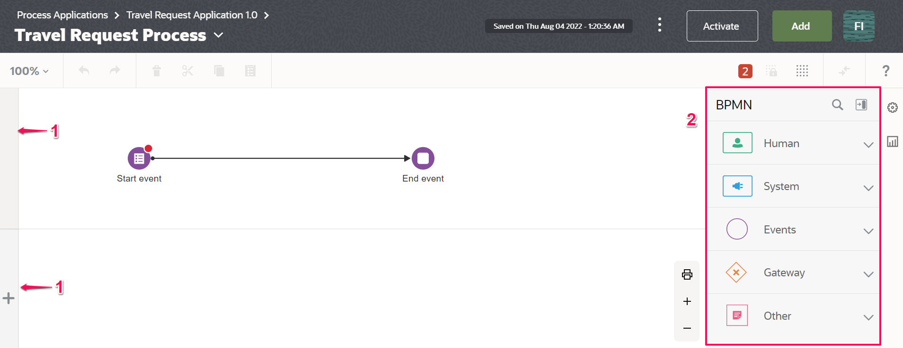
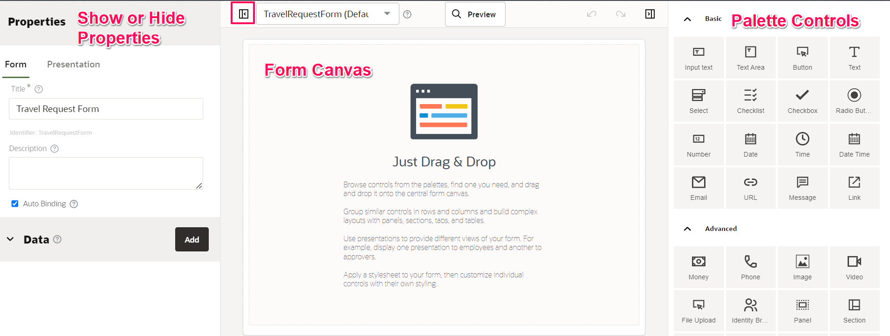
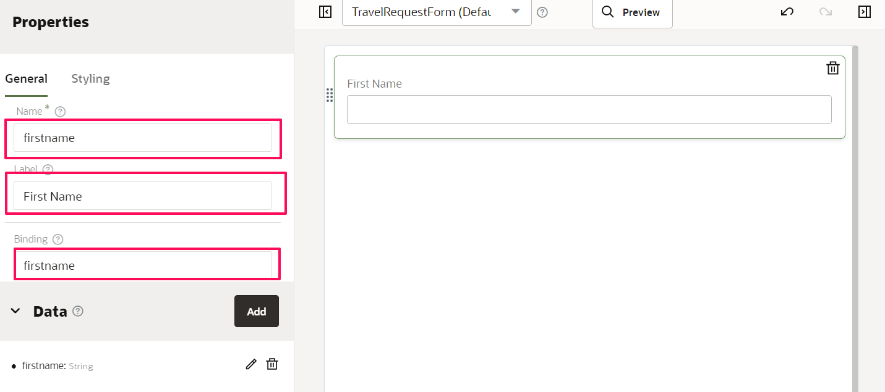
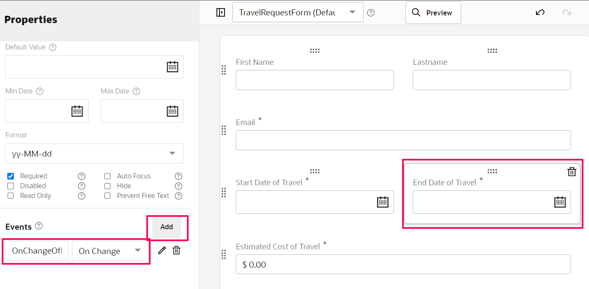
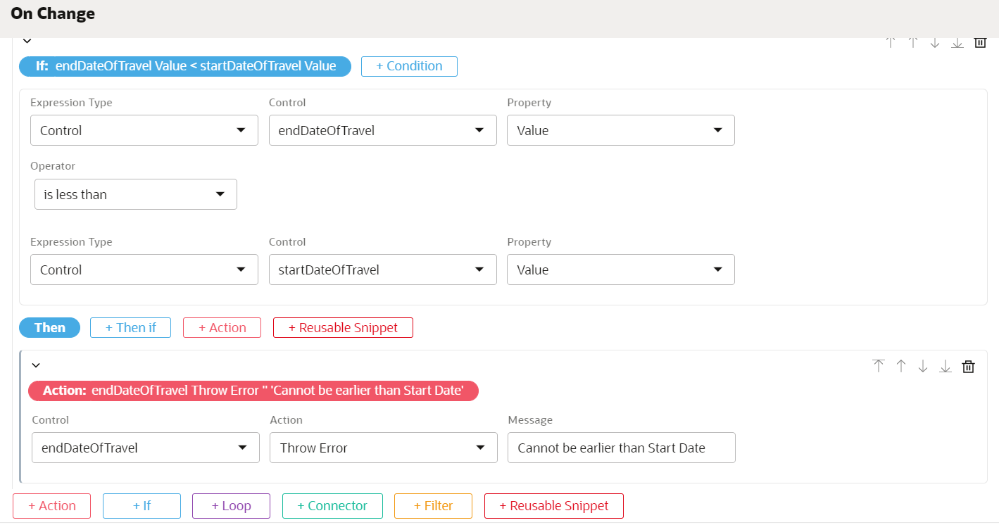
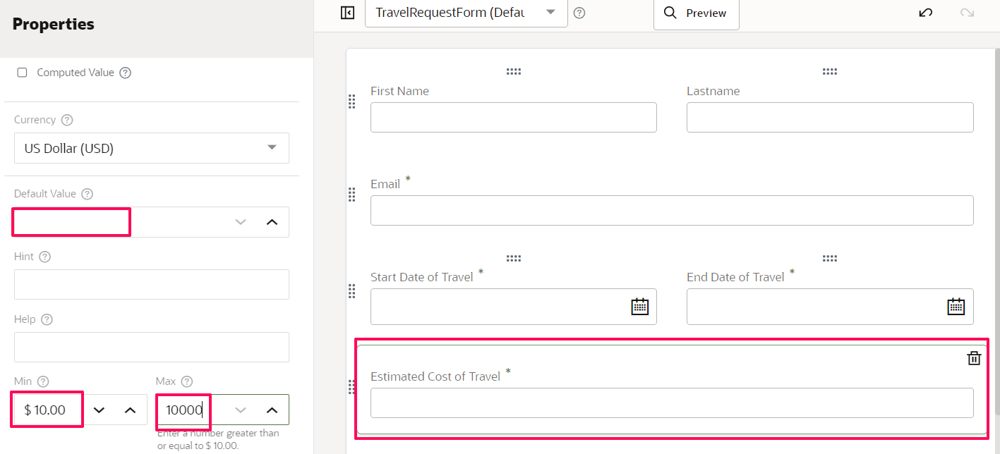
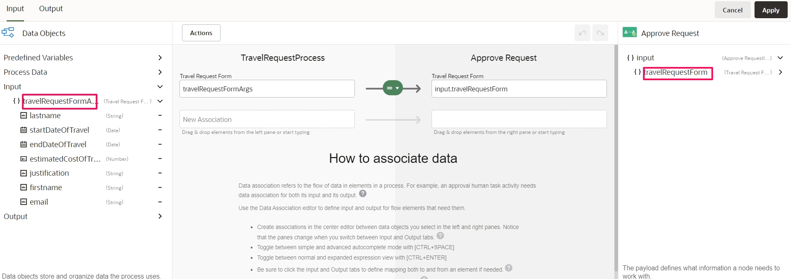
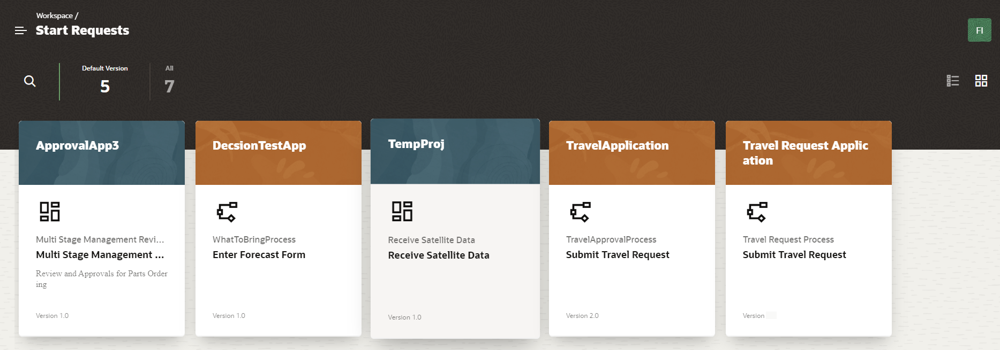
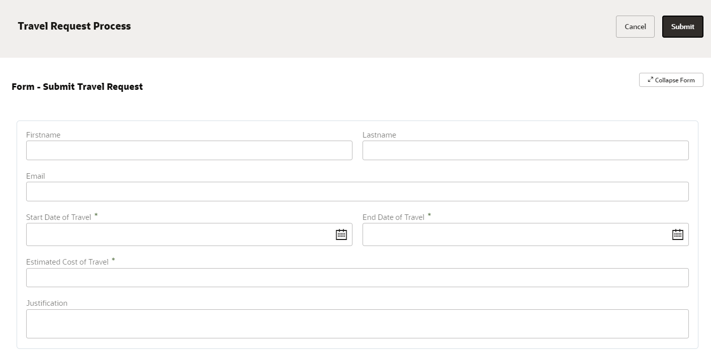
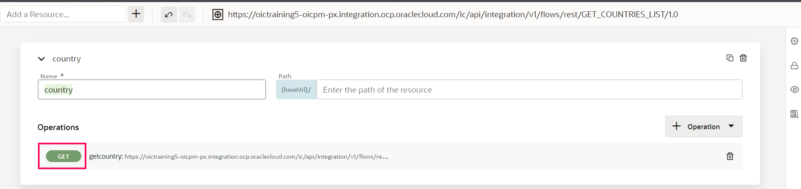

# Create Structured Process Application

## Introduction

This lab shows you how to create a  travel request application from scratch in Process Automation using a Structured Process.

Estimated Lab Time: 90 minutes

### Background

Process applications that you create from scratch in Designer can consist of one or more of the following application components:

-	Processes are a sequence of tasks or activities that result in a well-defined outcome. Business Process Model and Notation (BPMN) elements within the process define the flow and behavior of the application.

- Web Forms define the interface that your application users see in Workspace. You can create web forms from the ground up or you can base them on an existing data structure.

- Business Types represent real-world concepts or objects, such as a ticket, a request, or an employee. You use business types to create the data structures that are required in your application.

- Decisions are containers for if/then rules and decision tables that use the same input and output data objects. A decision exposes these data objects as a reusable service that multiple business processes can invoke.

- Connectors define how a business process connects to external REST services.

### Objectives

In this lab, you will:
* Create a Travel Application using a Structured Process
* Design a Web-Form based User Interface
* Use Connectors to integrate with external REST service
*	Model a decision and formulate multiple conditions
* Create roles
* Use workspace to work on assigned Tasks

### Prerequisites
You will need access to a Process Automation instance. Note that it is useful to have multiple credentials for testing purposes.

1.	Enter the web address for Process Automation. Ask your administrator if you don’t have it.

2.	Complete the User Name and Password fields, and click Sign In.

The main page for Process Designer appears, listing any existing process applications.

## Task 1: Create a Process Application in Designer

A process application is a container for key components: processes, forms, connectors, and roles.


1.	Click *Create*. The **Create Application** side pane opens.

2.	In the Title field, enter *Travel Request Application*. The title can have spaces and special characters.

		Note that by default the Identifier Name field gets auto-populated with the title you enter.

		Tip: You can modify the default identifier to a name of your choice. For example: TravelRequestApp_1. But keep in mind that it has more restrictions than the title. For example, it supports hyphen (-) and under score (_) but does not support space, and it always begins with an alphabet (A-Z) but supports alphanumeric values also.

3.	Enter a meaningful description in the **Description** field.

4.	Leave the Version Tag field as 1.0.
		It will help you identify the application version when you activate it.
		

5.	Click *Create*.
		A message indicates that it’s being created, then shows a link.

6.	Click the *Open now* link in the message.

		If the link disappeared, select the My Applications tab to filter the list to show only those you created. Click Search icon and enter the first few characters of the application’s name (travel). Once you locate the application, select it to open it.

## Task 2: Explore Components Tab and Navigation

Opening a process application displays its components page. Components are design elements of your application, and they’re listed as tabs near the top of the components page.

1.	From the **Components** tabs, click *UIs*.


Notice that a 0 appears for each component, since you haven’t created any yet.

For example, when you click *UIs*, the UIs page appears, offering you two ways to create a form or select a linked UI. Forms and linked UIs will be listed on this page after you create them.

2.	Click the *Process Applications* breadcrumb at the top.

You return to the Process Applications page. As you design components in your application, the breadcrumbs at the top get updated. You can easily navigate between components using the breadcrumbs.

3.	Open your process application again.

## Task 3: Create Roles

In Process Automation, you define roles to grant users or groups access to activated applications and to specify what they can do.

-	Permissions provide increasingly greater access to an application’s resources: Inspect, Read, Use, and Administer.
-	A role can be either local (to the application) or global (can be used in multiple applications). Note that permissions are specific to an application.
-	You don’t need to assign permissions to users who are assigned tasks. They inherit permissions from the task itself.

In this example, we’ll create two roles:
	-	**Requester** - who starts the process and is assigned the use permission
	-	**Approver** - who approves or rejects a request and is also assigned the use permission

Let’s create the two roles.

1.	From the top of the page, click *Add.*

2.	In the **Add component pane**, expand *Roles*, and click *New*.

3.	In the **Title** field, enter *Requester*, and click *Create*.

Notice how the role is now listed on the page and the Roles tab shows 1.

4.	Click the *Open now* link or select the role from the Roles page to open it.

5.	Let’s assign a user and review permissions for the role. In the **Search by** fields:

-	Leave **Users** selected in the drop-down field.
-	In the Search **Search** icon field, enter the first few characters of the user name you signed in with.
-	Select the user. The user gets listed in the page.

6.	In the **Application Permission Level** options, leave *Use* selected.


This allows your user to start an application request in Workspace.

7.	Repeat steps 1 - 4 to create the second role, only this time enter its name as *Approver* in the **Title** field

8.	Repeat step 5 to assign a user for the **Approver** role.
		In a real life scenario, multiple users are selected to complete different tasks in an application. But to keep this example simple, we’ll use the same user.

9.	In the **Application Permission Level** options, leave *Use* selected. This allows your user to update (in this case, Approve or Reject) a task in Workspace.

Now that we have created the two roles - Requester and Approver, let’s create a process where we implement the roles to specific user tasks.

## Task 4: Create a Structured Process

1.	Click the **Travel Request Application 1.0** breadcrumb to go to your application’s main page.

2.	From the top of the page, click *Add*.

3.	In the Add component pane, expand **Processes**, and click *Structured*.
		

4.	Enter *Travel Request Process* in the **Title** field.

5.	Click *Create*. A confirmation message shows that the process was created.

Notice how the process is listed on the page and the Processes tab shows 1.

6.	Select the process to open it.

The structured process editor opens. Start and end elements are already positioned on the flow for you. There are two swimlanes and the BPMN elements palette is on the right side.

7. Select the *Start* element activity and rename it to **Submit Travel Request**



8.	Select the *End event* acitivity and rename it to **Completed**

9.	Select the first swimlane containing the start and end element by clicking the bar on the left of the canvas. Click the *edit* icon to open the **Properties** pane. In the Properties pane, select *Requester* in the **Role** drop-down field.


Note that the swimlane’s name changes to Requester.

10.	Similarly, edit the second swimlane and select *Approver*

11.	In the BPMN elements palette, expand the **Human** category and drag an *Approve* task to the second swimlane. Adjust the process flow so that the **Approve** task is the second element in the flow. Rename it to *Approve Request*

12.	In the BPMN elements palette, expand the **Gateway** category and drag an *Exclusive* Gateway Activity to the second swimlane next to the **Approve Request**. Rename the **Gateway** activity to *Approved?*

13.	In the BPMN elements palette, expand the **Human** category and drag a *Submit* task to the first swimlane. Rename it to *Resubmit*.

14.	Select the *Approved?* Gateway activity. Using the connector (arrow icon) Connect one of the branches to the **Resubmit** task.
Notice a line on the branch connecting to *Completed* activity. This indicates the default route and the other branch connected to **Resubmit** activity is a conditional route. We will add the conditional logic in the later section

15. Select the *Resubmit* acitivity and connect with **Approve Request** task


## Task 5: Create a web form

- Use forms for human interaction to:
    - Define what users see when they initiate your process application
    - Define what approvers see when they receive requests that need their attention or action
- Process Automation allows you to create a simple form with the quick editor or create an advanced form
	with the web form editor. If needed, you can choose the quick editor and later switch to the web form editor

1.	Click *Add* at the top of the page.

2.	In the Add component pane, expand **UIs** and click *Web Form*.

3.	In the Title field, enter *Travel Request Form*.

4.	Click *Create*, then click the *Open now* link.

If you missed the Open now link, click the *expand* arrow next to the **Travel Request Process** at the top, then click the *UIs* tab, and select the new form.



Notice the following:
-	The palettes in the right pane. You have many more control types and options to choose from.
-	The tabs in the left Properties pane. Notice how they change depending on what is selected in the main canvas.
-	When the form is selected (click away from a control), Form and Presentation tabs appear.
-	When a control is selected, General and Styling tabs for that control appear.

5.	Drag-and-Drop you first field from the right palette, choose an *Input text* field


6.	Change the field name to **firstName** and the label to **First Name** . See the automatic binding.


7.	Repeat this operation for a **lastName** field of type input text, as well as an **email** field of type email.

8.	Create also as **startDateOfTravel** and **endDateOfTravel**, of type date.

9.	Add a *Money* field for **Estimated Cost of Travel**, from the Advanced Palette

10.	Add a *Text Area* to the bottom of the Form by drag-and-drop of a Text Area. Name this field **Justification**.

11.	Make the following fields (email, start date, end date and cost of travel) *Required*


## Task 6: Add dynamic controls to fields via Events

Use events to introduce dynamic behaviors into your web forms, and combine them with actions, conditions, functions, and REST connector calls.

For example, you can introduce the following behaviors into your forms:

-	Populate data in a control field based on another control field in the form. For example, a Country select field will impact the State select field and the State select field will impact the City select field.
-	Enable control field validation based on another form control field. For example, if Start Date is given then End Date is mandatory or a Full Name gets its value from the First Name and Last Name.
-	Make a REST call on demand, store the call’s response, and use response data in an event action or condition.

1.	Select the *End Date of Travel* field. In the properties pane scorll down to **Events** section. On the left pane, click *Add* to access the drop down field Events. Notice that there are a variety of events that you can choose from, such as on Change or on Submit. Pick *On Change* and then edit this field by clicking on the pen to the right. Provide the name of the event as **OnChangeOfEndDate**


2.	Edit the **OnChangeOfEndDate** to define event conditions

We need a condition such that if End date of travel is earlier than Start date of Travel throw an error

Define the if condition and Action as follows.



In essence, this will throw an error if the End date is earlier than the Start date.
Click *OK* and exit Events.

3.	Select the *Estimated cost of Travel* field, notice that it has a default value of zero. Replace this by a blank value.

Select the currency as USD and define the minimum value to 10 and the maximum value to 10000



4.	Test your web form by Selecting *Preview*. Click *Submit* to see what errors are generated


## Task 7: Create Presentations to the forms
We can now have the same form appearing differently to different role which is convenient when some particular users do not need to see the form in the same way as others. In our case, we will create a **ManagerView** presentation that will show less fields, and it will be used for Manager approval task.

1.	Navigate to **Travel Request Form**

2.	From the main form properties pane, scroll down to **Presentation** section and add a presentation by clicking on *Add*.

3.	In the **Select Presentation Type** select *Clone*. We selected to clone or copy the default presentation


4.	Give it a name such as *ManagerView* and a description. Click *Create*


5.	Make this presentation more synthetic by removing the first name and email fields, and condensing fields on the same line. When you preview the form, it should look more or less like this (no obligation , you can do what you want):


## Task 8: Implement the process

1.	Navigate to **Travel Request Process**

2.	Select *Submit Travel Request*. Click on the *Hamburger* icon and Select *Open Properties*


3. In the properties pane configure per below

| Property Name | Value |
| --- | --- |
| Assignee | Any user with Use Permission  |
| Title| Submit Travel Request |
| UI | Travel Request Form |
| Presentation | Default Presentation |

4.	Open the properties of **Approve Request** task. Configure the Properties per below

| Property Name | Value |
| --- | --- |
| Policy | Any Single Assignee |
| Select Participants| Current Lane Participants |
| Title | Approver to review request |
| UI | TravelRequestForm |
| Presentation | Managers View |
| Action | APPROVE,REJECT |
| Priority | Normal |

5.	Open the properties of **Resubmit** task. Configure the Properties per below

| Property Name | Value |
| --- | --- |
| Select Participants| Current Lane Participants |
| Title | Employee to resubmit request with additional information |
| UI | TravelRequestForm |
| Presentation | Default Presentation |
| Action | SUBMIT |
| Priority | Normal |

6.	Select the connector from **Approved?** to **Completed** which is the default path. In the properties pane Configure **Name** as *Yes*


7.	Select the connector from **Approved?** to **Resubmit** which is the conditional path. In the properties pane Configure **Name** as *More Information Required*

Define the condition **taskOutcomeDataObject=="REJECT"** and mark as *Conditional Flow*


## Task 9: Define data objects

Data objects are the variables used to store the information used by your business processes. They’re defined during the design and implementation stage of a process. To complete a process application, you must ensure that you have associated each activity with the data objects it requires.

At runtime, data objects contain information that might be altered as users interact with your business process. Running processes can store, access, and manipulate data. The values stored within a data object can also be used to determine the branch that a process takes.

Process Automation supports data objects that are based on generally simple data types. However, complex business objects can be created indirectly, by either creating a form or importing a JSON schema/sample in a connector.

Let's create a data object explicitly based on existing Travel Request form

1.	Navigate to **Travel Request Process** and then click *Data*


2.	In the Data pane, click on *+* to Create **Data Object**. Name the Data object as *travelRequestDO* . Select Type as *Business* and Business Object as *Travel Request Form*.


3.	Click on *Create*. Notice that a new Data Object is created in the **Process Data** category. We will use this data object to store travel request form data explicitly

	```
	Note: A default process data object with the name TaskOutcomeDataObject is automatically created for the human task outcome when a human task is created. The Edit and Delete links are disabled for this data object.
	```
## Task 10: Configure Data Association

Data association refers to the flow of data within a process. Use the Data Association editor to define input and output for flow elements that need them.

A data association involves a source and a target, where the source provides a value or an expression to be assigned to the target. An approval human task, for example, needs both input and output data association.
On the input side, it needs data input into the activity (referred to as its payload).

On the output side, after the activity has just finished, it needs output from the activity to data objects, to store results for use elsewhere in the process.

1.	In the **Travel Request Process** Select **Submit Travel Request** task , Click on *hamburger* icon and Select *Open Data Association*


The left pane displays source objects (Data Objects) in an expandable tree. The right pane displays the payload, or entry parameters the activity needs to perform its function

In the left pane Drag the data object **Input > travelRequestFormArgs** and drop it in the input field titled **New Association**

In the right pane Drag the data object **Process Data > travelReqDO** and drop it in the output field title **New Association**


Click on *Apply*

2.		Select **Approve Request** task and Click on *Open Data Association*.

In the Input tab, Map **Process Data > travelReqDO** to **input > travel request form**

In the Output tab, Map per below
**output > taskOutcome** to **Process Data > taskOutcomeDataObject**


**output > travelRequestForm** to **Process Data > travelRequestDO**


Click on *Apply*

## Task 11: Activate a Version of the Application

Activating an application moves its metadata from design time (Designer) to runtime (Workspace), where it can be run in production capacity.

Before you activate, note the following about Snapshots and Versions:
-	When you activate, you specify the snapshot to use. A snapshot just refers to the application’s design-time metadata at a point in time. Save as many snapshots as you want so you can return to one if needed.
-	Create an application version as often as you want.

So far your implementation artifacts should be per below


1.	Click *Activate* on the top right corner.
		The Activate version pane appears. Notice that the version tag you specified at creation is shown (1.0).
		

2.	Leave the **Make it default** field selected.
		An application always has a default version. In Workspace, users can choose to see all versions or the default only.		

3.	Click *Activate*.
		You’re informed that a snapshot of the application is being taken, followed by a message that the application is activated.
		

4.	Click *Test in Workspace*.

## Task 12:	Test and Run the Application in Workspace

Use the Workspace environment to run, test, monitor, troubleshoot, or administer process applications. The options you see depend on your assigned role.

Before you begin, get familiar with the options in the Workspace navigation menu.
-	**Workspace**: Returns to the runtime home page.
-	**Start Requests**: Lists applications you have permission to start.
-	**My Tasks**: Lists tasks assigned to you or a group you’re part of.
-	**Tracking**: Lists structured and dynamic processes you can track.
-	**Administration**: Lists tasks that users with administrative permissions can perform, such as 	
	managing roles, notifications, and credentials. Displays to users assigned an administrator role only.

###	Start an Application Instance
In this case, pretend you are an end user who wants to request for a Travel. Each time the application is started, a process instance is created.

1.	From the **Start Requests** page, select the *Travel Request Application*.
		The card’s banner lists the application identifier, and its process and start event titles appear below.
		
		The *Travel Request* form you created appears, with the first presentation shown.
		

2.	Complete the form and click *Submit*.
		The fields each show an asterisk, indicating that they’re required. If you enter an invalid address in the Email field, an error alerts you.
		A message confirms that an instance was created. The start event for the process is complete.

3.	Optionally, repeat these steps to select the application and create a few more instances.

###	Complete an Assigned Task

Now put yourself in the role of an approver - in this case, an *Approver* who gets assigned a task when a **Requester** makes a Travel Request.

1.	Choose *Workspace* from the options menu.
		The Workspace page lists tasks available to you and start requests below.

2.	Click the *Team Tasks* tab.
		You see tasks assigned with the title and process name you specified. Because they can be assigned to any user assigned to the role, you’ll need to claim a task to complete it.
		

3.	From the Actions column for a task, choose *Claim*. Click *Claim* in the Claim Task pane that
		appears.
		Click the *My Tasks* tab and your claimed Travel Request approval task now appears.

4.	Select the **Approver to review request** approval task to open it.
		The Travel Request form you created is displayed, with the Mangers View presentation shown this time.
		

5.	Notice that the fields that are removed for **Managers View**.
		Expand Comments, enter a comment, and click Post.
		Click *APPROVE* or *REJECT*.

		A message confirms that the task was approved or rejected. The approval human task is complete.
		You return to the My Tasks page. The task you just completed is no longer listed.

### Track Your Process

Now step into the role of a process owner, who wants to monitor processes to ensure that they’re moving smoothly.

1.	Choose *Tracking* from the **Workspace** navigation menu.
		The Tracking page lists processes you’re authorized to view.

2.	Select the *Completed* tab.
		You should see the Travel Application process you just completed with a Completed status.
		

3.	Select the *Completed* process.
		A page for viewing the process history is displayed.
		
-	Expand the Audit section and notice each element in the structured process listed: Submit Travel
	Request, Approve Request, Approved Gateway and Complete.
-	Click the View Input and output links to view the form entry data (payload).
-	Expand the Comments section to view any comments added or add a new one here. Comments are tracked
	with the user’s name.

## Task 13:	Add a REST connector to your form (Optional)

Connectors enable processes to interact with other Oracle Cloud applications via REST. Use an outbound REST connector to call a REST service to retrieve, create, update, or delete data on a web server that supports the REST architecture. The connector enables processes to interact with other Oracle Cloud applications via REST, including SaaS and PaaS applications running inside or outside Oracle Cloud.

Once configured, REST connectors can be implemented in
-	**service activities** in structured or dynamic processes
-	**forms**, when a field needs values from a REST call

You need the following service information to configure a connectors
-	URLs to the location of resources to call
-	Access to resources to get a JSON sample or schema to create the types needed to send and receive
	data to and from the service
-	List of operations to use on each resource
-	List of parameters to pass to operations
- Security Type (Basic Auth, OAuth 2.0 etc)

In this scenario you will configure a connector to get list of countries from a REST service and populate the values in **Select** form control as choice list based on a form event. You will modify the **Travel Request Form** to incorporate the changes.

### Create a Version
Before starting of with the new changes it is a good practice to version your application.

You can create a new version of an application at any time. The new version retains the same application name (although you can change it later) but has a different version tag, such as 1.1 versus 1.0. Once activated, application versions become different applications.

You can activate multiple application versions, but an application has only one default version, and that version is displayed by default in Workspace’s Start Requests. When you activate a version, you specify if it's the default version.

1.	In Designer, open the **Travel Request Application**

2.	From the breadcrumbs, display the Versions popup by clicking versions after the version indicator
		(The selected version is listed at the top). The green dot displays next to the default version.

3.	Create a new version by Clicking on *New Version*.
 		In the **New Version** pane accept the default Version Tag and Click on *Create*. A new version of application (1.1) is created and now marked as default application
		

### Configure Connector

1.	Select the new version of **Travel Request Application**  and Navigate to **Connectors** tab and
		Click on the *+* REST API  to configure a REST connector

2.	Complete entries for the connector and Click *Create*

| Property Name | Value |
| --- | --- |
| Title | Country Connector |
| Identifier | CountryConnector |
| Base URL | https://oictraining5-oicpm-px.integration.ocp.oraclecloud.com/ic/api/integration/v1/flows/rest/GET_COUNTRIES_LIST/1.0 |
| Description | Rest Connector to fetch countries and codes |

3.	Select the **CountryConnector**

4.	Add a Resource named **country**. Leave the resource path empty
		

5.	Add an **operation** by clicking the *+ Operation* on the right, for your resource. Make it a 	
		*GET*, with the name **getCountry**
		

6.	Select the operation created which will transition to the operation specific configuration. You
		will configure Request and Response message

7.	Configure the operation path as *countriesList*
		
		The final complete path should like **https://oictraining5-oicpm-px.integration.ocp.oraclecloud.com/ic/api/integration/v1/flows/rest/GET_COUNTRIES_LIST/1.0/countriesList**

8.	Click on the *Response* (there is nothing to add to the request, as we have no parameters to
		pass). In the **Body Definition** section Cick the *JSON Sample* sign, to define the response. Select *From Sample* and copy paste the below json

		```
		<copy>
			{
				 "countries":[
						{
							 "name":"Croatia",
							 "code":"HR"
						},
						{
							 "name":"France",
							 "code":"FR"
						},
						{
							 "name":"India",
							 "code":"IN"
						},
						{
							 "name":"United Kingdom",
							 "code":"GB"
						},
						{
							 "name":"United States",
							 "code":"US"
						}
				 ]
			 }
		</copy>
		```
9.	Select *Next*. A JSON Schema is created based on the structure provided. Finally, Click *Create*
		

10.	In the Response Body Definition select Business Type as **countryType** which was created in previous step
		Select *Apply*. Your **GET** operation is now configured to get Countries from an external REST API


### Configure Security Type

1.	In the extreme Right pane select *Security*
		

2.	Select *Edit* next to **No Security Defined**

3.	Select Security Type as **Basic Auth**. Provide Username as **livelab.user** and Password as **2@4gXz9jdI8q**
		

4.	Click on *Save*

###	Update the Travel Request form to list the countries

1.	Open the **Travel Request Form**. Make sure the form Presentation is Selected as **Default** instead of Manager View

2.	Drop on the form a new dropdown *Select* field. Select *Connector* as an **Options Source** (on the left properties palette)
		

3.	Select the *Connector*, *Resource* and *Operation* with the proper values of the REST connector you have created.
		

4.	Fill in the Option List as indicated here below, with the value *response.countries*. For the **Label** Binding and
		**Value** Binding, choose the *name* and *code* fields accordingly. For the Default Value choose *First*
		

### Activate the new version of Travel Request Application

1.	Select *Activate* and verify that you are version is 1.1 (or whatever version you provided)
		Check the *Make it default*
		

		Note: Refer the Task **Activate a Version of the Application** for detail steps.

2.	Open the activated Version in the **workspace** by Selecting *Test in Workspace* while in Designer

3.	Navigate to **Start Requests** and make sure you are in **Default Version** tab. Select the *Travel request
		application* and notice the version is 1.1. You will see only Application versions marked as default.

		Select the *All* tab and notice that all Versions are available.

4.	 Test the new Version of the application and verify that the **country of destination** field now displays countries as
		 dynamic choice list. Complete the whole test cycle repeating the steps as per **Task 12:	Test and Run the Application in Workspace**


## Learn More

* [Design Structured Processes](https://docs.oracle.com/en/cloud/paas/process-automation/user-process-automation/design-structured-processes.html)
* [Design Forms and User Interfaces](https://docs.oracle.com/en/cloud/paas/process-automation/user-process-automation/design-forms-and-user-interfaces.html)
* [Explore Workspace](https://docs.oracle.com/en/cloud/paas/process-automation/user-process-automation/explore-workspace.html)
*	[Work with Connectors](https://docs.oracle.com/en/cloud/paas/process-automation/user-process-automation/work-connectors.html)

## Acknowledgements
* **Author** - Kishore Katta, Product Management, Oracle Integration & Process Automation
* **Last Updated By/Date** - Kishore Katta, August 2022
