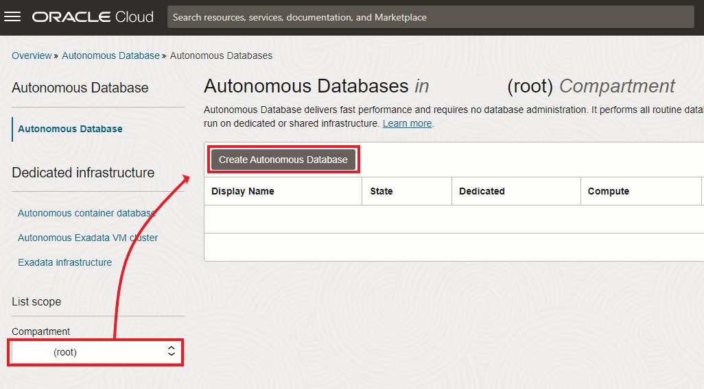
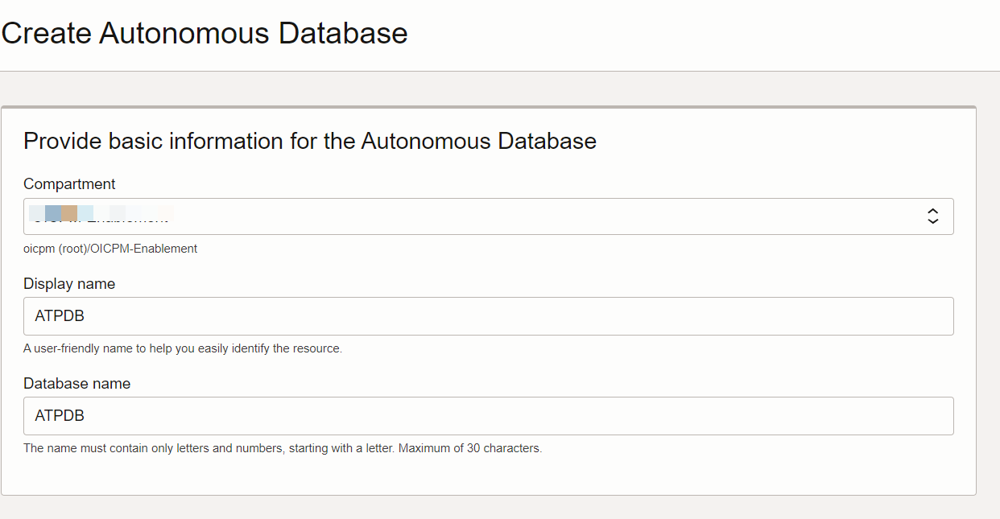
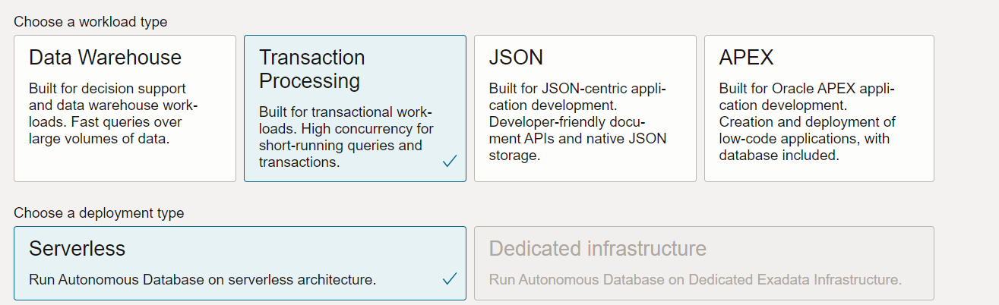
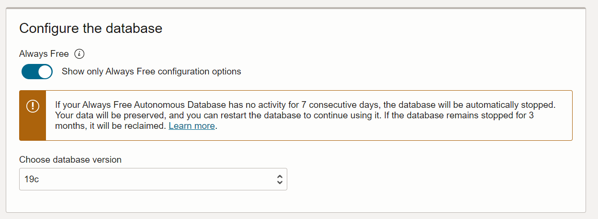
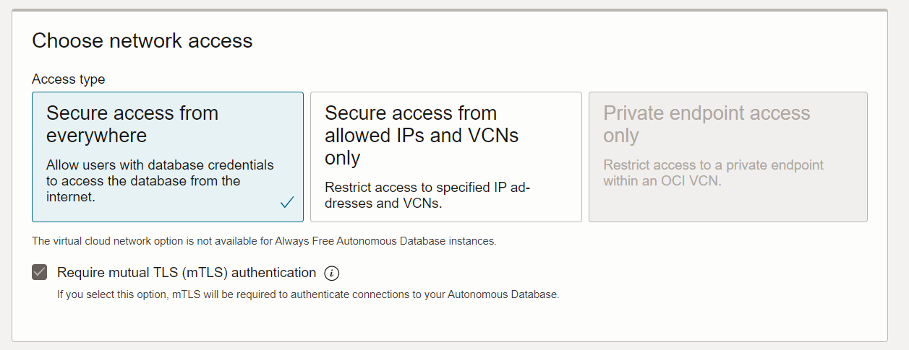

# Provision an Oracle Autonomous Database (ATP)

## Introduction

This workshop walks you through the steps to get started using the **Oracle Autonomous Transaction Processing Database (ATP)** on **Oracle Cloud Infrastructure (OCI)**. You will provision a new database in just few minutes.

Estimated Time: 15 minutes

Watch the video below for a quick walk through of the lab.

[Provision Autonomous Database Instance](youtube:a6Jm7lYaCWI)

> **Note:**  While this lab uses ADW, the steps are the same for creating an ATP database.

### Objectives

In this lab, you will:
- Create an Autonomous Database

### Prerequisites

- This lab assumes you have logged into your to Oracle Cloud account.

## Task 1: Create a new Autonomous Transaction Processing

1.  Log in to the Oracle Cloud.

2.  Click the **Navigation Menu** in the upper left, navigate to **Oracle Database**, and select **Autonomous Transaction Processing**.

    

    > Compartments are a logical separation of resources to attach roles and permissions. It will make possible to create your team structure in compartments so you know who manage what resources. Not necessary at this stage.

    And click in **Create Autonomous Database** button.

    

    You can leave the compartment as it is. Alternatively, choose a compartment as per your structure. Write the Display name and Database name.

    

3.  In the Workload type make sure you select **Transaction Processing** and deployment type as **Serverless**.

    

4.  In the **Configure the database** section Select *Always Free* and Choose database Version as **19c**.

    

5.  In the **Create administrator credentials** section Provide Username and Password

6.  Choose Network access as **Secure access from everywhere**

    

7.  Choose license type as **License Included**

8.  Click on *Create Autonomous Database*

    Your ATP Instance should be provisioned in few minutes.

9.  After a few minutes, when the instance is available, click on *Database Connection*, Select *Instance Wallet*, click on *Download wallet*, provide a password and **Download**. Copy **TNS Name** *&lt; Your Database Name &gt;\_low*. We will use these three values later.

You may now **proceed to the next lab**.

## Learn more

Go to [the documentation](https://docs.oracle.com/en/cloud/paas/autonomous-data-warehouse-cloud/user/autonomous-workflow.html#GUID-5780368D-6D40-475C-8DEB-DBA14BA675C3) on the typical workflow for using Autonomous Data Warehouse.

## Acknowledgements

* **Author** - Kishore Katta, Oracle Integration Product Management
* **Last Updated By/Date** - Kishore Katta, June 2024
