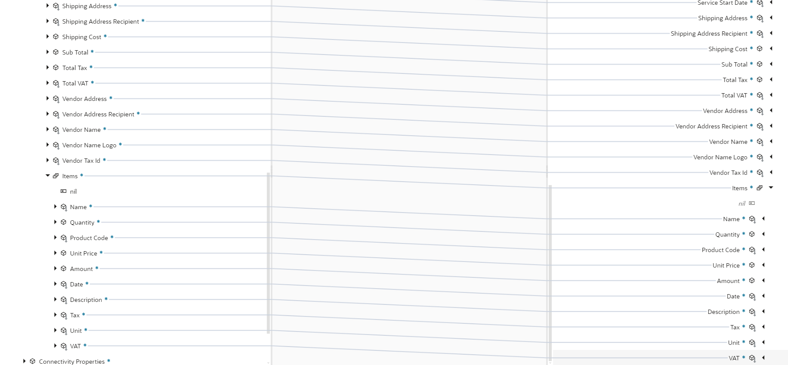
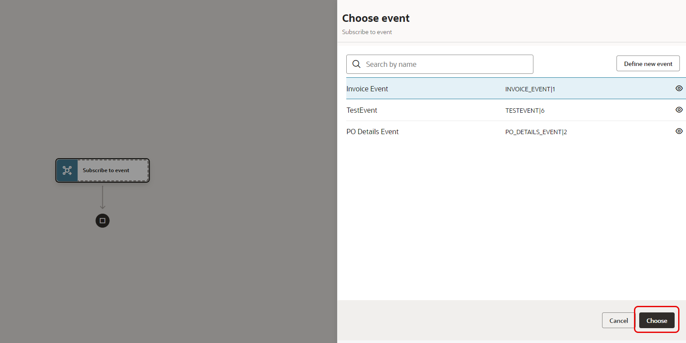
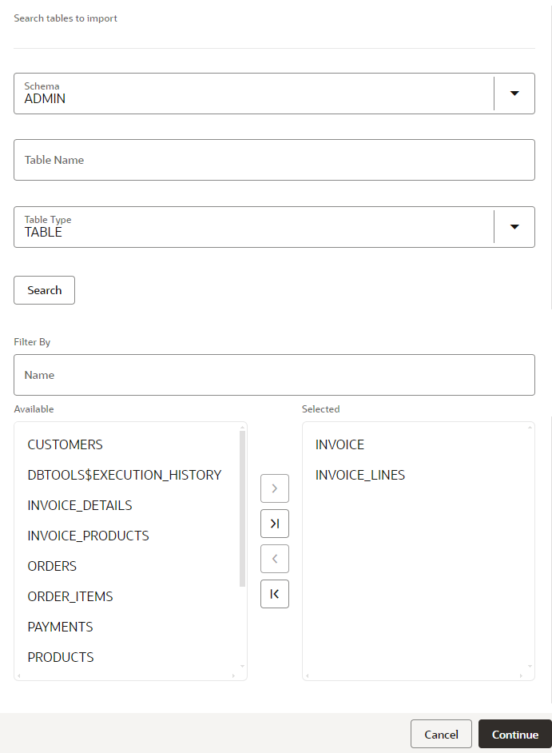
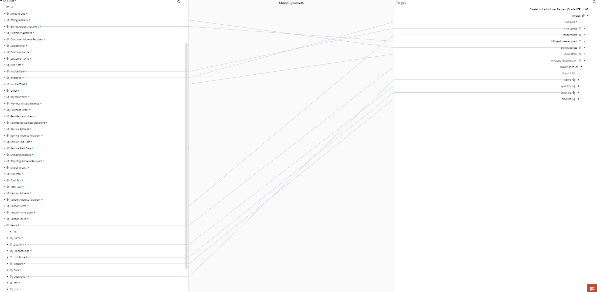
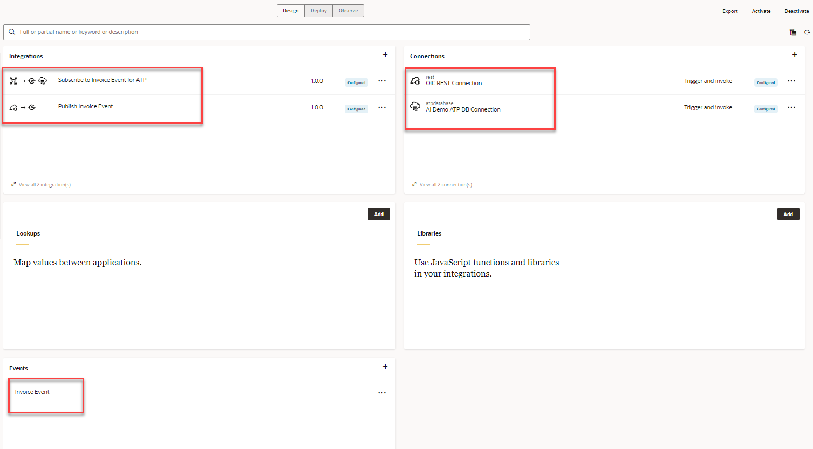
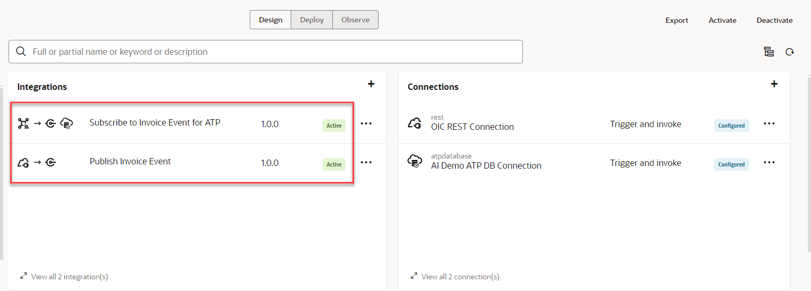
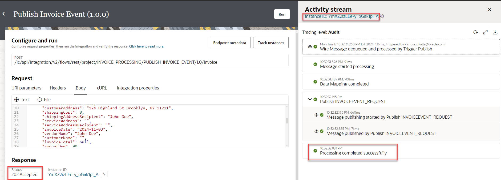

# Create Integration Flow

## Introduction

This lab walks you through the steps to create an integration flow which Publishes a Invoice Details message to OIC Event System. You will also create a Subscriber integration to receive the Invoice message and save it to a Database Table.


Estimated Time: 60 minutes

### Objectives

In this lab, you will learn to design a publish/subscribe integration pattern

* Create an Event Payload Structure
* Create a Publisher Integration
* Create a Subscriber Integration

### Prerequisites

This lab assumes you have:

* All Pre-requisite setup is done and the previous tasks completed successfully.

##  Task 1: Define Invoice Event Structure

1.  In OIC Console, Navigate to **Projects**, and Select the **Invoice Processing** project created previously.

2.  Select *Add* from the **Events** tile.

3.  The **Define new event** dialog is displayed. Provide a new **Invoice Event** and click on *Continue*

4.  In the **Define event structure** page copy and paste the below JSON Sample and click *Create*

    ```
    <copy>
      {
        "invoice" : {
          "document" : {
            "documentId" : "a1d7d123-05cb-4251-83d6-8125a18f498d",
            "documentName" : "invoice_with_customer_name.pdf"
          },
          "fields": {
            "amountDue": 90.00,
            "billingAddress": "",
            "billingAddressRecipient": "",
            "customerAddress": "124 Highland St Brooklyn, NY 11211",
            "customerAddressRecipient": "John Doe",
            "customerId": "",
            "customerName": "",
            "customerTaxId": "",
            "dueDate": "2024-11-03",
            "invoiceDate": "2024-11-03",
            "invoiceId": "101",
            "invoiceTotal": 90.00,
            "other": "",
            "paymentTerm": "Due on receipt",
            "previousUnpaidBalance": null,
            "purchaseOrder": "3746748",
            "remittanceAddress": "",
            "remittanceAddressRecipient": "",
            "serviceAddress": "",
            "serviceAddressRecipient": "",
            "serviceEndDate": "2024-11-03",
            "serviceStartDate": "2024-11-03",
            "shippingAddress": "124 Highland St Brooklyn, NY 11211",
            "shippingAddressRecipient": "John Doe",
            "shippingCost": 8.00,
            "subTotal": 80.00,
            "totalTax": 2.00,
            "totalVAT": 2.00,
            "vendorAddress": "657 Clifford Street Allentown, PA",
            "vendorAddressRecipient": "",
            "vendorName": "John Doe",
            "vendorNameLogo": "",
            "vendorTaxId": "12345",
            "items": [
              {
                "name": "Cable 23x44",
                "quantity": 2.00,
                "productCode": "Cable 23x44",
                "unitPrice": 10.00,
                "amount": 20.00,
                "date": "2024-11-03",
                "description": "",
                "tax": 0.00,
                "unit": "",
                "vAT": null
              },
              {
                "name": "Wire",
                "quantity": 3.00,
                "productCode": "Wire",
                "unitPrice": 20.00,
                "amount": 60.00,
                "date": "2024-11-03",
                "description": "",
                "tax": 0.00,
                "unit": "",
                "vAT": null
              }
            ]
          }
        }
      }
    </copy>
    ```


A new **Invoice Event** structure is created.

##  Task 2: Create a Publisher Integration

Let's create a Publisher integration flow which is exposed through a REST Endpoint.


1. Select the **Invoice Processing** project created previously if you are not already there.

2. Select *Add* from the **Integrations** tile. On the **Add Integration** page, click *Create*

3. Select **Application** as the style to use. The **Create Integration** dialog is displayed.

    Enter the Name of the integration as **Publish Invoice Event** and click on *Create*

4. Change Layout to **Horizontal**

***Define REST trigger***

Add **OIC REST Connection** trigger to the empty integration canvas.

1.  In the Designer canvas hover over the *Start* and Click the *+* sign in the integration canvas.

2.  Select the *OIC REST Connection* which you have created in the previous labs. This invokes the REST Adapter Configuration Wizard.


3.  On the **Basic Info** page,
     - for the **What do you want to call your endpoint?** element, enter *Publish*
     - Click *Continue*.

4.   On the **View Resource Configuration** page,
     -  for the **What is the endpoint's relative resource URI?**, enter */invoice*
     -  for the **What action do you want to perform on the endpoint?**, Select *POST* operation
     -  Select check box *Configure a request payload for this endpoint*
     
     -  Click *Continue*

 5.  On the  **Configure Request** page,
     -  Select the request payload format as **JSON Sample**
     -  Select &lt;&lt;&lt;Inline&gt;&gt;&gt; link and copy paste the below JSON Sample

     ```
     <copy>
     {
        "INVOICE" : {
          "document" : {
            "documentId" : "a1d7d123-05cb-4251-83d6-8125a18f498d",
            "documentName" : "invoice_with_customer_name.pdf"
          },
          "fields": {
            "amountDue": 90.00,
            "billingAddress": "",
            "billingAddressRecipient": "",
            "customerAddress": "124 Highland St Brooklyn, NY 11211",
            "customerAddressRecipient": "John Doe",
            "customerId": "",
            "customerName": "",
            "customerTaxId": "",
            "dueDate": "2024-11-03",
            "invoiceDate": "2024-11-03",
            "invoiceId": "101",
            "invoiceTotal": 90.00,
            "other": "",
            "paymentTerm": "Due on receipt",
            "previousUnpaidBalance": null,
            "purchaseOrder": "3746748",
            "remittanceAddress": "",
            "remittanceAddressRecipient": "",
            "serviceAddress": "",
            "serviceAddressRecipient": "",
            "serviceEndDate": "2024-11-03",
            "serviceStartDate": "2024-11-03",
            "shippingAddress": "124 Highland St Brooklyn, NY 11211",
            "shippingAddressRecipient": "John Doe",
            "shippingCost": 8.00,
            "subTotal": 80.00,
            "totalTax": 2.00,
            "totalVAT": 2.00,
            "vendorAddress": "657 Clifford Street Allentown, PA",
            "vendorAddressRecipient": "",
            "vendorName": "John Doe",
            "vendorNameLogo": "",
            "vendorTaxId": "12345",
            "items": [
              {
                "name": "Cable 23x44",
                "quantity": 2.00,
                "productCode": "Cable 23x44",
                "unitPrice": 10.00,
                "amount": 20.00,
                "date": "2024-11-03",
                "description": "",
                "tax": 0.00,
                "unit": "",
                "vAT": null
              },
              {
                "name": "Wire",
                "quantity": 3.00,
                "productCode": "Wire",
                "unitPrice": 20.00,
                "amount": 60.00,
                "date": "2024-11-03",
                "description": "",
                "tax": 0.00,
                "unit": "",
                "vAT": null
              }
            ]
          }
        }
      }
     </copy>
     ```
     -  Click *Continue* and **Finish** the wizard.

     -  Save your Integration

***Add Publish Action***

Add Publish action and configure the event created. The action publishes the Invoice Details message as per the shape of the event payload provided.

1.  Click on the *+* icon next to the **Publish** activity. Search for *Publish event* action
    

2.  In the **Choose event** page, Select *Invoice Event* and click on *Choose*

3.  In the **Review Publish** page, Edit the Event Name as **InvoiceEvent** and *Finish* the wizard. Save the Integration.

4.  **Edit** the Map Activity **INVOICEEVENT**.

5.  In the Mapper canvas, expand the **Publish Request &gt; Request Wrapper  &gt; INVOICE &gt; Fields** element on Source side. Also, expand the **INVOICEEVENT Request&gt;Request Wrapper &gt; Invoice &gt; Fields** on the target side. Source and Target elements looks pretty much the same. You may do one to one mapping. See the below screenshots for Reference




6.  **Validate** the mapping and Navigate back to the Integration flow

7.  **Save** your integration flow.
The Final Integration should look like below


***Define Business Identifiers & Activate the Publisher Integration***

1. Manage business identifiers that enable you to track fields in messages during runtime.

2. Click on the *(I) Business Identifiers* menu on the top right.
   

3. From the **Source** section, expand *execute* &gt; *request-wrapper &gt; invoice &gt; fields*. Drag the *InvoiceID* and *Vendor Name*  fields to the right side section

4. Click on the *(I) Business Identifiers* menu on the top right and Click *Save* and Click on *&lt;* *(Go back)* button.

##  Task 3: Create a Subscriber Integration and Save Invoice to DB

Let's create a Subscribe integration flow which will save invoice details to DB. Since, the Publish/Subscribe flows are decoupled you can create any number of Subscribe Integration flows to push the data to downstream systems seamlessly.


Navigate to the **Invoice Processing** project created previously if you are not already there.

1. Select *Add* from the **Integrations** tile. On the **Add Integration** page, click *Create*

2.  In the **Create integration**page select the design pattern *Event* and provide name *Subscribe to Invoice Event for ATP*. Click on *Create*

3.  In the integration canvas **Choose Event** page select the publisher Event **Invoice Event** and select *Choose* and *Finish*. Save your integration. Edit the name of Subscribe Action to **InvoiceEvent** for easy understanding.



***Add DB Action to Save Invoice Details***

Invoke Insert operation to Save Invoice details

Hover cursor next to **Subscribe to event** activity and Click on *+* sign. From the list of **Invoke** connections choose *AI Demo ATP DB Connection*
- In the **Basic Info** page, configure the operation per below and click *Continue*
| **Field Name** | **Value** |
|----------------|-----------|
| What do you want to call your endpoint? | CreateInvoiceAndLines |
| What operation do you want to perform | Select **Perform an Operation on a Table** |
| What operation do you want to perform on Table? | Insert |
{: title="ATP Adapter Wizard Basic Info Properties"}

- In the **Configure Operation On Table** page, select the database tables as per below

| **Field Name** | **Value** |
|----------------|-----------|
| Schema | ADMIN |
| Table Type | Select **TABLE** and click on *Search* |
| Selected Pane | From the Available Pane Select **INVOICE** and **INVOICE_LINES** TABLE and shuttle to the **Selected** pane |
{: title="Configure Operation on Table Page Properties"}



Click on *Continue*. Finally, *Finish* the wizard. An Invoke action and Map activity is added in the Integration flow.

***Edit Map Activity - CreateInvoiceAndLines***

1.  Edit the Map Activity **CreateInvoiceAndLines**

2.  Perform the mapping as per below. On the Source side Expand **InvoiceEvent Request &gt; Request Wrapper &gt; Invoice &gt; Fields**. On the Target side Expand **CreateInvoiceAndLinea Request &gt; Invoice**.

Perform one to one Map of the following fields per the table below
| **Source** | **Target** |
|----------------|-----------|
| Billing Address | billingaddress |
| Billing Address Recipient | billingaddressrecipient |
| Invoice Date | invoicedate |
| Invoice Id | invoiceid |
| Invoice Total | invoicetotal |
| Vendor Name | vendorname |
| Items | InvoiceLinesCollection > InvoiceLines |
| Items > Quantity | InvoiceLinesCollection > InvoiceLines > quantity |
| Items > Unit Price | InvoiceLinesCollection > InvoiceLines > unitprice |
| Items > Amount | InvoiceLinesCollection > InvoiceLines > amount |
| Items > Description | InvoiceLinesCollection > InvoiceLines > name |
{: title="Configure Invoice and Lines Mapping"}



Click on *Validate* and Navigate back to the Integration Flow canvas. Save the Integration Flow.

Your final Subscribe Flow should like below.


***Define Business Identifiers & Activate the Subscribe Integration***

1. Manage business identifiers that enable you to track fields in messages during runtime.

2. Click on the *(I) Business Identifiers* menu on the top right.
   

3. From the **Source** section, expand *execute* &gt; *request-wrapper &gt; invoice &gt; fields*. Drag the *InvoiceID* and *Vendor Name*  fields to the right side section

4. Click on the *(I) Business Identifiers* menu on the top right and Click *Save* and Click on *&lt;* *(Go back)* button.

##  Task 4: Create Project Deployment

Here is our **Invoice Processing** Project Design View.



1.  Select *Deploy* tab.

2.  Click on *Create*. In the **Create Deployment** page provide a name for the deployment.

3.  Choose both the Publish and Subscribe Integration Flows and Click on *Save*.

4.  Navigate back to the **Deploy** page.

5.  Select the *Design* tab, Click on *Activate* action at the top right.

6.  In the **Activate project** page, Select the deployment create and Tracing level as *Audit*. Click on *Activate*

7.  Observe that both Integration are now in *Active* status.




##  Task 5: Test the Publisher & Subscriber Integration Flow
We will Unit Test the publisher & subscriber integration flow, before we consume the integration from the Process Workflow.

Prerequisites: Make sure both the Publisher and Subscribe Integration flows are **Active**

1.  In the Project **Design** view page, Click on *...* next to **Publish Invoice to Event Service** Integration flow.

2.  From the Actions select *Run*, which will bring up the **Configure and run** page

3.  In the **Request** section select *Body* tab, and click on *Run* at the top right.


4.  In the **Response** section, verify if the Status is **202 Accepted**

5.  Explore the Activity Stream on the right hand side, make sure the **Processing completed successfully**



6.  Navigate Back to **Design** view. Select **Observe &gt; Instances** tab. Observe that both integrations Completed Successfully.


7.  Navigate **OCI Console &gt; Oracle Database &gt; Autonomous Transaction Processing**. Select the database which you provisioned. Click *Database actions* and Select *SQL*. Query the tables and confirm that records got inserted in **Invoice** and **Invoice\_Lines** tables. You may delete the records after confirming.

You may now **proceed to the next lab**.

## Learn More

* [Oracle Integration](https://docs.oracle.com/en/cloud/paas/application-integration/)
* [Oracle ATP Adapter](https://docs.oracle.com/en/cloud/paas/application-integration/atp-adapter/oracle-autonomous-transaction-processing-adapter-capabilities.html)
* [Publishing and Subscribing to Events](https://docs.oracle.com/en/cloud/paas/application-integration/integrations-user/create-integrations-publish-and-subscribe-events.html)

## Acknowledgements

* **Author** - Kishore Katta, Oracle Integration Product Management
* **Last Updated By/Date** - Kishore Katta, June 2024
