# Create Process Application

## Introduction

In this lab, we will guide you through every step of crafting this intelligent workflow using Oracle Process Automation. You will learn how to design, configure, and implement a process workflow. The process workflow begins when a User uploads an Invoice PDF document via an interface, a web form hosted through OCI Process Automation. Once the invoice is uploaded, it triggers the "Attach Invoice" step within the Process Automation workflow.

The uploaded invoice PDF is then sent to the OCI AI service called Document Understanding. This AI service leverages machine learning models to accurately extract key information from the invoice, such as the invoice number, date, total amount, line item details, and vendor information etc.

After the data extraction, the workflow moves to the "Validate" step, where the extracted invoice data is validated to ensure it is complete and accurate. If any issues are found during validation, the invoice can be "Rejected", and the User or a designated group can be "Notified" accordingly.

However, if the validation is successful, the workflow proceeds to "Approve" the invoice. The approved invoice data is then processed through the "Save Invoice" step, which triggers an OIC Integration flow.

Estimated Time: 45 minutes

### Background

**Essential Elements of Oracle Process Applications**

Before diving into the tutorial's core content, it's crucial to grasp the fundamental parts that make up Oracle Process Applications. These elements collaborate to construct robust applications tailored to specific business requirements. Here's a quick overview of each component:

1. **Processes:** Processes are the organized steps that guide your application towards specific outcomes. These steps, defined using Business Process Model and Notation (BPMN), outline the flow and behavior of your application. Think of them as the logical sequence of tasks, decisions, and interactions needed to achieve your business goals.

2. **Web Forms:** Web Forms are the user interfaces of your application presented in Oracle Workspace. They capture user input and streamline interactions. You can create these forms from scratch or derive them from existing data structures, providing an intuitive way for users to input information.

3. **Business Types:** Business Types model real-world concepts, like customers, orders, or products. They structure your application's data and ensure it aligns with your business processes. Business Types enable consistent data capture and management.

4. **Decisions:** Decisions add intelligence to your application. They contain rules and decision tables that automate choices based on input and output data. These rules allow you to define logic, making your application's behavior smart and efficient.

5. **Connectors:** Connectors are the communication links between your application and external REST services. They enable your processes to exchange data seamlessly with external systems, expanding your application's reach and capabilities.

### Objectives

In this hands-on workshop, you'll master the following skills:

Based on the diagram and description provided, this lab will primarily focus on the following features of OCI Process Automation:

-	Triggering workflows based on user actions

-	Integrating with OCI AI Services using Out of the box **AI Document Understanding** Form Control

-	Data validation and conditional branching

-	User notifications and interactions

-	Approvals and human tasks

-	Activating and Testing Process Application

- Discover and Consume OIC Integration Flow

-	Process Analytics

### Prerequisites

-	Make sure your Publish and Subscribe Integration Flow is Activated before you proceed further.

Navigate to the Process Designer from **OIC Console &gt; Process**

## Task 1: Create a Process Application in Designer

A process application is a container for key components: processes, forms, connectors, and roles.

1.	Click *Create*. The **Create Application** side pane opens.

2.	In the Title field, enter *Invoice Processing*. The title can have spaces
		and special characters.
> **Note:** By default the Identifier Name field gets auto-populated with the title you enter.

3.	Enter a meaningful description such as **This application processes Invoices by integrating with OCI Document Understanding Service** in the **Description** field.

4.	Leave the Version Tag field as 1.0.
		It will help you identify the application version when you activate it.
		

5.	Click *Create*.
		A message indicates that it’s being created, and then shows a link.

6.	Click the *Open now* link in the message.

If the link disappeared, select the My Applications tab to filter the list to show only those you created. Click the Search icon and enter the first few characters of the application’s name (travel). Once you locate the application, select it to open it.

## Task 2: Explore Components Tab and Navigation

Opening a process application displays its components page. Components are design elements of your application, and they’re listed as tabs near the top of the components page.

1.	From the **Components** tabs, click *UIs*.
    

Notice that a 0 appears for each component, since you haven’t created any yet.

For example, when you click *UIs*, the UIs page appears, offering you two ways to create a form or select a linked UI. Forms and linked UIs will be listed on this page after you create them.

2.	Click the *Process Applications* breadcrumb at the top.

You return to the Process Applications page. As you design components in your application, the breadcrumbs at the top get updated. You can easily navigate between components using the breadcrumbs.

3.	Open your process application again.

## Task 3: Create Roles

In Process Automation, you define roles to grant users or groups access to activated applications and specify what they can do.

-	Permissions provide increasingly greater access to an application’s resources: Inspect, Read, Use, and Administer.
-	A role can be either local (to the application) or global (can be used in multiple applications). Note that permissions are specific to an application.
-	You don’t need to assign permissions to users who are assigned tasks. They inherit permissions from the task itself.

In this example, we’ll create one role:
- *Process User* - who starts the process and also approves and is assigned the manage permission
In a real world scenario user who initiates will be different than manager who approves the task. To make it easy for the lab we will be creating human intervention activities as well in the same lane.

Let’s create a role.

1.	From the top of the page, click *Add.*

2.	In the **Add component pane**, expand *Roles*, and click *New*.

3.	In the **Title** field, enter *Process User*, and click *Create*, leave the Scope as **Application**
		Notice how the role is now listed on the page and the Roles tab shows.

4.	Click the *Open now* link or select the role from the Roles page to open it.

5.	Let’s assign a user and review permissions for the role. In the **Search by** fields:

	-	Leave **Users** selected in the drop-down field.
	-	In the Search **Search** icon field, enter the first few characters of the user name you signed in with.
	-	Select the user. The user gets listed on the page.

6.	In the **Application Permission Level** options, select *Manage*.

This allows your user to start an application request in Workspace.

Now that we have created a role which does both - Initiator and Approver, let’s create a process where we implement the roles to specific user tasks.

## Task 4: Create a Connector to Publisher Integration

1.	From the top of the page, click *Add.*

2.	In the **Add component pane**, expand *Connectors*, and click *Integration*.

3. Select Integration Context as **Project**. From the list of projects, Choose *Invoice Processing* project . Select the *Publish Invoice Event* from the list and click on *Create*. If you don't see the integration listed, then please create the integration first and activate it and come back here.

## Task 5: Create a web form

- Use forms for human interaction to:
    - Define what users see when they initiate your process application
    - Define what approvers see when they receive requests that need their attention or action
- Process Automation allows you to create a simple form with the quick editor or create an advanced form
	with the web form editor. If needed, you can choose the quick editor and later switch to the web form editor

1.	Click *Add* at the top of the page.

2.	In the Add component pane, expand **UIs** and click *Web Form*.

3.	In the Title field, enter *Invoice*.

4.	Click *Create*, then click the *Open now* link.

- Notice the following:
    -	The palettes in the right pane. You have many more control types and options to choose from.
    -	The tabs in the left Properties pane. Notice how they change depending on what is selected in the main canvas.
    -	When the form is selected (click away from a control), Form and Presentation tabs appear.
    -	When a control is selected, General and Styling tabs for that control appear.

  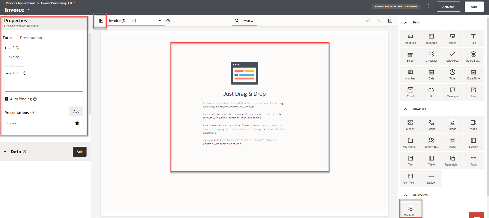

## Task 6: Design a web form

1.	Open the *Invoice* form if it is not opened.

2.	Choose an *Document Understanding* field from the right palette under **AI Services** category and Drag-and-Drop on to the designer.
		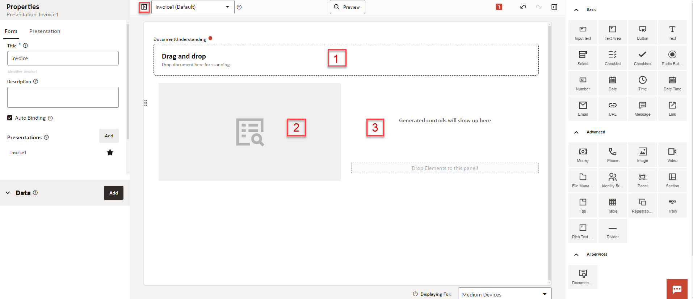

This control exposes pre-trained Key-Value extraction models provided by the OCI Document Understanding (ODU) service to perform text extraction on documents such as passports, driver's licenses, receipts, and invoices. By leveraging these pre-trained models, OPA customers can instantly use document extraction capabilities without needing prior knowledge of the ODU service or training their own custom models. This capability is native to our service, so process designers can use it without acquiring new SKUs or setting up service-level connections!

-	An area where users can upload their document.
-	An optional section which will show an image preview of the uploaded document.
-	An optional section which will hold the extracted data from the uploaded document.

3.	Click on Toggle Properties if you don't find the Properties Pane on the left side.

4.	Change the field name to **InvoiceUpload** and the label to **Invoice Upload** . See the automatic binding.
   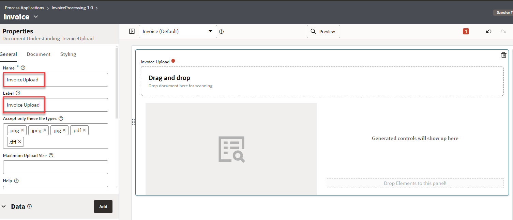

5.	The next thing we need is to configure the component. During the configuration, you will select the intended **Document Type**

	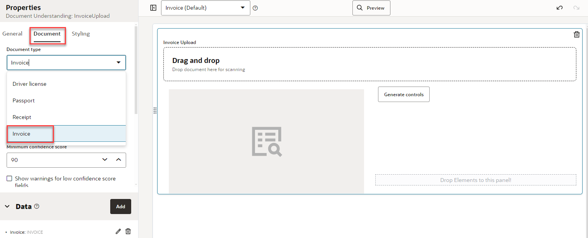

	Selecting a document type will create a dedicated data object that will hold the data returned by the ODU service. This data object will be based on the document type selected and contain related fields (e.g., A invoice extraction will include fields such as invoice number, date, total amount, line item details, and vendor information etc). This object is intentionally created to be easy to use and understand. It presents all data fields supported by the ODU service for each document type without any of the complexity of the service's native response

	

6.	To Verify the extracted text immediately after invoice upload we need to see extracted fields on the form. In the **Document** properties Click on *Generate controls*. This action will add the response data object to the form. When, invoice is uploaded controls will display the extracted data.

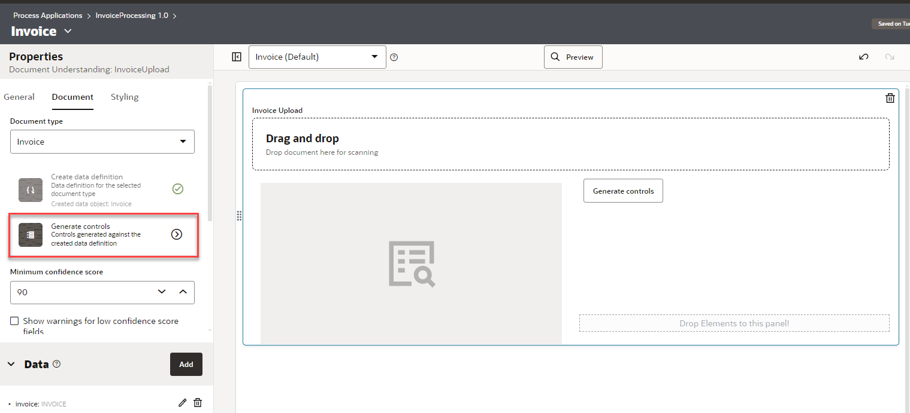

Observe that the form has Invoice Fields sections with several controls generated as per the data object. Optionally, you may re arrange the controls in a logical order.

In the **Document** Properties, Select **Hide fields with no data** and **Persist document reference in payload**

7.	Click on **Preview** to visualize your form. [Download](https://objectstorage.us-phoenix-1.oraclecloud.com/p/jSdZ5GBRN76nEp5Ru9yDkTTXNJm9J1iNAU739OUOvO-cwyFOEnyVBK8ZRhNsPJbd/n/oicpm/b/oiclivelabs/o/oic3/automate-invoice-processing/invoice%20processing%20artifacts.zip) sample invoices and save it to your desktop if you not done already.

Upload one of the invoices and verify the extracted data shown in web form.

## Task 7: Create Presentations to the forms
We can now have the same form appearing differently to a different role which is convenient when some particular users do not need to see the form in the same way as others. In our case, we will create a **ReviewInvoice** form presentation that will show fewer fields, and it will be used for Manager approval task.

1.	Navigate to **Invoice** form

2.	From the main form properties pane, scroll down to **Presentation** section and add a presentation by clicking on *Add*.

3.	In the **Select Presentation Type** select *Clone* and click on *Select*
	 

4.	Give it a name such as *ReviewInvoice* form and a description. Click *Create*
	 

5.	In the **ReviewInvoice** form Presentation, Select the **Document Understanding** control to view the properties.

6.	In the Properties window, select **Document** tab and make sure you Select the below properties.
	-	Hide fields with no data
	-	Hide document upload
	-	Persist document reference in payload

	

7.	Select the **Invoice fields** section. In the properties, select the **Read Only** property. We want the approver/reviewer to have a read only view.

	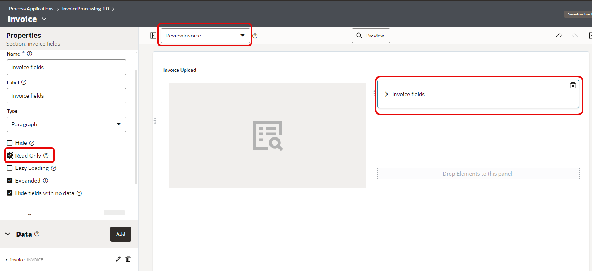

## Task 8: Create a Structured Process

We will design a process workflow to ingest invoice pdf document, analyze and display the result in a web form. A human intervention activity is orchestrated to review the extracted invoice data and accordingly approve or reject. A conditional branching is designed to save the invoice details by calling an integration flow.

1.	Click the **Invoice Processing 1.0** breadcrumb to go to your application’s main page.

2.	From the top of the page, click *Add*.

3.	In the Add component pane, expand **Processes**, and click *Structured*.
		

4.	Enter *Invoice Review Process* in the **Title** field.

5.	Click *Create*. A confirmation message shows that the process was created.

6.	Select the process to open it.

The structured process editor opens. **Start** and **end** elements are already positioned on the flow for you. There are two swimlanes and the BPMN elements palette is on the right side.

7. Select the *Start* element activity and rename it to **Upload Invoice**

   

8.	Select the *End event* activity and rename it to **Completed**

9.	Select the first swimlane containing the start and end element by clicking the bar on the left of the canvas. Click the *edit* icon to open the **Properties** pane. In the Properties pane, select *Process User* in the **Role** drop-down field.

   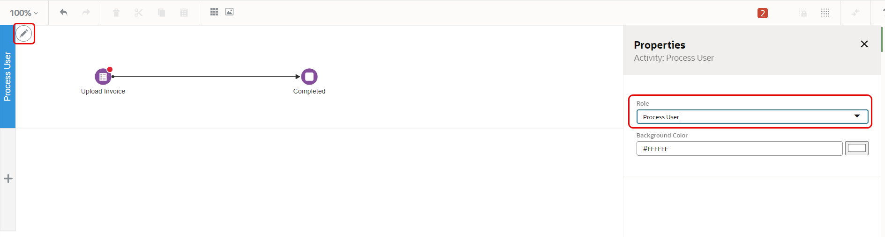
> **Note:**  Note that the swimlane’s name changes to *Process User*.

10.	In the BPMN elements palette, expand the **Human** category and drag an *Approve* task to the first swimlane. Adjust the process flow so that the **Approve** task is the second element in the flow. Rename it to *Verify Invoice Details*
		

11.	In the BPMN elements palette, expand the **Gateway** category and drag an *Exclusive* Gateway Activity to the first swimlane next to the **Verify Invoice Details**. Rename the **Gateway** activity to *Approved?*
		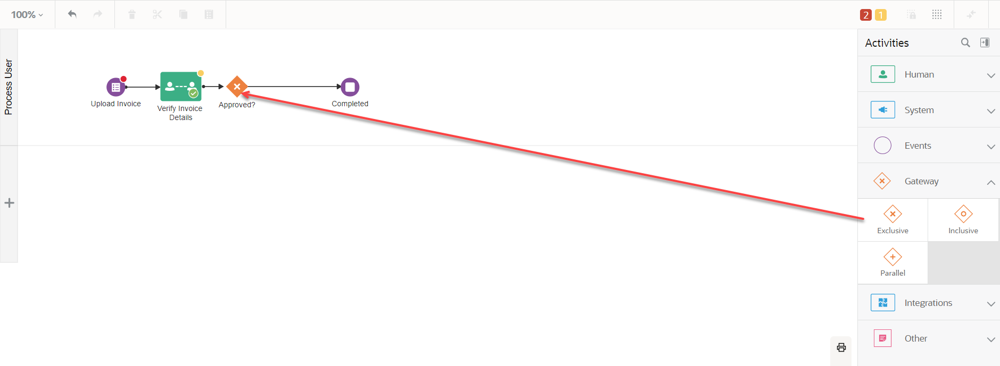

12.	In the BPMN elements palette, expand the **Integrations** category and drag a *Publish Invoice to Event Service* activity to the first swimlane after the **Approved?** activity. Rename it to *Save Invoice*.
		

13. In the BPMN elements palette, expand the **System** category and drag an *Notify* activity to the first swimlane and put it after *Approved?* task. Rename it as **Notify**

14.	Connect **Approved?** activity and **Notify** activity. Make sure your design looks like below.

15. Click on **Invoice Processing Application 1.0** to go back to the process application and again open the process and make sure your design is intact.

## Task 9: Implement the process

1. Navigate to **Invoice Review Process**

2. Select *Upload Invoice*. Click on the *Hamburger* icon and Select *Open Properties*

   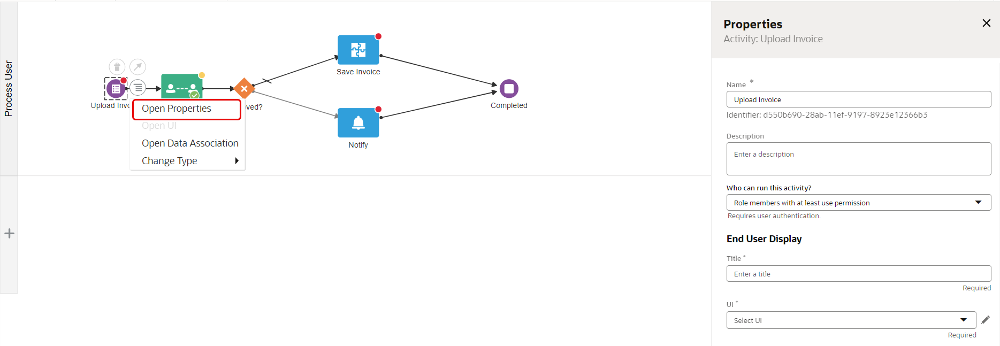

3. In the properties pane configure per below

| Property Name | Value |
| --- | --- |
| Assignee | Role members with at least use permission  |
| Title| Invoice Upload |
| UI | Invoice |
| Presentation | Default Presentation |
{: title="Upload Invoice Task Properties"}

4.	Open the properties of **Verify Invoice Details** task. Configure the Properties per below

| Property Name | Value |
| --- | --- |
| Policy | Any Single Assignee |
| Select Participants| Current Lane Participants |
| Title | Select **Expression** mode and construct the expression "Review Invoice Id: " + invoiceArgs.invoice.fields.invoiceId |
| UI | Invoice |
| Presentation |  ReviewInvoice |
| Bind to Process Data | Select the check box |
| Task Payload | Select **invoiceArgs** from the drop down|
| Task Outcome | Select **taskOutcomeDataObject** from the drop down |
| Action | APPROVE,REJECT |
| Priority | Normal |
{: title="Verify Invoice Details Task Properties"}

5.	Open the properties of **Save Invoice** task. Configure the Properties per below

| Property Name | Value |
| --- | --- |
| Connector Details &gt; Service | Publish Invoice Event |
| Resource | /invoice |
| Operation | POST |
{: title="Save Invoice Task Properties"}

6.	Open the properties of **Notify** task. Configure the Properties per below

| Property Name | Value |
| --- | --- |
| Send an email **To** | Select your user |
| Subject | Change the literal mode to **expression mode** and construct an expression as below \n "Invoice Id:" + invoiceArgs.invoice.fields.invoiceId + " Rejected"|
| Body | Please review the invoice and reupload. - ERP Backend Team |
{: title="Notify Task Properties"}

7.	Select the connector from **Approved?** to **Save Invoice**. In the properties pane Configure **Name** as *Yes* and mark as *Conditional Flow* , Define the condition **taskOutcomeDataObject=="APPROVE"**.
   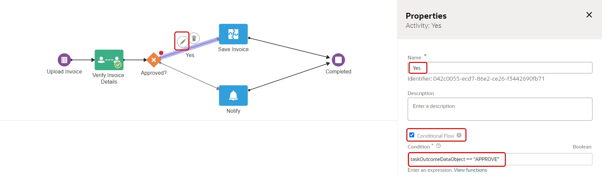

8.	Select the connector from **Approved?** to **Notify** which is not a conditional path. Name it as **No**
   

9. Click on **Invoice Processing 1.0** Application to go back to the process application and again open the process. Make sure your design and implementation is intact.

## Task 10: Configure Data Association

Data association refers to the flow of data within a process. Use the Data Association editor to define input and output for flow elements that need them.

A data association involves a source and a target, where the source provides a value or an expression to be assigned to the target. An approval human task, for example, needs both input and output data association.
On the input side, it needs data input into the activity (referred to as its payload).

On the output side, after the activity has just finished, it needs output from the activity to data objects, to store results for use elsewhere in the process.

1.	In the **Invoice Review Process** Select **Save Invoice** task , Click on *hamburger* icon and Select *Open Data Association*

  

The left pane displays source objects (Data Objects) in an expandable tree. The right pane displays the payload, or entry parameters the activity needs to perform its function

2. Expand **Input > invoiceArgs > invoice > fields** from the left pane and Expand **input > body > INVOICE > fields** from the right pane.

3. From the left pane, hold and drag **fields** and drop it in the input field titled **New Association**

4. From the right pane, hold and drag **fields** and drop it in the input field titled **New Association**

6. Click on *Apply* and again comeback to the mappings screen. This completes the mapping activity.

9.	In the process designer, make sure there are no validation errors. You should see a green check icon on top banner.

## Task 11: Activate a Version of the Application
Activating an application moves its metadata from design time (Designer) to runtime (Workspace), where it can be run in production capacity.

Before you activate, note the following about Snapshots and Versions:
-	When you activate, you specify the snapshot to use. A snapshot just refers to the application’s design-time metadata at a point in time. Save as many snapshots as you want so you can return to one if needed.
-	Create an application version as often as you want.

So far your implementation artifacts should be per below

1.	Click *Activate* on the top right corner.
		The Activate version pane appears. Notice that the version tag you specified at creation is shown (1.0).

2.	Leave the **Make it default** field selected.
		An application always has a default version. In Workspace, users can choose to see all versions or the default only.		

3.	Click *Activate*.
		You’re informed that a snapshot of the application is being taken, followed by a message that the application is activated.
		

4.	Click *Test in Workspace*.

## Task 12:	Test and Run the Application in Workspace

Use the Workspace environment to run, test, monitor, troubleshoot, or administer process applications. The options you see depend on your assigned role.

Before you begin, get familiar with the options in the Workspace navigation menu.
-	**Workspace**: Returns to the runtime home page.
-	**Start Requests**: Lists applications you have permission to start.
-	**Tasks**: Lists tasks assigned to you or a group you’re part of.
-	**Tracking**: Lists structured and dynamic processes you can track.
-	**Administration**: Lists tasks that users with administrative permissions can perform, such as managing roles, notifications, and credentials. Displays to users assigned an administrator role only.

###	Start an Application Instance
In this case, pretend you are an end user who wants to request for Travel. Each time the application is started, a process instance is created.

1. From the **Start Requests** page, select the *Invoice Processing* Application.
  	The card’s banner lists the application identifier, and its process and start event titles appear below.
  	

2. The *Invoice Upload Form* (default presentation) you created appears, Browse the invoice pdf with customer name from your desktop and Upload.
		

3. The form is populated with extracted invoice fields and also a preview of the invoice is shown on the left hand side.
		

4.	Click on *Submit*. A process Instance is created.

###	Complete an Assigned Task

Now put yourself in the role of an approver - in this case, an Approver who gets assigned a task when a **Process User** submits the *Invoice*.

1.	Choose *Workspace* from the options menu.
		The Workspace page lists tasks available to you and start requests below.

2.	Click the *Team Tasks* tab and Select the Task -> Review Invoice Details to Open it.
		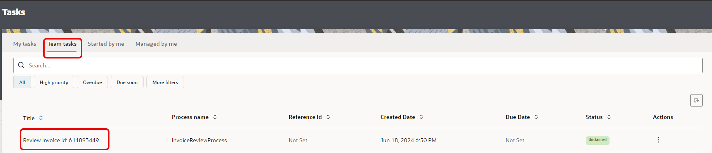

3.	Notice that the fields are read only for **Approvers View** and Presentation *Review Form* is rendered. Select *Comments* tab, enter a comment, and click Post.
		Click *APPROVE*.
		

A message confirms that the task was approved or rejected. The approval human task is complete.
You return to the My Tasks page. The task you just completed is no longer listed.

4.	Verify the database table. You should see Invoice Details and Invoice Lines inserted successfully.

5.	Re run the test again. Upload the invoice pdf which do not have a customer name. Verify the Rejected path. Run a few sample tests with the invoices provided as part of lab artifacts.

6.	Before you proceed to the next Task make sure you have testing the end to end flow with a few sample invoices and finally Approve/Reject.

## Task 13:	Use Process Analytics

In Process Automation, using Analytics you can get statistical data in the form of graphs, charts, and maps to monitor business processes. Starting from a summary view of analytics report for all your applications, you can drill down to get granular data for process instances and activities. This in turn helps you in understanding and getting insights into the performance of applications, processes, activities and also in identifying potential bottlenecks.

You can access Analytics from the Workspace

***Application Overview***

The application overview page summarizes your process instances by application (a container for process artifacts). Its purpose is to provide state and time-based indicators upon which you may want to drill down further. Here, you can see two main visualizations:

-	**Instance By statuses :** this can show you which applications see the highest volume of transactions, the most demand for new instances, or have encountered the most errors. You can sort or filter this visualization based on the available process statuses. The intention here is to provide a flexible way to identify process state trends or issues you may want to investigate further.

-	**Average Time :** of how the top applications in terms of time taken to complete. This graph can help you identify long-running processes that may need attention and allows you to drill in further to answer any time-based questions.

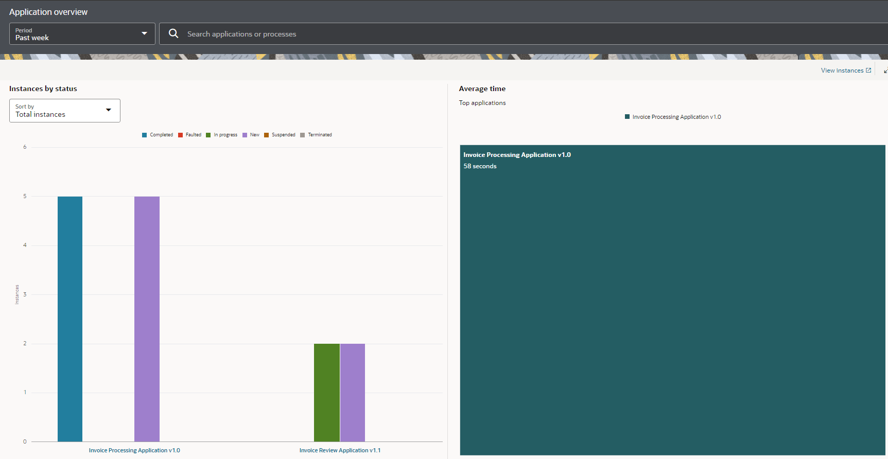

***View Analytics for an Application***

The process overview page presents a summary view of what is going on within a process application. Here, you can see the following visualizations:

-	**Status by process** can show you which processes in the selected application are seeing the most amount of demand, overall transactional volume, or errors. It is a level down from the application view on the previous page and shows you the distribution of the previously summarized application data by process.

-	**Total Instances** by process show you the total number of instances/transactions for each process in the selected application. The idea here is that you can see the demand for a particular process over time (based on your selected duration) to get insight into the behavior of a process.

-	**Average time to complete** represents the time taken for each process to complete over time (based on your selected duration). It allows you to identify which process is experiencing high wait times. It serves as a more detailed view of the application-level Average Time chart we saw on the Application Overview page.

Select the Process Application *Invoice Processing* Application

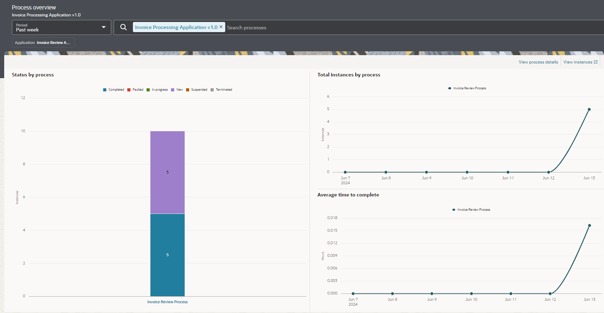

***View Analytics for a Process***

This process overview page presents a summary view of what is going on within one selected process. Here, you can see the following visualizations:

-	**Status over time** shows the distribution of process instances by state over time (based on the selected duration). The intent of this visualization is to show you the correlation between the number of instances that were in various stages. It allows you to answer questions related to process states, such as "Are all my processes failing?", "When is demand for my process high?" and "How many of my processes need manual intervention?"

-	**Instances by status** by default, it shows the distribution of process instances by state over the selected period. When a date is selected in the Status over time chart, however, the donut chart changes to show you a summary of process instances for the selected date. It serves as an easy way to answer questions such as "What is the status of this process today?" or "What was the status of this process on a particular date?"

-	**Average time to complete** represents the average time taken for the selected process to complete over time (based on your selected duration). It allows you to identify when the process is experiencing high wait times by showing a trend over the selected time range.

Select the Process *Invoice Review Process*

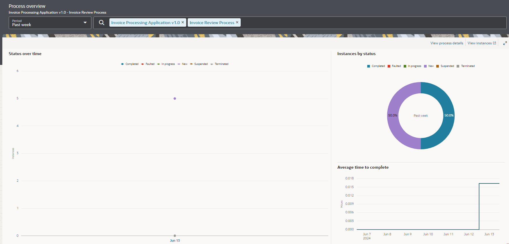

***View Analytics for Activities within a Process***

-	**Monitor the current state of process executions:**
	-	This allows you to see where in-flight instances are currently by presenting the activities that hold in-progress transactions. This is useful when users need to understanding the current state of a process.

-	**Understand the flow or paths that process instances take:**
	-	This lets you see the activities that have been executed, their relationships to other activities, and the frequencies of each traversed path. In other words, the process flow. This helps you see patterns that could cause inefficiencies, introduce bottlenecks or bypass compliance and organizational requirements.

-	**Understand the average time taken for activities to complete:**
	-	This allows you to see exactly which tasks contribute to the average duration time of a process and by how much. This information can be used to identify potential problems with actioning tasks assigned to human actors.

-	**Understand where errors occur and why:**
	-	You can now see where errors are occurring and how often. This view is a great indicator to prompt further drill-down to determine root cause.

Select **View Process Details**

Select **Verify Invoice Details** activity

So, this answers questions such as:

-	How many tasks are not on track, and who are they assigned?
-	How many tasks are assigned to a team queue but have not been claimed?
-	How many times are we requesting more information?
-	What is the workload breakdown by assignees? (who is/is not active)
-	What is the outcome people usually take on approval tasks?

**Conclusion: Automating Invoice Processing with Oracle Process Automation integrating with OCI Document Understanding**

**Congratulations** on successfully completing this comprehensive workshop on building an automated invoice processing solution using Oracle Cloud Infrastructure (OCI) services! You have acquired valuable skills and knowledge that will streamline your organization's financial operations and enhance overall efficiency.

Throughout this hands-on workshop, you learned how to:

1. Leverage OCI Process Automation to orchestrate end-to-end workflows, triggered by user actions such as uploading invoice PDFs.
2. Integrate with OCI AI services, like Document Understanding, to accurately extract key invoice data using advanced machine learning models.
3. Implement robust data validation processes to ensure the integrity and completeness of extracted invoice information.
4. Utilize OIC Integration to seamlessly save approved invoices to Object Storage and publish events to the OIC Event System.
5. Configure subscriber integration flows to listen for invoice events and persist the data in an ATP database for long-term storage and potential integration with other systems.
6. Enable user notifications and interactions within the workflow, keeping stakeholders informed about invoice statuses and facilitating approvals when needed.
7. Deploy and monitor a fully functional invoice automation pipeline on OCI, leveraging various services and their powerful capabilities.

By mastering these skills, you have empowered yourself and your organization to streamline invoice processing, reduce manual effort, minimize errors, and improve overall financial operations. The knowledge you have gained will enable you to optimize workflows, enhance data accuracy, and make data-driven decisions to drive business success.

Moreover, this workshop has provided you with a solid foundation in utilizing OCI services for process automation, AI, integration, and database management, opening doors to explore further use cases and solutions across different domains.

Congratulations once again on your achievement! You are now well-equipped to transform your organization's invoice processing and unlock new levels of efficiency and productivity.

## Learn More

* [Design Structured Processes](https://docs.oracle.com/en/cloud/paas/process-automation/user-process-automation/design-structured-processes.html)
* [Design Forms and User Interfaces](https://docs.oracle.com/en/cloud/paas/process-automation/user-process-automation/design-forms-and-user-interfaces.html)
* [Explore Workspace](https://docs.oracle.com/en/cloud/paas/process-automation/user-process-automation/explore-workspace.html)
*	[Work with Integrations](https://docs.oracle.com/en/cloud/paas/process-automation/user-process-automation/work-integrations.html#GUID-7DCA4E96-D577-4DE1-AB82-F074361DE9B4)
*	[Process Analytics](https://docs.oracle.com/en/cloud/paas/process-automation/user-process-automation/use-analytics.html)

## Acknowledgements
* **Author** - Kishore Katta, Oracle Integration Product Management
* **Last Updated By/Date** - Kishore Katta, June 2024
