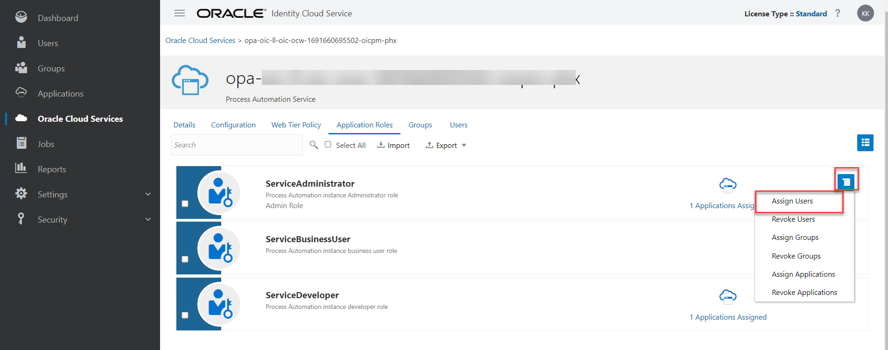

# Enable OCI Process Automation (OPA)

## About this Workshop

To use Process Automation with Oracle Integration, an administrator needs to enable it from an Oracle Integration service instance in the Oracle Cloud Infrastructure (OCI) Console. When enabled, a Process Automation instance gets automatically provisioned with the Oracle Integration instance. In such a case, the two services become associated with each other and gets listed in each others Associated services page in the Oracle Cloud Infrastructure Console.

Estimated Time: 15 minutes

### Objectives

In this workshop, you will learn how to:
* Enable Process Automation
* Access OPA service console

### Prerequisites

This lab assumes you have:

* All previous labs successfully completed

## Task 1: Enable OCI Process Automation

To enable a Process Automation instance with an Oracle Integration instance:

1.  On the Oracle Cloud console Get Started page, Click *Developer Services*. Under **Application Integration**, click *Integration*

2.  From the **Compartment** drop-down list, select the compartment in which you want to provision and enable a Process Automation instance with an Oracle Integration instance.

3.  Choose an existing Oracle Integration instance provisioned in the previous lab

4.  Click the *Enable* link for **Process Automation** on the Integration instance information tab

5.  When prompted, click *Enable* to confirm that you want to enable Process Automation. This may take 10-15 minutes to enable the OPA functionality. Once enablement is completed the status should show as **Active**.

## Task 2: Assign IDCS Application Roles to User
Complete this task only if your tenancy **Do Not** use **Identity Domains**

After an Oracle Cloud Infrastructure Process Automation instance has been created, assign Process Automation IDCS application roles to groups of users in Oracle Identity Cloud Service (IDCS) to allow them to work with the features of the Process Automation instance

1.  In the OCI Console, Open the navigation menu and click *Identity & Security*. Under **Identity**, click *Federation*

2.  On the Federation page, select the **OracleIdentityCloudService** link to view the default Oracle Identity Cloud Service identity federation.

3.  On the **Identity Provider Details** page, select the *Identity Provider Information* tab (if not selected already) and click the *Oracle Identity Cloud Service Console* link.

4.  Open the IDCS navigation menu, and click *Oracle Cloud Services*

5.  In the Oracle Cloud Services page, navigate to the Process Automation service instance for which you want to assign user roles. You can also search for the service instance by entering the prefix or string that begins the Process Automation service instance's display name

6.  Click the instance to open the instance details page.

7.  Click the *Application Roles* tab. The available IDCS application roles are displayed

8.  Select the **Service Administrator** Role. Click the action menu and then select *Assign Users*

9.  In the Assign User dialog, select user to which you want to assign the role and click *Assign*

10. Now that a Process Automation instance is enabled and provisioned with an Oracle Integration instance.

    From the navigation menu in the Oracle Integration home page, click the punch out URL for Process Automation. The Process Automation Designer opens in another browser tab and you can start designing your process applications.

    

## Task 3: Assign IDCS Application Roles to User in Identity Domain
Complete this task only if your tenancy use **Identity Domains**

After an Oracle Cloud Infrastructure Process Automation instance has been created, assign Process Automation IDCS application roles to groups of users to allow them to work with the features of the Process Automation instance.

1.  In the OCI Console, Open the navigation menu and click *Identity & Security*. Under **Identity**, click *Domains*

2.  If not already selected, select the Compartment in which the domain that contains the group to which you want to assign Process Automation roles resides.

3.  In the **Name** column, click the *Default* domain for the group to which you want to assign roles.
The domain Overview page is displayed.

4.  In the navigation pane, click *Oracle Cloud Services*.
The Oracle Cloud Services page is displayed.

5.  In the **Oracle Cloud Services** page, navigate to the Process Automation service instance for which you want to assign user roles.
You can also search for the service instance by entering the prefix or string that begins the Process Automation service instance's display name.

6.  Click the Process Automation service instance to open the instance details page.

7.  Under **Resources**, click **Application roles**.
The available IDCS application roles are displayed.

8.  In the Application roles list, locate the **Service Administrator** role that you want to assign to the user. At the far right, click Open **Details**

9.  Next to **Assigned Users**, click the *Manage* link.

10. On the Manage group assignments pane, click *Show available users*.

11. In the Available Users list, select the user to which to assign the role, and click *Assign*.

12. Now that a Process Automation instance is enabled and provisioned with an Oracle Integration instance.

    From the navigation menu in the Oracle Integration home page, click the punch out URL for Process Automation. The Process Automation Designer opens in another browser tab and you can start designing your process applications.

    

**Congratulations!** You have successfully enabled OPA in Oracle Integration and able to access the designer console.

You may now **proceed to the next lab**.

## Learn More

* [Enable OPA in Oracle Integration](https://docs.oracle.com/en/cloud/paas/process-automation/admin-process-automation/enable-process-automation-oracle-integration-3.html)
* [Assign IDCS Roles to Groups](https://docs.oracle.com/en/cloud/paas/process-automation/admin-process-automation/assign-idcs-application-roles-groups.html)
* [Assign IDCS application roles to groups in a Domain](https://docs.oracle.com/en/cloud/paas/process-automation/admin-process-automation/assign-idcs-application-roles-groups-identity-domain.html)

## Acknowledgements
* **Author** - Kishore Katta, Oracle Integration Product Management
* **Last Updated By/Date** - Kishore Katta, June 2024
