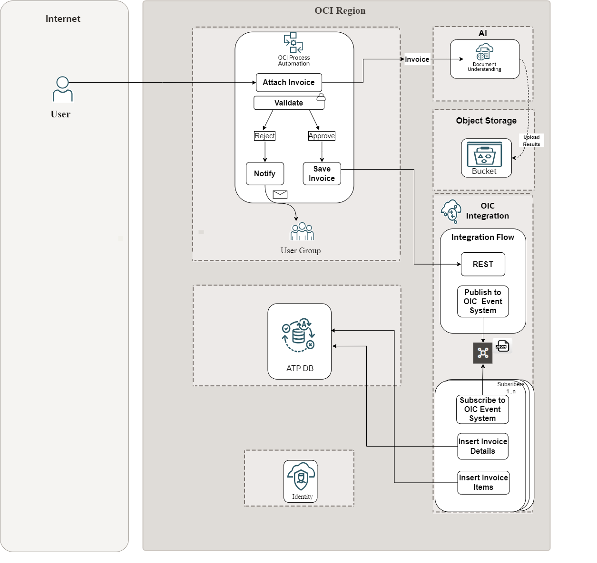

# Introduction

## About this Workshop

In this hands-on workshop, we will build an end-to-end automated invoice processing solution integrating with Oracle Cloud Infrastructure (OCI) AI services like Document Understanding (ODU).

The process begins when a user uploads an invoice PDF document, which triggers the OCI Process Automation (OPA) workflow. The invoice PDF is then sent to the OCI AI service Document Understanding, which uses advanced machine learning to accurately extract key data like the invoice number, date, total amount, line items, and vendor details.

Next, the extracted invoice data goes through a validation process to ensure completeness and integrity. Approved invoices move forward to trigger an OIC Integration flow that saves the invoice details to ATP Database. This integration flow also publishes the invoice event to the OIC Event System.

A subscriber integration flow listens for these invoice events and inserts the invoice header details and line items into an ATP database for storage and potential integration with other systems like accounting or ERP.

Throughout the process, users can be notified about rejected invoices or updates on approved ones through the OCI Process Automation workflow interactions.

By the end of this workshop, you will have practical experience building and deploying this full invoice automation orchestration using OPA, gaining valuable skills with AI services, process automation, integration, databases, and more. Let's get started!

Here is the high level architecture reference of the tutorial

Estimated Time: 2 hours 45 minutes

### Objectives

Here are the objectives of this workshop:

- Learn to build an end-to-end automated invoice processing solution using OCI services
- Understand how to use OCI Process Automation to trigger workflows based on user actions
- Gain experience with OCI AI Document Understanding for extracting key data from invoice PDFs
- Implement invoice data validation to ensure data integrity and completeness
- Utilize OIC Integration to save approved invoices to Object Storage and publish events
- Configure a subscriber integration flow to store invoice details in an ATP database
- Explore user notifications for rejected and approved invoices through the workflow
- Build a fully functional invoice automation solution

Acquire hands-on skills with various OCI services, including AI, process automation, integration, and databases

### Prerequisites

This lab assumes you have the following:
* Oracle Cloud Account with credits to provision services.

You may now **proceed to the next lab**.

## Learn More

* [Oracle Integration 3 Documentation](https://docs.oracle.com/en/cloud/paas/application-integration/index.html)
* [Oracle Integration 3 Blogs](https://blogs.oracle.com/integration/)
* [Process Automation](https://docs.oracle.com/en/cloud/paas/process-automation/index.html)
* [OCI Document Understanding](https://www.oracle.com/in/artificial-intelligence/document-understanding/)

## Acknowledgements
* **Author** - Kishore Katta, Oracle Integration Product Management
* **Contributors** - Harris Qureshi (App Integration Specialist), Stanislav Tanev (OPA Product Management)
* **Last Updated By/Date** - Kishore Katta, June 2024
