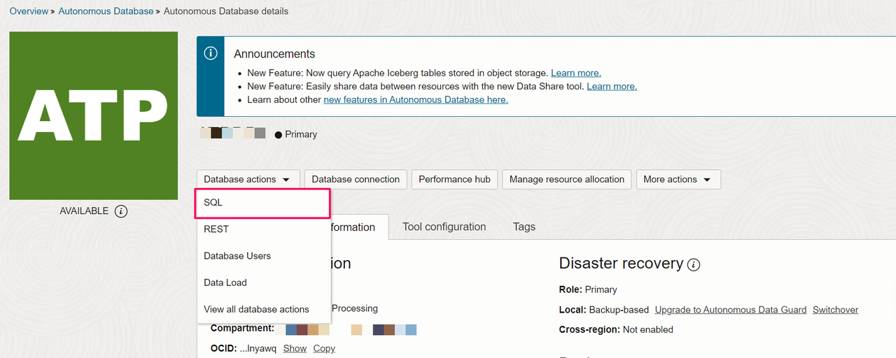
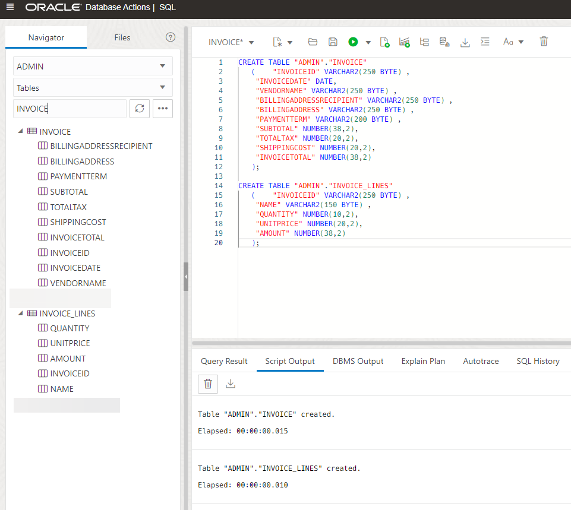
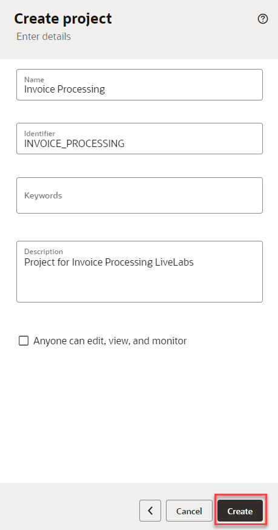
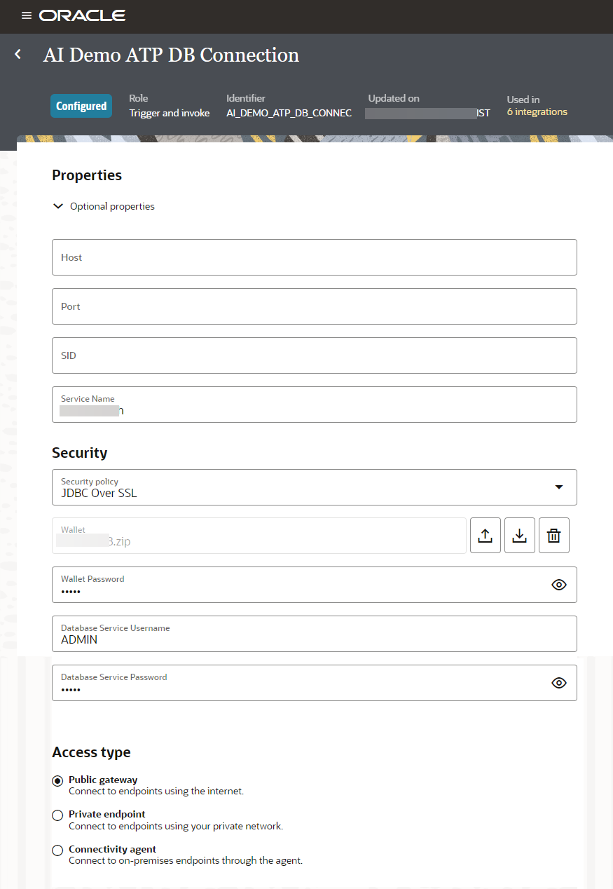

# Setup DB Objects and Connections

## Introduction

This lab walks you through the setup required to complete the workshop. You will be creating database tables to save the invoice details and items. Using the database information you will create an ATP connection in OIC.

Estimated Time: 20 minutes

### Objectives
In this lab, you will:
- Create Database Table using a SQL script
- Create OIC Connections


### Prerequisites
This lab assumes you have:
- Completed all the previous labs.


## Task 1: Create a database objects using an SQL script
Follow these steps to create a Database objects which will be used as part of this workshop.

1. From you ATP Database Details page, click the **Database Actions** button and Select **SQL**.

    

2. The SQL Worksheet appears. Select **ADMIN** schema. Before you proceed with the SQL Worksheet, copy below code snippet:
    ```
    <copy>
          --------------------------------------------------------
          --  DDL for Table INVOICE
          --------------------------------------------------------
          CREATE TABLE ADMIN.INVOICE
          (
           INVOICEID               VARCHAR2 (50) PRIMARY KEY,
           INVOICEDATE             DATE ,
           VENDORNAME              VARCHAR2 (250) ,
           BILLINGADDRESSRECIPIENT VARCHAR2 (250) ,
           BILLINGADDRESS          VARCHAR2 (250) ,
           INVOICETOTAL            NUMBER (38,2)
          );
          --------------------------------------------------------
          --  DDL for Table INVOICE_LINES
          --------------------------------------------------------
          CREATE TABLE ADMIN.INVOICE_LINES
          (
           LINEID NUMBER PRIMARY KEY,
           INVOICEID VARCHAR2 (50),
           NAME      VARCHAR2 (150) ,
           QUANTITY  NUMBER (10,2) ,
           UNITPRICE NUMBER (20,2) ,
           AMOUNT    NUMBER (38,2),
           FOREIGN KEY (INVOICEID) REFERENCES ADMIN.INVOICE(INVOICEID)
          );
          --------------------------------------------------------
          -- Create a sequence for auto-incrementing lineId
          --------------------------------------------------------
          CREATE SEQUENCE INVOICE_LINES_SEQ
          START WITH 1
          INCREMENT BY 50
          NOCACHE;
          --------------------------------------------------------
          -- Create a trigger to use the sequence for auto-incrementing lineId
          --------------------------------------------------------
          CREATE OR REPLACE TRIGGER INVOICE_LINES_BEFORE_INSERT
          BEFORE INSERT ON ADMIN.INVOICE_LINES
          FOR EACH ROW
          BEGIN
              SELECT ADMIN.INVOICE_LINES_SEQ.NEXTVAL INTO :NEW.lineId FROM dual;
          END;
    </copy>
    ```

6. Paste the script in the SQL Worksheet, then click **Run Script** button.

    This will create 2 tables as below. The table is created successfully when you see the notification in the *Script Output* window.

    

## Task 2: Create Invoice Processing Project
Create a Project which provides a single unified workspace for all stakeholders to design, manage, and monitor integrations. Additionally, projects provide robust life-cycle management.

1. In the left Navigation pane of OIC, Click *Projects* and Click *Add*, then *Create*

2. In the **Create Project** dialog, enter the following information and click on *Create*:

| **Field**        | **Value**          |       
| --- | ----------- |
| Name         | Invoice Processing     |
| Identifier         | Generated automatically       |
| Description  | Project for Invoice Processing LiveLabs |
{: title="Create Project"}



## Task 3: Create Database Connection

1. In the **Project** page, select *Add* from the **Connections** tile.

2.  From the List of Adapters, search for **ORACLE ATP** and Select *Oracle ATP* adapter.

3. In the **Create Connection** page provide below and click *Create*

| **Field**        | **Value**          |       
| --- | ----------- |
| Name         | AI Demo ATP DB Connection     |
| Identifier         | Generated automatically       |
| Role         | Trigger and Invoke    |
| Description  | Save Invoice Details |
{: title="Create DB Connection"}

4.  In the Connection Configuration page, Expand the **Optional Properties**, Provide the value of **database tns name** captured earlier as **service name** ex: aidemodb\_low.

5.  Provide the following values in **Security** Section

| Name           | Value                                           |
| ----------------- | ----------------------------------------------------- |
| Security Policy              | JDBC Over SSL                                   
| Wallet        | Wallet zip file Downloaded and saved earlier |
| Wallet Password       | Password configured earlier                                 |
| Database Service Name | ADMIN |
| Database Service Password  | Database password configured during provisioning |
| Access Type     | Public Gateway |
{: title="ATP Adapter Connection Properties"}



5.   **Test** and **Save** the connection.

## Task 4: Create REST connection

Create a connection using REST Adapter to Interface Processor Child Integration.

1. In the **Project** page created previously, select *Add* from the **Connections** tile.

2.  From the List of Adapters, search for **REST** and Select *REST* adapter.

3. In the **Create Connection** page provide below and click *Create*

    | **Field**        | **Value**          |       
    | --- | ----------- |
    | Name         | OIC REST Connection     |
    | Role         | Trigger       |
    | Description  | Publisher REST Interface Connection |
    {: title="Rest Interface Connection"}

    Keep all other values as default.

4. In the *Configuration* page, enter the following information:

    | **Field**  | **Values** |
    |---|---|
    |Security Policy | OAuth 2.0 Or Basic Authentication |
    {: title="Rest Interface Connection Properties"}

We will use this connection to expose a REST interface for the Publish Integration Flow. (Refer the architecture diagram in the Introduction Section)

5. Click on *Test*  and wait until you receive a confirmation box that the test was successful.

6. Click *Save* and wait for the confirmation box. Exit the connection canvas by clicking the back button on the top left side of the screen.

## Task 5: Download Lab artifacts

1. [Download](https://objectstorage.us-phoenix-1.oraclecloud.com/p/jSdZ5GBRN76nEp5Ru9yDkTTXNJm9J1iNAU739OUOvO-cwyFOEnyVBK8ZRhNsPJbd/n/oicpm/b/oiclivelabs/o/oic3/automate-invoice-processing/invoice%20processing%20artifacts.zip) the lab artifacts and unzip in your local drive.

You may now **proceed to the next lab**.

## Acknowledgements
* **Author** - Kishore Katta, Oracle Integration Product Management
* **Last Updated By/Date** - Kishore Katta, June 2024
