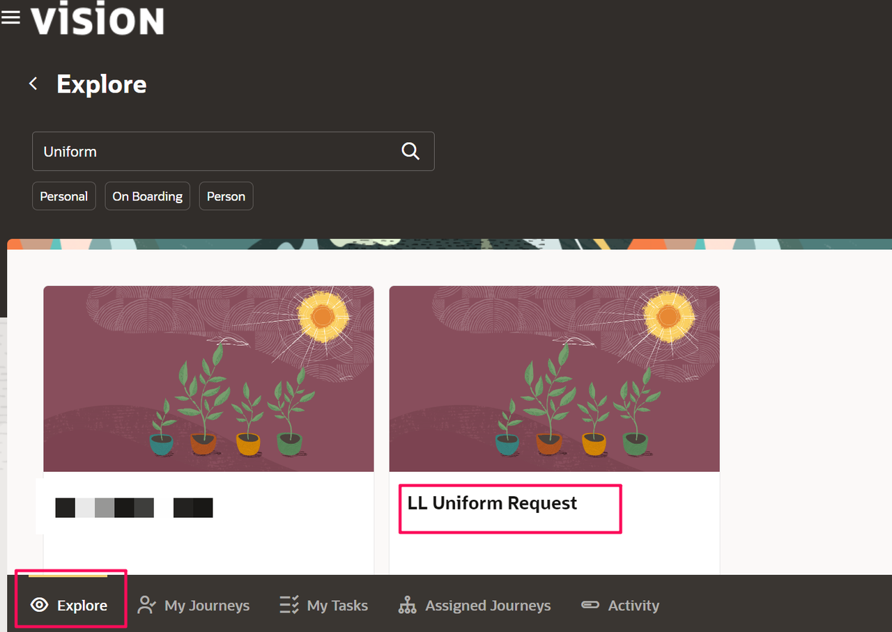
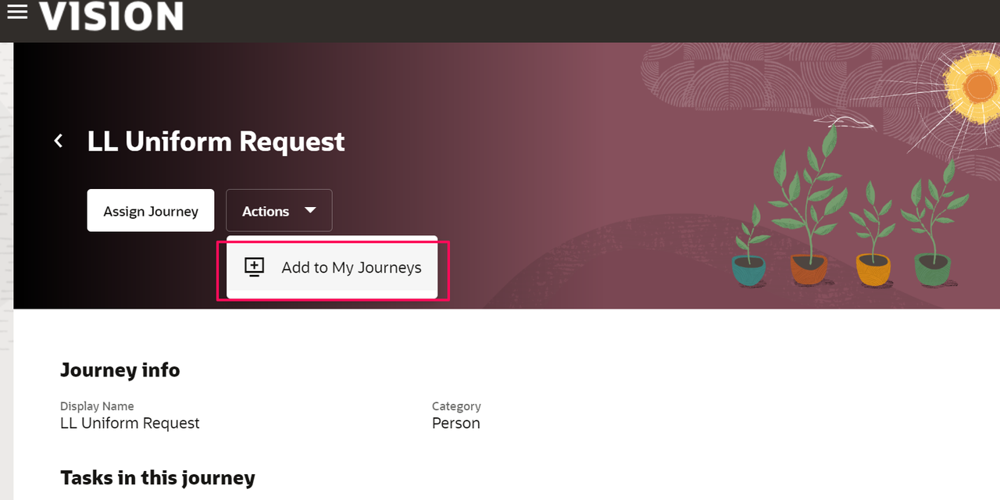
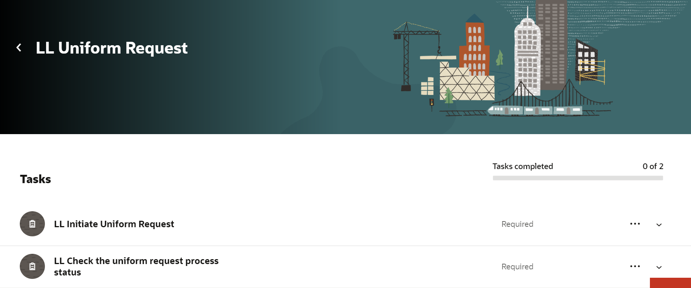
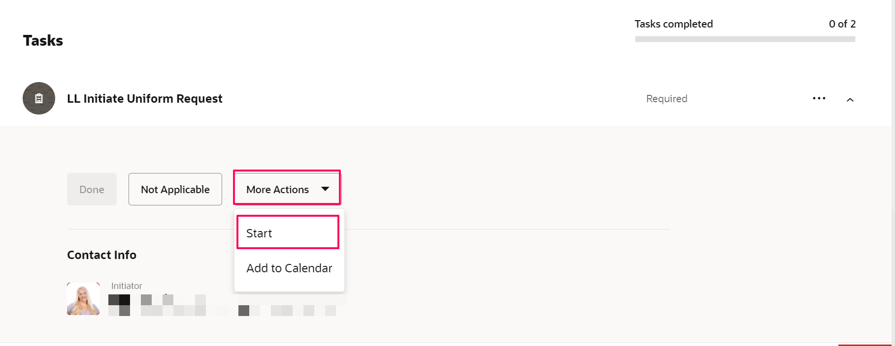
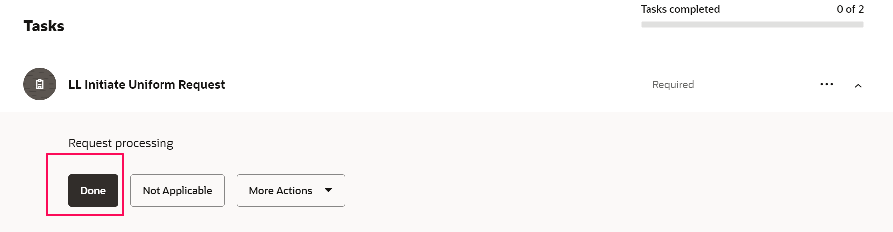
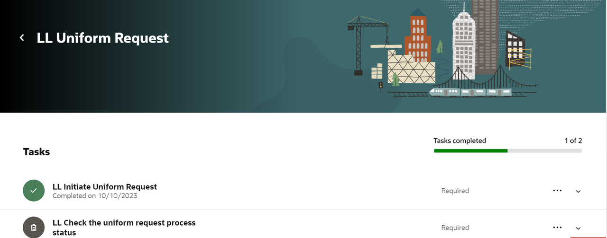
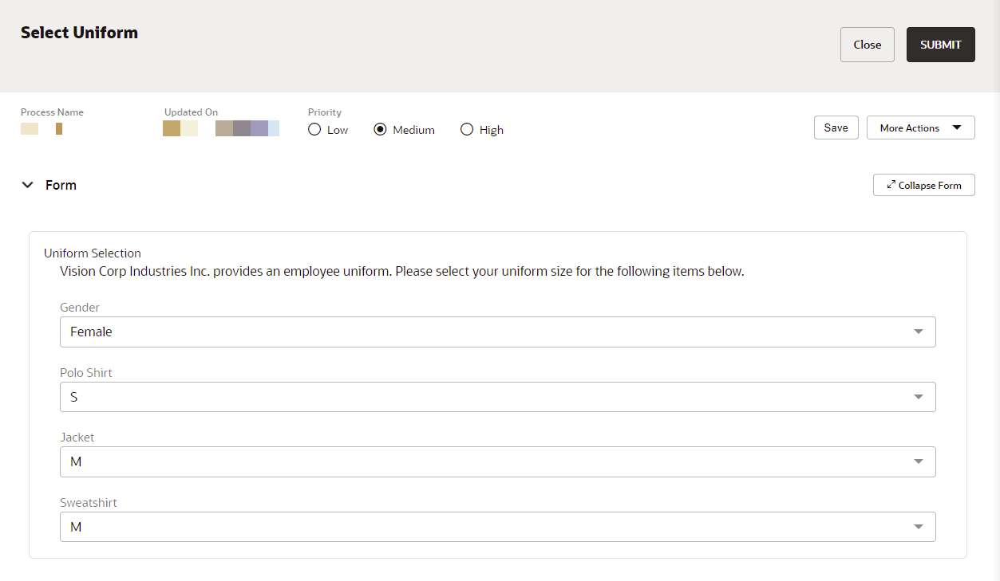
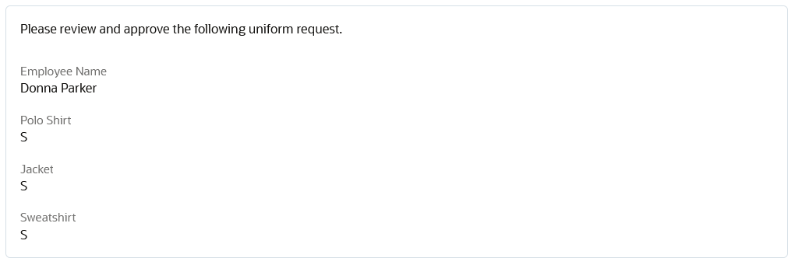

# Assign HCM Journey to Employee

## Introduction

This lab walks through the end user experience for the employee actor in the runtime interaction with the HCM Journey Booster experience.

Previously the Journey template has been setup to be a standalone Journey, but the tasks can be integrated into larger Journeys and not stand alone.

Estimated Time: 10 minutes

### Objectives

In this lab, you will:
* Allocate new HCM Journey to employee

### Prerequisites

Setup and Configure HCM Cloud Journey Template

## Task 1: Allocate new HCM Journey to employee

1.	In the HCM Cloud Select Navigator &gt; Me &gt; Journeys

On the *Explore* tab of HCM Journeys in the search entry box, enter **Uniform**. This will return the newly created Uniform Request Journey created in the previous section.

2.  Assign the Journey to self (for test purposes) or assign  to intended/target user by the **Add to My Journeys** add New Journey Icon

3.  Navigate to the My Journeys tab

4.  Select the **LL Uniform Request*** Journey

5.  Expand the Initiate Uniform Request task

6.  Select *Start* from **More Actions**
This will initiate Uniform Request process in Booster, and display a Request processing notification

7.  Select *Done*, to mark the task as Complete.

8.  An email notification will have been sent to the employee per the flow, notifying of need to complete the Uniform Selection.

Once the uniform selection has been completed, the user will select Submit. This will move the process forward to the approval task.

9.  Approval of Uniform Request

An approval notification is sent to the individual in the organization responsible for approving uniforms. They can action the approval via the notification or by entering the Booster product and reviewing the workspace tasks.

10. Worker checks status in HCM Journey while Process is in progress, they will receive the response as **Request Processing**.

11. Once the Process has been completed, a completed message will be returned and the Worker can make the task as **Done**.

## Learn More

## Acknowledgements
* **Author** - Kishore Katta, Product Management, Oracle Integration & OCI Process Automation
* **Last Updated By/Date** - Kishore Katta, October 2023
