# Create a REST API Connector

## Introduction

This lab shows you how to use a REST Connector to communicate and exchange data with HCM Cloud via REST Services. You need the following service information:

- Definition of the REST service to connect too
- URLs to the location of the different resources
- Access to these URLs to get the JSON sample used to create the types needed to send and receive data to/from the service
- List of operations to use on each resource
- List of parameters to pass to operations

Estimated Time: 15 minutes

### Prerequisites

For a secure REST service, the username and password required to access the service will be needed.

### Objectives

In this lab, you will:
* Create the connectors
* Apply authentication to the connectors
* Add resources to the connector
* Add operations to resources
* Specify request and response parameters for operations


## Task 1: Create the connector

1.	Open the newly created application from the previous step.

2.	On the Process Applications page Click *Add* and Select *Connectors*
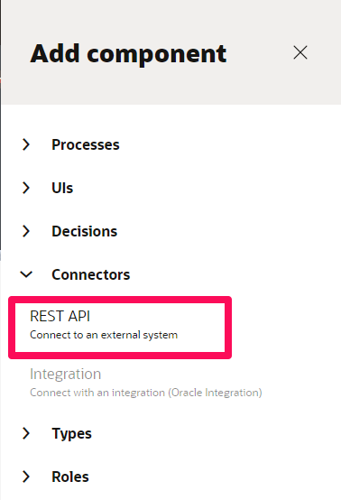

3.	Click *REST API* and complete the following fields substituting the Base URL with the URL from your environment:

| Field | Value |	Description	|
| --- | --- |	---	|
| Title | ##HCMCloud_DIT	 |	Name of the Connector e.g. HCM Cloud.|
| Identifier Name	 | ##HCMCloud_DIT	 |	System generated value that can be edited. |
| Base URL | https://servername.fa.us2.oraclecloud.com	 |	URL of the HCM Cloud instance you are connecting too. E.g. https://servername.fa.us2.oraclecloud.com |
| Description | Tutorial Connection to Oracle Environment.	 |	Meaningful description of the endpoint e.g. Test Oracle HCM environment |
{: title="Create Component Dialog"}

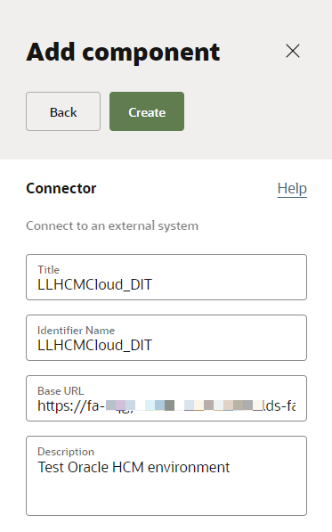

4.	Click *Create*. Open the connector.

## Task 2: Apply authentication to the connector

By default, no security is configured. You can apply HTTP basic authentication, which provides access control to web resources by requiring a user name and password when making requests.

> Note: the authentication credentials cannot be updated when the process is active. If you need to modify the credentials a new version should be created.

1.  On the **REST Connector** tab, select the *Padlock Icon* to open the **Security** tab.
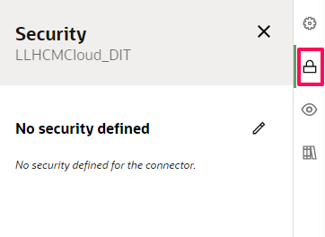

2.  On the **Security** tab select the *edit icon* to apply authentication to the REST connector

3.  Select Security Type **Basic Auth** and complete the following fields for an HCM integration user:
  - Username
  - Password

4.  Click *Save*

## Task 3: Add resources to the connector: getWorker

The first resource we are going to add to the newly created Connector is one to retrieve Worker data. A resource contains one or more operations that control data by performing basic create, read, update, and delete operations (CRUD) on resources using standard HTTP method requests.

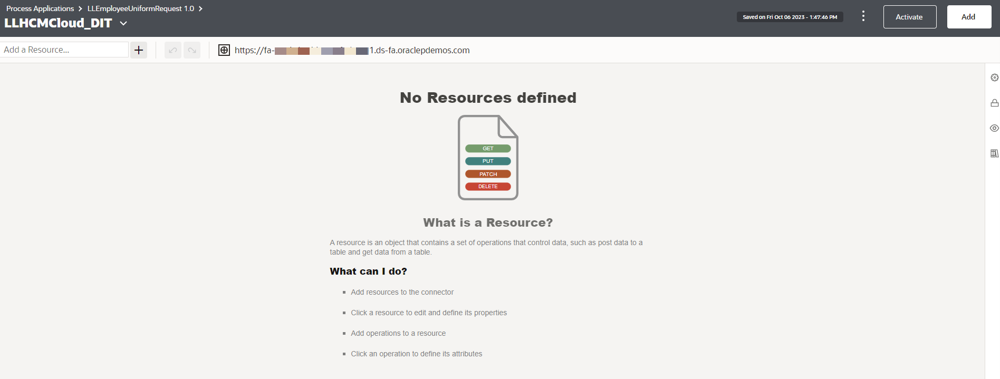

1.  At the top of the Resources section, click *+*

2.  Click the new resource that was added to the Resources list to expand it.

3.  Enter a **Name** as *workers*, for the resource.

4.  You’ll select this resource name when implementing a service task. E.g. workers

5.  In the **Path** field, identify the resource path within the base URL: hcmRestApi/resources/11.13.18.05/workers
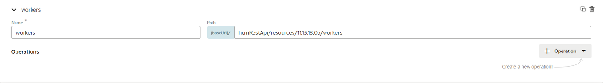

## Task 4: Add operations to resources: getWorker

1.  In the **Operations** section, click *Operation* Button

2.  From the dropdown select the *GET* method to add. The new operation is added to the Operations list, along with its name and path.

3.  Select the newly created **Operations**, this will open the **Operations Detail** panel. On the Request tab:
    - Enter q in the first parameter
    - Enter expand in the second parameter field
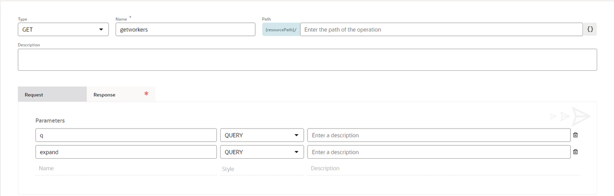

4.  Select the *Response* tab
The Response tab is where the returned payload from HCM is used to create a schema for OPA. This initially can be generated from a response payload from Postman. Here is a sample payload for reference.

```
<copy>
{
    "offset": 0,
    "count": 1,
    "hasMore": false,
    "limit": 25,
    "links": [{
        "kind": "collection",
        "rel": "self",
        "name": "workers",
        "href": "https://servername-fa-ext.us.oracle.com:443/hcmRestApi/resources/11.13.18.05/workers"
    }],
    "items": [{
        "PersonNumber": "955160008178430",
        "DateOfBirth": null,
        "LastUpdatedBy": "FUSION_APPS_HCM_ESS_LOADER_APPID",
        "CreationDate": "2014-07-30T04:06:13.251+00:00",
        "CreatedBy": "FUSION_APPS_HCM_ESS_LOADER_APPID",
        "CorrespondenceLanguage": null,
        "workRelationships": [{
            "PeriodOfServiceId": 300100037952124,
            "EnterpriseSeniorityDate": null,
            "CreationDate": "2014-07-30T04:06:14.188+00:00",
            "LegislationCode": "DE",
            "PrimaryFlag": true,
            "assignments": [{
                "GradeLadderId": null,
                "CreationDate": "2014-07-30T04:06:14.284+00:00",
                "ContractNumber": null,
                "EffectiveLatestChange": "Y",
                "SeniorityBasis": null,
                "UnionId": null,
                "InternalBuilding": null,
                "ReportingEstablishmentId": null,
                "WorkerCategory": null,
                "NoticePeriod": null,
                "FullPartTime": null,
                "ExpenseCheckSendToAddress": null,
                "GradeCode": null,
                "ProbationEndDate": null,
                "EffectiveSequence": 1,
                "NoticePeriodUOM": null,
                "StandardFrequency": "W",
                "links": [{
                    "kind": "item",
                    "rel": "self",
                    "name": "assignments",
                    "href": "https://servername-fa-ext.us.oracle.com:443/hcmRestApi/resources/11.13.18.05/workers/00020000000EACED00057708000110F07C28C2770000004AACED00057372000D6A6176612E73716C2E4461746514FA46683F3566970200007872000E6A6176612E7574696C2E44617465686A81014B597419030000787077080000017E4148D80078/child/workRelationships/300100037952124/child/assignments/00020000000EACED00057708000110F07C28C2820000004AACED00057372000D6A6176612E73716C2E4461746514FA46683F3566970200007872000E6A6176612E7574696C2E44617465686A81014B597419030000787077080000017E4148D80078",
                    "properties": {
                        "changeIndicator": "ACED0005737200136A6176612E7574696C2E41727261794C6973747881D21D99C7619D03000149000473697A65787000000001770400000001737200116A6176612E6C616E672E496E746567657212E2A0A4F781873802000149000576616C7565787200106A6176612E6C616E672E4E756D62657286AC951D0B94E08B02000078700000001178"
                    }
                }, {
                    "kind": "item",
                    "rel": "canonical",
                    "name": "assignments",
                    "href": "https://servername-fa-ext.us.oracle.com:443/hcmRestApi/resources/11.13.18.05/workers/00020000000EACED00057708000110F07C28C2770000004AACED00057372000D6A6176612E73716C2E4461746514FA46683F3566970200007872000E6A6176612E7574696C2E44617465686A81014B597419030000787077080000017E4148D80078/child/workRelationships/300100037952124/child/assignments/00020000000EACED00057708000110F07C28C2820000004AACED00057372000D6A6176612E73716C2E4461746514FA46683F3566970200007872000E6A6176612E7574696C2E44617465686A81014B597419030000787077080000017E4148D80078"
                }, {
                    "kind": "item",
                    "rel": "parent",
                    "name": "workRelationships",
                    "href": "https://servername-fa-ext.us.oracle.com:443/hcmRestApi/resources/11.13.18.05/workers/00020000000EACED00057708000110F07C28C2770000004AACED00057372000D6A6176612E73716C2E4461746514FA46683F3566970200007872000E6A6176612E7574696C2E44617465686A81014B597419030000787077080000017E4148D80078/child/workRelationships/300100037952124"
                }, {
                    "kind": "collection",
                    "rel": "child",
                    "name": "allReports",
                    "href": "https://servername-fa-ext.us.oracle.com:443/hcmRestApi/resources/11.13.18.05/workers/00020000000EACED00057708000110F07C28C2770000004AACED00057372000D6A6176612E73716C2E4461746514FA46683F3566970200007872000E6A6176612E7574696C2E44617465686A81014B597419030000787077080000017E4148D80078/child/workRelationships/300100037952124/child/assignments/00020000000EACED00057708000110F07C28C2820000004AACED00057372000D6A6176612E73716C2E4461746514FA46683F3566970200007872000E6A6176612E7574696C2E44617465686A81014B597419030000787077080000017E4148D80078/child/allReports"
                }, {
                    "kind": "collection",
                    "rel": "child",
                    "name": "assignmentsDDF",
                    "href": "https://servername-fa-ext.us.oracle.com:443/hcmRestApi/resources/11.13.18.05/workers/00020000000EACED00057708000110F07C28C2770000004AACED00057372000D6A6176612E73716C2E4461746514FA46683F3566970200007872000E6A6176612E7574696C2E44617465686A81014B597419030000787077080000017E4148D80078/child/workRelationships/300100037952124/child/assignments/00020000000EACED00057708000110F07C28C2820000004AACED00057372000D6A6176612E73716C2E4461746514FA46683F3566970200007872000E6A6176612E7574696C2E44617465686A81014B597419030000787077080000017E4148D80078/child/assignmentsDDF"
                }, {
                    "kind": "collection",
                    "rel": "child",
                    "name": "assignmentsDFF",
                    "href": "https://servername-fa-ext.us.oracle.com:443/hcmRestApi/resources/11.13.18.05/workers/00020000000EACED00057708000110F07C28C2770000004AACED00057372000D6A6176612E73716C2E4461746514FA46683F3566970200007872000E6A6176612E7574696C2E44617465686A81014B597419030000787077080000017E4148D80078/child/workRelationships/300100037952124/child/assignments/00020000000EACED00057708000110F07C28C2820000004AACED00057372000D6A6176612E73716C2E4461746514FA46683F3566970200007872000E6A6176612E7574696C2E44617465686A81014B597419030000787077080000017E4148D80078/child/assignmentsDFF"
                }, {
                    "kind": "collection",
                    "rel": "child",
                    "name": "assignmentsEFF",
                    "href": "https://servername-fa-ext.us.oracle.com:443/hcmRestApi/resources/11.13.18.05/workers/00020000000EACED00057708000110F07C28C2770000004AACED00057372000D6A6176612E73716C2E4461746514FA46683F3566970200007872000E6A6176612E7574696C2E44617465686A81014B597419030000787077080000017E4148D80078/child/workRelationships/300100037952124/child/assignments/00020000000EACED00057708000110F07C28C2820000004AACED00057372000D6A6176612E73716C2E4461746514FA46683F3566970200007872000E6A6176612E7574696C2E44617465686A81014B597419030000787077080000017E4148D80078/child/assignmentsEFF"
                }, {
                    "kind": "collection",
                    "rel": "child",
                    "name": "gradeSteps",
                    "href": "https://servername-fa-ext.us.oracle.com:443/hcmRestApi/resources/11.13.18.05/workers/00020000000EACED00057708000110F07C28C2770000004AACED00057372000D6A6176612E73716C2E4461746514FA46683F3566970200007872000E6A6176612E7574696C2E44617465686A81014B597419030000787077080000017E4148D80078/child/workRelationships/300100037952124/child/assignments/00020000000EACED00057708000110F07C28C2820000004AACED00057372000D6A6176612E73716C2E4461746514FA46683F3566970200007872000E6A6176612E7574696C2E44617465686A81014B597419030000787077080000017E4148D80078/child/gradeSteps"
                }, {
                    "kind": "collection",
                    "rel": "child",
                    "name": "managers",
                    "href": "https://servername-fa-ext.us.oracle.com:443/hcmRestApi/resources/11.13.18.05/workers/00020000000EACED00057708000110F07C28C2770000004AACED00057372000D6A6176612E73716C2E4461746514FA46683F3566970200007872000E6A6176612E7574696C2E44617465686A81014B597419030000787077080000017E4148D80078/child/workRelationships/300100037952124/child/assignments/00020000000EACED00057708000110F07C28C2820000004AACED00057372000D6A6176612E73716C2E4461746514FA46683F3566970200007872000E6A6176612E7574696C2E44617465686A81014B597419030000787077080000017E4148D80078/child/managers"
                }, {
                    "kind": "collection",
                    "rel": "child",
                    "name": "representatives",
                    "href": "https://servername-fa-ext.us.oracle.com:443/hcmRestApi/resources/11.13.18.05/workers/00020000000EACED00057708000110F07C28C2770000004AACED00057372000D6A6176612E73716C2E4461746514FA46683F3566970200007872000E6A6176612E7574696C2E44617465686A81014B597419030000787077080000017E4148D80078/child/workRelationships/300100037952124/child/assignments/00020000000EACED00057708000110F07C28C2820000004AACED00057372000D6A6176612E73716C2E4461746514FA46683F3566970200007872000E6A6176612E7574696C2E44617465686A81014B597419030000787077080000017E4148D80078/child/representatives"
                }, {
                    "kind": "collection",
                    "rel": "child",
                    "name": "workMeasures",
                    "href": "https://servername-fa-ext.us.oracle.com:443/hcmRestApi/resources/11.13.18.05/workers/00020000000EACED00057708000110F07C28C2770000004AACED00057372000D6A6176612E73716C2E4461746514FA46683F3566970200007872000E6A6176612E7574696C2E44617465686A81014B597419030000787077080000017E4148D80078/child/workRelationships/300100037952124/child/assignments/00020000000EACED00057708000110F07C28C2820000004AACED00057372000D6A6176612E73716C2E4461746514FA46683F3566970200007872000E6A6176612E7574696C2E44617465686A81014B597419030000787077080000017E4148D80078/child/workMeasures"
                }, {
                    "kind": "other",
                    "rel": "action",
                    "name": "endAssignment",
                    "href": "https://servername-fa-ext.us.oracle.com:443/hcmRestApi/resources/11.13.18.05/workers/00020000000EACED00057708000110F07C28C2770000004AACED00057372000D6A6176612E73716C2E4461746514FA46683F3566970200007872000E6A6176612E7574696C2E44617465686A81014B597419030000787077080000017E4148D80078/child/workRelationships/300100037952124/child/assignments/00020000000EACED00057708000110F07C28C2820000004AACED00057372000D6A6176612E73716C2E4461746514FA46683F3566970200007872000E6A6176612E7574696C2E44617465686A81014B597419030000787077080000017E4148D80078/action/endAssignment"
                }],
                "PositionCode": null,
                "CollectiveAgreementName": null,
                "LastUpdatedBy": "ABRAHAM.MASON",
                "GradeCeilingStep": null,
                "ProposedUserPersonType": null,
                "ManagerFlag": false,
                "CreatedBy": "FUSION_APPS_HCM_ESS_LOADER_APPID",
                "EffectiveEndDate": "4712-12-31",
                "CollectiveAgreementId": null,
                "BusinessUnitId": 300100037681347,
                "DefaultExpenseAccount": "01-000-7320-0000-000",
                "LocationCode": null,
                "StartTime": null,
                "PeopleGroup": null,
                "GradeLadderName": null,
                "ReasonCode": "NEWHIRE",
                "WorkAtHomeFlag": null,
                "AssignmentStatusTypeCode": "ACTIVE_NO_PROCESS",
                "InternalFloor": null,
                "AssignmentName": "Test Engineer",
                "AssignmentCategory": null,
                "DepartmentName": "Europe-West",
                "WorkTaxAddressId": null,
                "ReportingEstablishmentName": null,
                "ProbationPeriodUnit": null,
                "LabourUnionMemberFlag": false,
                "PrimaryFlag": true,
                "EndTime": null,
                "GradeCeilingStepId": null,
                "ActionCode": "HIRE",
                "UserPersonType": "Employee",
                "RetirementDate": null,
                "ProjectedStartDate": null,
                "PermanentTemporary": null,
                "StandardWorkingHours": 40,
                "PrimaryAssignmentFlag": true,
                "JobCode": "ENG1003",
                "InternalOfficeNumber": null,
                "AssignmentId": 300100037952130,
                "AssignmentNumber": "E955160008178430",
                "InternalMailstop": null,
                "GradeId": null,
                "NormalHours": null,
                "BusinessUnitName": "Vision Europe Projects",
                "ProposedUserPersonTypeId": null,
                "JobId": 300100037657906,
                "UnionName": null,
                "SystemPersonType": "EMP",
                "RetirementAge": null,
                "PositionId": null,
                "AssignmentStatusType": "ACTIVE",
                "LocationId": null,
                "ContractId": null,
                "ProjectedEndDate": null,
                "HourlySalariedCode": null,
                "AssignmentStatusTypeId": 100010026278191,
                "BargainingUnitCode": null,
                "AssignmentType": "E",
                "UserPersonTypeId": 13,
                "Frequency": null,
                "DepartmentId": 300100037658037,
                "EffectiveStartDate": "2009-01-01",
                "SynchronizeFromPositionFlag": false,
                "GradeStepEligibilityFlag": true,
                "ProbationPeriod": null,
                "LastUpdateDate": "2017-02-25T13:03:51.107+00:00"
            }],
            "RecommendedForRehire": "Y",
            "ProjectedTerminationDate": null,
            "RevokeUserAccess": null,
            "StartDate": "2009-01-01",
            "LegalEmployerName": "Vision Europe",
            "WorkerType": "E",
            "NotificationDate": null,
            "LegalEntityId": 300100037658592,
            "ReadyToConvertFlag": null,
            "LegalEmployerSeniorityDate": null,
            "links": [{
                "kind": "item",
                "rel": "self",
                "name": "workRelationships",
                "href": "https://servername-fa-ext.us.oracle.com:443/hcmRestApi/resources/11.13.18.05/workers/00020000000EACED00057708000110F07C28C2770000004AACED00057372000D6A6176612E73716C2E4461746514FA46683F3566970200007872000E6A6176612E7574696C2E44617465686A81014B597419030000787077080000017E4148D80078/child/workRelationships/300100037952124",
                "properties": {
                    "changeIndicator": "ACED0005737200136A6176612E7574696C2E41727261794C6973747881D21D99C7619D03000149000473697A65787000000001770400000001737200116A6176612E6C616E672E496E746567657212E2A0A4F781873802000149000576616C7565787200106A6176612E6C616E672E4E756D62657286AC951D0B94E08B02000078700000000178"
                }
            }, {
                "kind": "item",
                "rel": "canonical",
                "name": "workRelationships",
                "href": "https://servername-fa-ext.us.oracle.com:443/hcmRestApi/resources/11.13.18.05/workers/00020000000EACED00057708000110F07C28C2770000004AACED00057372000D6A6176612E73716C2E4461746514FA46683F3566970200007872000E6A6176612E7574696C2E44617465686A81014B597419030000787077080000017E4148D80078/child/workRelationships/300100037952124"
            }, {
                "kind": "item",
                "rel": "parent",
                "name": "workers",
                "href": "https://servername-fa-ext.us.oracle.com:443/hcmRestApi/resources/11.13.18.05/workers/00020000000EACED00057708000110F07C28C2770000004AACED00057372000D6A6176612E73716C2E4461746514FA46683F3566970200007872000E6A6176612E7574696C2E44617465686A81014B597419030000787077080000017E4148D80078"
            }, {
                "kind": "collection",
                "rel": "child",
                "name": "assignments",
                "href": "https://servername-fa-ext.us.oracle.com:443/hcmRestApi/resources/11.13.18.05/workers/00020000000EACED00057708000110F07C28C2770000004AACED00057372000D6A6176612E73716C2E4461746514FA46683F3566970200007872000E6A6176612E7574696C2E44617465686A81014B597419030000787077080000017E4148D80078/child/workRelationships/300100037952124/child/assignments"
            }, {
                "kind": "collection",
                "rel": "child",
                "name": "contracts",
                "href": "https://servername-fa-ext.us.oracle.com:443/hcmRestApi/resources/11.13.18.05/workers/00020000000EACED00057708000110F07C28C2770000004AACED00057372000D6A6176612E73716C2E4461746514FA46683F3566970200007872000E6A6176612E7574696C2E44617465686A81014B597419030000787077080000017E4148D80078/child/workRelationships/300100037952124/child/contracts"
            }, {
                "kind": "collection",
                "rel": "child",
                "name": "workRelationshipsDDF",
                "href": "https://servername-fa-ext.us.oracle.com:443/hcmRestApi/resources/11.13.18.05/workers/00020000000EACED00057708000110F07C28C2770000004AACED00057372000D6A6176612E73716C2E4461746514FA46683F3566970200007872000E6A6176612E7574696C2E44617465686A81014B597419030000787077080000017E4148D80078/child/workRelationships/300100037952124/child/workRelationshipsDDF"
            }, {
                "kind": "collection",
                "rel": "child",
                "name": "workRelationshipsDFF",
                "href": "https://servername-fa-ext.us.oracle.com:443/hcmRestApi/resources/11.13.18.05/workers/00020000000EACED00057708000110F07C28C2770000004AACED00057372000D6A6176612E73716C2E4461746514FA46683F3566970200007872000E6A6176612E7574696C2E44617465686A81014B597419030000787077080000017E4148D80078/child/workRelationships/300100037952124/child/workRelationshipsDFF"
            }, {
                "kind": "other",
                "rel": "action",
                "name": "reverseTermination",
                "href": "https://servername-fa-ext.us.oracle.com:443/hcmRestApi/resources/11.13.18.05/workers/00020000000EACED00057708000110F07C28C2770000004AACED00057372000D6A6176612E73716C2E4461746514FA46683F3566970200007872000E6A6176612E7574696C2E44617465686A81014B597419030000787077080000017E4148D80078/child/workRelationships/300100037952124/action/reverseTermination"
            }, {
                "kind": "other",
                "rel": "action",
                "name": "changePrimaryFlag",
                "href": "https://servername-fa-ext.us.oracle.com:443/hcmRestApi/resources/11.13.18.05/workers/00020000000EACED00057708000110F07C28C2770000004AACED00057372000D6A6176612E73716C2E4461746514FA46683F3566970200007872000E6A6176612E7574696C2E44617465686A81014B597419030000787077080000017E4148D80078/child/workRelationships/300100037952124/action/changePrimaryFlag"
            }, {
                "kind": "other",
                "rel": "action",
                "name": "changeStartDate",
                "href": "https://servername-fa-ext.us.oracle.com:443/hcmRestApi/resources/11.13.18.05/workers/00020000000EACED00057708000110F07C28C2770000004AACED00057372000D6A6176612E73716C2E4461746514FA46683F3566970200007872000E6A6176612E7574696C2E44617465686A81014B597419030000787077080000017E4148D80078/child/workRelationships/300100037952124/action/changeStartDate"
            }, {
                "kind": "other",
                "rel": "action",
                "name": "terminate",
                "href": "https://servername-fa-ext.us.oracle.com:443/hcmRestApi/resources/11.13.18.05/workers/00020000000EACED00057708000110F07C28C2770000004AACED00057372000D6A6176612E73716C2E4461746514FA46683F3566970200007872000E6A6176612E7574696C2E44617465686A81014B597419030000787077080000017E4148D80078/child/workRelationships/300100037952124/action/terminate"
            }, {
                "kind": "other",
                "rel": "action",
                "name": "correctTermination",
                "href": "https://servername-fa-ext.us.oracle.com:443/hcmRestApi/resources/11.13.18.05/workers/00020000000EACED00057708000110F07C28C2770000004AACED00057372000D6A6176612E73716C2E4461746514FA46683F3566970200007872000E6A6176612E7574696C2E44617465686A81014B597419030000787077080000017E4148D80078/child/workRelationships/300100037952124/action/correctTermination"
            }, {
                "kind": "other",
                "rel": "action",
                "name": "cancelWorkRelationship",
                "href": "https://servername-fa-ext.us.oracle.com:443/hcmRestApi/resources/11.13.18.05/workers/00020000000EACED00057708000110F07C28C2770000004AACED00057372000D6A6176612E73716C2E4461746514FA46683F3566970200007872000E6A6176612E7574696C2E44617465686A81014B597419030000787077080000017E4148D80078/child/workRelationships/300100037952124/action/cancelWorkRelationship"
            }, {
                "kind": "other",
                "rel": "action",
                "name": "changeLegalEmployer",
                "href": "https://servername-fa-ext.us.oracle.com:443/hcmRestApi/resources/11.13.18.05/workers/00020000000EACED00057708000110F07C28C2770000004AACED00057372000D6A6176612E73716C2E4461746514FA46683F3566970200007872000E6A6176612E7574696C2E44617465686A81014B597419030000787077080000017E4148D80078/child/workRelationships/300100037952124/action/changeLegalEmployer"
            }, {
                "kind": "other",
                "rel": "action",
                "name": "addTemporaryAssignment",
                "href": "https://servername-fa-ext.us.oracle.com:443/hcmRestApi/resources/11.13.18.05/workers/00020000000EACED00057708000110F07C28C2770000004AACED00057372000D6A6176612E73716C2E4461746514FA46683F3566970200007872000E6A6176612E7574696C2E44617465686A81014B597419030000787077080000017E4148D80078/child/workRelationships/300100037952124/action/addTemporaryAssignment"
            }],
            "LastUpdatedBy": "FUSION_APPS_HCM_ESS_LOADER_APPID",
            "CreatedBy": "FUSION_APPS_HCM_ESS_LOADER_APPID",
            "TerminationDate": null,
            "RecommendationReason": null,
            "RecommendationAuthorizedByPersonId": null,
            "WorkerNumber": null,
            "LastWorkingDate": null,
            "OnMilitaryServiceFlag": false,
            "LastUpdateDate": "2014-07-30T04:06:15.134+00:00"
        }],
        "emails": [{
            "LastUpdatedBy": "IT_SECURITY_MANAGER",
            "CreationDate": "2014-07-30T04:06:14.167+00:00",
            "EmailType": "W1",
            "CreatedBy": "FUSION_APPS_HCM_ESS_LOADER_APPID",
            "PrimaryFlag": true,
            "FromDate": "2009-01-01",
            "ToDate": "4712-12-31",
            "links": [{
                "kind": "item",
                "rel": "self",
                "name": "emails",
                "href": "https://servername-fa-ext.us.oracle.com:443/hcmRestApi/resources/11.13.18.05/workers/00020000000EACED00057708000110F07C28C2770000004AACED00057372000D6A6176612E73716C2E4461746514FA46683F3566970200007872000E6A6176612E7574696C2E44617465686A81014B597419030000787077080000017E4148D80078/child/emails/300100037952122",
                "properties": {
                    "changeIndicator": "ACED0005737200136A6176612E7574696C2E41727261794C6973747881D21D99C7619D03000149000473697A65787000000001770400000001737200116A6176612E6C616E672E496E746567657212E2A0A4F781873802000149000576616C7565787200106A6176612E6C616E672E4E756D62657286AC951D0B94E08B02000078700000000278"
                }
            }, {
                "kind": "item",
                "rel": "canonical",
                "name": "emails",
                "href": "https://servername-fa-ext.us.oracle.com:443/hcmRestApi/resources/11.13.18.05/workers/00020000000EACED00057708000110F07C28C2770000004AACED00057372000D6A6176612E73716C2E4461746514FA46683F3566970200007872000E6A6176612E7574696C2E44617465686A81014B597419030000787077080000017E4148D80078/child/emails/300100037952122"
            }, {
                "kind": "item",
                "rel": "parent",
                "name": "workers",
                "href": "https://servername-fa-ext.us.oracle.com:443/hcmRestApi/resources/11.13.18.05/workers/00020000000EACED00057708000110F07C28C2770000004AACED00057372000D6A6176612E73716C2E4461746514FA46683F3566970200007872000E6A6176612E7574696C2E44617465686A81014B597419030000787077080000017E4148D80078"
            }, {
                "kind": "collection",
                "rel": "child",
                "name": "emailsDFF",
                "href": "https://servername-fa-ext.us.oracle.com:443/hcmRestApi/resources/11.13.18.05/workers/00020000000EACED00057708000110F07C28C2770000004AACED00057372000D6A6176612E73716C2E4461746514FA46683F3566970200007872000E6A6176612E7574696C2E44617465686A81014B597419030000787077080000017E4148D80078/child/emails/300100037952122/child/emailsDFF"
            }],
            "EmailAddress": "sendmail-test-discard@oracle.com",
            "EmailAddressId": 300100037952122,
            "LastUpdateDate": "2018-05-25T07:11:31+00:00"
        }],
        "names": [{
            "CreationDate": "2014-07-30T04:06:13.278+00:00",
            "PreNameAdjunct": null,
            "LocalFirstName": "Donna",
            "LocalPreviousLastName": null,
            "LocalLastUpdateDate": "2021-12-21T04:45:15+00:00",
            "LocalFullName": "Parker Donna",
            "MiddleNames": null,
            "MilitaryRank": null,
            "NameInformation9": null,
            "LastUpdatedBy": "TM-MFITZIMMONS",
            "CreatedBy": "FUSION_APPS_HCM_ESS_LOADER_APPID",
            "PreviousLastName": null,
            "NameInformation1": null,
            "NameInformation2": null,
            "NameInformation3": null,
            "LocalTitle": null,
            "NameInformation4": null,
            "NameInformation5": null,
            "NameInformation6": null,
            "NameInformation7": null,
            "NameInformation8": null,
            "LocalMiddleNames": null,
            "Suffix": null,
            "LocalCreationDate": "2014-07-30T04:06:13.753+00:00",
            "NameInformation10": null,
            "LocalDisplayName": "Donna Parker",
            "LocalNameInformation7": null,
            "LocalNameInformation22": null,
            "NameInformation11": null,
            "LocalNameInformation6": null,
            "LocalNameInformation23": null,
            "NameInformation12": null,
            "LocalNameInformation9": null,
            "LocalNameInformation20": null,
            "NameInformation13": null,
            "LocalNameInformation8": null,
            "LocalNameInformation21": null,
            "NameInformation14": null,
            "Honors": null,
            "NameInformation15": null,
            "NameInformation16": null,
            "NameInformation17": null,
            "LocalLastName": "Parker",
            "NameInformation18": null,
            "NameInformation19": null,
            "LocalNameInformation28": null,
            "LocalNameInformation29": null,
            "LocalNameInformation26": null,
            "LocalNameInformation27": null,
            "LocalNameInformation24": null,
            "LocalCreatedBy": "FUSION_APPS_HCM_ESS_LOADER_APPID",
            "LocalNameInformation25": null,
            "LocalEffectiveStartDate": "2009-01-01",
            "NameInformation20": null,
            "LocalLastUpdatedBy": "TM-MFITZIMMONS",
            "ListName": "Parker, Donna",
            "LocalNameInformation30": null,
            "FirstName": "Donna",
            "LocalMilitaryRank": null,
            "LocalNameInformation1": null,
            "LocalNameInformation3": null,
            "LocalNameInformation2": null,
            "LocalNameInformation5": null,
            "LastUpdateDate": "2021-12-21T04:45:15+00:00",
            "LocalNameLanguage": "US",
            "LocalNameInformation4": null,
            "LocalEffectiveEndDate": "4712-12-31",
            "LocalSuffix": null,
            "NameLanguage": "US",
            "links": [{
                "kind": "item",
                "rel": "self",
                "name": "names",
                "href": "https://servername-fa-ext.us.oracle.com:443/hcmRestApi/resources/11.13.18.05/workers/00020000000EACED00057708000110F07C28C2770000004AACED00057372000D6A6176612E73716C2E4461746514FA46683F3566970200007872000E6A6176612E7574696C2E44617465686A81014B597419030000787077080000017E4148D80078/child/names/00020000000EACED00057708000110F07C28C2780000004AACED00057372000D6A6176612E73716C2E4461746514FA46683F3566970200007872000E6A6176612E7574696C2E44617465686A81014B597419030000787077080000017E4148D80078",
                "properties": {
                    "changeIndicator": "ACED0005737200136A6176612E7574696C2E41727261794C6973747881D21D99C7619D03000149000473697A65787000000002770400000002737200116A6176612E6C616E672E496E746567657212E2A0A4F781873802000149000576616C7565787200106A6176612E6C616E672E4E756D62657286AC951D0B94E08B02000078700000001F7371007E00020000002078"
                }
            }, {
                "kind": "item",
                "rel": "canonical",
                "name": "names",
                "href": "https://servername-fa-ext.us.oracle.com:443/hcmRestApi/resources/11.13.18.05/workers/00020000000EACED00057708000110F07C28C2770000004AACED00057372000D6A6176612E73716C2E4461746514FA46683F3566970200007872000E6A6176612E7574696C2E44617465686A81014B597419030000787077080000017E4148D80078/child/names/00020000000EACED00057708000110F07C28C2780000004AACED00057372000D6A6176612E73716C2E4461746514FA46683F3566970200007872000E6A6176612E7574696C2E44617465686A81014B597419030000787077080000017E4148D80078"
            }, {
                "kind": "item",
                "rel": "parent",
                "name": "workers",
                "href": "https://servername-fa-ext.us.oracle.com:443/hcmRestApi/resources/11.13.18.05/workers/00020000000EACED00057708000110F07C28C2770000004AACED00057372000D6A6176612E73716C2E4461746514FA46683F3566970200007872000E6A6176612E7574696C2E44617465686A81014B597419030000787077080000017E4148D80078"
            }],
            "LocalPersonNameId": 300100037952121,
            "NameInformation21": null,
            "LocalNameInformation11": null,
            "NameInformation22": null,
            "LocalNameInformation12": null,
            "NameInformation23": null,
            "NameInformation24": null,
            "LocalNameInformation10": null,
            "EffectiveEndDate": "4712-12-31",
            "NameInformation25": null,
            "NameInformation26": null,
            "NameInformation27": null,
            "NameInformation28": null,
            "LocalHonors": null,
            "NameInformation29": null,
            "LocalListName": "Parker, Donna",
            "LocalNameInformation19": null,
            "LocalLegislationCode": "DE",
            "LocalNameInformation17": null,
            "LocalNameInformation18": null,
            "LocalNameInformation15": null,
            "LocalNameInformation16": null,
            "LocalNameInformation13": null,
            "LocalNameInformation14": null,
            "LastName": "Parker",
            "LocalKnownAs": null,
            "NameInformation30": null,
            "PersonNameId": 300100037952120,
            "OrderName": "Parker, Donna",
            "LegislationCode": "DE",
            "KnownAs": null,
            "LocalPreNameAdjunct": null,
            "DisplayName": "Donna Parker",
            "Title": null,
            "FullName": "Parker, Donna",
            "LocalOrderName": "Parker Donna",
            "EffectiveStartDate": "2009-01-01"
        }],
        "PersonId": 300100037952119,
        "TownOfBirth": null,
        "RegionOfBirth": null,
        "links": [{
            "kind": "item",
            "rel": "self",
            "name": "workers",
            "href": "https://servername-fa-ext.us.oracle.com:443/hcmRestApi/resources/11.13.18.05/workers/00020000000EACED00057708000110F07C28C2770000004AACED00057372000D6A6176612E73716C2E4461746514FA46683F3566970200007872000E6A6176612E7574696C2E44617465686A81014B597419030000787077080000017E4148D80078",
            "properties": {
                "changeIndicator": "ACED0005737200136A6176612E7574696C2E41727261794C6973747881D21D99C7619D03000149000473697A65787000000002770400000002737200116A6176612E6C616E672E496E746567657212E2A0A4F781873802000149000576616C7565787200106A6176612E6C616E672E4E756D62657286AC951D0B94E08B0200007870000000017371007E00020000001078"
            }
        }, {
            "kind": "item",
            "rel": "canonical",
            "name": "workers",
            "href": "https://servername-fa-ext.us.oracle.com:443/hcmRestApi/resources/11.13.18.05/workers/00020000000EACED00057708000110F07C28C2770000004AACED00057372000D6A6176612E73716C2E4461746514FA46683F3566970200007872000E6A6176612E7574696C2E44617465686A81014B597419030000787077080000017E4148D80078"
        }, {
            "kind": "collection",
            "rel": "child",
            "name": "addresses",
            "href": "https://servername-fa-ext.us.oracle.com:443/hcmRestApi/resources/11.13.18.05/workers/00020000000EACED00057708000110F07C28C2770000004AACED00057372000D6A6176612E73716C2E4461746514FA46683F3566970200007872000E6A6176612E7574696C2E44617465686A81014B597419030000787077080000017E4148D80078/child/addresses"
        }, {
            "kind": "collection",
            "rel": "child",
            "name": "citizenships",
            "href": "https://servername-fa-ext.us.oracle.com:443/hcmRestApi/resources/11.13.18.05/workers/00020000000EACED00057708000110F07C28C2770000004AACED00057372000D6A6176612E73716C2E4461746514FA46683F3566970200007872000E6A6176612E7574696C2E44617465686A81014B597419030000787077080000017E4148D80078/child/citizenships"
        }, {
            "kind": "collection",
            "rel": "child",
            "name": "disabilities",
            "href": "https://servername-fa-ext.us.oracle.com:443/hcmRestApi/resources/11.13.18.05/workers/00020000000EACED00057708000110F07C28C2770000004AACED00057372000D6A6176612E73716C2E4461746514FA46683F3566970200007872000E6A6176612E7574696C2E44617465686A81014B597419030000787077080000017E4148D80078/child/disabilities"
        }, {
            "kind": "collection",
            "rel": "child",
            "name": "driverLicenses",
            "href": "https://servername-fa-ext.us.oracle.com:443/hcmRestApi/resources/11.13.18.05/workers/00020000000EACED00057708000110F07C28C2770000004AACED00057372000D6A6176612E73716C2E4461746514FA46683F3566970200007872000E6A6176612E7574696C2E44617465686A81014B597419030000787077080000017E4148D80078/child/driverLicenses"
        }, {
            "kind": "collection",
            "rel": "child",
            "name": "emails",
            "href": "https://servername-fa-ext.us.oracle.com:443/hcmRestApi/resources/11.13.18.05/workers/00020000000EACED00057708000110F07C28C2770000004AACED00057372000D6A6176612E73716C2E4461746514FA46683F3566970200007872000E6A6176612E7574696C2E44617465686A81014B597419030000787077080000017E4148D80078/child/emails"
        }, {
            "kind": "collection",
            "rel": "child",
            "name": "ethnicities",
            "href": "https://servername-fa-ext.us.oracle.com:443/hcmRestApi/resources/11.13.18.05/workers/00020000000EACED00057708000110F07C28C2770000004AACED00057372000D6A6176612E73716C2E4461746514FA46683F3566970200007872000E6A6176612E7574696C2E44617465686A81014B597419030000787077080000017E4148D80078/child/ethnicities"
        }, {
            "kind": "collection",
            "rel": "child",
            "name": "externalIdentifiers",
            "href": "https://servername-fa-ext.us.oracle.com:443/hcmRestApi/resources/11.13.18.05/workers/00020000000EACED00057708000110F07C28C2770000004AACED00057372000D6A6176612E73716C2E4461746514FA46683F3566970200007872000E6A6176612E7574696C2E44617465686A81014B597419030000787077080000017E4148D80078/child/externalIdentifiers"
        }, {
            "kind": "collection",
            "rel": "child",
            "name": "legislativeInfo",
            "href": "https://servername-fa-ext.us.oracle.com:443/hcmRestApi/resources/11.13.18.05/workers/00020000000EACED00057708000110F07C28C2770000004AACED00057372000D6A6176612E73716C2E4461746514FA46683F3566970200007872000E6A6176612E7574696C2E44617465686A81014B597419030000787077080000017E4148D80078/child/legislativeInfo"
        }, {
            "kind": "collection",
            "rel": "child",
            "name": "messages",
            "href": "https://servername-fa-ext.us.oracle.com:443/hcmRestApi/resources/11.13.18.05/workers/00020000000EACED00057708000110F07C28C2770000004AACED00057372000D6A6176612E73716C2E4461746514FA46683F3566970200007872000E6A6176612E7574696C2E44617465686A81014B597419030000787077080000017E4148D80078/child/messages"
        }, {
            "kind": "collection",
            "rel": "child",
            "name": "names",
            "href": "https://servername-fa-ext.us.oracle.com:443/hcmRestApi/resources/11.13.18.05/workers/00020000000EACED00057708000110F07C28C2770000004AACED00057372000D6A6176612E73716C2E4461746514FA46683F3566970200007872000E6A6176612E7574696C2E44617465686A81014B597419030000787077080000017E4148D80078/child/names"
        }, {
            "kind": "collection",
            "rel": "child",
            "name": "nationalIdentifiers",
            "href": "https://servername-fa-ext.us.oracle.com:443/hcmRestApi/resources/11.13.18.05/workers/00020000000EACED00057708000110F07C28C2770000004AACED00057372000D6A6176612E73716C2E4461746514FA46683F3566970200007872000E6A6176612E7574696C2E44617465686A81014B597419030000787077080000017E4148D80078/child/nationalIdentifiers"
        }, {
            "kind": "collection",
            "rel": "child",
            "name": "otherCommunicationAccounts",
            "href": "https://servername-fa-ext.us.oracle.com:443/hcmRestApi/resources/11.13.18.05/workers/00020000000EACED00057708000110F07C28C2770000004AACED00057372000D6A6176612E73716C2E4461746514FA46683F3566970200007872000E6A6176612E7574696C2E44617465686A81014B597419030000787077080000017E4148D80078/child/otherCommunicationAccounts"
        }, {
            "kind": "collection",
            "rel": "child",
            "name": "passports",
            "href": "https://servername-fa-ext.us.oracle.com:443/hcmRestApi/resources/11.13.18.05/workers/00020000000EACED00057708000110F07C28C2770000004AACED00057372000D6A6176612E73716C2E4461746514FA46683F3566970200007872000E6A6176612E7574696C2E44617465686A81014B597419030000787077080000017E4148D80078/child/passports"
        }, {
            "kind": "collection",
            "rel": "child",
            "name": "phones",
            "href": "https://servername-fa-ext.us.oracle.com:443/hcmRestApi/resources/11.13.18.05/workers/00020000000EACED00057708000110F07C28C2770000004AACED00057372000D6A6176612E73716C2E4461746514FA46683F3566970200007872000E6A6176612E7574696C2E44617465686A81014B597419030000787077080000017E4148D80078/child/phones"
        }, {
            "kind": "collection",
            "rel": "child",
            "name": "photos",
            "href": "https://servername-fa-ext.us.oracle.com:443/hcmRestApi/resources/11.13.18.05/workers/00020000000EACED00057708000110F07C28C2770000004AACED00057372000D6A6176612E73716C2E4461746514FA46683F3566970200007872000E6A6176612E7574696C2E44617465686A81014B597419030000787077080000017E4148D80078/child/photos"
        }, {
            "kind": "collection",
            "rel": "child",
            "name": "religions",
            "href": "https://servername-fa-ext.us.oracle.com:443/hcmRestApi/resources/11.13.18.05/workers/00020000000EACED00057708000110F07C28C2770000004AACED00057372000D6A6176612E73716C2E4461746514FA46683F3566970200007872000E6A6176612E7574696C2E44617465686A81014B597419030000787077080000017E4148D80078/child/religions"
        }, {
            "kind": "collection",
            "rel": "child",
            "name": "visasPermits",
            "href": "https://servername-fa-ext.us.oracle.com:443/hcmRestApi/resources/11.13.18.05/workers/00020000000EACED00057708000110F07C28C2770000004AACED00057372000D6A6176612E73716C2E4461746514FA46683F3566970200007872000E6A6176612E7574696C2E44617465686A81014B597419030000787077080000017E4148D80078/child/visasPermits"
        }, {
            "kind": "collection",
            "rel": "child",
            "name": "workRelationships",
            "href": "https://servername-fa-ext.us.oracle.com:443/hcmRestApi/resources/11.13.18.05/workers/00020000000EACED00057708000110F07C28C2770000004AACED00057372000D6A6176612E73716C2E4461746514FA46683F3566970200007872000E6A6176612E7574696C2E44617465686A81014B597419030000787077080000017E4148D80078/child/workRelationships"
        }, {
            "kind": "collection",
            "rel": "child",
            "name": "workersDFF",
            "href": "https://servername-fa-ext.us.oracle.com:443/hcmRestApi/resources/11.13.18.05/workers/00020000000EACED00057708000110F07C28C2770000004AACED00057372000D6A6176612E73716C2E4461746514FA46683F3566970200007872000E6A6176612E7574696C2E44617465686A81014B597419030000787077080000017E4148D80078/child/workersDFF"
        }, {
            "kind": "collection",
            "rel": "child",
            "name": "workersEFF",
            "href": "https://servername-fa-ext.us.oracle.com:443/hcmRestApi/resources/11.13.18.05/workers/00020000000EACED00057708000110F07C28C2770000004AACED00057372000D6A6176612E73716C2E4461746514FA46683F3566970200007872000E6A6176612E7574696C2E44617465686A81014B597419030000787077080000017E4148D80078/child/workersEFF"
        }],
        "DateOfDeath": null,
        "ApplicantNumber": null,
        "BloodType": null,
        "CountryOfBirth": null,
        "LastUpdateDate": "2014-07-30T04:06:14.500+00:00"
    }]
}
</copy>
```

5.  Select *+ JSON Sample* which opens the types panel

6. Select *From Sample* which opens the **Sample**

7.  Paste the body of the JSON payload into the **Sample** field.
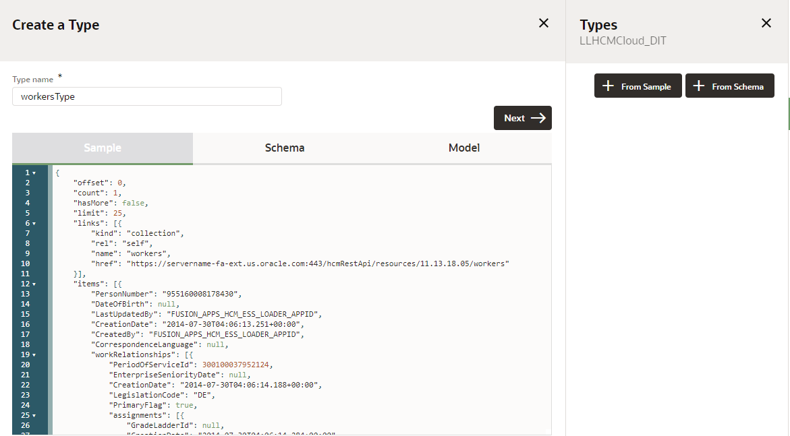

8.  Select *Next*, this will validate the sample payload and generate a schema.

9.  Select *Create*, this will generate a **Body Definition** to be used in subsequent Process.

10. Select the *workersType* body definition if not selected already.
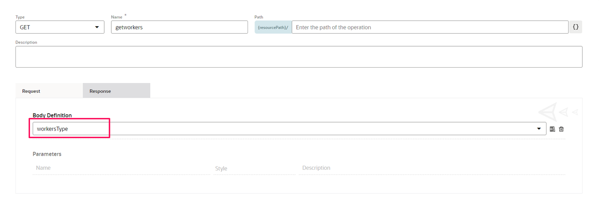

11. Select *Apply*, this will save the **Connector** and the newly added **Operation**.

## Task 5: Add resources to the connector: getUserName
The second resource we are going to add to the newly created Connector is one to retrieve User data.

1.  At the top of the **Resources** section, click *Add* (+). Click the new resource that was added to the Resources list to expand it.

2.  Enter a **Name** for the resource. You’ll select this resource name when implementing a service task. E.g. userAccounts

3.  In the **Path** field, identify the resource path within the base URL. E.g., hcmRestApi/resources/11.13.18.05/userAccounts
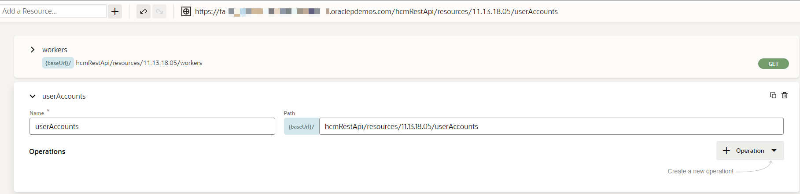

## Task 6: Add operations to resources: getUserName
The second resource we are going to add to the newly created Connector is one to retrieve User data.

1.  In the **Operations** section, click *operation* Button. Click the new resource that was added to the Resources list to expand it.

2.  From the dropdown select the *GET* method to add. The new operation is added to the **Operations** list, along with its name and paths

3.  Specify request and response parameters for operations: getUserName. Select the newly created Operations, this will open the Operations Detail panel. On the Request tab:
  - Enter **q** in the first parameter list, along with its name and paths.
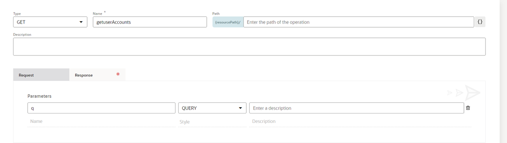

4.  On the **Response** tab is where the returned payload from HCM is used to create a schema for OPA. This initially can be generated from a response payload from Postman. Use payload as reference.
```
<copy>
{
    "offset": 0,
    "count": 1,
    "hasMore": false,
    "limit": 25,
    "links": [{
        "kind": "collection",
        "rel": "self",
        "name": "userAccounts",
        "href": "https://servername-fa-ext.us.oracle.com:443/hcmRestApi/resources/11.13.18.05/userAccounts"
    }],
    "items": [{
        "PersonNumber": "955160008178429",
        "LastUpdatedBy": "David.Parker",
        "CreationDate": "2014-08-10T23:52:27+00:00",
        "SuspendedFlag": false,
        "CreatedBy": "0",
        "PersonId": 300100037952076,
        "Username": "David.Parker",
        "UserId": 100100036578807,
        "GUID": "73DF39BFD222A4F710D9792DAE3914A3",
        "links": [{
            "kind": "item",
            "rel": "self",
            "name": "userAccounts",
            "href": "https://servername-fa-ext.us.oracle.com:443/hcmRestApi/resources/11.13.18.05/userAccounts/73DF39BFD222A4F710D9792DAE3914A3",
            "properties": {
                "changeIndicator": "ACED0005737200136A6176612E7574696C2E41727261794C6973747881D21D99C7619D03000149000473697A657870000000017704000000017372001B6F7261636C652E6A626F2E646F6D61696E2E4E756C6C56616C75655899C1C58DAABEEB02000149000A6D53514C54797065496478700000000C78"
            }
        }, {
            "kind": "item",
            "rel": "canonical",
            "name": "userAccounts",
            "href": "https://servername-fa-ext.us.oracle.com:443/hcmRestApi/resources/11.13.18.05/userAccounts/73DF39BFD222A4F710D9792DAE3914A3"
        }, {
            "kind": "collection",
            "rel": "child",
            "name": "userAccountRoles",
            "href": "https://servername-fa-ext.us.oracle.com:443/hcmRestApi/resources/11.13.18.05/userAccounts/73DF39BFD222A4F710D9792DAE3914A3/child/userAccountRoles"
        }, {
            "kind": "other",
            "rel": "action",
            "name": "resetPassword",
            "href": "https://servername-fa-ext.us.oracle.com:443/hcmRestApi/resources/11.13.18.05/userAccounts/73DF39BFD222A4F710D9792DAE3914A3/action/resetPassword"
        }, {
            "kind": "other",
            "rel": "action",
            "name": "updatePassword",
            "href": "https://servername-fa-ext.us.oracle.com:443/hcmRestApi/resources/11.13.18.05/userAccounts/73DF39BFD222A4F710D9792DAE3914A3/action/updatePassword"
        }, {
            "kind": "other",
            "rel": "action",
            "name": "autoprovisionRoles",
            "href": "https://servername-fa-ext.us.oracle.com:443/hcmRestApi/resources/11.13.18.05/userAccounts/73DF39BFD222A4F710D9792DAE3914A3/action/autoprovisionRoles"
        }],
        "CredentialsEmailSentFlag": false,
        "LastUpdateDate": "2021-06-22T09:19:20.542+00:00"
    }]
}
</copy>
```

5.  Select *+ JSON Sample* which opens the types panel

6. Select *From Sample* which opens the **Sample**

7.  Paste the body of the JSON payload above into the **Sample** field.
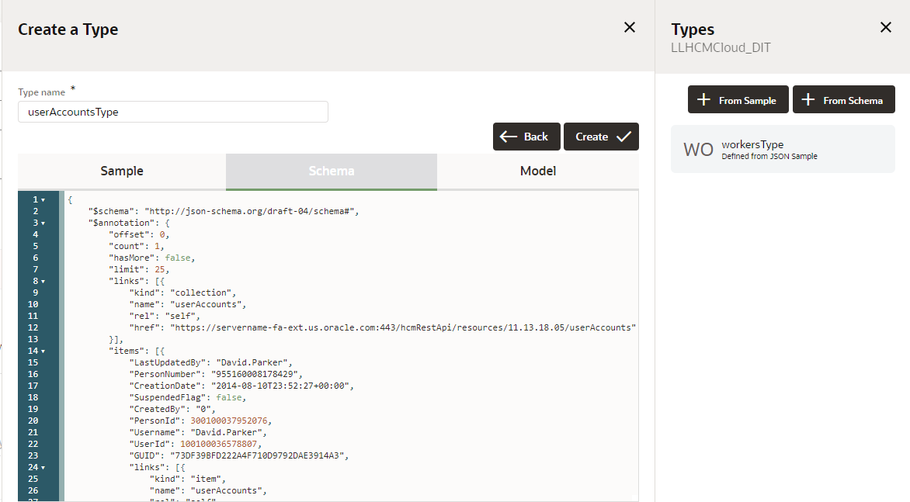

8.  Select *Next*, this will validate the sample payload and generate a schema.

9.  Select *Create*, this will generate a **Body Definition** to be used in subsequent Process.

10. Select userAccountsType (created earlier) as **Body Definition** if not already selected

11. Select *Apply*, this will save the **Connector** and the newly added *getUserAccount* Operation.
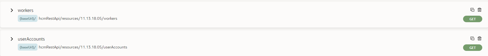

You may now **proceed to the next lab**.

## Learn More

*	[Work with Connectors](https://docs.oracle.com/en/cloud/paas/process-automation/user-process-automation/work-connectors.html)

## Acknowledgements
* **Author** - Kishore Katta, Product Management, Oracle Integration & OCI Process Automation
* **Last Updated By/Date** - Kishore Katta, October 2023
