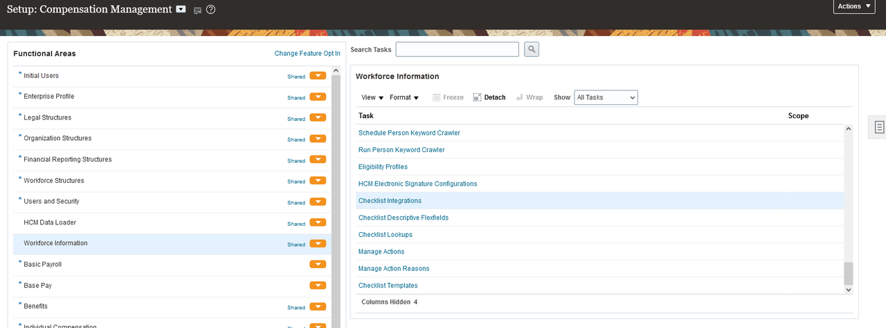
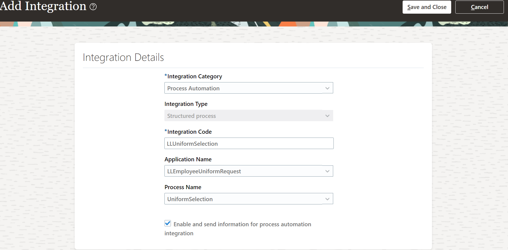
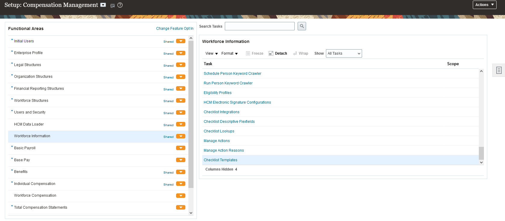
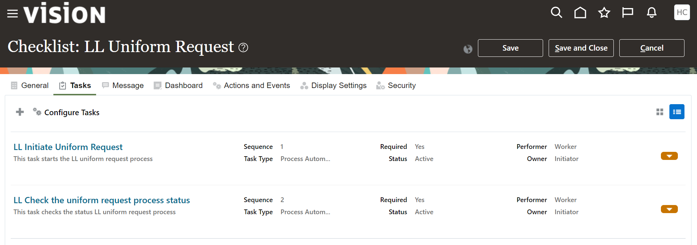

# Create a new HCM Journey

## Introduction

This lab guides through the steps to  setup the HCM Journey Booster use case, and configuration of the Journey within HCM to trigger and monitor the process.

Estimated Time: 10 minutes

### Objectives

In this lab, you will:
* Setup and Configure HCM Journey Booster use case within HCM Cloud
  - Register process in HCM journeys
  - Create a journey using an OPA Process

### Prerequisites

Access to the instance of HCM with a user that has the Role Manage Journey By HR. (PER_MANAGE_JOURNEY_BY_HR_PRIV) Allows HR specialists to access and manage worker journeys.

## Task 1: Register Process in HCM Journeys

1.	In the **Setup and Maintenance** work area, select Functional Area *Workforce Information*

2.	Select the Checklist Integration

This will open the Configure Checklist Integration page listing any existing integrations configured for HCM Journeys.

3.  Select *Add* which will open the **Integration Details** page.

4.  Enter the values as shown in the table.

|Field|	Type |	Value |
|--|	-- |	-- |
|Integration Category|	Drop down	|Process Automation|
|Integration Type|	Drop down |	Structured process|
|Integration Code	|Text entry|	LLUniformSelection|
|Application Name	|Drop down|	LLEmployeeUniformRequest|
|Process Name|	Drop down|	UniformSelection|
{: title="Integration Details Properties"}

5.  Check the *Enable and send information* for process automation integration

6.  Select *Validate*
HCM Journeys will return a status of Success under Validate Integration Details

7.  Select Save and Close

## Task 2: Create a journey using an OPA Process

1.  In the Setup and Maintenance work area, go to the following:
    * Functional Area: Workforce Information
    * Task: Checklist Templates

2.  On the **Checklist Templates** page, click *Create* to open the Create Checklists page.

3.  In the dialog shown, Enter the values as shown in the table.

|Field|	Type	|Value|
|--|	--	|--|
|Name|	Text|	LL Uniform Request|
|Description	|Text|	This Journey is used to make a new employee uniform request.|
|Category|	Drop down	|Person|
{: title="Checklist Template Properties"}

All other values can be left as default.

4.  Select *OK*

5.  Select *Tasks* tab from the menu and then to create a new task.

6.  On the **Create Task** page, enter the values as shown in the table

|Field|	Type|	Value|
|--|	--|	-- |
|Name|	Text	| LL Initiate Uniform Request|
|Sequence|	Text|	|1|
|Description|	Text|	This task starts the uniform request process|
|Required|	Check	|Checked|
|Task Type|	Drop down|	Process Automation|
|Process Section|	Drop down|	Process Section 1 – Start Process|
|Process Configuration|	Drop down|	LL Uniform Selection|
{: title="Create Task Properties"}

Expire 10 days after assigned date

All other values can be left as default.

7.  Select *Save and Close*

8.  Next click to create another new task.

9.  On the **Create Task** page, enter the values as shown in the table
|Field|	Type|	Value|
|Name|	Text|	Check the uniform request process status|
|Sequence|	Text	|2|
|Description|	Text|	This task checks the status uniform request process|
|Required|	Check|	Checked|
|Task Type|	Drop down|	Process Automation|
|Process Section|	Drop down|	Process Section 2 – Check Process Status|
|Process Configuration|	Drop down|	LL Uniform Selection|
{: title="Create Task Properties"}

Expire 10 days after assigned date

All other values can be left as default.

10. Select *Save and Close*, returning to the Tasks list for the Checklist Uniform Request Journey template.
The tasks created

11. On the General tab, select *Active* for the **Status** of the checklist.

12. Select *Save and Close*, returning to the Checklist Templates summary page.

You may now **proceed to the next lab**.

## Learn More

* [Integrate With OPA In Journeys](https://docs.oracle.com/en/cloud/saas/human-resources/23d/faijh/integrate-with-oracle-process-automation-in-journeys.html#u30010752)

## Acknowledgements
* **Author** - Kishore Katta, Product Management, Oracle Integration & Process Automation
* **Last Updated By/Date** - Kishore Katta, October 2023
