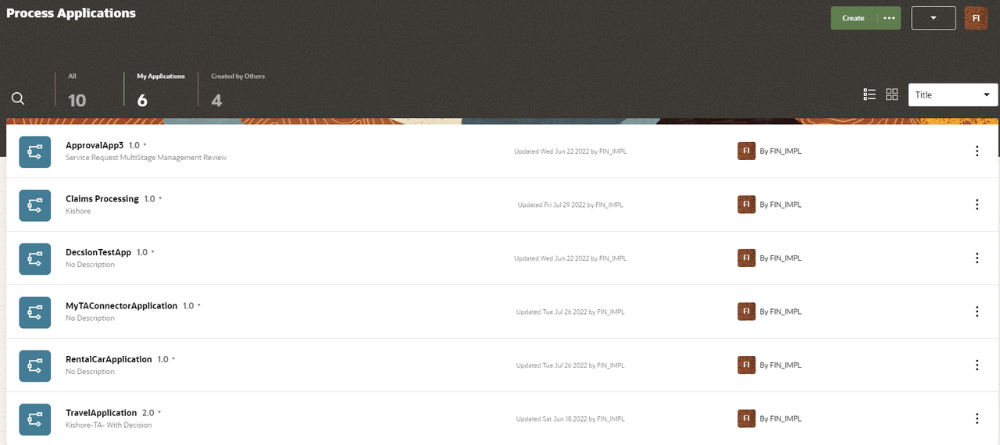
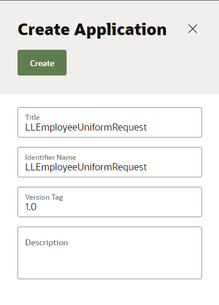

# Create Process Application

## Introduction

This lab shows you how to create a  employee uniform request application from scratch in OPA using a Structured Process.

Estimated Time: 10 minutes

### Background

Process applications that you create from scratch in Designer can consist of one or more of the following application components:

-	Processes are a sequence of tasks or activities that result in a well-defined outcome. Business Process Model and Notation (BPMN) elements within the process define the flow and behavior of the application.

- Web Forms define the interface that your application users see in Workspace. You can create web forms from the ground up or you can base them on an existing data structure.

- Business Types represent real-world concepts or objects, such as a ticket, a request, or an employee. You use business types to create the data structures that are required in your application.

- Decisions are containers for if/then rules and decision tables that use the same input and output data objects. A decision exposes these data objects as a reusable service that multiple business processes can invoke.

- Connectors define how a business process connects to external REST services.

### Objectives

In this lab, you will:
* Create a Employee Uniform request Application

### Prerequisites

Access to an OCI Process Automation instance in conjunction with a subscription to a Fusion-based Oracle Cloud Applications service

## Task 1: Create a Process Application in Designer

A process application is a container for key components: processes, forms, connectors, and roles.

1.	Login into OPA design time environment. Open the **Process Applications** page.

2.	Click *Create*. The **Create Application** side pane opens.

3.	Enter information into the **Create Application** dialog box replacing ## with your initials or another unique value.

| Field | Value |	Description	|
| --- | --- |	---	|
| Title and Description	 | ##EmployeeUniformRequest |	Make sure the application **Title** and **Description** are useful. Give the user a good idea of what the application is all about and why they might want to use it. Good Titles and Descriptions help users distinguish applications with a similar title or purpose. You can’t change the name after the application is created.|
| Identifier Name	 | ##EmployeeUniformRequest |	System generated value that can be edited. |
| Version Tag | 1.0 (Default) |	System generated value that can be edited.|
{: title="Create Application Dialog"}

4.	Click *Create*.

This will add a new application to the Process Applications list on the OPA home page.

You may now **proceed to the next lab**.

## Learn More

* [Design Structured Processes](https://docs.oracle.com/en/cloud/paas/process-automation/user-process-automation/design-structured-processes.html)
* [Design Forms and User Interfaces](https://docs.oracle.com/en/cloud/paas/process-automation/user-process-automation/design-forms-and-user-interfaces.html)
* [Explore Workspace](https://docs.oracle.com/en/cloud/paas/process-automation/user-process-automation/explore-workspace.html)
*	[Work with Connectors](https://docs.oracle.com/en/cloud/paas/process-automation/user-process-automation/work-connectors.html)

## Acknowledgements
* **Author** - Kishore Katta, Product Management, Oracle Integration & OCI Process Automation
* **Last Updated By/Date** - Kishore Katta, October 2023
