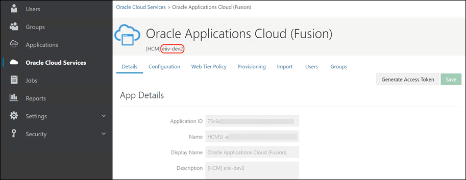
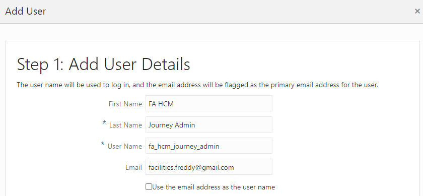

# Get Started

## Introduction

To use OPA with certain Fusion-based cloud applications, you will need to create specific users in Oracle Identity Cloud Service (IDCS). For this workshop, we intend to use OPA with Oracle HCM Cloud, you must create the "FA HCM Journey Admin" user in IDCS to discover the processes in Journeys Integration. This lab provides instructions on how to create the necessary user in IDCS.

Estimated Time: 10 minutes

### Objectives

In this lab, you will:
* Create a FA HCM Journey Admin user which must be in IDCS only, and should not exist in FA

### Prerequisites

Access to an OCI Process Automation instance in conjunction with a subscription to a Fusion-based Oracle Cloud Applications service

## Task 1: Assign IDCS Application Roles
You must assign predefined Oracle Identity Cloud Service (IDCS) application roles to users or groups in Oracle Identity Cloud Service to allow them to work with Oracle Cloud Infrastructure Process Automation.

In OPA, the ServiceAdministrator and ServiceDeveloper IDCS application roles are functional roles that determine whether or not a user has access to the administration and Designer user interface and APIs.

The Cloud Account Administrator on your team (typically, the person who signed up for the service) can grant team members these roles.

> Note: These roles are not required for accessing the Process Automation Workspace. Any authenticated user can work in Workspace or access runtime APIs.

1.  In the **IDCS navigation pane**, click *Oracle Cloud Services*.

2.  As the display name of the Process Automation IDCS application is prefixed with the display name of the IDCS application for your Fusion based cloud application, you can search for the Process Automation IDCS application by entering the display name of the IDCS application for your Fusion based cloud application in the **Search** field.

For example, if the display name of the IDCS application for your Fusion based cloud application is **exqx-test** then enter exqx-test in the **Search** field. The Process Automation IDCS application appears in the search result. Verify it is the right application by confirming that its display name starts with **exqx-test** (for example, exqx-testdemoxyz).

The following image shows the **display name** for the IDCS application of a Fusion based cloud application (HCM).

3.  Select and click the Process Automation IDCS application to open it.

4.  Navigate to the **Application Roles** tab.

5.  In the tile for the **ServiceAdministrator** or **ServiceDeveloper** role:
    - Click *menu icon* and select **Assign Users** or **Assign Group**.
    - Select the users or groups to whom you want to assign the role and click *Assign*.

## Task 2: Get the Process Automation Instance URL
To access OPA, you have to get the Process Automation URL. Bookmark the URL and share it with your developers.

1.  In the IDCS application for your Process Automation instance, click the *Configuration* tab.

2.  Expand the **Resources** section of the page.

3.  Copy the value of the **Primary Audience** field and paste it to a text file.

4.  Append **/designer** to the end of the URL. This is the URL for the Process Automation instance's Designer user interface.

5.  Copy the value of the **Primary Audience** field again and append /workspace to the end of the URL. This is the URL for the Process Automation instance's Workspace user interface.

6.  Distribute these URLs to team members who require access to the Process Automation instance.

## Task 3: Create a required User in IDCS

To create the required user FA HCM Journey Admin in IDCS for Oracle HCM Cloud:

1.  As the Cloud Account Administrator, sign in to IDCS.

2.  In the IDCS navigation pane, click **Users**.

3.  On the Users page, click **Add**.

4.  In the Add Users dialog, add the FA HCM Journey Admin user, as follows:
    - First Name: FA HCM
    - Last Name: Journey Admin
    - User Name: fa\_hcm\_journey\_admin
    - Email: An email address where this user can receive email notifications

You may now **proceed to the next lab**.

## Learn More

* [OCI Process Automation](https://docs.oracle.com/en/cloud/paas/process-automation/index.html)
* [Use OCI Process Automation with Fusion Based Oracle Cloud Applications](https://docs.oracle.com/en/cloud/paas/process-automation/user-process-automation/process-automation-product-types.html)
* [Assign Application Roles in IDCS](https://docs.oracle.com/en/cloud/paas/process-automation/user-process-automation/process-automation-product-types.html#GUID-721B6DF0-C476-4A4E-8314-F5E3C39CDA41)

## Acknowledgements

* **Author** - Kishore Katta, Product Management, Oracle Integration & OCI Process Automation
* **Last Updated By/Date** - Kishore Katta, October 2023
